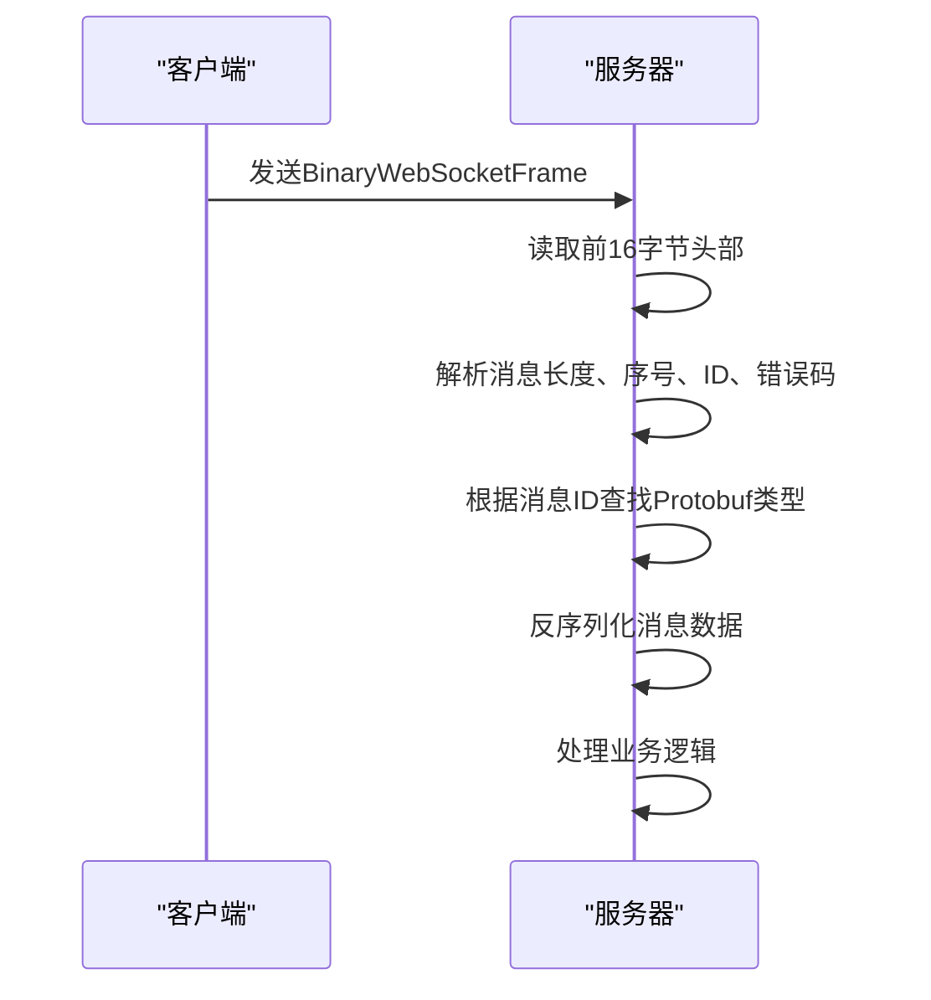

# API参考

<cite>
**本文档引用的文件**   
- [Account.proto](file://protocol/src/main/proto/Account.proto)
- [BaseMsg.proto](file://protocol/src/main/proto/BaseMsg.proto)
- [LoginServer.java](file://login/src/main/java/cn/game/login/LoginServer.java)
- [RestServer.java](file://login/src/main/java/cn/game/login/RestServer.java)
- [VertxThirdPartyConfirmReq.java](file://login/src/main/java/cn/game/login/net/clientpacket/vertx/VertxThirdPartyConfirmReq.java)
- [VertxServerListReq.java](file://login/src/main/java/cn/game/login/net/clientpacket/vertx/VertxServerListReq.java)
- [VertxLogicServerListReq.java](file://login/src/main/java/cn/game/login/net/clientpacket/vertx/VertxLogicServerListReq.java)
- [GameClient.java](file://game/src/main/java/cn/game/games/net/client/GameClient.java)
- [ImprovedClientHandler.java](file://simulationclient/src/main/java/cn/game/simulation/socket/ImprovedClientHandler.java)
- [WebSocketClientHandler.java](file://simulationclient/src/main/java/cn/game/simulation/client/handler/WebSocketClientHandler.java)
- [WebSocketEncoder.java](file://game/src/main/java/cn/game/games/core/netty/WebSocketEncoder.java)
- [ProtobufProtocolCodec.java](file://core/src/main/java/cn/game/core/net/vertx/codec/ProtobufProtocolCodec.java)
- [ProtobufProtocol.java](file://core/src/main/java/cn/game/core/net/protocol/object/ProtobufProtocol.java)
- [登录流程.txt](file://game/登录流程.txt)
</cite>

## 目录
1. [简介](#简介)
2. [RESTful API接口](#restful-api接口)
   1. [用户注册](#用户注册)
   2. [用户登录](#用户登录)
   3. [服务器列表查询](#服务器列表查询)
   4. [逻辑服务器列表查询](#逻辑服务器列表查询)
3. [WebSocket通信协议](#websocket通信协议)
   1. [连接建立](#连接建立)
   2. [数据包结构](#数据包结构)
   3. [消息序列化](#消息序列化)
   4. [心跳机制](#心跳机制)
   5. [错误处理](#错误处理)
4. [API版本控制与兼容性](#api版本控制与兼容性)
5. [客户端示例](#客户端示例)
6. [最佳实践](#最佳实践)

## 简介

本API参考文档详细描述了游戏服务器系统暴露的所有接口，包括LoginServer和GameServer的RESTful API和WebSocket API。文档涵盖了HTTP方法、URL路径、请求头、认证机制、请求体结构和响应格式等详细信息。对于WebSocket API，说明了连接建立过程、消息帧格式、事件类型编码规则、心跳机制和错误码体系。文档还特别关注了LoginServer和GameServer的端点设计，包括用户登录、会话验证、游戏指令提交等关键接口。

**本文档引用的文件**
- [登录流程.txt](file://game/登录流程.txt#L1-L42)

## RESTful API接口

### 用户注册

用户注册接口用于创建新账号。

**HTTP方法**: `POST`  
**URL路径**: `/account/register`  
**请求头**: `Content-Type: application/json`  
**认证机制**: 无（注册时不需要认证）

**请求体结构**:
```json
{
  "account": "string",
  "pwd": "string"
}
```

**响应格式**:
```json
{
  "result": {
    "errorMsg": "string",
    "errorCode": "AccountErrorCode"
  }
}
```

**错误码**:
- `ACCOUNT_EMPTY`: 账号为空
- `ACCOUNT_EXIST`: 账号已存在
- `SYSTEM_ERROR`: 服务器异常

**curl示例**:
```bash
curl -X POST http://10.12.175.84:9390/account/register \
  -H "Content-Type: application/json" \
  -d '{"account":"testuser","pwd":"testpass"}'
```

**本文档引用的文件**
- [Account.proto](file://protocol/src/main/proto/Account.proto#L8-L17)
- [VertxRegisterReq.java](file://login/src/main/java/cn/game/login/net/clientpacket/vertx/VertxRegisterReq.java)

### 用户登录

用户登录接口用于验证用户身份并获取会话令牌。

**HTTP方法**: `POST`  
**URL路径**: `/account/third_party_confirm`  
**请求头**: `Content-Type: application/json`  
**认证机制**: 无（登录时不需要认证）

**请求体结构**:
```json
{
  "channel": "AccountChannelType",
  "token": "string"
}
```

**响应格式**:
```json
{
  "result": {
    "errorMsg": "string",
    "errorCode": "AccountErrorCode"
  },
  "passport_session_id": "string",
  "user_id": "string",
  "sdk_user_id": "string",
  "isNew": "boolean",
  "ext": "string"
}
```

**渠道类型**:
- `OFFICIAL`: 官方渠道，token格式为"账号 密码"
- `WECHAT`: 微信渠道，token为微信临时登录凭证code
- `CHANGYOU`: 畅游SDK渠道

**curl示例**:
```bash
# 官方渠道登录
curl -X POST http://10.12.175.84:9390/account/third_party_confirm \
  -H "Content-Type: application/json" \
  -d '{"channel":"OFFICIAL","token":"testuser testpass"}'

# 微信渠道登录
curl -X POST http://10.12.175.84:9390/account/third_party_confirm \
  -H "Content-Type: application/json" \
  -d '{"channel":"WECHAT","token":"wechat_code"}'
```

**本文档引用的文件**
- [Account.proto](file://protocol/src/main/proto/Account.proto#L18-L32)
- [VertxThirdPartyConfirmReq.java](file://login/src/main/java/cn/game/login/net/clientpacket/vertx/VertxThirdPartyConfirmReq.java)

### 服务器列表查询

服务器列表查询接口用于获取可用的游戏服务器列表。

**HTTP方法**: `POST`  
**URL路径**: `/account/server_list`  
**请求头**: `Content-Type: application/json`  
**认证机制**: JWT（通过passport_session_id）

**请求体结构**:
```json
{
  "passport_session_id": "string"
}
```

**响应格式**:
```json
{
  "result": {
    "errorMsg": "string",
    "errorCode": "AccountErrorCode"
  },
  "servers": [
    {
      "serverId": "string",
      "name": "string",
      "ip": "string",
      "port": "int32",
      "status": "int32",
      "version": "string"
    }
  ],
  "totalServerCount": "int32",
  "myServerList": [
    {
      "serverId": "string",
      "name": "string",
      "level": "int32",
      "lastEnterTime": "int32",
      "playerId": "string"
    }
  ]
}
```

**服务器状态**:
- `1`: 正常开启
- `2`: 维护
- `4`: 停服

**curl示例**:
```bash
curl -X POST http://10.12.175.84:9390/account/server_list \
  -H "Content-Type: application/json" \
  -d '{"passport_session_id":"223634f7-ba37-4451-bfb4-65e28c0e3d19"}'
```

**本文档引用的文件**
- [Account.proto](file://protocol/src/main/proto/Account.proto#L42-L54)
- [VertxServerListReq.java](file://login/src/main/java/cn/game/login/net/clientpacket/vertx/VertxServerListReq.java)

### 逻辑服务器列表查询

逻辑服务器列表查询接口用于获取逻辑服务器列表，支持分页。

**HTTP方法**: `POST`  
**URL路径**: `/account/logic_server_list`  
**请求头**: `Content-Type: application/json`  
**认证机制**: JWT（通过passport_session_id）

**请求体结构**:
```json
{
  "passport_session_id": "string",
  "page": "int32",
  "pageSize": "int32"
}
```

**响应格式**:
```json
{
  "result": {
    "errorMsg": "string",
    "errorCode": "AccountErrorCode"
  },
  "logicServerList": [
    {
      "serverId": "string",
      "name": "string",
      "seq": "int32",
      "openTime": "int32",
      "status": "int32",
      "isNew": "boolean"
    }
  ]
}
```

**逻辑服务器状态**:
- `1`: 正常开启（火爆）
- `2`: 维护

**curl示例**:
```bash
curl -X POST http://10.12.175.84:9390/account/logic_server_list \
  -H "Content-Type: application/json" \
  -d '{"passport_session_id":"223634f7-ba37-4451-bfb4-65e28c0e3d19","page":1,"pageSize":10}'
```

**本文档引用的文件**
- [Account.proto](file://protocol/src/main/proto/Account.proto#L56-L66)
- [VertxLogicServerListReq.java](file://login/src/main/java/cn/game/login/net/clientpacket/vertx/VertxLogicServerListReq.java)

## WebSocket通信协议

### 连接建立

WebSocket连接建立过程如下：

1. 客户端首先通过RESTful API完成用户登录，获取`passport_session_id`
2. 客户端使用从服务器列表查询接口获取的IP和端口信息
3. 客户端发起WebSocket连接到指定的游戏服务器
4. 连接成功后，客户端发送登录请求消息

**连接URL格式**: `ws://<server_ip>:<server_port>/`

**本文档引用的文件**
- [登录流程.txt](file://game/登录流程.txt#L37-L42)
- [WebSocketClientHandler.java](file://simulationclient/src/main/java/cn/game/simulation/client/handler/WebSocketClientHandler.java)

### 数据包结构

WebSocket消息采用二进制帧格式，数据包结构如下：

```
+------------------+------------------+------------------+------------------+
|  消息总长度(4字节)  |  消息序号(4字节)   |  消息ID(4字节)    |  错误码(4字节)    |
+------------------+------------------+------------------+------------------+
|                              消息数据(变长)                               |
+-------------------------------------------------------------------------+
```

**字段说明**:
- **消息总长度**: 整个消息包的总长度（包括头部16字节）
- **消息序号**: 消息序列号，用于保证消息顺序和重发机制
- **消息ID**: 消息类型ID，对应Protobuf消息的唯一标识
- **错误码**: 0表示成功，非0表示错误代码
- **消息数据**: Protobuf序列化后的消息体

**本文档引用的文件**
- [ImprovedClientHandler.java](file://simulationclient/src/main/java/cn/game/simulation/socket/ImprovedClientHandler.java#L37-L40)
- [GameClient.java](file://game/src/main/java/cn/game/games/net/client/GameClient.java#L171-L174)

### 消息序列化

系统使用Protobuf作为消息序列化格式，所有游戏指令和响应都通过Protobuf定义。

**序列化流程**:
1. 客户端将Protobuf消息对象序列化为字节数组
2. 添加16字节的消息头部（长度、序号、ID、错误码）
3. 将完整的消息包封装为BinaryWebSocketFrame发送

**反序列化流程**:
1. 服务端接收BinaryWebSocketFrame
2. 读取前16字节获取消息头部信息
3. 根据消息ID查找对应的Protobuf消息类型
4. 反序列化消息数据部分



**本文档引用的文件**
- [ProtobufProtocolCodec.java](file://core/src/main/java/cn/game/core/net/vertx/codec/ProtobufProtocolCodec.java)
- [ProtobufProtocol.java](file://core/src/main/java/cn/game/core/net/protocol/object/ProtobufProtocol.java)
- [WebSocketEncoder.java](file://game/src/main/java/cn/game/games/core/netty/WebSocketEncoder.java)

### 心跳机制

系统实现了心跳机制来检测连接状态和保持连接活跃。

**心跳请求**:
- 消息ID: `PlayerHeartbeatRequest_01000005`
- 频率: 客户端每30秒发送一次
- 超时: 服务器在90秒内未收到心跳则断开连接

**心跳响应**:
- 消息ID: `PlayerHeartbeatResponse_01000006`
- 服务器收到心跳请求后立即返回响应

**空闲超时检测**:
```java
public boolean isIdleTimeOut(long timeOut) {
    long time = System.currentTimeMillis() - lastRecvPacketTime - timeOut;
    return time > 0;
}
```

**本文档引用的文件**
- [GameClient.java](file://game/src/main/java/cn/game/games/net/client/GameClient.java#L223-L226)
- [PlayerMsg.proto](file://protocol/src/main/proto/PlayerMsg.proto)

### 错误处理

系统定义了统一的错误处理机制，通过消息包中的错误码字段传递错误信息。

**错误码体系**:
- `0`: 成功
- `1`: 请求过于频繁
- `2`: 消息序号错误
- `3`: 消息ID无效
- `4`: 数据解析错误
- `5`: 会话过期
- `6`: 权限不足

**错误处理流程**:
1. 服务端在处理消息时检测到错误
2. 设置响应消息包的错误码字段
3. 返回包含错误码的响应消息
4. 客户端根据错误码执行相应处理

**本文档引用的文件**
- [GameClient.java](file://game/src/main/java/cn/game/games/net/client/GameClient.java#L284-L285)
- [ErrorMsgEnum.java](file://protocol/src/main/java/cn/game/protocol/manual/ErrorMsgEnum.java)

## API版本控制与兼容性

系统采用语义化版本控制策略，确保向后兼容性。

**版本控制策略**:
- 主版本号: 重大变更，不保证向后兼容
- 次版本号: 新功能添加，保证向后兼容
- 修订版本号: Bug修复，保证向后兼容

**向后兼容性保证**:
1. 新增字段必须是可选的
2. 不得删除现有字段
3. 不得修改现有字段的类型
4. 不得修改现有消息的ID
5. 新增消息使用新的ID

**版本协商机制**:
- 客户端在连接时发送版本信息
- 服务器检查版本兼容性
- 如果不兼容，返回错误码并建议升级

**本文档引用的文件**
- [BaseMsg.proto](file://protocol/src/main/proto/BaseMsg.proto)
- [Account.proto](file://protocol/src/main/proto/Account.proto)

## 客户端示例

### Java客户端示例

```java
// 创建WebSocket连接
URI uri = new URI("ws://127.0.0.1:7011/");
WebSocketClientHandshaker handshaker = WebSocketClientHandshakerFactory.newHandshaker(
    uri, WebSocketVersion.V13, null, false, new DefaultHttpHeaders());

ChannelPipeline pipeline = channel.pipeline();
pipeline.addLast(new HttpClientCodec());
pipeline.addLast(new HttpObjectAggregator(8192));
pipeline.addLast(new WebSocketClientHandler(handshaker));
```

### Python客户端示例

```python
import asyncio
import websockets
import struct

async def connect_to_game_server():
    async with websockets.connect('ws://127.0.0.1:7011/') as websocket:
        # 构造消息包
        message_id = 1000001  # PlayerLoginRequest
        sequence = 1
        error_code = 0
        data = b"protobuf_serialized_data"
        
        header = struct.pack('!IIII', len(data) + 16, sequence, message_id, error_code)
        message = header + data
        
        await websocket.send(message)
        
        response = await websocket.recv()
        # 处理响应
```

**本文档引用的文件**
- [Client.java](file://simulationclient/src/main/java/cn/game/simulation/client/Client.java)
- [WebSocketClientHandler.java](file://simulationclient/src/main/java/cn/game/simulation/client/handler/WebSocketClientHandler.java)

## 最佳实践

### 连接管理

1. **连接重试**: 实现指数退避重试机制
2. **连接池**: 对于高并发场景，使用连接池管理WebSocket连接
3. **资源清理**: 确保在连接关闭时释放相关资源

### 消息处理

1. **消息去重**: 使用消息序号防止重复处理
2. **消息顺序**: 保证消息按序处理
3. **超时处理**: 为重要请求设置超时机制

### 性能优化

1. **批量发送**: 将多个小消息合并发送
2. **压缩**: 对大数据量消息启用压缩
3. **缓存**: 缓存频繁访问的数据

### 安全考虑

1. **输入验证**: 严格验证所有输入数据
2. **防刷机制**: 限制消息发送频率
3. **会话管理**: 定期更新会话令牌

**本文档引用的文件**
- [GameClient.java](file://game/src/main/java/cn/game/games/net/client/GameClient.java)
- [ImprovedClientHandler.java](file://simulationclient/src/main/java/cn/game/simulation/socket/ImprovedClientHandler.java)