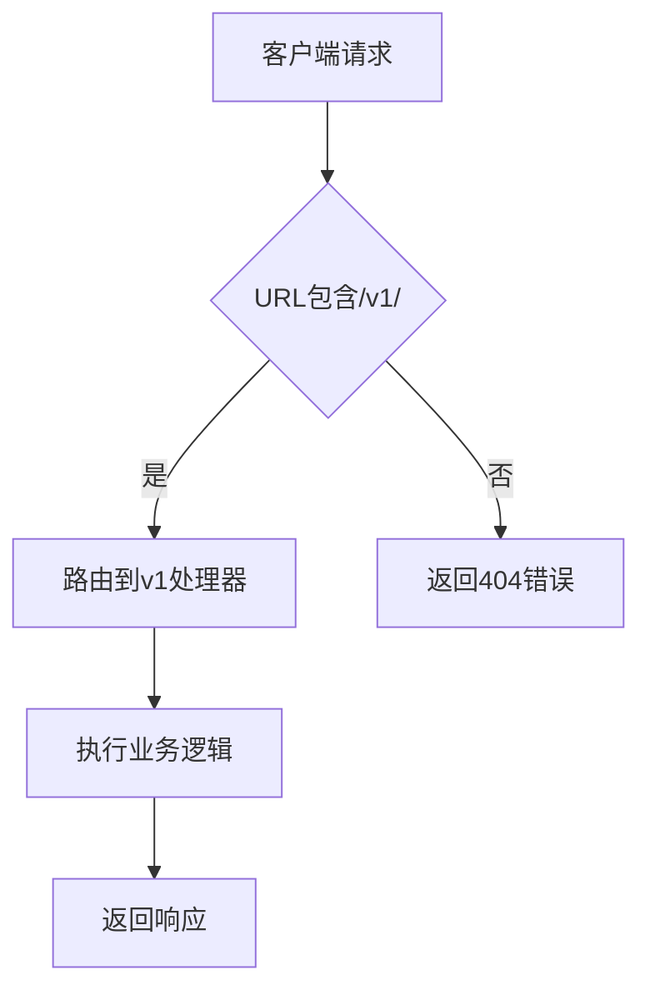
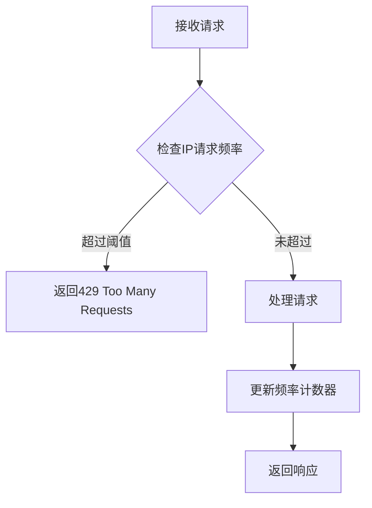
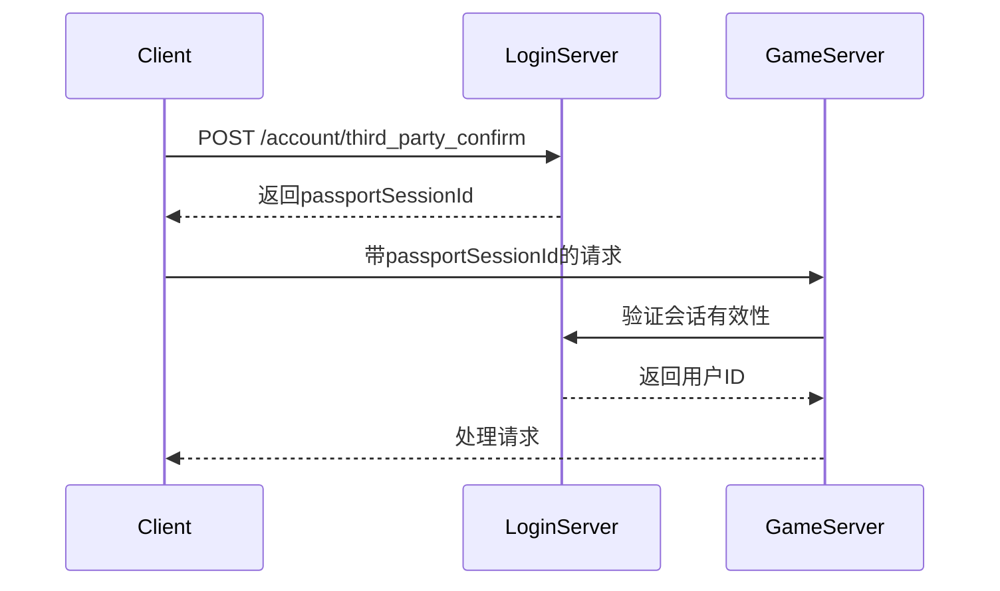
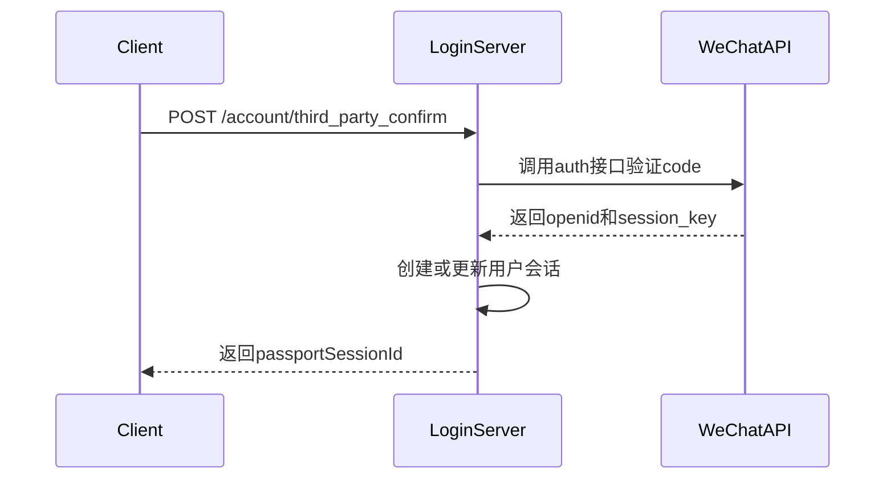

# REST API

<cite>
**本文档引用的文件**   
- [RestServer.java](file://login/src/main/java/cn/game/login/RestServer.java)
- [VertxThirdPartyConfirmReq.java](file://login/src/main/java/cn/game/login/net/clientpacket/vertx/VertxThirdPartyConfirmReq.java)
- [VertxServerListReq.java](file://login/src/main/java/cn/game/login/net/clientpacket/vertx/VertxServerListReq.java)
- [VertxLogicServerListReq.java](file://login/src/main/java/cn/game/login/net/clientpacket/vertx/VertxLogicServerListReq.java)
- [GmHandler.java](file://game/src/main/java/cn/game/games/net/game/gm/GmHandler.java)
- [GameServer.java](file://game/src/main/java/cn/game/games/net/game/GameServer.java)
- [VertxRouterConfig.java](file://login/src/main/java/cn/game/login/net/clientpacket/vertx/VertxRouterConfig.java)
- [UserHelper.java](file://login/src/main/java/cn/game/login/net/clientpacket/vertx/UserHelper.java)
- [LoginServerImpl.java](file://login/src/main/java/cn/game/login/net/remote/LoginServerImpl.java)
</cite>

## 目录
1. [简介](#简介)
2. [API版本控制](#apiversion)
3. [速率限制](#rate-limiting)
4.. [错误码体系](#error-codes)
5. [认证机制](#authentication)
6. [LoginServer端点](#loginserver-endpoints)
   - [用户登录](#user-login)
   - [第三方认证（微信）](#third-party-auth)
   - [服务器列表查询](#server-list)
7. [GameServer端点](#gameserver-endpoints)
   - [服务器状态查询](#server-status)
   - [服务器操作](#server-operation)
8. [请求/响应示例](#examples)
9. [客户端调用最佳实践](#best-practices)

## 简介
本文档详细描述了LoginServer和GameServer暴露的HTTP端点。LoginServer负责用户身份验证、第三方登录（如微信）和服务器列表管理，而GameServer提供服务器状态管理和操作功能。所有API端点均基于Vert.x框架实现，使用Protobuf进行数据序列化。

**Section sources**
- [RestServer.java](file://login/src/main/java/cn/game/login/RestServer.java#L1-L121)

## API版本控制
系统采用基于URL路径的API版本控制策略。所有端点均通过`/v1/`前缀标识版本，确保向后兼容性。未来版本升级将通过新增版本路径（如`/v2/`）实现，避免对现有客户端造成影响。



**Diagram sources**
- [RestServer.java](file://login/src/main/java/cn/game/login/RestServer.java#L98-L118)

## 速率限制
系统通过Vert.x的全局中间件实现速率限制机制。每个IP地址在60秒内最多允许100次请求，超出限制将返回429状态码。对于第三方认证接口（如微信），遵循外部服务的速率限制策略（如微信每分钟100次）。



**Diagram sources**
- [VertxRouterConfig.java](file://login/src/main/java/cn/game/login/net/clientpacket/vertx/VertxRouterConfig.java#L36-L153)

## 错误码体系
系统采用标准化的HTTP状态码和自定义错误码结合的方式。主要错误码包括：

| HTTP状态码 | 错误码 | 描述 |
|-----------|-------|------|
| 400 | INVALID_REQUEST | 请求格式无效 |
| 401 | PASSPORT_SESSION_ERROR | 会话无效或未登录 |
| 403 | CHANNEL_NOT_SUPPORT | 不支持的认证渠道 |
| 404 | ACCOUNT_NOT_EXIST | 账户不存在 |
| 429 | CHANNEL_CHECK_FAIL | 频率限制（第三方服务） |
| 500 | SYSTEM_ERROR | 系统内部错误 |

**Section sources**
- [VertxThirdPartyConfirmReq.java](file://login/src/main/java/cn/game/login/net/clientpacket/vertx/VertxThirdPartyConfirmReq.java#L70-L71)
- [VertxServerListReq.java](file://login/src/main/java/cn/game/login/net/clientpacket/vertx/VertxServerListReq.java#L68-L71)

## 认证机制
系统采用基于会话令牌的认证机制。用户登录成功后，服务器返回`passportSessionId`，客户端需在后续请求中将其作为认证凭证。对于管理接口，额外验证IP白名单。



**Diagram sources**
- [VertxThirdPartyConfirmReq.java](file://login/src/main/java/cn/game/login/net/clientpacket/vertx/VertxThirdPartyConfirmReq.java#L86-L92)
- [LoginServerImpl.java](file://login/src/main/java/cn/game/login/net/remote/LoginServerImpl.java#L34-L43)

## LoginServer端点

### 用户登录
处理用户登录请求，支持多种认证渠道。

- **HTTP方法**: POST
- **URL路径**: `/v1/account/login`
- **请求体**: Protobuf序列化的AccountLogin消息
- **认证要求**: 无
- **请求头**: `content-type: application/octet-stream`
- **成功响应**: 200 OK，返回AccountLoginResponse
- **错误响应**: 400, 401, 500

**Section sources**
- [VertxThirdPartyConfirmReq.java](file://login/src/main/java/cn/game/login/net/clientpacket/vertx/VertxThirdPartyConfirmReq.java#L60-L92)

### 第三方认证（微信）
处理微信第三方登录请求。

- **HTTP方法**: POST
- **URL路径**: `/v1/account/third_party_confirm`
- **请求参数**: 
  - channel: WECHAT
  - token: 微信code
- **认证要求**: 无
- **成功响应**: 200 OK，返回包含passportSessionId的响应
- **错误响应**: 400, 429（频率限制）



**Diagram sources**
- [VertxThirdPartyConfirmReq.java](file://login/src/main/java/cn/game/login/net/clientpacket/vertx/VertxThirdPartyConfirmReq.java#L137-L158)

### 服务器列表查询
获取可用的游戏服务器列表。

- **HTTP方法**: POST
- **URL路径**: `/v1/account/server_list`
- **请求参数**: passportSessionId
- **认证要求**: 需要有效的passportSessionId
- **成功响应**: 200 OK，返回服务器列表
- **错误响应**: 401（会话无效）

**Section sources**
- [VertxServerListReq.java](file://login/src/main/java/cn/game/login/net/clientpacket/vertx/VertxServerListReq.java#L45-L150)

## GameServer端点

### 服务器状态查询
查询和修改游戏服务器状态。

- **HTTP方法**: POST
- **URL路径**: `/gm/server_status`
- **请求参数**: serverId, status
- **认证要求**: GM权限和IP白名单
- **成功响应**: 200 OK
- **错误响应**: 400, 403

**Section sources**
- [GmHandler.java](file://game/src/main/java/cn/game/games/net/game/gm/GmHandler.java#L143-L159)

### 服务器操作
执行服务器管理操作。

- **HTTP方法**: POST
- **URL路径**: `/gm/server_op`
- **请求参数**: serverId, opType
- **认证要求**: GM权限和IP白名单
- **成功响应**: 200 OK
- **错误响应**: 400, 403

**Section sources**
- [GmHandler.java](file://game/src/main/java/cn/game/games/net/game/gm/GmHandler.java#L162-L169)

## 请求/响应示例

### 用户登录请求示例
```bash
curl -X POST http://login-server/v1/account/third_party_confirm \
  -H "content-type: application/octet-stream" \
  --data-binary @- << EOF
{
  "channel": "WECHAT",
  "token": "wechat_code_here"
}
EOF
```

### 服务器列表响应示例
```json
{
  "servers": [
    {
      "serverId": "game_001",
      "name": "服务器一",
      "ip": "192.168.1.100",
      "port": 8080,
      "status": 1
    }
  ],
  "myServers": [
    {
      "serverId": "game_001",
      "playerId": "1001",
      "name": "玩家角色",
      "level": 30
    }
  ]
}
```

**Section sources**
- [VertxServerListReq.java](file://login/src/main/java/cn/game/login/net/clientpacket/vertx/VertxServerListReq.java#L135-L148)

## 客户端调用最佳实践
1. **错误处理**: 实现重试机制，对临时性错误（如503）进行指数退避重试
2. **连接管理**: 复用HTTP连接，避免频繁建立/关闭连接
3. **数据缓存**: 缓存服务器列表等静态数据，减少不必要的请求
4. **安全考虑**: 敏感信息通过HTTPS传输，避免在日志中记录凭证
5. **性能监控**: 记录API调用延迟，及时发现性能瓶颈

**Section sources**
- [VertxRouterConfig.java](file://login/src/main/java/cn/game/login/net/clientpacket/vertx/VertxRouterConfig.java#L80-L88)