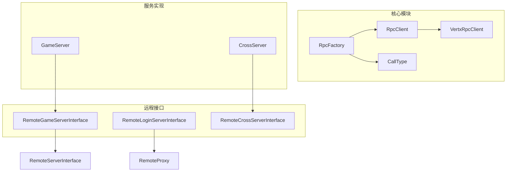
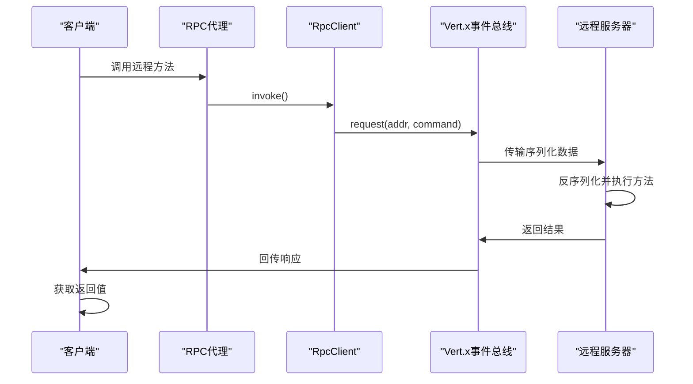
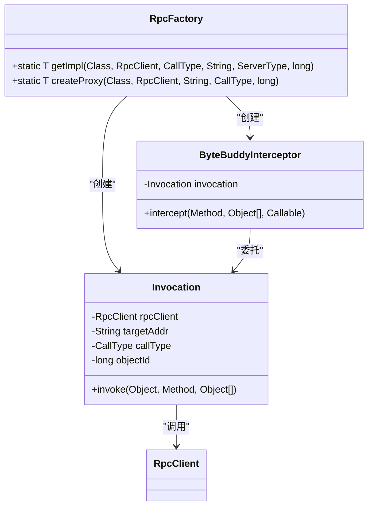
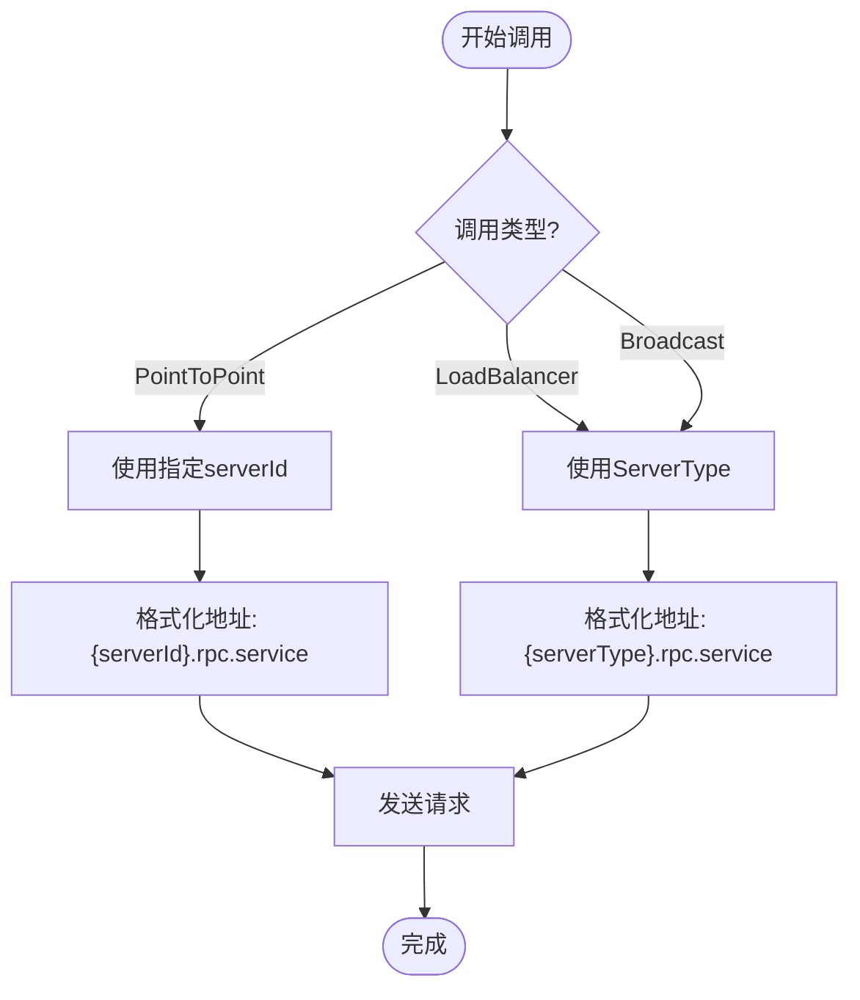
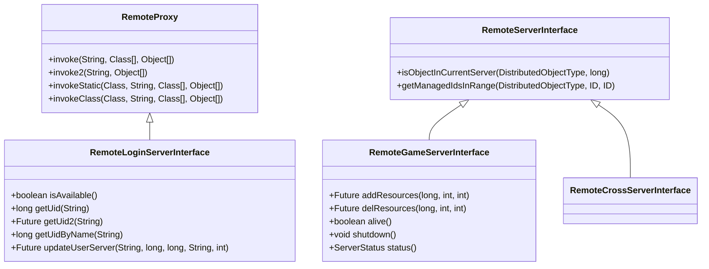
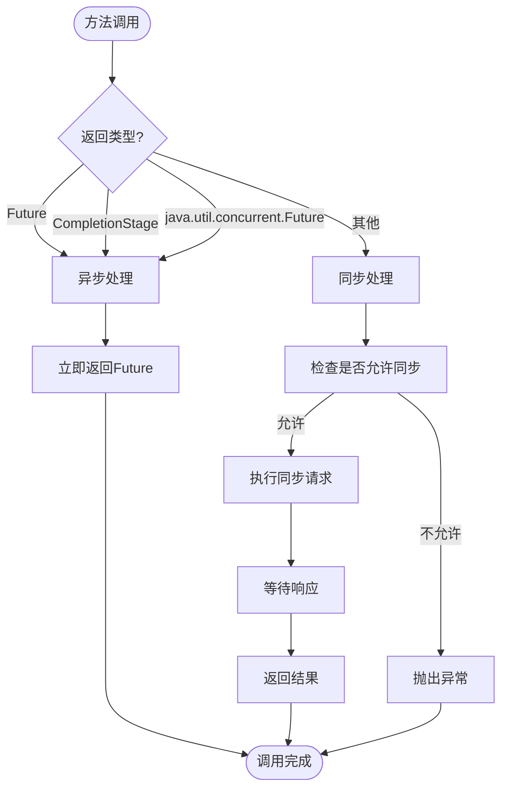
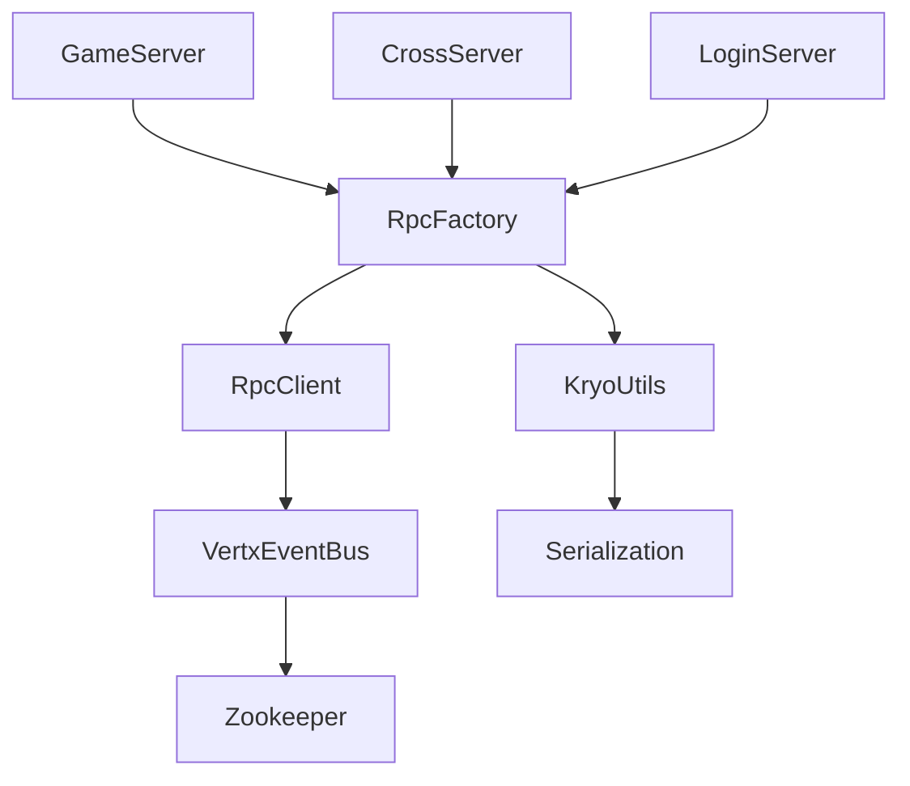

# RPC API

<cite>
**本文档引用的文件**  
- [CallType.java](file://core/src/main/java/cn/game/core/net/rpc/CallType.java)
- [Rpc.java](file://core/src/main/java/cn/game/core/net/rpc/Rpc.java)
- [RpcFactory.java](file://core/src/main/java/cn/game/core/net/rpc/RpcFactory.java)
- [RpcClient.java](file://core/src/main/java/cn/game/core/net/rpc/RpcClient.java)
- [VertxRpcClient.java](file://core/src/main/java/cn/game/core/net/rpc/vertx/VertxRpcClient.java)
- [RemoteCrossServerInterface.java](file://core/src/main/java/cn/game/core/net/remote/RemoteCrossServerInterface.java)
- [RemoteGameServerInterface.java](file://core/src/main/java/cn/game/core/net/remote/RemoteGameServerInterface.java)
- [RemoteLoginServerInterface.java](file://core/src/main/java/cn/game/core/net/remote/RemoteLoginServerInterface.java)
- [RemoteServerInterface.java](file://core/src/main/java/cn/game/core/net/remote/RemoteServerInterface.java)
- [VxHolder.java](file://core/src/main/java/cn/game/core/net/vertx/VxHolder.java)
- [KryoUtils.java](file://util/src/main/java/cn/game/util/KryoUtils.java)
- [GameServer.java](file://game/src/main/java/cn/game/games/net/game/GameServer.java)
- [CrossServer.java](file://game/src/main/java/cn/game/games/net/cross/CrossServer.java)
</cite>

## 目录
1. [引言](#引言)
2. [项目结构](#项目结构)
3. [核心组件](#核心组件)
4. [架构概述](#架构概述)
5. [详细组件分析](#详细组件分析)
6. [依赖分析](#依赖分析)
7. [性能考虑](#性能考虑)
8. [故障排查指南](#故障排查指南)
9. [结论](#结论)

## 引言
本文档详细描述了服务器间远程过程调用（RPC）机制的设计与实现。系统基于Vert.x事件总线构建，采用动态代理和反射技术实现服务间的通信。支持点对点、负载均衡和广播三种调用模式，并通过Kryo进行高效序列化。文档涵盖服务注册发现、调用流程、序列化方式、网络协议及分布式事务处理等关键方面。

## 项目结构
系统由多个模块组成，包括核心框架、游戏服务、登录服务、工具库等。RPC相关功能主要分布在`core`模块的`net.rpc`包中，而远程接口定义位于`net.remote`包。各服务通过接口契约进行通信，实现了松耦合的分布式架构。

**图示来源**  
- [RpcFactory.java](file://core/src/main/java/cn/game/core/net/rpc/RpcFactory.java)
- [RpcClient.java](file://core/src/main/java/cn/game/core/net/rpc/RpcClient.java)
- [CallType.java](file://core/src/main/java/cn/game/core/net/rpc/CallType.java)
- [VertxRpcClient.java](file://core/src/main/java/cn/game/core/net/rpc/vertx/VertxRpcClient.java)
- [RemoteGameServerInterface.java](file://core/src/main/java/cn/game/core/net/remote/RemoteGameServerInterface.java)
- [RemoteLoginServerInterface.java](file://core/src/main/java/cn/game/core/net/remote/RemoteLoginServerInterface.java)
- [RemoteCrossServerInterface.java](file://core/src/main/java/cn/game/core/net/remote/RemoteCrossServerInterface.java)
- [GameServer.java](file://game/src/main/java/cn/game/games/net/game/GameServer.java)
- [CrossServer.java](file://game/src/main/java/cn/game/games/net/cross/CrossServer.java)

**本节来源**  
- [project_structure](file://project_structure)

## 核心组件
系统RPC机制的核心组件包括`RpcFactory`用于创建代理实例，`RpcClient`定义网络通信行为，`CallType`枚举支持多种调用模式。远程接口通过继承`RemoteProxy`或`RemoteServerInterface`建立契约。序列化由`KryoUtils`提供高效支持，结合Vert.x事件总线实现跨节点通信。

**本节来源**  
- [RpcFactory.java](file://core/src/main/java/cn/game/core/net/rpc/RpcFactory.java#L26-L218)
- [RpcClient.java](file://core/src/main/java/cn/game/core/net/rpc/RpcClient.java#L26-L215)
- [CallType.java](file://core/src/main/java/cn/game/core/net/rpc/CallType.java#L3-L5)
- [KryoUtils.java](file://util/src/main/java/cn/game/util/KryoUtils.java#L60-L389)

## 架构概述
系统采用基于Vert.x事件总线的分布式架构，通过动态代理实现透明的远程方法调用。客户端通过`RpcFactory`获取接口代理，调用时自动封装为`Command`对象并经由`VertxRpcClient`发送至目标地址。服务端接收后反序列化并反射执行对应方法，结果沿原路径返回。

**图示来源**  
- [RpcFactory.java](file://core/src/main/java/cn/game/core/net/rpc/RpcFactory.java)
- [RpcClient.java](file://core/src/main/java/cn/game/core/net/rpc/RpcClient.java)
- [VertxRpcClient.java](file://core/src/main/java/cn/game/core/net/rpc/vertx/VertxRpcClient.java)
- [VxHolder.java](file://core/src/main/java/cn/game/core/net/vertx/VxHolder.java)

## 详细组件分析

### RPC工厂与代理机制
`RpcFactory`是RPC系统的核心，负责创建接口的动态代理实例。支持JDK动态代理（接口）和Byte Buddy（类）两种方式。通过缓存机制优化性能，仅当`objectId`为0时启用缓存。

**图示来源**  
- [RpcFactory.java](file://core/src/main/java/cn/game/core/net/rpc/RpcFactory.java#L26-L218)

**本节来源**  
- [RpcFactory.java](file://core/src/main/java/cn/game/core/net/rpc/RpcFactory.java#L26-L218)

### 调用类型与路由策略
系统支持三种调用模式：点对点（PointToPoint）、负载均衡（LoadBalancer）和广播（Broadcast）。不同模式对应不同的寻址策略和消息分发机制。

**图示来源**  
- [RpcFactory.java](file://core/src/main/java/cn/game/core/net/rpc/RpcFactory.java#L45-L59)
- [VxHolder.java](file://core/src/main/java/cn/game/core/net/vertx/VxHolder.java#L340-L346)

**本节来源**  
- [CallType.java](file://core/src/main/java/cn/game/core/net/rpc/CallType.java)
- [VxHolder.java](file://core/src/main/java/cn/game/core/net/vertx/VxHolder.java#L340-L346)

### 远程接口定义
远程接口通过继承特定基接口定义服务契约。`RemoteGameServerInterface`提供游戏服务器对外服务，`RemoteLoginServerInterface`暴露登录服务功能，`RemoteCrossServerInterface`支持跨服通信。

**图示来源**  
- [RemoteProxy.java](file://core/src/main/java/cn/game/core/net/remote/RemoteProxy.java)
- [RemoteServerInterface.java](file://core/src/main/java/cn/game/core/net/remote/RemoteServerInterface.java)
- [RemoteGameServerInterface.java](file://core/src/main/java/cn/game/core/net/remote/RemoteGameServerInterface.java)
- [RemoteLoginServerInterface.java](file://core/src/main/java/cn/game/core/net/remote/RemoteLoginServerInterface.java)

**本节来源**  
- [RemoteProxy.java](file://core/src/main/java/cn/game/core/net/remote/RemoteProxy.java#L19-L94)
- [RemoteServerInterface.java](file://core/src/main/java/cn/game/core/net/remote/RemoteServerInterface.java#L12-L42)
- [RemoteGameServerInterface.java](file://core/src/main/java/cn/game/core/net/remote/RemoteGameServerInterface.java#L12-L24)
- [RemoteLoginServerInterface.java](file://core/src/main/java/cn/game/core/net/remote/RemoteLoginServerInterface.java#L12-L34)

### 同步与异步调用
系统根据返回值类型自动判断调用方式。返回`Future`、`CompletionStage`或`java.util.concurrent.Future`时为异步调用，其他情况为同步阻塞调用。

**图示来源**  
- [RpcClient.java](file://core/src/main/java/cn/game/core/net/rpc/RpcClient.java#L123-L137)

**本节来源**  
- [RpcClient.java](file://core/src/main/java/cn/game/core/net/rpc/RpcClient.java#L123-L137)

## 依赖分析
系统RPC机制依赖于Vert.x事件总线进行消息传输，使用Kryo进行对象序列化，通过Zookeeper实现服务注册与发现。各模块间通过接口契约解耦，确保了良好的可维护性和扩展性。

**图示来源**  
- [pom.xml](file://core/pom.xml)
- [RpcFactory.java](file://core/src/main/java/cn/game/core/net/rpc/RpcFactory.java)
- [KryoUtils.java](file://util/src/main/java/cn/game/util/KryoUtils.java)

**本节来源**  
- [pom.xml](file://core/pom.xml)
- [RpcFactory.java](file://core/src/main/java/cn/game/core/net/rpc/RpcFactory.java)
- [KryoUtils.java](file://util/src/main/java/cn/game/util/KryoUtils.java)

## 性能考虑
系统在设计上充分考虑了性能因素。通过代理实例缓存减少创建开销，使用对象池管理Kryo序列化器以支持虚拟线程，设置合理的超时时间防止线程阻塞。建议优先使用异步调用模式，避免在事件循环线程中进行同步等待。

**本节来源**  
- [KryoUtils.java](file://util/src/main/java/cn/game/util/KryoUtils.java#L81-L83)
- [RpcClient.java](file://core/src/main/java/cn/game/core/net/rpc/RpcClient.java#L176-L180)

## 故障排查指南
常见问题包括代理创建失败、序列化异常、网络超时等。应检查接口定义是否正确、参数类型是否可序列化、目标服务是否在线。可通过日志中的`targetAddr`和`command`信息定位具体调用链路。

**本节来源**  
- [RpcClient.java](file://core/src/main/java/cn/game/core/net/rpc/RpcClient.java#L209-L212)
- [RpcFactory.java](file://core/src/main/java/cn/game/core/net/rpc/RpcFactory.java#L141-L144)

## 结论
该RPC系统设计合理，功能完整，支持多种调用模式和通信场景。通过动态代理技术实现了透明的远程调用体验，结合Vert.x的响应式特性保证了高性能和高并发能力。建议在实际使用中遵循异步优先原则，合理配置超时参数，充分利用广播和负载均衡模式提升系统整体效率。