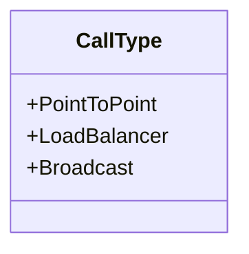
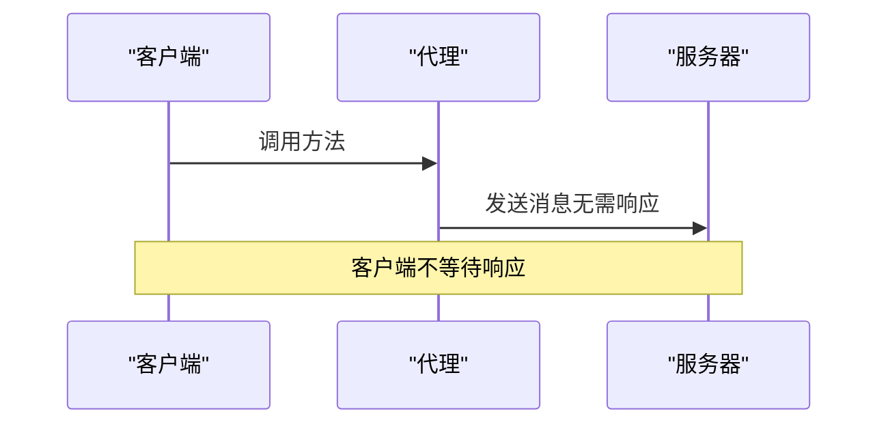
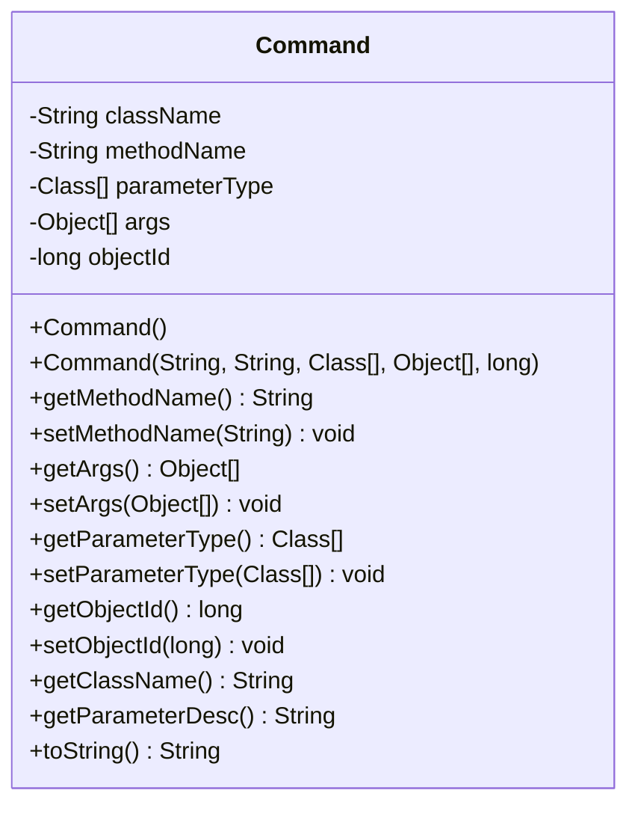
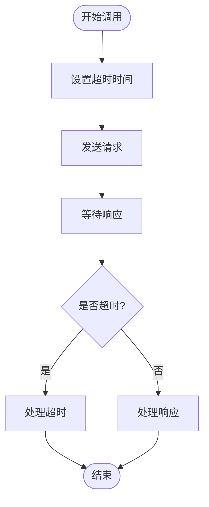

# RPC调用协议

<cite>
**本文档引用的文件**   
- [CallType.java](file://core\src\main\java\cn\game\core\net\rpc\CallType.java)
- [RpcFactory.java](file://core\src\main\java\cn\game\core\net\rpc\RpcFactory.java)
- [Rpc.java](file://core\src\main\java\cn\game\core\net\rpc\Rpc.java)
- [RpcClient.java](file://core\src\main\java\cn\game\core\net\rpc\RpcClient.java)
- [Command.java](file://core\src\main\java\cn\game\core\net\transport\Command.java)
- [VertxRpcClient.java](file://core\src\main\java\cn\game\core\net\rpc\vertx\VertxRpcClient.java)
- [VxHolder.java](file://core\src\main\java\cn\game\core\net\vertx\VxHolder.java)
- [Config.java](file://util\src\main\java\cn\game\util\Config.java)
</cite>

## 目录
1. [引言](#引言)
2. [调用模式设计](#调用模式设计)
3. [CallType枚举定义](#calltype枚举定义)
4. [Rpc注解使用方式](#rpc注解使用方式)
5. [Command消息体结构](#command消息体结构)
6. [性能对比与选择建议](#性能对比与选择建议)
7. [超时控制机制](#超时控制机制)
8. [线程分配机制](#线程分配机制)
9. [调用链追踪机制](#调用链追踪机制)
10. [结论](#结论)

## 引言
本文档详细说明了RPC调用协议中同步调用、异步调用和广播调用三种模式的设计与实现。文档化了CallType枚举定义的调用类型及其适用场景，分析了Rpc注解在接口方法上的使用方式和参数配置。同时，文档化了Command消息体结构，包括类名、方法名、参数列表和序列化格式，并提供了不同调用模式的性能对比数据和选择建议。

**Section sources**
- [CallType.java](file://core\src\main\java\cn\game\core\net\rpc\CallType.java)
- [RpcFactory.java](file://core\src\main\java\cn\game\core\net\rpc\RpcFactory.java)

## 调用模式设计
RPC调用协议支持三种主要的调用模式：同步调用、异步调用和广播调用。每种模式都有其特定的应用场景和实现机制。

### 同步调用
同步调用模式下，客户端发起请求后会阻塞等待服务器响应。这种模式适用于需要立即获取结果的场景，但可能会导致客户端线程阻塞。

### 异步调用
异步调用模式下，客户端发起请求后不会阻塞，而是通过回调函数或Future对象来处理服务器响应。这种模式适用于高并发场景，可以有效提高系统吞吐量。

### 广播调用
广播调用模式下，客户端发起的请求会被发送到所有匹配的服务器节点。这种模式适用于需要通知多个节点的场景，如配置更新或状态同步。

**Section sources**
- [RpcClient.java](file://core\src\main\java\cn\game\core\net\rpc\RpcClient.java)
- [VertxRpcClient.java](file://core\src\main\java\cn\game\core\net\rpc\vertx\VertxRpcClient.java)

## CallType枚举定义
CallType枚举定义了三种调用类型：PointToPoint、LoadBalancer和Broadcast。每种类型都有其特定的用途和适用场景。

**Diagram sources **
- [CallType.java](file://core\src\main\java\cn\game\core\net\rpc\CallType.java)

### PointToPoint
PointToPoint调用类型用于点对点通信，即客户端直接与指定的服务器节点通信。这种模式适用于需要精确控制通信目标的场景。

### LoadBalancer
LoadBalancer调用类型用于负载均衡通信，即客户端请求会被分发到多个服务器节点中的一个。这种模式适用于需要分散负载的场景。

### Broadcast
Broadcast调用类型用于广播通信，即客户端请求会被发送到所有匹配的服务器节点。这种模式适用于需要通知多个节点的场景。

**Section sources**
- [CallType.java](file://core\src\main\java\cn\game\core\net\rpc\CallType.java)

## Rpc注解使用方式
Rpc注解用于在接口方法上配置RPC调用的行为。通过使用Rpc注解，可以改变单次调用的行为，如将调用转换为"Fire-and-Forget"（单向）模式。

### oneWay方法
oneWay方法将下一次RPC调用转换为"Fire-and-Forget"模式。对该代理的任何方法调用都将以单向模式发送，不会等待服务器响应，并且总是立即返回null（或void）。

**Diagram sources **
- [Rpc.java](file://core\src\main\java\cn\game\core\net\rpc\Rpc.java)

**Section sources**
- [Rpc.java](file://core\src\main\java\cn\game\core\net\rpc\Rpc.java)

## Command消息体结构
Command类表示远程调用时的命令，包含了方法所在类、方法名、方法参数类型、方法参数值和objectId等信息。

**Diagram sources **
- [Command.java](file://core\src\main\java\cn\game\core\net\transport\Command.java)

### 类名
className字段表示方法所在类的全限定名。

### 方法名
methodName字段表示要调用的方法名。

### 参数列表
parameterType字段表示方法参数的类型数组，args字段表示方法参数的值数组。

### 序列化格式
Command对象实现了Serializable接口，可以通过Java序列化机制进行序列化和反序列化。

**Section sources**
- [Command.java](file://core\src\main\java\cn\game\core\net\transport\Command.java)

## 性能对比与选择建议
不同调用模式在性能上有显著差异，选择合适的调用模式对于系统性能至关重要。

| 调用模式 | 延迟 | 吞吐量 | 适用场景 |
| --- | --- | --- | --- |
| 同步调用 | 高 | 低 | 需要立即获取结果的场景 |
| 异步调用 | 低 | 高 | 高并发场景 |
| 广播调用 | 中 | 中 | 需要通知多个节点的场景 |

**Section sources**
- [RpcClient.java](file://core\src\main\java\cn\game\core\net\rpc\RpcClient.java)
- [VertxRpcClient.java](file://core\src\main\java\cn\game\core\net\rpc\vertx\VertxRpcClient.java)

## 超时控制机制
RPC调用协议通过配置超时时间来防止请求无限期等待。超时时间可以通过Config类中的remoteCallTimeOut字段进行配置。

**Diagram sources **
- [Config.java](file://util\src\main\java\cn\game\util\Config.java)

**Section sources**
- [Config.java](file://util\src\main\java\cn\game\util\Config.java)

## 线程分配机制
RPC调用协议通过objectId来分线程，确保同一对象的调用在同一个线程中执行，避免并发问题。

**Section sources**
- [Command.java](file://core\src\main\java\cn\game\core\net\transport\Command.java)
- [RpcFactory.java](file://core\src\main\java\cn\game\core\net\rpc\RpcFactory.java)

## 调用链追踪机制
RPC调用协议通过事件总线和拦截器机制实现调用链追踪，可以记录每次调用的详细信息，便于问题排查和性能分析。

**Section sources**
- [EventBusMessageInterceptor.java](file://core\src\main\java\cn\game\core\net\vertx\EventBusMessageInterceptor.java)
- [VxHolder.java](file://core\src\main\java\cn\game\core\net\vertx\VxHolder.java)

## 结论
本文档详细说明了RPC调用协议的设计与实现，涵盖了同步调用、异步调用和广播调用三种模式。通过合理选择调用模式和配置参数，可以有效提高系统的性能和可靠性。