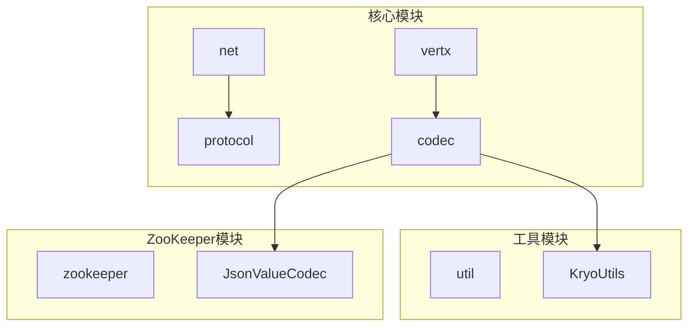
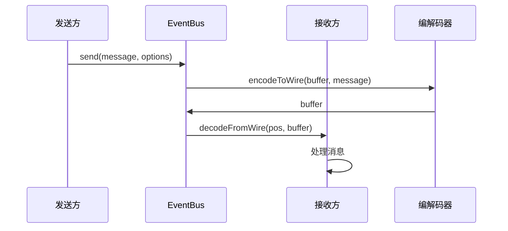
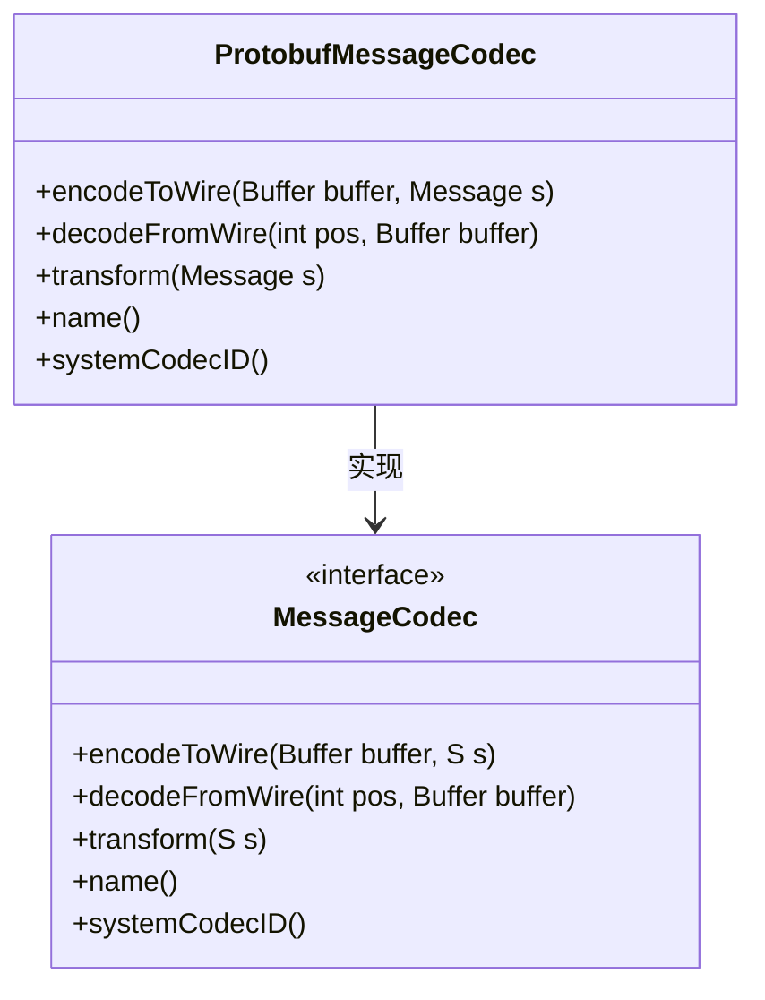
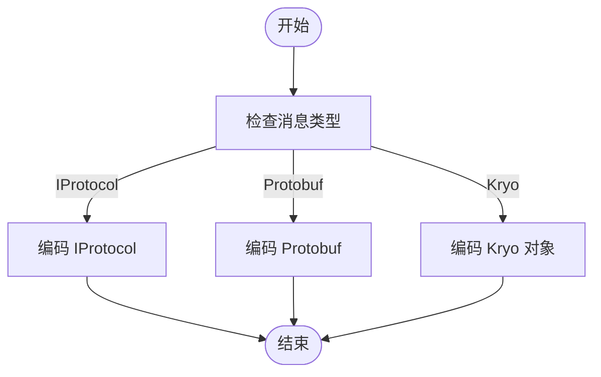
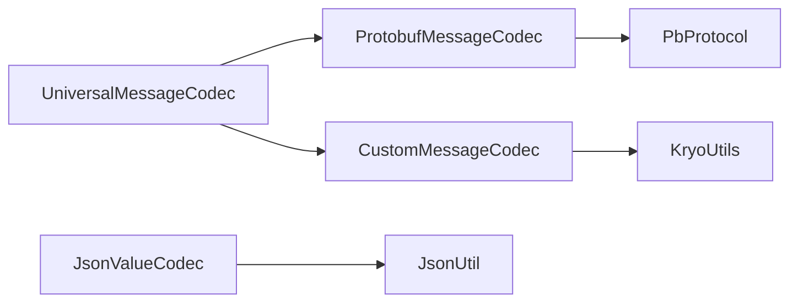

# 协议编解码器

<cite>
**本文档引用的文件**  
- [ProtobufMessageCodec.java](file://core\src\main\java\cn\game\core\net\vertx\codec\ProtobufMessageCodec.java)
- [ProtobufProtocolCodec.java](file://core\src\main\java\cn\game\core\net\vertx\codec\ProtobufProtocolCodec.java)
- [ProtocolCodec.java](file://core\src\main\java\cn\game\core\net\vertx\codec\ProtocolCodec.java)
- [CustomMessageCodec.java](file://core\src\main\java\cn\game\core\net\vertx\codec\CustomMessageCodec.java)
- [UniversalMessageCodec.java](file://core\src\main\java\cn\game\core\net\vertx\codec\UniversalMessageCodec.java)
- [VxHolder.java](file://core\src\main\java\cn\game\core\net\vertx\VxHolder.java)
- [BaseProtocol.java](file://core\src\main\java\cn\game\core\net\protocol\BaseProtocol.java)
- [IProtocol.java](file://core\src\main\java\cn\game\core\net\protocol\IProtocol.java)
- [ProtobufProtocol.java](file://core\src\main\java\cn\game\core\net\protocol\object\ProtobufProtocol.java)
- [KryoUtils.java](file://util\src\main\java\cn\game\util\KryoUtils.java)
- [JsonValueCodec.java](file://core\src\main\java\cn\game\core\zookeeper\codec\JsonValueCodec.java)
- [ValueCodec.java](file://core\src\main\java\cn\game\core\zookeeper\codec\ValueCodec.java)
</cite>

## 目录
1. [引言](#引言)
2. [项目结构](#项目结构)
3. [核心组件](#核心组件)
4. [架构概述](#架构概述)
5. [详细组件分析](#详细组件分析)
6. [依赖分析](#依赖分析)
7. [性能考虑](#性能考虑)
8. [故障排除指南](#故障排除指南)
9. [结论](#结论)

## 引言
本文档系统阐述了协议编解码器的设计与实现，重点分析了 `ProtobufMessageCodec` 和 `JsonMessageCodec` 如何与 Vert.x 消息系统集成，以实现自定义消息类型的序列化与反序列化。文档详细说明了编解码器在消息传输过程中的作用，包括消息头处理、类型标识和数据封装机制。同时，解释了如何注册和使用自定义编解码器，以及编解码过程中的异常处理机制。此外，还提供了编解码性能优化建议，如缓冲区管理、零拷贝传输和压缩策略，并展示了如何扩展协议以支持新的数据类型。

## 项目结构
项目结构清晰地划分了核心功能模块，其中协议编解码器主要位于 `core` 模块的 `net/vertx/codec` 包中。该模块负责处理网络通信中的消息编解码逻辑，与 Vert.x 事件总线紧密集成。`util` 模块提供了通用的工具类，如 `KryoUtils`，用于支持对象序列化。`zookeeper` 模块中的编解码器则用于处理 ZooKeeper 节点值的序列化。

**图示来源**
- [ProtobufMessageCodec.java](file://core\src\main\java\cn\game\core\net\vertx\codec\ProtobufMessageCodec.java)
- [KryoUtils.java](file://util\src\main\java\cn\game\util\KryoUtils.java)
- [JsonValueCodec.java](file://core\src\main\java\cn\game\core\zookeeper\codec\JsonValueCodec.java)

**本节来源**
- [ProtobufMessageCodec.java](file://core\src\main\java\cn\game\core\net\vertx\codec\ProtobufMessageCodec.java)
- [KryoUtils.java](file://util\src\main\java\cn\game\util\KryoUtils.java)

## 核心组件
核心组件包括 `ProtobufMessageCodec`、`CustomMessageCodec`、`ProtocolCodec` 和 `UniversalMessageCodec`。这些编解码器实现了 `MessageCodec` 接口，负责将 Java 对象序列化为字节流并通过 Vert.x 事件总线进行传输。`ProtobufMessageCodec` 专门用于处理 Protobuf 消息，而 `CustomMessageCodec` 使用 Kryo 序列化任意 Java 对象。`UniversalMessageCodec` 提供了统一的编解码接口，支持多种消息类型。

**本节来源**
- [ProtobufMessageCodec.java](file://core\src\main\java\cn\game\core\net\vertx\codec\ProtobufMessageCodec.java)
- [CustomMessageCodec.java](file://core\src\main\java\cn\game\core\net\vertx\codec\CustomMessageCodec.java)
- [UniversalMessageCodec.java](file://core\src\main\java\cn\game\core\net\vertx\codec\UniversalMessageCodec.java)

## 架构概述
系统架构基于 Vert.x 事件总线，通过自定义编解码器实现消息的序列化与反序列化。编解码器在消息发送前将对象编码为字节流，在接收端将字节流解码为对象。`VxHolder` 类负责初始化和注册所有编解码器，确保它们在 Vert.x 实例中可用。消息类型通过 `DeliveryOptions` 指定，以选择正确的编解码器。

**图示来源**
- [VxHolder.java](file://core\src\main\java\cn\game\core\net\vertx\VxHolder.java)
- [ProtobufMessageCodec.java](file://core\src\main\java\cn\game\core\net\vertx\codec\ProtobufMessageCodec.java)

## 详细组件分析

### ProtobufMessageCodec 分析
`ProtobufMessageCodec` 是专门用于处理 Protobuf 消息的编解码器。它在编码时将消息 ID 和消息体字节写入缓冲区，在解码时根据消息 ID 解析出对应的 Protobuf 消息。

**图示来源**
- [ProtobufMessageCodec.java](file://core\src\main\java\cn\game\core\net\vertx\codec\ProtobufMessageCodec.java)

**本节来源**
- [ProtobufMessageCodec.java](file://core\src\main\java\cn\game\core\net\vertx\codec\ProtobufMessageCodec.java)

### UniversalMessageCodec 分析
`UniversalMessageCodec` 是一个通用编解码器，支持多种消息类型，包括 `IProtocol`、Protobuf 消息和 Kryo 序列化对象。它通过类型标识符区分不同的消息类型，并调用相应的编解码逻辑。

**图示来源**
- [UniversalMessageCodec.java](file://core\src\main\java\cn\game\core\net\vertx\codec\UniversalMessageCodec.java)

**本节来源**
- [UniversalMessageCodec.java](file://core\src\main\java\cn\game\core\net\vertx\codec\UniversalMessageCodec.java)

## 依赖分析
编解码器依赖于 `Vert.x` 的 `eventbus` 模块进行消息传输，依赖于 `Kryo` 库进行对象序列化。`ProtobufMessageCodec` 依赖于 `PbProtocol` 类进行 Protobuf 消息的解析。`JsonValueCodec` 依赖于 `JsonUtil` 进行 JSON 序列化。

**图示来源**
- [ProtobufMessageCodec.java](file://core\src\main\java\cn\game\core\net\vertx\codec\ProtobufMessageCodec.java)
- [CustomMessageCodec.java](file://core\src\main\java\cn\game\core\net\vertx\codec\CustomMessageCodec.java)
- [JsonValueCodec.java](file://core\src\main\java\cn\game\core\zookeeper\codec\JsonValueCodec.java)

**本节来源**
- [ProtobufMessageCodec.java](file://core\src\main\java\cn\game\core\net\vertx\codec\ProtobufMessageCodec.java)
- [CustomMessageCodec.java](file://core\src\main\java\cn\game\core\net\vertx\codec\CustomMessageCodec.java)
- [JsonValueCodec.java](file://core\src\main\java\cn\game\core\zookeeper\codec\JsonValueCodec.java)

## 性能考虑
为了提高编解码性能，系统采用了多种优化策略。`KryoUtils` 使用对象池管理 Kryo 实例，避免频繁创建和销毁。`ProtobufMessageCodec` 支持零拷贝传输，通过 `nioBuffer()` 方法直接获取 Netty 的 `ByteBuf`，减少内存复制。此外，建议在高并发场景下使用 `UniversalMessageCodec`，因为它可以统一处理多种消息类型，减少编解码器切换的开销。

**本节来源**
- [KryoUtils.java](file://util\src\main\java\cn\game\util\KryoUtils.java)
- [ProtobufMessageCodec.java](file://core\src\main\java\cn\game\core\net\vertx\codec\ProtobufMessageCodec.java)

## 故障排除指南
在使用编解码器时，常见的问题包括消息类型不匹配、序列化失败和编解码器未注册。确保在发送消息时正确设置 `DeliveryOptions` 的 `codecName`。检查 `VxHolder` 中是否已注册所需的编解码器。对于序列化失败，确认消息类已正确实现 `Serializable` 接口或使用 Kryo 兼容的序列化方式。

**本节来源**
- [VxHolder.java](file://core\src\main\java\cn\game\core\net\vertx\VxHolder.java)
- [KryoUtils.java](file://util\src\main\java\cn\game\util\KryoUtils.java)

## 结论
本文档详细阐述了协议编解码器的设计与实现，涵盖了从核心组件到性能优化的各个方面。通过 `ProtobufMessageCodec` 和 `UniversalMessageCodec`，系统实现了高效、灵活的消息序列化与反序列化。未来可以进一步优化编解码器的性能，例如引入压缩策略或支持更多数据类型。