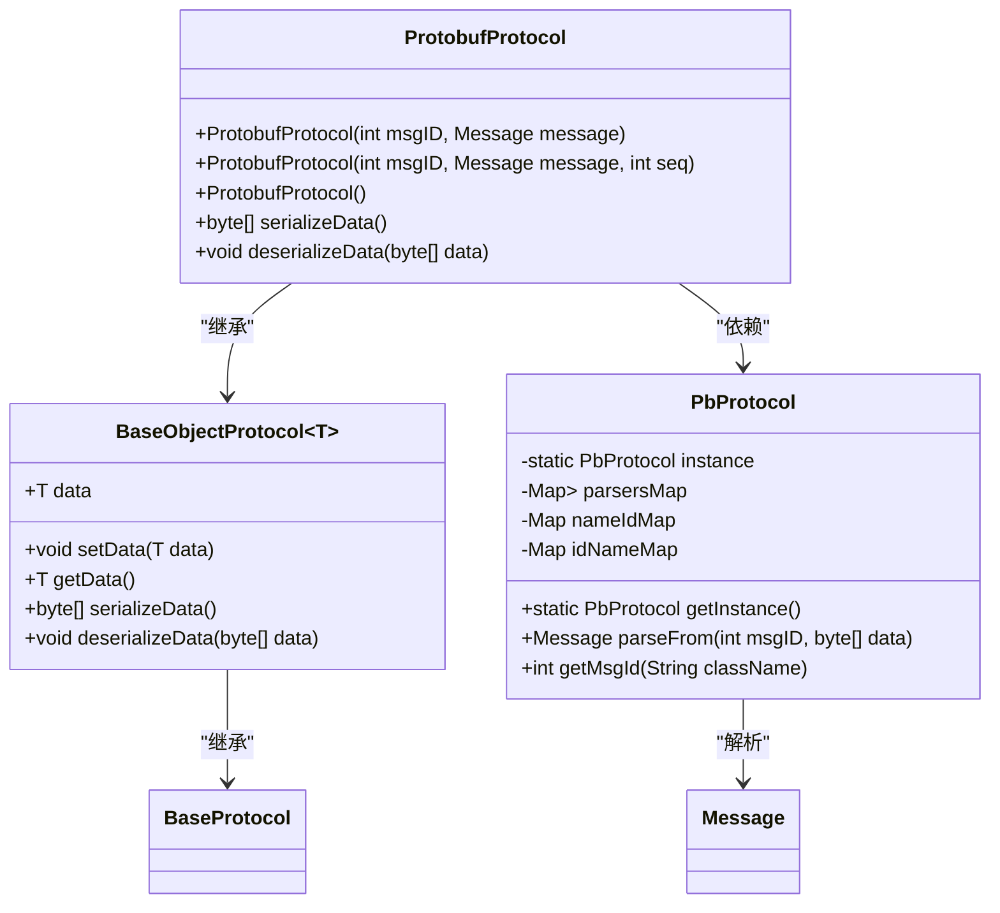
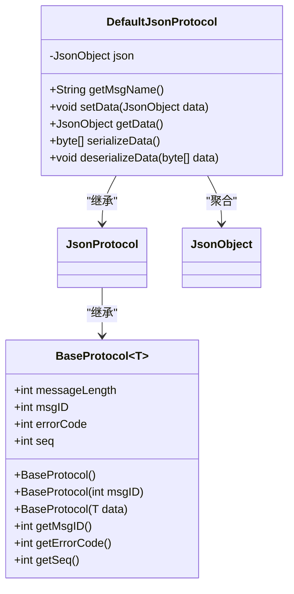
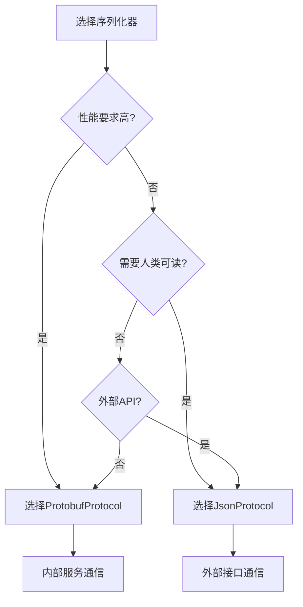
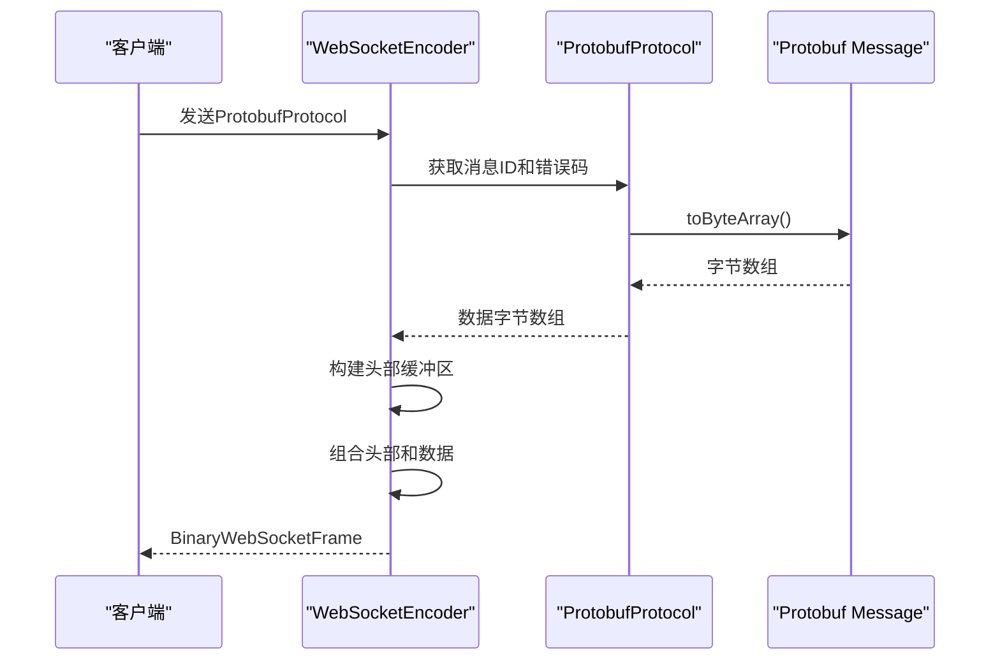

# 序列化机制

<cite>
**本文档引用的文件**   
- [ProtobufProtocol.java](file://core\src\main\java\cn\game\core\net\protocol\object\ProtobufProtocol.java)
- [JsonProtocol.java](file://core\src\main\java\cn\game\core\net\protocol\json\JsonProtocol.java)
- [DefaultJsonProtocol.java](file://core\src\main\java\cn\game\core\net\protocol\json\DefaultJsonProtocol.java)
- [BaseObjectProtocol.java](file://core\src\main\java\cn\game\core\net\protocol\object\BaseObjectProtocol.java)
- [PbProtocol.java](file://protocol\src\main\java\cn\game\protocol\protobuf\PbProtocol.java)
- [BaseProtocol.java](file://core\src\main\java\cn\game\core\net\protocol\BaseProtocol.java)
- [IProtocol.java](file://core\src\main\java\cn\game\core\net\protocol\IProtocol.java)
- [ProtobufProtocolCodec.java](file://core\src\main\java\cn\game\core\net\vertx\codec\ProtobufProtocolCodec.java)
- [WebSocketEncoder.java](file://game\src\main\java\cn\game\games\core\netty\WebSocketEncoder.java)
</cite>

## 目录
1. [引言](#引言)
2. [ProtobufProtocol实现原理](#protobufprotocol实现原理)
3. [JsonProtocol实现原理](#jsonprotocol实现原理)
4. [性能对比分析](#性能对比分析)
5. [序列化器选择指导原则](#序列化器选择指导原则)
6. [复杂对象处理](#复杂对象处理)
7. [结论](#结论)

## 引言
本文档详细分析了系统中两种核心序列化机制：ProtobufProtocol和JsonProtocol。ProtobufProtocol基于Google Protocol Buffers实现高效的二进制序列化，而JsonProtocol则处理JSON格式的序列化与反序列化。这两种机制在性能、带宽占用、可读性和跨语言兼容性方面各有优劣，适用于不同的应用场景。

## ProtobufProtocol实现原理
ProtobufProtocol是基于Google Protocol Buffers的二进制序列化实现，继承自BaseObjectProtocol<Message>，专门用于处理Protocol Buffers消息的序列化和反序列化。

该协议的核心实现包括：
- **序列化**：通过调用Message对象的toByteArray()方法将Protobuf消息转换为字节数组
- **反序列化**：利用PbProtocol单例的parseFrom方法，根据消息ID和数据字节数组解析出对应的Protobuf消息
- **消息ID管理**：在编码时将消息ID写入缓冲区，支持通过类名自动获取消息ID的机制

ProtobufProtocol与Vert.x事件总线集成，通过ProtobufProtocolCodec实现消息编解码，支持在分布式系统中高效传输Protobuf消息。

**图源**
- [ProtobufProtocol.java](file://core\src\main\java\cn\game\core\net\protocol\object\ProtobufProtocol.java#L7-L29)
- [BaseObjectProtocol.java](file://core\src\main\java\cn\game\core\net\protocol\object\BaseObjectProtocol.java#L6-L53)
- [PbProtocol.java](file://protocol\src\main\java\cn\game\protocol\protobuf\PbProtocol.java#L18-L800)

**节源**
- [ProtobufProtocol.java](file://core\src\main\java\cn\game\core\net\protocol\object\ProtobufProtocol.java#L7-L29)
- [PbProtocol.java](file://protocol\src\main\java\cn\game\protocol\protobuf\PbProtocol.java#L18-L800)

## JsonProtocol实现原理
JsonProtocol是基于Vert.x JsonObject的JSON序列化实现，提供了一种人类可读的文本格式序列化机制。

DefaultJsonProtocol作为JsonProtocol的具体实现，其核心功能包括：
- **序列化**：将JsonObject转换为Buffer，然后获取字节数组
- **反序列化**：创建新的JsonObject实例，从字节数据中读取JSON内容
- **数据封装**：使用JsonObject作为数据载体，支持JSON标准的数据类型

JsonProtocol适用于需要人类可读性、调试便利性和与Web前端交互的场景。它与Vert.x的Web服务器组件紧密集成，便于处理HTTP请求和响应。

**图源**
- [DefaultJsonProtocol.java](file://core\src\main\java\cn\game\core\net\protocol\json\DefaultJsonProtocol.java#L6-L36)
- [JsonProtocol.java](file://core\src\main\java\cn\game\core\net\protocol\json\JsonProtocol.java#L6-L9)
- [BaseProtocol.java](file://core\src\main\java\cn\game\core\net\protocol\BaseProtocol.java#L3-L73)

**节源**
- [DefaultJsonProtocol.java](file://core\src\main\java\cn\game\core\net\protocol\json\DefaultJsonProtocol.java#L6-L36)
- [JsonProtocol.java](file://core\src\main\java\cn\game\core\net\protocol\json\JsonProtocol.java#L6-L9)

## 性能对比分析
ProtobufProtocol和JsonProtocol在关键性能指标上存在显著差异：

| 指标 | ProtobufProtocol | JsonProtocol |
|------|------------------|--------------|
| **序列化性能** | 高性能，二进制编码，无需字符串处理 | 较低性能，需要JSON解析和字符串处理 |
| **网络带宽占用** | 极低，二进制格式紧凑，无冗余字符 | 较高，文本格式包含大量引号、括号等分隔符 |
| **可读性** | 二进制格式，人类不可读，需要专用工具解析 | 文本格式，人类可读，便于调试和日志分析 |
| **跨语言兼容性** | 极佳，Protocol Buffers原生支持多语言 | 良好，JSON是通用数据交换格式 |
| **类型安全** | 强类型，通过.proto文件定义严格的数据结构 | 动态类型，运行时类型检查，灵活性高 |
| **版本兼容性** | 优秀的向后和向前兼容性，支持字段增删 | 兼容性依赖于JSON解析器的实现 |
| **调试便利性** | 需要专用工具查看，调试复杂 | 直接可读，便于日志分析和问题排查 |

ProtobufProtocol在性能和带宽方面具有明显优势，特别适合高频、大数据量的内部服务通信。而JsonProtocol在可读性和调试便利性方面表现更好，适合对外API和需要人工检查的场景。

**节源**
- [ProtobufProtocol.java](file://core\src\main\java\cn\game\core\net\protocol\object\ProtobufProtocol.java#L20-L27)
- [DefaultJsonProtocol.java](file://core\src\main\java\cn\game\core\net\protocol\json\DefaultJsonProtocol.java#L26-L33)

## 序列化器选择指导原则
根据不同的应用场景，应遵循以下指导原则选择合适的序列化器：

### 高性能内部通信
对于服务间高频调用、大数据量传输的场景，推荐使用ProtobufProtocol：
- 游戏服务器之间的状态同步
- 微服务间的内部API调用
- 实时数据流处理
- 高并发消息队列通信

### 外部API和Web交互
对于需要与外部系统或Web前端交互的场景，推荐使用JsonProtocol：
- 对外RESTful API
- Web管理后台接口
- 移动端API
- 第三方系统集成

### 调试和开发阶段
在开发和调试阶段，可根据需要灵活选择：
- 开发初期可使用JsonProtocol便于调试
- 性能测试时切换到ProtobufProtocol评估真实性能
- 生产环境日志记录可使用JsonProtocol便于分析

### 版本管理和兼容性
ProtobufProtocol在版本管理方面具有优势：
- 支持字段的优雅增删，不影响现有客户端
- 通过消息ID机制实现协议版本控制
- 提供向后和向前兼容性保证

**图源**
- [ProtobufProtocol.java](file://core\src\main\java\cn\game\core\net\protocol\object\ProtobufProtocol.java#L20-L27)
- [DefaultJsonProtocol.java](file://core\src\main\java\cn\game\core\net\protocol\json\DefaultJsonProtocol.java#L26-L33)

**节源**
- [ProtobufProtocol.java](file://core\src\main\java\cn\game\core\net\protocol\object\ProtobufProtocol.java#L20-L27)
- [DefaultJsonProtocol.java](file://core\src\main\java\cn\game\core\net\protocol\json\DefaultJsonProtocol.java#L26-L33)

## 复杂对象处理
两种序列化机制在处理复杂嵌套对象和集合类型时表现出不同的特性和限制。

### ProtobufProtocol复杂对象处理
ProtobufProtocol通过.proto文件定义复杂数据结构，支持：
- 嵌套消息类型
- 重复字段（集合）
- 枚举类型
- Map类型

在运行时，Protobuf消息是不可变的，所有字段都有默认值，确保了类型安全和数据完整性。对于动态结构，系统通过PbProtocol的parsersMap和nameIdMap实现消息类型的动态解析和注册。

### JsonProtocol复杂对象处理
JsonProtocol直接使用Vert.x的JsonObject和JsonArray，天然支持：
- 嵌套JSON对象
- JSON数组
- 动态字段添加
- 混合数据类型

这种灵活性使得JsonProtocol在处理不确定结构的数据时更加方便，但牺牲了编译时的类型检查。

**图源**
- [WebSocketEncoder.java](file://game\src\main\java\cn\game\games\core\netty\WebSocketEncoder.java#L13-L32)
- [ProtobufProtocol.java](file://core\src\main\java\cn\game\core\net\protocol\object\ProtobufProtocol.java#L20-L27)

**节源**
- [WebSocketEncoder.java](file://game\src\main\java\cn\game\games\core\netty\WebSocketEncoder.java#L13-L32)
- [ProtobufProtocol.java](file://core\src\main\java\cn\game\core\net\protocol\object\ProtobufProtocol.java#L20-L27)

## 结论
ProtobufProtocol和JsonProtocol作为系统中的两种核心序列化机制，各有其适用场景和优势。ProtobufProtocol以其高效的二进制序列化、低带宽占用和优秀的跨语言兼容性，成为内部服务通信的理想选择。而JsonProtocol凭借其人类可读性、调试便利性和与Web技术的天然兼容性，在对外API和开发调试场景中表现出色。

在实际应用中，应根据具体的性能要求、通信场景和维护需求选择合适的序列化器。对于高性能、低延迟的内部通信，优先选择ProtobufProtocol；对于需要人工检查、调试或与Web前端交互的场景，则选择JsonProtocol。通过合理选择和使用这两种序列化机制，可以在保证系统性能的同时，提高开发效率和可维护性。