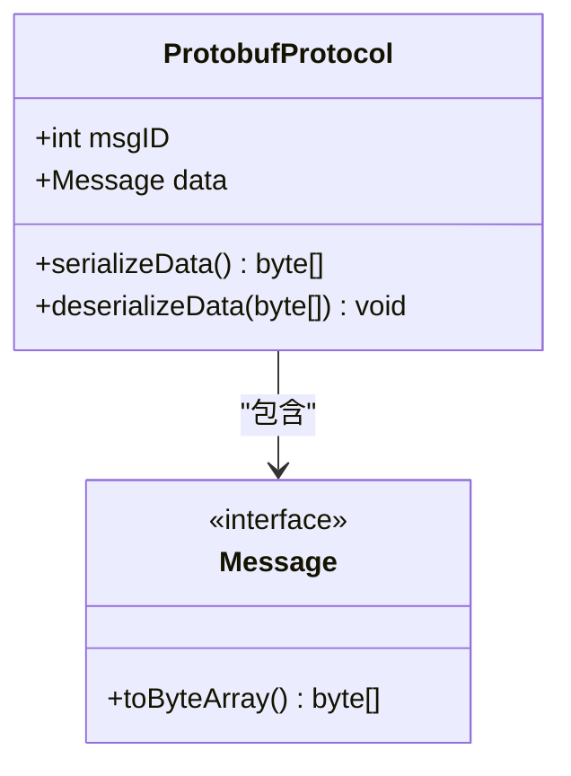
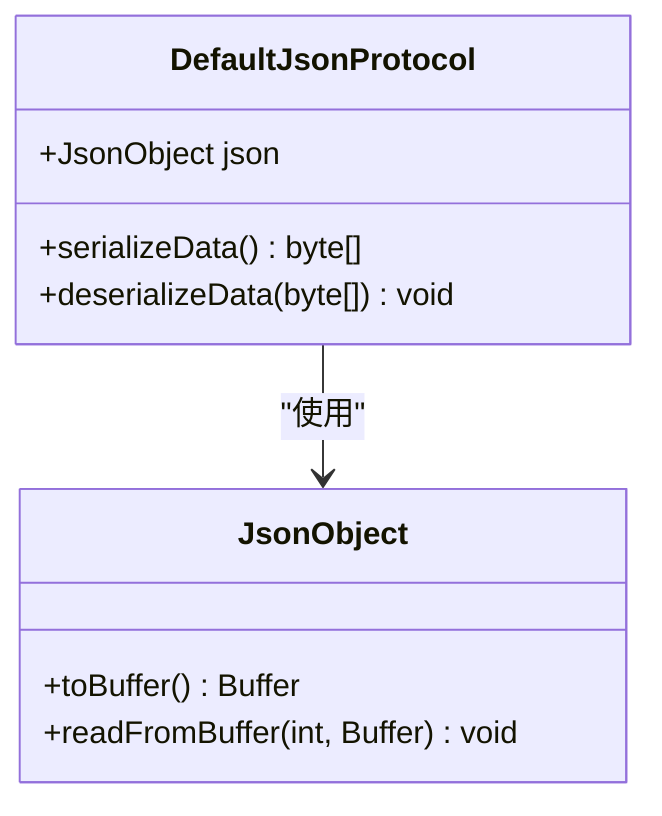
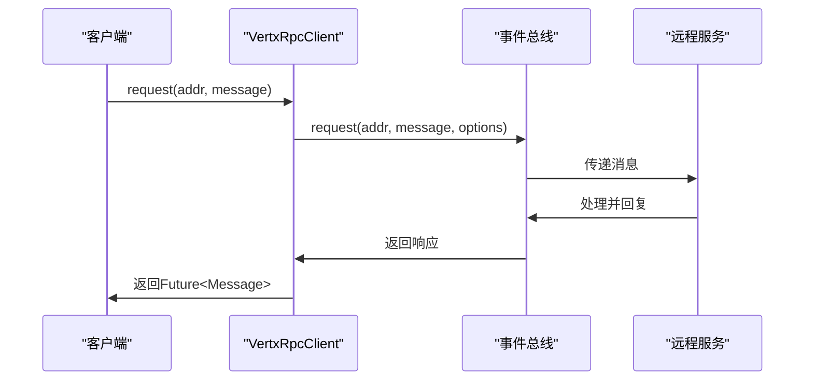
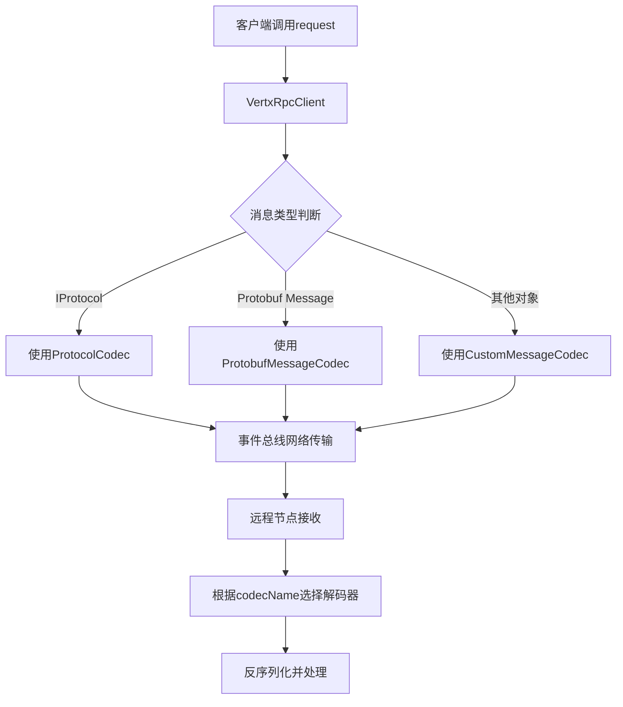
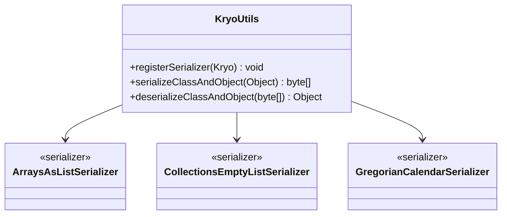
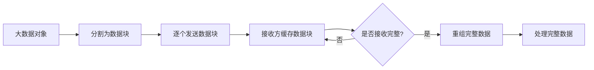

# 数据序列化与传输

<cite>
**本文档引用的文件**  
- [ProtobufProtocolCodec.java](file://core\src\main\java\cn\game\core\net\vertx\codec\ProtobufProtocolCodec.java)
- [ProtobufProtocol.java](file://core\src\main\java\cn\game\core\net\protocol\object\ProtobufProtocol.java)
- [JsonProtocol.java](file://core\src\main\java\cn\game\core\net\protocol\json\JsonProtocol.java)
- [DefaultJsonProtocol.java](file://core\src\main\java\cn\game\core\net\protocol\json\DefaultJsonProtocol.java)
- [UniversalMessageCodec.java](file://core\src\main\java\cn\game\core\net\vertx\codec\UniversalMessageCodec.java)
- [VertxRpcClient.java](file://core\src\main\java\cn\game\core\net\rpc\vertx\VertxRpcClient.java)
- [VxHolder.java](file://core\src\main\java\cn\game\core\net\vertx\VxHolder.java)
- [KryoUtils.java](file://util\src\main\java\cn\game\util\KryoUtils.java)
</cite>

## 目录
1. [引言](#引言)
2. [序列化协议对比](#序列化协议对比)
3. [RPC通信与事件总线封装](#rpc通信与事件总线封装)
4. [反序列化中的类型安全保证](#反序列化中的类型安全保证)
5. [自定义序列化器扩展](#自定义序列化器扩展)
6. [大数据量传输的流式处理建议](#大数据量传输的流式处理建议)
7. [结论](#结论)

## 引言

本项目采用基于Vert.x事件总线的分布式通信架构，其中数据序列化是跨节点消息传递的核心环节。系统支持多种序列化协议，包括高效的Protobuf和可读性强的JSON，通过灵活的编解码机制实现高性能、低延迟的RPC通信。本文档详细阐述了序列化机制的设计、实现与最佳实践。

## 序列化协议对比

系统中主要使用两种序列化协议：ProtobufProtocol和JsonProtocol。它们在性能、带宽占用和可读性方面各有特点。

### ProtobufProtocol

ProtobufProtocol基于Google Protocol Buffers实现，是一种二进制序列化格式。其核心优势在于高性能和低带宽消耗。



**协议来源**  
- [ProtobufProtocol.java](file://core\src\main\java\cn\game\core\net\protocol\object\ProtobufProtocol.java#L7-L29)

ProtobufProtocol的`serializeData()`方法直接调用`data.toByteArray()`进行序列化，避免了中间转换过程，效率极高。在反序列化时，通过`PbProtocol.getInstance().parseFrom(msgID, bytes)`根据消息ID查找对应的Protobuf消息类型进行解析，确保了类型安全。

### JsonProtocol

JsonProtocol基于Vert.x的JsonObject实现，是一种文本序列化格式。其主要优势在于良好的可读性和调试便利性。



**协议来源**  
- [DefaultJsonProtocol.java](file://core\src\main\java\cn\game\core\net\protocol\json\DefaultJsonProtocol.java#L6-L36)

JsonProtocol的`serializeData()`方法将JsonObject转换为Buffer后获取字节数组，而`deserializeData()`则通过`readFromBuffer`方法从字节数组重建JsonObject。虽然可读性好，但其序列化后的数据体积通常比Protobuf大30%-50%，且序列化/反序列化速度较慢。

### 性能对比

| 特性 | ProtobufProtocol | JsonProtocol |
|------|------------------|--------------|
| **序列化速度** | 极快 | 中等 |
| **反序列化速度** | 极快 | 中等 |
| **数据体积** | 小（二进制） | 大（文本） |
| **可读性** | 差（需解码） | 好（明文） |
| **类型安全** | 强（编译时检查） | 弱（运行时检查） |
| **调试便利性** | 差 | 好 |

**选择策略**：对于高频、低延迟的内部服务通信，优先选择ProtobufProtocol以获得最佳性能；对于需要人工查看或调试的场景（如日志、配置传输），可选择JsonProtocol。

**协议来源**  
- [ProtobufProtocol.java](file://core\src\main\java\cn\game\core\net\protocol\object\ProtobufProtocol.java#L20-L27)
- [DefaultJsonProtocol.java](file://core\src\main\java\cn\game\core\net\protocol\json\DefaultJsonProtocol.java#L26-L33)

## RPC通信与事件总线封装

VertxRpcClient是系统中用于发起RPC调用的核心组件，它封装了对Vert.x事件总线的访问，提供了简洁的API。

### VertxRpcClient实现



**图示来源**  
- [VertxRpcClient.java](file://core\src\main\java\cn\game\core\net\rpc\vertx\VertxRpcClient.java#L16-L22)

VertxRpcClient实现了RpcClient接口，其核心方法`request(String addr, T message)`直接委托给Vert.x事件总线的`request`方法。该方法返回一个`Future<Message<T>>`，实现了异步非阻塞的通信模式。

### 消息发送流程

当客户端调用`request`方法时，消息会通过事件总线发送到指定地址。系统通过`VxHolder`注册了多种MessageCodec，包括`UniversalMessageCodec`，用于处理不同类型的消息编解码。



**流程来源**  
- [VxHolder.java](file://core\src\main\java\cn\game\core\net\vertx\VxHolder.java#L143-L148)
- [UniversalMessageCodec.java](file://core\src\main\java\cn\game\core\net\vertx\codec\UniversalMessageCodec.java#L22-L64)

在`VxHolder.init()`方法中，系统注册了多种编解码器，确保不同类型的消息能够被正确序列化和反序列化。`universalOptions`指定了使用`UniversalMessageCodec`，该编解码器能够智能识别消息类型并选择合适的序列化策略。

## 反序列化中的类型安全保证

系统通过多种机制确保反序列化过程中的类型安全，防止类型转换错误和数据损坏。

### 类型标识与验证

在`UniversalMessageCodec`中，每种消息类型都有唯一的类型标识符：

```java
private static final byte TYPE_PROTOBUF_WITH_MSGID = 1;
private static final byte TYPE_PROTOBUF_WITH_CLASSNAME = 2;
private static final byte TYPE_KRYO_OBJECT = 3;
private static final byte TYPE_IPROTOCOL = 4;
```

这些标识符在序列化时写入消息头部，在反序列化时用于确定消息类型，避免了类型混淆。

### Protobuf类型安全

ProtobufProtocol在反序列化时，通过消息ID（msgID）查找对应的Protobuf消息类型：

```java
this.data = PbProtocol.getInstance().parseFrom(msgID, data);
```

这种方式确保了反序列化出的对象类型与发送时完全一致，提供了编译时级别的类型安全。

### Kryo序列化安全

对于普通Java对象的序列化，系统使用KryoUtils，它通过注册常用集合类型的序列化器来保证兼容性：



**图示来源**  
- [KryoUtils.java](file://util\src\main\java\cn\game\util\KryoUtils.java#L316-L336)

通过预注册这些序列化器，系统确保了常见Java集合类型在序列化/反序列化过程中的正确性和一致性。

**类型安全来源**  
- [ProtobufProtocol.java](file://core\src\main\java\cn\game\core\net\protocol\object\ProtobufProtocol.java#L26)
- [UniversalMessageCodec.java](file://core\src\main\java\cn\game\core\net\vertx\codec\UniversalMessageCodec.java#L67-L129)

## 自定义序列化器扩展

系统设计允许通过实现MessageCodec接口来扩展自定义的序列化器，以满足特定的业务需求。

### 扩展步骤

1. **实现MessageCodec接口**：创建新的编解码器类，实现`encodeToWire`、`decodeFromWire`等方法。
2. **注册编解码器**：在`VxHolder.init()`中通过`vertx.eventBus().registerCodec()`注册新编解码器。
3. **使用编解码器**：在发送消息时通过`DeliveryOptions.setCodecName()`指定使用自定义编解码器。

### 示例：自定义JSON编解码器

```java
public class CustomJsonCodec implements MessageCodec<JsonObject, JsonObject> {
    @Override
    public void encodeToWire(Buffer buffer, JsonObject jsonObject) {
        byte[] jsonBytes = jsonObject.toBuffer().getBytes();
        buffer.appendInt(jsonBytes.length);
        buffer.appendBytes(jsonBytes);
    }

    @Override
    public JsonObject decodeFromWire(int pos, Buffer buffer) {
        int length = buffer.getInt(pos);
        pos += 4;
        byte[] bytes = buffer.getBytes(pos, pos + length);
        return new JsonObject(Buffer.buffer(bytes));
    }

    @Override
    public JsonObject transform(JsonObject jsonObject) {
        return jsonObject;
    }

    @Override
    public String name() {
        return "CustomJson";
    }

    @Override
    public byte systemCodecID() {
        return -1;
    }
}
```

然后在`VxHolder.init()`中注册：

```java
vertx.eventBus().registerCodec(new CustomJsonCodec());
```

**扩展来源**  
- [UniversalMessageCodec.java](file://core\src\main\java\cn\game\core\net\vertx\codec\UniversalMessageCodec.java)
- [VxHolder.java](file://core\src\main\java\cn\game\core\net\vertx\VxHolder.java#L143-L148)

## 大数据量传输的流式处理建议

对于大数据量的传输，直接序列化整个对象可能导致内存溢出或网络拥塞。建议采用流式处理策略。

### 分块传输

将大数据分割成多个小块进行传输，接收方按序重组。这种方式可以有效控制内存使用和网络负载。



### 使用场景

- **文件传输**：大文件上传/下载
- **批量数据同步**：数据库批量导出/导入
- **实时流数据**：日志流、监控数据流

### 实现建议

1. **定义分块协议**：在消息中包含块序号、总块数、数据等字段。
2. **使用缓冲机制**：接收方使用环形缓冲区或队列缓存数据块。
3. **超时与重传**：设置合理的超时时间，对丢失的数据块进行重传。
4. **内存监控**：监控缓冲区大小，防止内存溢出。

虽然当前代码库中未直接实现流式处理，但Vert.x的事件总线天然支持异步消息传递，为实现流式处理提供了良好的基础。

## 结论

本系统通过灵活的序列化机制实现了高效、可靠的RPC通信。ProtobufProtocol在性能和带宽方面具有明显优势，适合高频内部通信；JsonProtocol则在可读性和调试方面表现更好。系统通过`UniversalMessageCodec`统一管理多种序列化协议，并通过类型标识和验证机制确保反序列化安全。对于大数据量传输，建议采用分块流式处理策略，以避免内存和网络问题。未来可考虑引入更高效的序列化框架或实现原生的流式传输支持。