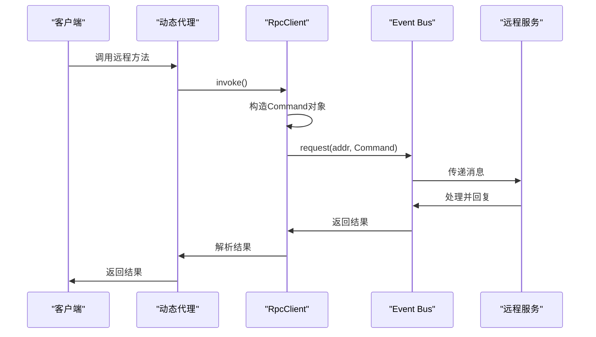
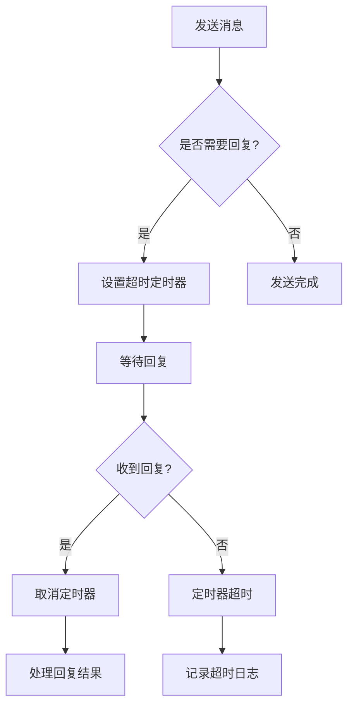

# 网络层实现

<cite>
**本文档引用的文件**  
- [VertxRpcClient.java](file://core\src\main\java\cn\game\core\net\rpc\vertx\VertxRpcClient.java)
- [RpcClient.java](file://core\src\main\java\cn\game\core\net\rpc\RpcClient.java)
- [Rpc.java](file://core\src\main\java\cn\game\core\net\rpc\Rpc.java)
- [VertxRPCService.java](file://core\src\main\java\cn\game\core\net\rpc\vertx\VertxRPCService.java)
- [EventBusMessageInterceptor.java](file://core\src\main\java\cn\game\core\net\vertx\EventBusMessageInterceptor.java)
- [VxHolder.java](file://core\src\main\java\cn\game\core\net\vertx\VxHolder.java)
- [Command.java](file://core\src\main\java\cn\game\core\net\transport\Command.java)
- [RpcFactory.java](file://core\src\main\java\cn\game\core\net\rpc\RpcFactory.java)
- [CallType.java](file://core\src\main\java\cn\game\core\net\rpc\CallType.java)
- [RPCServiceImpl.java](file://core\src\main\java\cn\game\core\net\rpc\RPCServiceImpl.java)
</cite>

## 目录
1. [引言](#引言)
2. [核心组件分析](#核心组件分析)
3. [Vert.x事件总线RPC机制](#vertx事件总线rpc机制)
4. [消息构造与调用封装](#消息构造与调用封装)
5. [同步与异步调用实现](#同步与异步调用实现)
6. [事件总线消息路由与传输保障](#事件总线消息路由与传输保障)
7. [网络可靠性设计](#网络可靠性设计)
8. [性能调优建议](#性能调优建议)
9. [通信监控与问题诊断](#通信监控与问题诊断)
10. [总结](#总结)

## 引言

本文档深入解析基于Vert.x事件总线的RPC网络传输实现。系统性地阐述了远程调用的封装机制、消息路由策略、可靠性设计以及性能优化方案，旨在为开发者提供全面的网络层实现参考。

## 核心组件分析

系统中的RPC网络传输依赖于多个核心组件的协同工作。`VertxRpcClient`作为RPC客户端的Vert.x实现，封装了事件总线的请求、发送和广播功能。`RpcClient`接口定义了统一的远程调用契约，而`RpcFactory`则负责创建动态代理，将接口调用转换为网络请求。`VertxRPCService`作为服务端处理器，负责接收并执行远程命令。`VxHolder`是Vert.x实例的全局持有者，管理着事件总线、集群配置和编解码器等核心资源。

**本节来源**
- [VertxRpcClient.java](file://core\src\main\java\cn\game\core\net\rpc\vertx\VertxRpcClient.java)
- [RpcClient.java](file://core\src\main\java\cn\game\core\net\rpc\RpcClient.java)
- [RpcFactory.java](file://core\src\main\java\cn\game\core\net\rpc\RpcFactory.java)
- [VertxRPCService.java](file://core\src\main\java\cn\game\core\net\rpc\vertx\VertxRPCService.java)
- [VxHolder.java](file://core\src\main\java\cn\game\core\net\vertx\VxHolder.java)

## Vert.x事件总线RPC机制

系统采用Vert.x事件总线（Event Bus）作为RPC通信的底层传输机制。事件总线提供了一个分布式、异步的消息传递系统，支持点对点（Point-to-Point）、发布/订阅（Publish/Subscribe）等多种通信模式。在集群环境下，通过Zookeeper作为集群管理器，实现了节点间的自动发现和消息路由。

`VxHolder`在系统初始化时创建并配置了Vert.x实例，注册了自定义的编解码器（如`ProtobufMessageCodec`和`UniversalMessageCodec`），以支持复杂对象的序列化传输。事件总线的地址（Address）遵循特定的命名规范，例如`<serverId>.rpc.service`，用于标识远程服务端点。

```mermaid
graph TB
subgraph "客户端"
A[业务代码] --> B[RpcFactory]
B --> C[动态代理]
C --> D[VertxRpcClient]
D --> E[Vert.x Event Bus]
end
subgraph "网络"
E --> |集群通信| F[Zookeeper]
E < --> |消息路由| G[Vert.x Event Bus]
end
subgraph "服务端"
G --> H[VertxRPCService]
H --> I[RPCServiceImpl]
I --> J[业务实现]
end
```

**图示来源**
- [VxHolder.java](file://core\src\main\java\cn\game\core\net\vertx\VxHolder.java#L95-L151)
- [VertxRpcClient.java](file://core\src\main\java\cn\game\core\net\rpc\vertx\VertxRpcClient.java#L10-L55)
- [VertxRPCService.java](file://core\src\main\java\cn\game\core\net\rpc\vertx\VertxRPCService.java#L29-L101)

## 消息构造与调用封装

远程调用的请求被封装在`Command`对象中。该对象包含了目标方法的类名、方法名、参数类型、参数值以及用于线程分配的`objectId`。当通过`RpcFactory`创建的动态代理调用一个方法时，`Invocation`处理器会拦截该调用，构建一个`Command`对象，并通过`RpcClient`发送出去。

`RpcClient`的`invoke`方法根据返回值类型自动选择处理策略。对于`Future`、`CompletionStage`或`java.util.concurrent.Future`类型的返回值，采用异步处理模式；对于其他类型，则采用同步阻塞模式。`VertxRpcClient`实现了`RpcClient`接口，利用Vert.x的`eventBus().request()`方法发送请求，并返回一个Vert.x `Future`对象。



**图示来源**
- [Command.java](file://core\src\main\java\cn\game\core\net\transport\Command.java#L13-L93)
- [RpcFactory.java](file://core\src\main\java\cn\game\core\net\rpc\RpcFactory.java#L45-L145)
- [RpcClient.java](file://core\src\main\java\cn\game\core\net\rpc\RpcClient.java#L42-L215)
- [VertxRpcClient.java](file://core\src\main\java\cn\game\core\net\rpc\vertx\VertxRpcClient.java#L16-L22)

## 同步与异步调用实现

系统支持同步和异步两种调用模式，其选择由方法的返回值类型决定。

**异步调用**：当远程方法的返回值类型为`Future`、`CompletionStage`或`java.util.concurrent.Future`时，系统采用异步模式。`RpcClient`会立即返回一个`Future`对象，客户端代码可以在此`Future`上注册回调，而不会阻塞当前线程。这是推荐的调用方式，符合Vert.x的非阻塞编程模型。

**同步调用**：对于返回普通类型的调用，系统采用同步模式。`RpcClient`会调用`Future.get()`方法，阻塞当前线程直到收到回复或超时。此模式仅在`worker`线程中允许使用，以避免阻塞事件循环线程。超时时间由`Config.remoteCallTimeOut`配置项控制。

此外，系统还提供了`Rpc.oneWay()`工具方法，用于执行“即发即忘”（Fire-and-Forget）的单向调用。它会创建一个临时代理，强制将所有调用转换为`send()`操作，不等待任何回复。

**本节来源**
- [RpcClient.java](file://core\src\main\java\cn\game\core\net\rpc\RpcClient.java#L123-L207)
- [Rpc.java](file://core\src\main\java\cn\game\core\net\rpc\Rpc.java#L34-L93)

## 事件总线消息路由与传输保障

### 消息路由策略

事件总线的消息路由由`CallType`枚举定义，支持三种模式：
- **PointToPoint (点对点)**：消息发送到指定`serverId`的节点。
- **LoadBalancer (负载均衡)**：消息发送到指定`ServerType`的所有节点中的一个，由事件总线内部的负载均衡算法决定。
- **Broadcast (广播)**：消息发送到指定`ServerType`的所有节点。

`RpcFactory`根据`CallType`和`serverId`/`serverType`参数，通过`VxHolder.rpcServiceAddr()`方法生成目标地址。

### 传输保障机制

系统通过多种机制保障消息的可靠传输：
1.  **超时设置**：在`DeliveryOptions`中设置`sendTimeout`，防止请求无限期挂起。`VertxRpcClient`使用`VxHolder.universalOptions`作为默认选项。
2.  **错误处理**：`VertxRPCService`在捕获到异常后，会将其包装为`RPCException`并通过`message.fail()`或`message.reply()`发送回客户端。客户端在`handleSyncCall`中会重新抛出这些异常。
3.  **消息跟踪与拦截**：`EventBusMessageInterceptor`作为事件总线的拦截器，在消息发送和接收时进行日志记录和状态跟踪。它为每条消息生成唯一的`trace-id`，记录发送和接收时间戳，并跟踪回复消息的生命周期，有助于诊断消息丢失或超时问题。



**图示来源**
- [CallType.java](file://core\src\main\java\cn\game\core\net\rpc\CallType.java#L3-L5)
- [VxHolder.java](file://core\src\main\java\cn\game\core\net\vertx\VxHolder.java#L340-L346)
- [RpcClient.java](file://core\src\main\java\cn\game\core\net\rpc\RpcClient.java#L176-L180)
- [EventBusMessageInterceptor.java](file://core\src\main\java\cn\game\core\net\vertx\EventBusMessageInterceptor.java#L55-L199)

## 网络可靠性设计

系统在设计上考虑了网络的可靠性，主要体现在以下几个方面：

1.  **集群健康监控**：`EventBusMessageInterceptor`启动了一个周期性任务，每10秒检查一次集群状态（节点数、活跃状态）。如果节点数少于3个或集群非活跃，会记录警告日志，便于及时发现集群问题。
2.  **消息确认机制**：`EventBusMessageInterceptor`通过`replyStatusMap`跟踪回复消息的发送和接收状态。它记录了回复消息的发送时间，并计划在1秒后检查是否被接收，如果未被接收则发出警告，有助于发现网络分区或节点故障。
3.  **诊断功能**：系统定期输出诊断信息，包括活跃消息数、活跃定时器数和待确认回复数，为监控和故障排查提供数据支持。
4.  **熔断与重试**：虽然核心RPC层未直接实现熔断和重试，但其基于`Future`的异步模型为上层应用实现这些策略提供了基础。应用层可以在`Future`上使用`retry`或`circuitBreaker`等操作符来增强可靠性。

**本节来源**
- [EventBusMessageInterceptor.java](file://core\src\main\java\cn\game\core\net\vertx\EventBusMessageInterceptor.java#L206-L247)

## 性能调优建议

1.  **连接池配置**：`VxHolder`在初始化`WebClient`时配置了连接超时，但未显式配置连接池大小。在高并发场景下，应通过`WebClientOptions`设置合理的`setMaxPoolSize`和`setMaxWaitQueueSize`。
2.  **消息批处理**：对于高频的小消息，可以考虑在应用层实现批处理机制，将多个`Command`打包成一个批次发送，以减少网络开销和事件总线的处理负担。
3.  **流量控制**：利用Vert.x的`executeBlockingWithTimeout`方法执行阻塞操作，并设置合理的超时时间，防止慢操作拖垮整个系统。`VxHolder`已对此进行了封装。
4.  **编解码优化**：优先使用`ProtobufMessageCodec`等高效的二进制编解码器，避免使用JSON等文本格式进行序列化，以减少消息体积和序列化开销。
5.  **线程池调优**：根据`VxHolder`中的配置，`workerPoolSize`是`eventLoopPoolSize`的两倍。应根据实际的CPU密集型和IO密集型任务比例，调整这两个参数以达到最佳性能。

**本节来源**
- [VxHolder.java](file://core\src\main\java\cn\game\core\net\vertx\VxHolder.java#L127-L128)
- [VxHolder.java](file://core\src\main\java\cn\game\core\net\vertx\VxHolder.java#L536-L563)

## 通信监控与问题诊断

系统提供了强大的通信监控和诊断能力：

1.  **详细日志**：`EventBusMessageInterceptor`会在发送和接收消息时打印详细的日志，包括目标地址、回复地址、`trace-id`、超时时间、消息体摘要和发送者信息。这对于追踪消息流向至关重要。
2.  **链路追踪**：通过`trace-id`，可以将一次远程调用的请求和回复关联起来，形成完整的调用链。
3.  **超时告警**：`MessageTracker`类会为每个需要回复的请求设置一个超时定时器。如果在超时时间内未收到回复，会记录一条错误日志，明确指出超时的请求详情。
4.  **状态诊断**：系统定期输出诊断信息，帮助运维人员了解事件总线的实时负载情况。
5.  **集群状态监控**：通过日志可以实时了解集群的节点数量和健康状态。

**本节来源**
- [EventBusMessageInterceptor.java](file://core\src\main\java\cn\game\core\net\vertx\EventBusMessageInterceptor.java#L117-L119)
- [EventBusMessageInterceptor.java](file://core\src\main\java\cn\game\core\net\vertx\EventBusMessageInterceptor.java#L601-L604)
- [EventBusMessageInterceptor.java](file://core\src\main\java\cn\game\core\net\vertx\EventBusMessageInterceptor.java#L258-L260)

## 总结

本文档详细解析了基于Vert.x事件总线的RPC网络传输实现。系统通过`RpcFactory`和动态代理机制，将Java方法调用无缝转换为网络请求。`VertxRpcClient`和`VertxRPCService`分别在客户端和服务端利用事件总线完成消息的发送和处理。通过`EventBusMessageInterceptor`提供的消息跟踪、超时管理和日志记录，系统具备了良好的可靠性和可观测性。开发者应优先使用异步调用模式，并结合性能调优建议，以构建高效、稳定的分布式应用。