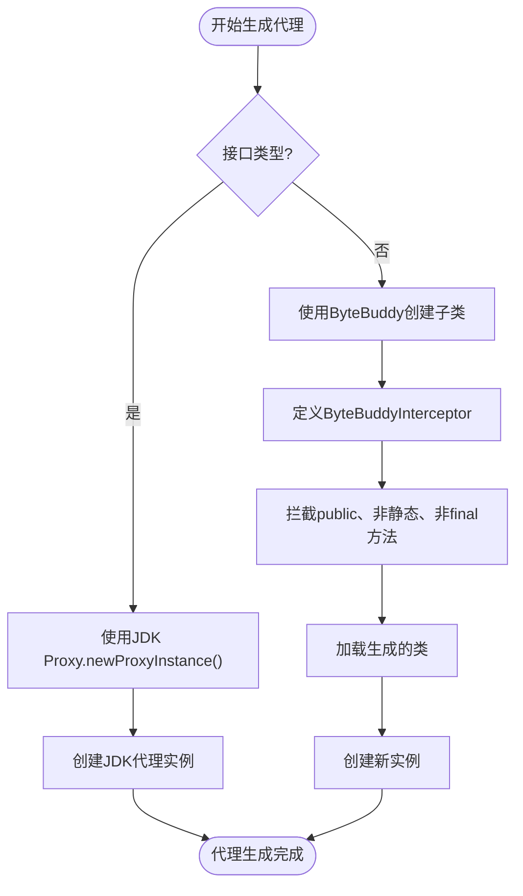
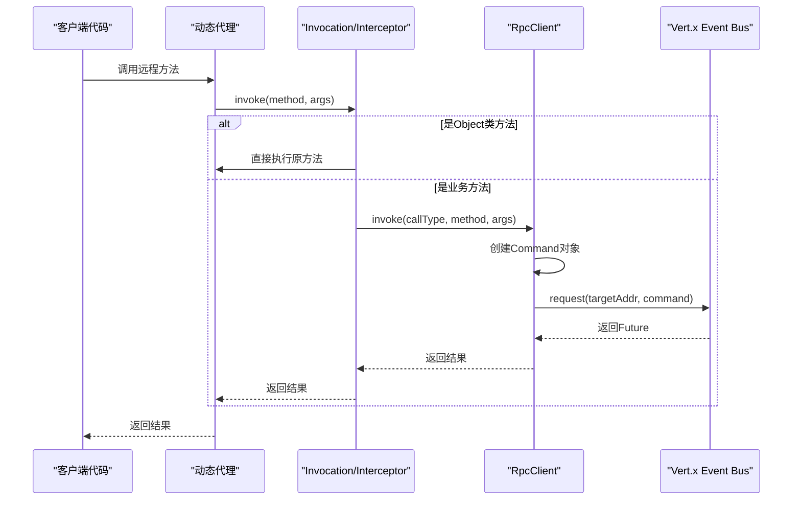
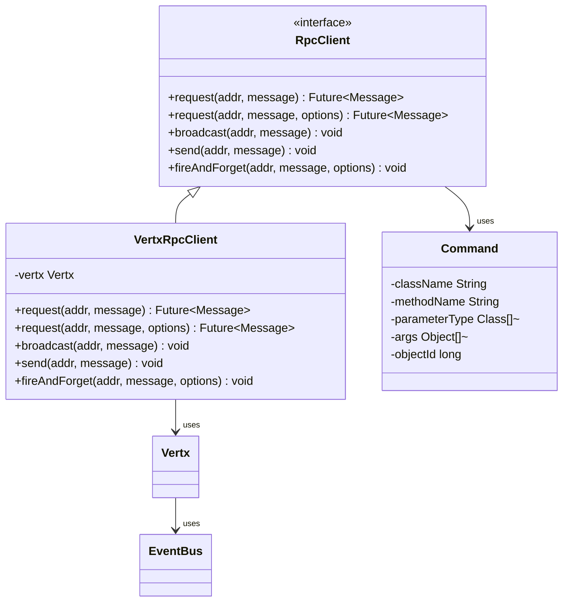

# 客户端代理生成

<cite>
**本文档引用的文件**  
- [RpcFactory.java](file://core/src/main/java/cn/game/core/net/rpc/RpcFactory.java)
- [RpcClient.java](file://core/src/main/java/cn/game/core/net/rpc/RpcClient.java)
- [VertxRpcClient.java](file://core/src/main/java/cn/game/core/net/rpc/vertx/VertxRpcClient.java)
- [VxHolder.java](file://core/src/main/java/cn/game/core/net/vertx/VxHolder.java)
- [UniversalMessageCodec.java](file://core/src/main/java/cn/game/core/net/vertx/codec/UniversalMessageCodec.java)
- [Config.java](file://util/src/main/java/cn/game/util/Config.java)
- [Rpc.java](file://core/src/main/java/cn/game/core/net/rpc/Rpc.java)
- [Command.java](file://core/src/main/java/cn/game/core/net/transport/Command.java)
</cite>

## 目录
1. [引言](#引言)
2. [核心组件](#核心组件)
3. [代理生成机制](#代理生成机制)
4. [方法调用拦截与消息转换](#方法调用拦截与消息转换)
5. [RpcClient的角色与网络传输](#rpcclient的角色与网络传输)
6. [性能优化策略](#性能优化策略)
7. [代理配置最佳实践](#代理配置最佳实践)
8. [结论](#结论)

## 引言

客户端代理生成机制是本系统实现远程服务调用的核心技术。该机制利用ByteBuddy库在运行时动态创建远程服务接口的代理对象，通过拦截方法调用并将其转换为Vert.x事件总线消息，实现了高效、透明的分布式通信。本文档将深入解析`RpcFactory`如何生成代理，`RpcClient`如何处理消息封装与传输，以及相关的性能优化和配置最佳实践。

## 核心组件

本机制涉及多个核心组件，它们协同工作以实现动态代理和远程调用。`RpcFactory`负责创建代理实例，`RpcClient`处理底层网络通信，`VxHolder`管理Vert.x事件总线，而`UniversalMessageCodec`则负责消息的序列化与反序列化。

**本文档引用的文件**  
- [RpcFactory.java](file://core/src/main/java/cn/game/core/net/rpc/RpcFactory.java)
- [RpcClient.java](file://core/src/main/java/cn/game/core/net/rpc/RpcClient.java)
- [VxHolder.java](file://core/src/main/java/cn/game/core/net/vertx/VxHolder.java)
- [UniversalMessageCodec.java](file://core/src/main/java/cn/game/core/net/vertx/codec/UniversalMessageCodec.java)

## 代理生成机制

`RpcFactory`是客户端代理生成的核心。它根据服务接口的类型，选择使用JDK动态代理或ByteBuddy来创建代理实例。

**图示来源**  
- [RpcFactory.java](file://core/src/main/java/cn/game/core/net/rpc/RpcFactory.java#L66-L90)

当请求的接口类型为接口时，`RpcFactory`使用JDK的`Proxy.newProxyInstance`方法创建代理。当请求的类型为具体类时，则使用ByteBuddy库通过`subclass(clazz)`创建该类的子类，并通过`MethodDelegation.to(interceptor)`将所有符合条件的方法调用委托给一个拦截器。这种方法允许系统为任何类生成代理，而不仅限于接口，极大地增强了灵活性。

## 方法调用拦截与消息转换

无论是JDK代理还是ByteBuddy代理，其核心的拦截逻辑都由`Invocation`和`ByteBuddyInterceptor`两个内部类实现。它们负责将方法调用转换为可传输的`Command`对象。

**图示来源**  
- [RpcFactory.java](file://core/src/main/java/cn/game/core/net/rpc/RpcFactory.java#L132-L140)
- [RpcClient.java](file://core/src/main/java/cn/game/core/net/rpc/RpcClient.java#L42-L45)

当代理对象的方法被调用时，控制权会转移到`Invocation.invoke`或`ByteBuddyInterceptor.intercept`方法。首先，它会检查调用的方法是否属于`Object`类（如`toString`, `hashCode`），如果是，则直接在本地执行。对于业务方法，它会创建一个`Command`对象，该对象封装了方法的全限定类名、方法名、参数类型数组和参数值数组。这个`Command`对象随后被传递给`RpcClient`进行网络传输。

## RpcClient的角色与网络传输

`RpcClient`是远程调用的执行者，它负责将`Command`对象通过Vert.x事件总线发送到目标服务器，并处理响应。

**图示来源**  
- [RpcClient.java](file://core/src/main/java/cn/game/core/net/rpc/RpcClient.java)
- [VertxRpcClient.java](file://core/src/main/java/cn/game/core/net/rpc/vertx/VertxRpcClient.java)
- [Command.java](file://core/src/main/java/cn/game/core/net/transport/Command.java)

`RpcClient`是一个接口，具体的实现是`VertxRpcClient`。它利用Vert.x的`eventBus()`进行通信。根据方法的返回类型，`RpcClient`会自动选择异步或同步调用模式。如果返回类型是`Future`、`CompletionStage`或`java.util.concurrent.Future`，则采用异步模式，立即返回一个`Future`对象。否则，采用同步模式，在`handleSyncCall`方法中，它会设置一个超时时间，然后调用`request`方法并阻塞等待结果。消息的序列化由`UniversalMessageCodec`完成，它支持多种类型，包括自定义的`IProtocol`、Protobuf消息和通过Kryo序列化的任意对象。

## 性能优化策略

该代理机制在设计上融入了多项性能优化策略，以确保高并发下的高效运行。

### 方法缓存

`RpcFactory`使用一个`ConcurrentHashMap`作为`instanceCache`来缓存生成的代理实例。当`objectId`为0时，系统会根据`clazz`、`targetAddr`和`callType`生成一个`Key`，并使用`computeIfAbsent`方法来确保相同配置的代理实例只会被创建一次。这避免了重复的代理生成开销，显著提升了性能。

### 异步调用支持

系统优先支持异步调用。通过识别方法返回类型为`Future`或`CompletionStage`，`RpcClient`可以立即返回一个`Future`，让调用方在不阻塞当前线程的情况下继续执行其他任务。这充分利用了Vert.x的事件驱动模型，保证了Event Loop线程的高效运转。

### 序列化优化

`UniversalMessageCodec`实现了高效的序列化策略。它首先检查消息类型，对于`IProtocol`和`Protobuf`消息，采用自定义的、更高效的序列化方式。对于其他对象，则使用Kryo进行序列化。这种多路复用的编解码器避免了单一序列化方式的性能瓶颈。

## 代理配置最佳实践

为了确保系统的稳定性和性能，需要对代理进行合理的配置。

### 超时设置

同步调用的超时时间由`Config.java`中的`remoteCallTimeOut`字段控制，单位为秒。在`VertxRpcClient`中，这个值会被乘以1000并设置为`DeliveryOptions`的`sendTimeout`。建议根据业务场景合理设置此值，避免因网络延迟导致线程长时间阻塞。

### 重试策略

虽然`RpcClient`本身不直接处理重试，但其返回的`Future`对象可以与系统的重试框架集成。例如，可以使用`RetryConfig`来定义最大重试次数和重试间隔，当`Future`失败时，根据配置进行重试。

### 负载均衡

`CallType`枚举定义了`PointToPoint`、`LoadBalancer`和`Broadcast`三种调用类型。在`LoadBalancer`模式下，`VxHolder.rpcServiceAddr(serverType)`会生成一个基于服务器类型的服务地址，Vert.x集群会自动将请求负载均衡到该类型的所有可用节点上，从而实现横向扩展。

## 结论

客户端代理生成机制通过`RpcFactory`、`RpcClient`和Vert.x事件总线的紧密协作，实现了高效、透明的远程服务调用。它利用ByteBuddy和JDK动态代理技术，将复杂的网络通信细节对开发者隐藏。通过方法缓存、异步调用和高效的序列化等优化策略，该机制能够在高并发场景下保持卓越的性能。遵循超时、重试和负载均衡的最佳实践，可以构建出稳定可靠的分布式系统。