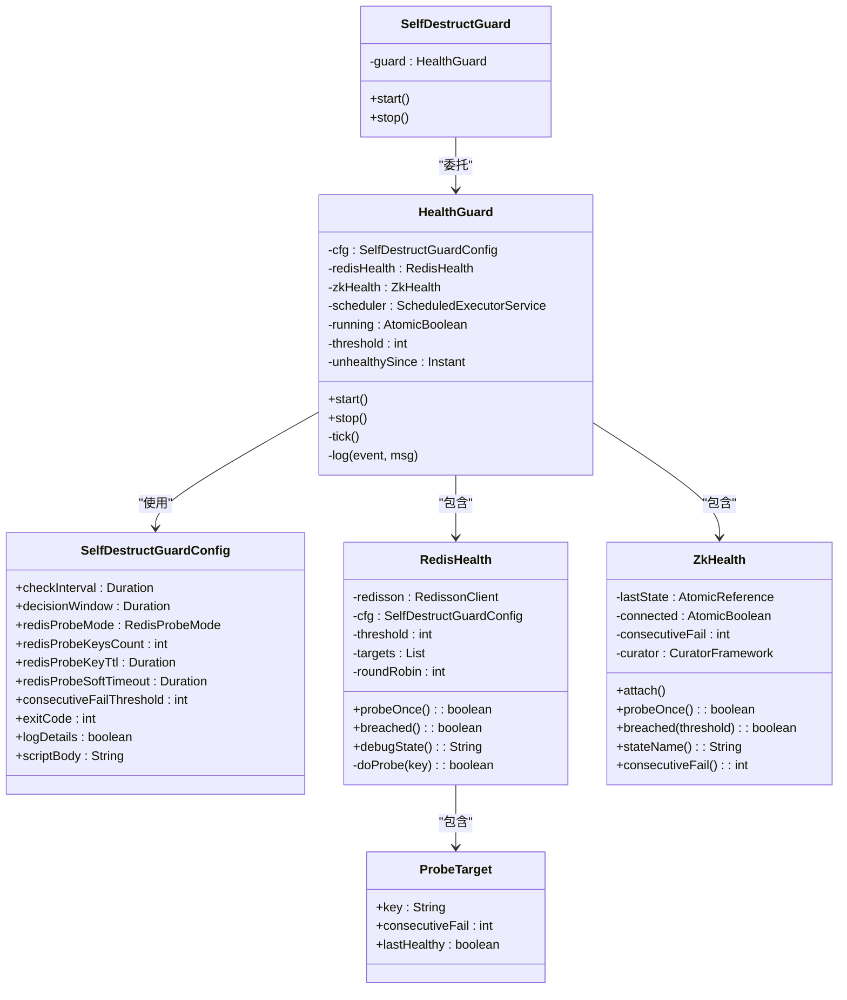
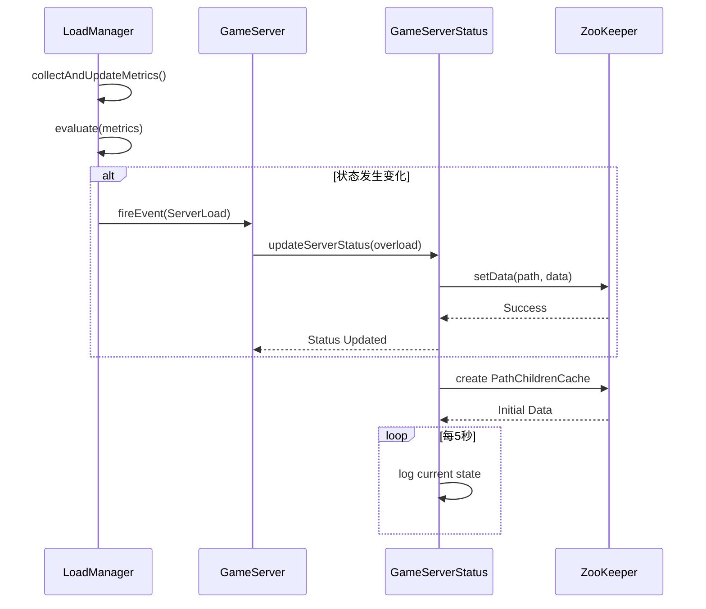

# 服务健康检查

<cite>
**本文档引用的文件**   
- [HealthGuard.java](file://core\src\main\java\cn\game\core\health\HealthGuard.java)
- [SelfDestructGuard.java](file://core\src\main\java\cn\game\core\health\SelfDestructGuard.java)
- [SelfDestructGuardConfig.java](file://core\src\main\java\cn\game\core\health\SelfDestructGuardConfig.java)
- [RedisHealth.java](file://core\src\main\java\cn\game\core\health\RedisHealth.java)
- [ZkHealth.java](file://core\src\main\java\cn\game\core\health\ZkHealth.java)
- [LoadManager.java](file://core\src\main\java\cn\game\core\performance\LoadManager.java)
- [GameServerStatus.java](file://game\src\main\java\cn\game\games\core\GameServerStatus.java)
- [EventLoopHealthChecker.java](file://core\src\main\java\cn\game\core\net\vertx\EventLoopHealthChecker.java)
- [DegradeStrategy.java](file://core\src\main\java\cn\game\core\performance\DegradeStrategy.java)
</cite>

## 目录
1. [引言](#引言)
2. [核心健康检查机制](#核心健康检查机制)
3. [ServerStatus与集群健康感知](#serverstatus与集群健康感知)
4. [健康检查结果对服务发现的影响](#健康检查结果对服务发现的影响)
5. [健康检查阈值配置最佳实践](#健康检查阈值配置最佳实践)
6. [服务异常时的自动降级机制](#服务异常时的自动降级机制)
7. [告警机制](#告警机制)
8. [总结](#总结)

## 引言

本文档详细阐述了系统中服务健康检查机制的实现，重点介绍HealthGuard如何监控RPC服务的运行状态。系统通过多维度的健康检查，包括CPU使用率、内存占用和事件循环阻塞等关键指标，确保服务的高可用性和稳定性。ServerStatus组件在服务状态上报和集群健康感知中扮演着核心角色，其状态直接影响服务发现和负载均衡决策。当服务出现异常时，系统具备自动降级和告警能力，以最大限度地保障用户体验和系统安全。

## 核心健康检查机制

系统的核心健康检查由`HealthGuard`类实现，它是一个独立的守护进程，负责周期性地探测关键外部依赖的健康状况。其主要职责是监控ZooKeeper和Redis这两个核心中间件的可用性。

`HealthGuard`通过`SelfDestructGuard`启动，其配置由`SelfDestructGuardConfig`定义。该配置允许设置健康检查的频率（`checkInterval`）、故障判定窗口（`decisionWindow`）以及连续失败的阈值（`consecutiveFailThreshold`）。当任何一个依赖项在判定窗口内连续失败次数达到阈值时，`HealthGuard`将触发自毁机制，通过`System.exit()`退出JVM，从而防止一个不健康的服务实例继续处理请求，避免问题扩散。

对于Redis的健康检查，系统采用了`RedisHealth`类，它通过多种模式（PING、SMALL_RW、SCRIPT）进行探测。它会创建多个独立的“探测目标”键，并使用轮询的方式对它们进行读写操作。这种设计可以更全面地覆盖Redis集群的不同节点，避免因单个节点故障而误判整个集群的健康状况。探测操作在独立的线程池中执行，并设置了软超时，以防止探测本身阻塞主线程。



**图示来源**
- [HealthGuard.java](file://core\src\main\java\cn\game\core\health\HealthGuard.java)
- [SelfDestructGuard.java](file://core\src\main\java\cn\game\core\health\SelfDestructGuard.java)
- [SelfDestructGuardConfig.java](file://core\src\main\java\cn\game\core\health\SelfDestructGuardConfig.java)
- [RedisHealth.java](file://core\src\main\java\cn\game\core\health\RedisHealth.java)
- [ZkHealth.java](file://core\src\main\java\cn\game\core\health\ZkHealth.java)

**本节来源**
- [HealthGuard.java](file://core\src\main\java\cn\game\core\health\HealthGuard.java#L1-L105)
- [SelfDestructGuard.java](file://core\src\main\java\cn\game\core\health\SelfDestructGuard.java#L1-L34)
- [SelfDestructGuardConfig.java](file://core\src\main\java\cn\game\core\health\SelfDestructGuardConfig.java#L1-L38)
- [RedisHealth.java](file://core\src\main\java\cn\game\core\health\RedisHealth.java#L1-L161)
- [ZkHealth.java](file://core\src\main\java\cn\game\core\health\ZkHealth.java#L1-L61)

## ServerStatus与集群健康感知

`ServerStatus`机制是集群健康感知的核心。在本系统中，`GameServerStatus`类负责管理游戏服务器的状态。它通过ZooKeeper来实现状态的持久化和共享。每个游戏服务器实例在启动时，会将自己的状态信息（如服务器ID、端口、版本、运行状态等）注册到ZooKeeper的一个特定路径下。

`GameServerStatus`不仅负责上报本机状态，还负责监听ZooKeeper上其他服务器节点的状态变化。它使用`PathChildrenCache`来监听服务器列表路径，当有新的服务器加入、现有服务器状态更新或服务器下线时，它都能及时收到通知并更新本地缓存。这使得任何一个服务器实例都能快速感知到整个集群的拓扑变化和健康状况。

当`LoadManager`检测到本机负载状态发生变化时，会触发一个`ServerEventTypeEnum.ServerLoad`事件。`GameServer`类中注册了该事件的监听器，当监听到负载状态变为`CRITICAL`（临界）时，会调用`GameServerStatus.getInstance().updateServerStatus()`方法，将本机在ZooKeeper上的状态更新为`STATUS_OVERLOAD`（过载）。反之，当负载恢复正常时，状态会被更新回`STATUS_RUN`（运行中）。这样，服务发现组件就可以根据ZooKeeper中的状态信息，做出相应的路由决策。



**图示来源**
- [LoadManager.java](file://core\src\main\java\cn\game\core\performance\LoadManager.java#L180-L201)
- [GameServer.java](file://game\src\main\java\cn\game\games\net\game\GameServer.java#L607-L635)
- [GameServerStatus.java](file://game\src\main\java\cn\game\games\core\GameServerStatus.java#L1-L169)

**本节来源**
- [GameServerStatus.java](file://game\src\main\java\cn\game\games\core\GameServerStatus.java#L1-L169)
- [GameServer.java](file://game\src\main\java\cn\game\games\net\game\GameServer.java#L607-L641)

## 健康检查结果对服务发现的影响

健康检查的结果直接影响服务发现和负载均衡的决策。服务发现组件（如客户端或网关）会定期从ZooKeeper中获取当前可用的服务器列表。在获取列表时，它会检查每个服务器节点的`status`字段。

- **正常状态 (STATUS_RUN)**：该服务器被视为健康，可以接收新的客户端连接和请求。负载均衡器会将其纳入候选池，根据负载情况分配流量。
- **过载状态 (STATUS_OVERLOAD)**：该服务器被视为不健康或过载。服务发现组件会将其从可用列表中移除，或者将其权重设置为0，从而停止向其分配新的流量。这可以防止过载的服务器接收更多请求，使其有机会恢复。
- **已下线状态 (STATUS_STOP)**：该服务器已主动下线或被标记为不可用。服务发现组件会立即将其从列表中移除。

通过这种方式，健康检查机制与服务发现紧密结合，实现了动态的、基于健康状况的流量路由。当一个服务实例因高负载或外部依赖故障而变得不健康时，系统能够自动将其隔离，将流量引导至健康的实例，从而保证了整个服务集群的稳定性和可用性。

## 健康检查阈值配置最佳实践

合理的阈值配置是健康检查机制有效运行的关键。配置不当可能导致误报（服务正常但被判定为不健康）或漏报（服务已不健康但未被及时发现）。

1.  **`checkInterval` (检查频率)**：建议设置为10-15秒。过于频繁的检查会增加ZooKeeper和Redis的负担，而间隔过长则会导致故障发现延迟。10-15秒是一个在及时性和系统开销之间的良好平衡点。
2.  **`decisionWindow` (判定窗口)**：建议设置为5分钟。这个窗口定义了系统在多长时间内观察连续失败。5分钟的窗口可以过滤掉短暂的网络抖动或瞬时故障，避免因偶发问题导致服务被错误地终止。
3.  **`consecutiveFailThreshold` (连续失败阈值)**：该值通常由`decisionWindow`和`checkInterval`自动推导。例如，如果`decisionWindow`为5分钟（300秒），`checkInterval`为10秒，则阈值为30次。这意味着服务必须在5分钟内连续30次检查失败才会被判定为不健康。这个配置确保了判定的保守性。
4.  **`redisProbeKeysCount` (探测键数量)**：建议设置为9或更高。更多的探测键可以更均匀地分布在Redis集群的不同分片上，提供更全面的健康视图，避免因单个分片问题而误判整个集群。
5.  **`redisProbeKeyTtl` (探测键TTL)**：建议设置为30秒。这确保了探测键不会在Redis中长期残留，避免占用不必要的内存。

## 服务异常时的自动降级机制

除了通过`HealthGuard`进行自毁外，系统还实现了更精细的、非破坏性的自动降级策略。`LoadManager`负责监控本机的系统资源，如CPU、内存、磁盘I/O、网络和Vert.x事件循环/工作线程池的负载。

`LoadManager`通过`MetricCollector`收集各类指标，然后由`LoadEvaluator`根据指标的权重和阈值评估出当前的`LoadState`（`NORMAL`、`WARNING`、`CRITICAL`）。当状态发生变化时，`LoadManager`会调用`DegradeStrategy`来执行相应的降级策略。

`DegradeStrategy`使用一个原子布尔数组来标记各种功能的限制状态。例如：
- 当系统处于`CRITICAL`状态时，会限制`Login`（登录）和`GlobalChat`（全局聊天）功能。
- 当系统处于`WARNING`状态时，会限制`GlobalChat`功能。
- 当Vert.x事件循环队列积压严重时，会限制`NoBlockingOperation`（禁止阻塞操作），防止事件循环被阻塞。
- 当工作线程池过载时，会限制`BlockingOperation`（阻塞操作），防止创建更多耗时的任务。

业务代码在执行关键操作前，会调用`DegradeStrategy.isLimited(type)`来检查相应的功能是否被限制。如果被限制，则可以返回一个友好的错误提示，而不是直接处理请求，从而保护核心服务的稳定。

```mermaid
flowchart TD
A[开始] --> B[LoadManager收集指标]
B --> C[LoadEvaluator评估状态]
C --> D{状态是否变化?}
D -- 是 --> E[执行executeDegrade()]
D -- 否 --> F[等待下次采集]
E --> G[恢复所有限制]
G --> H{根据新状态}
H --> |CRITICAL| I[限制登录和全局聊天]
H --> |WARNING| J[限制全局聊天]
H --> |NORMAL| K[不进行限制]
I --> L[通知ServerContext]
J --> L
K --> L
L --> M[结束]
```

**图示来源**
- [LoadManager.java](file://core\src\main\java\cn\game\core\performance\LoadManager.java#L180-L252)
- [DegradeStrategy.java](file://core\src\main\java\cn\game\core\performance\DegradeStrategy.java#L1-L52)

**本节来源**
- [LoadManager.java](file://core\src\main\java\cn\game\core\performance\LoadManager.java#L164-L258)
- [DegradeStrategy.java](file://core\src\main\java\cn\game\core\performance\DegradeStrategy.java#L1-L52)

## 告警机制

系统的告警机制主要通过日志和监控指标来实现。

1.  **日志告警**：`HealthGuard`在日志级别为`ERROR`时会输出详细的健康检查事件，如`ENTER_UNHEALTHY`、`SELF_DESTRUCT`等。这些日志可以被日志收集系统（如ELK）捕获，并通过日志分析平台触发告警。`LoadEvaluator`在检测到任何指标超过警告或临界阈值时，也会输出`WARN`级别的日志。
2.  **监控指标告警**：`LoadManager`集成了Micrometer，将所有收集到的性能指标（CPU、内存、事件循环队列长度等）暴露给监控系统（如Prometheus）。运维人员可以在Grafana等可视化工具中配置告警规则，例如“当`vertx.eventloop`指标持续5分钟超过0.9时，发送邮件告警”。这种方式提供了更实时、更灵活的告警能力。
3.  **事件循环阻塞检测**：`EventLoopHealthChecker`类提供了一个专门的检查，它每秒都会测量向Vert.x事件循环提交任务的响应延迟。如果延迟超过100毫秒，它会发出警告，并进一步检查线程栈，尝试发现是否有同步的RPC调用等阻塞操作在事件循环线程上执行，这对于预防服务雪崩至关重要。

## 总结

本系统构建了一套多层次、全方位的服务健康检查机制。`HealthGuard`作为最底层的“保险丝”，通过监控ZooKeeper和Redis的健康状况，在服务完全失联时进行自毁，防止“僵尸”实例污染集群。`LoadManager`和`DegradeStrategy`则提供了更精细化的、基于本机资源的健康管理和自动降级能力，能够在服务过载时保护核心功能。`GameServerStatus`通过ZooKeeper实现了集群范围内的健康状态共享，使得服务发现和负载均衡能够基于准确的健康信息做出决策。这套机制共同保障了服务的高可用性和稳定性，是系统可靠运行的重要基石。