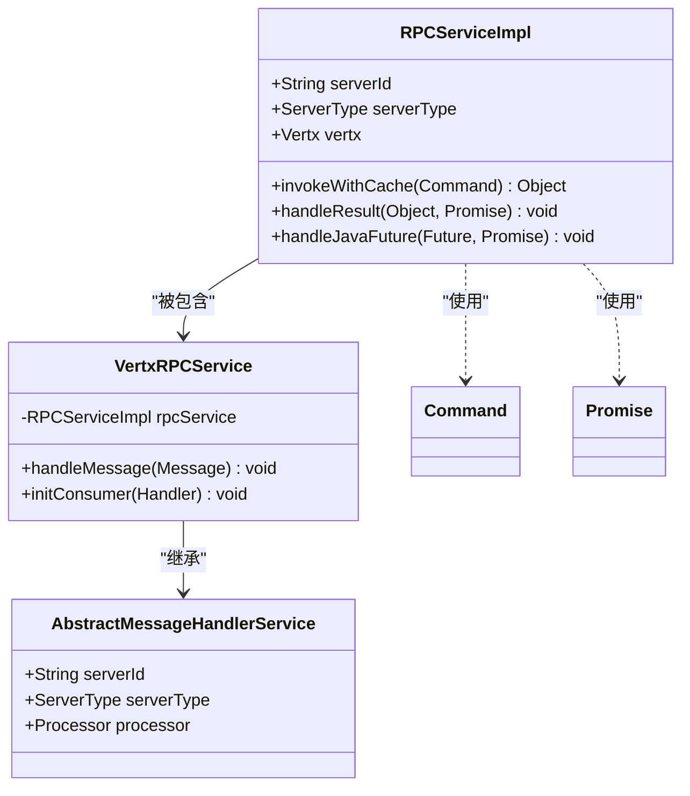
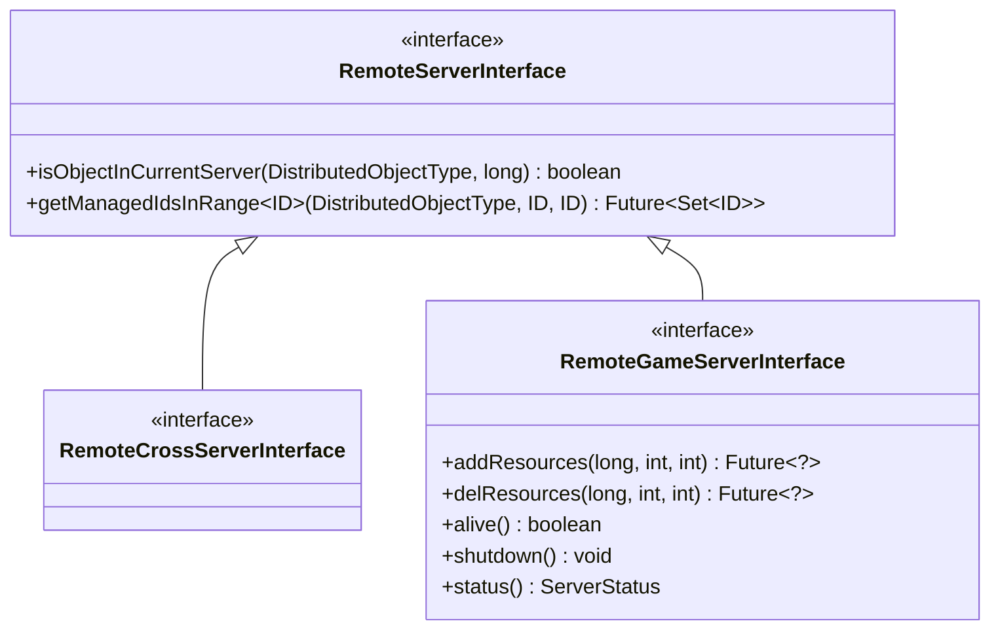
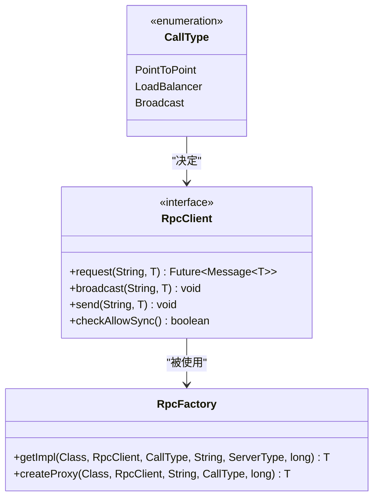
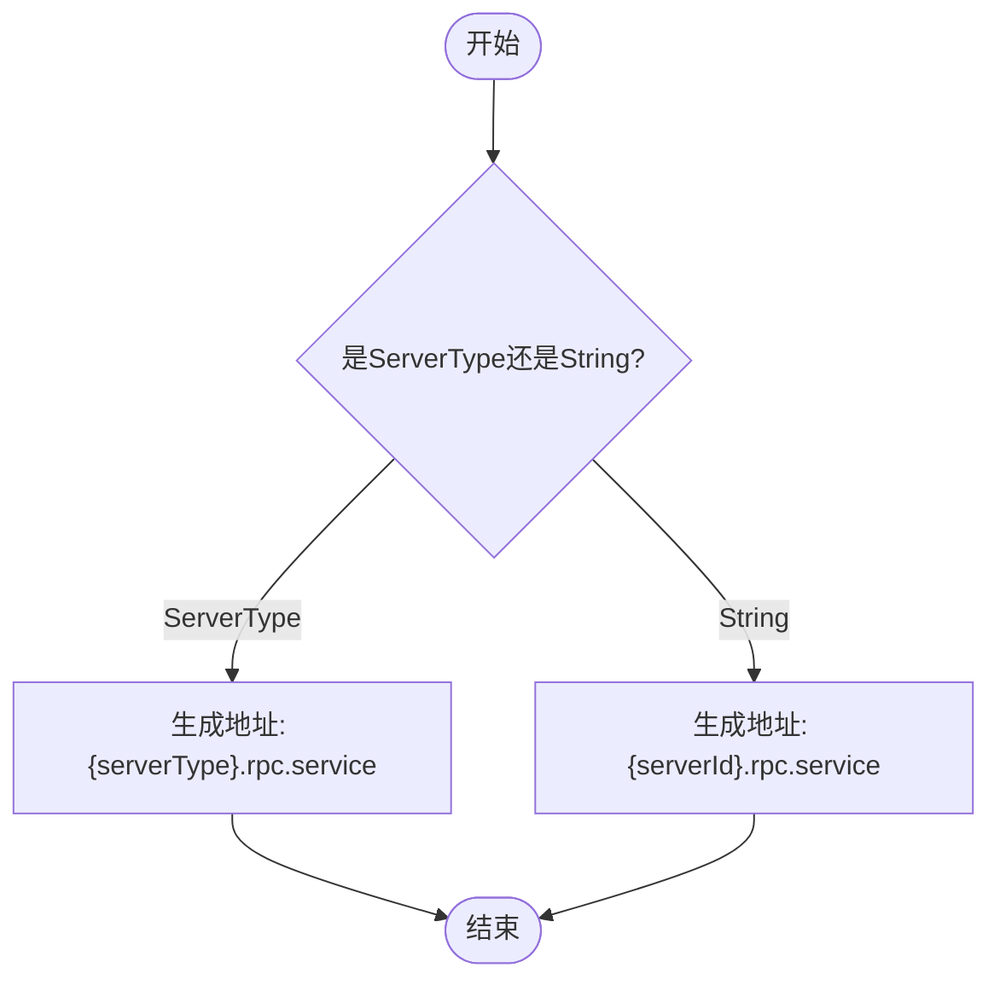
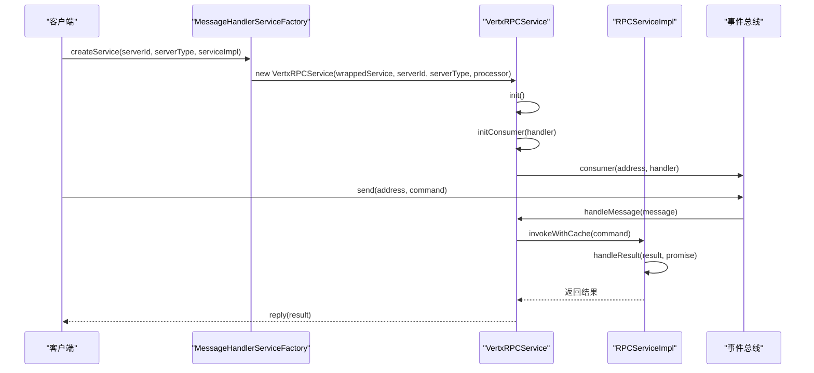

# 服务暴露机制

<cite>
**本文档引用的文件**   
- [RPCServiceImpl.java](file://core\src\main\java\cn\game\core\net\rpc\RPCServiceImpl.java)
- [VertxRPCService.java](file://core\src\main\java\cn\game\core\net\rpc\vertx\VertxRPCService.java)
- [VxHolder.java](file://core\src\main\java\cn\game\core\net\vertx\VxHolder.java)
- [RemoteServerInterface.java](file://core\src\main\java\cn\game\core\net\remote\RemoteServerInterface.java)
- [RpcFactory.java](file://core\src\main\java\cn\game\core\net\rpc\RpcFactory.java)
- [RpcClient.java](file://core\src\main\java\cn\game\core\net\rpc\RpcClient.java)
- [CallType.java](file://core\src\main\java\cn\game\core\net\rpc\CallType.java)
- [AbstractMessageHandlerService.java](file://core\src\main\java\cn\game\core\net\message\AbstractMessageHandlerService.java)
- [MessageHandlerServiceFactory.java](file://core\src\main\java\cn\game\core\net\message\MessageHandlerServiceFactory.java)
</cite>

## 目录
1. [简介](#简介)
2. [服务注册核心机制](#服务注册核心机制)
3. [远程服务契约与接口定义](#远程服务契约与接口定义)
4. [服务元数据与调用类型](#服务元数据与调用类型)
5. [事件总线地址映射规则](#事件总线地址映射规则)
6. [服务暴露流程分析](#服务暴露流程分析)
7. [最佳实践](#最佳实践)
8. [异常处理机制](#异常处理机制)
9. [线程模型与性能监控](#线程模型与性能监控)

## 简介
本文档详细阐述了基于Vert.x事件总线的服务暴露机制，重点分析了`RPCServiceImpl`如何通过`registerService`方法将本地服务实例注册到事件总线。文档解释了服务接口与事件总线地址的映射关系，描述了服务元数据（如超时配置、调用类型）的注册流程，并说明了`RemoteServerInterface`作为远程服务契约的作用。同时，文档提供了服务注册的最佳实践，包括异常处理、线程模型选择和性能监控集成。

## 服务注册核心机制

`RPCServiceImpl`类是服务暴露的核心实现，它通过构造函数接收服务实例、服务器ID和服务器类型等参数，并在Vert.x事件总线上注册服务。服务注册的关键在于`VertxRPCService`类，它继承自`AbstractMessageHandlerService`并实现了`RPCService`接口。

当创建`VertxRPCService`实例时，会初始化一个`RPCServiceImpl`实例，并通过`initConsumer`方法在事件总线上注册消费者。该消费者监听特定地址的消息，并将接收到的命令转发给`RPCServiceImpl`进行处理。

**图示来源**
- [RPCServiceImpl.java](file://core\src\main\java\cn\game\core\net\rpc\RPCServiceImpl.java#L18-L113)
- [VertxRPCService.java](file://core\src\main\java\cn\game\core\net\rpc\vertx\VertxRPCService.java#L29-L101)
- [AbstractMessageHandlerService.java](file://core\src\main\java\cn\game\core\net\message\AbstractMessageHandlerService.java#L10-L48)

**本节来源**
- [RPCServiceImpl.java](file://core\src\main\java\cn\game\core\net\rpc\RPCServiceImpl.java#L18-L113)
- [VertxRPCService.java](file://core\src\main\java\cn\game\core\net\rpc\vertx\VertxRPCService.java#L29-L101)

## 远程服务契约与接口定义

`RemoteServerInterface`是所有远程服务的契约接口，它定义了远程服务的基本行为。该接口继承自`RemoteProxy`，并提供了默认实现的方法，如`isObjectInCurrentServer`和`getManagedIdsInRange`。

通过泛型接口定义，系统实现了类型安全的远程调用。例如，`RemoteGameServerInterface`接口定义了游戏服务器提供给其他服务器调用的远程方法，如`addResources`、`delResources`等。这些接口方法的返回值类型为`Future<?>`，支持异步调用。

**图示来源**
- [RemoteServerInterface.java](file://core\src\main\java\cn\game\core\net\remote\RemoteServerInterface.java#L12-L42)
- [RemoteCrossServerInterface.java](file://core\src\main\java\cn\game\core\net\remote\RemoteCrossServerInterface.java#L9-L11)
- [RemoteGameServerInterface.java](file://core\src\main\java\cn\game\core\net\remote\RemoteGameServerInterface.java#L12-L24)

**本节来源**
- [RemoteServerInterface.java](file://core\src\main\java\cn\game\core\net\remote\RemoteServerInterface.java#L12-L42)
- [RemoteGameServerInterface.java](file://core\src\main\java\cn\game\core\net\remote\RemoteGameServerInterface.java#L12-L24)

## 服务元数据与调用类型

服务元数据包括超时配置、调用类型等信息，这些信息在服务注册时被传递给`RpcFactory`。`CallType`枚举定义了三种调用类型：`PointToPoint`（点对点）、`LoadBalancer`（负载均衡）和`Broadcast`（广播）。

不同的调用类型对应不同的消息路由策略。点对点调用直接发送到指定的服务器ID，负载均衡调用会在同一类型的服务实例间进行负载均衡，而广播调用则会发送到所有匹配的服务实例。

**图示来源**
- [CallType.java](file://core\src\main\java\cn\game\core\net\rpc\CallType.java#L3-L5)
- [RpcClient.java](file://core\src\main\java\cn\game\core\net\rpc\RpcClient.java#L26-L215)
- [RpcFactory.java](file://core\src\main\java\cn\game\core\net\rpc\RpcFactory.java#L26-L218)

**本节来源**
- [CallType.java](file://core\src\main\java\cn\game\core\net\rpc\CallType.java#L3-L5)
- [RpcClient.java](file://core\src\main\java\cn\game\core\net\rpc\RpcClient.java#L26-L215)

## 事件总线地址映射规则

事件总线地址的映射规则由`VxHolder`类中的静态方法`rpcServiceAddr`定义。该方法根据服务器ID或服务器类型生成唯一的事件总线地址。地址格式为`{serverId}.rpc.service`或`{serverType}.rpc.service`。

这种命名规则确保了服务地址的唯一性和可预测性，使得客户端能够准确地定位到目标服务。同时，通过使用服务器类型而非具体ID，系统支持了服务的负载均衡和广播调用。

**图示来源**
- [VxHolder.java](file://core\src\main\java\cn\game\core\net\vertx\VxHolder.java#L340-L346)

**本节来源**
- [VxHolder.java](file://core\src\main\java\cn\game\core\net\vertx\VxHolder.java#L340-L346)

## 服务暴露流程分析

服务暴露的完整流程始于`MessageHandlerServiceFactory.createService`方法。该工厂方法根据服务实现类的类型决定创建`MsgConsumerVerticle`还是`VertxRPCService`实例。

对于RPC服务，工厂方法会创建`VertxRPCService`实例，该实例在初始化时会调用`initConsumer`方法，在事件总线上注册消费者。消费者监听特定地址的消息，并将消息体转换为`Command`对象，然后通过`RPCServiceImpl.invokeWithCache`方法调用实际的服务方法。

**图示来源**
- [MessageHandlerServiceFactory.java](file://core\src\main\java\cn\game\core\net\message\MessageHandlerServiceFactory.java#L10-L17)
- [VertxRPCService.java](file://core\src\main\java\cn\game\core\net\rpc\vertx\VertxRPCService.java#L39-L91)
- [RPCServiceImpl.java](file://core\src\main\java\cn\game\core\net\rpc\RPCServiceImpl.java#L43-L69)

**本节来源**
- [MessageHandlerServiceFactory.java](file://core\src\main\java\cn\game\core\net\message\MessageHandlerServiceFactory.java#L10-L17)
- [VertxRPCService.java](file://core\src\main\java\cn\game\core\net\rpc\vertx\VertxRPCService.java#L39-L91)

## 最佳实践

在使用服务暴露机制时，应遵循以下最佳实践：

1. **服务接口设计**：确保远程服务接口的方法返回`Future`类型，以支持异步调用。
2. **异常处理**：在服务实现中正确处理异常，并通过`Promise.fail()`方法将异常传递给调用方。
3. **线程模型**：避免在事件循环线程中执行阻塞操作，必要时使用Worker Verticle。
4. **性能监控**：利用`VxHolder`提供的`runWithLock`等方法进行性能监控和资源管理。
5. **配置管理**：合理设置超时时间和其他配置参数，以适应不同的网络环境。

## 异常处理机制

系统提供了完善的异常处理机制。当服务方法抛出异常时，`RPCServiceImpl`会捕获异常并将其包装为`RPCException`，然后通过`Promise.fail()`方法将异常传递给调用方。调用方可以通过检查`Future`的失败状态来处理异常。

此外，`RpcClient`类中的`logError`方法会在远程调用失败时记录详细的错误日志，包括目标地址、命令和耗时等信息，便于问题排查。

**本节来源**
- [RPCServiceImpl.java](file://core\src\main\java\cn\game\core\net\rpc\RPCServiceImpl.java#L51-L69)
- [RpcClient.java](file://core\src\main\java\cn\game\core\net\rpc\RpcClient.java#L209-L212)

## 线程模型与性能监控

系统采用Vert.x的事件驱动模型，所有服务调用都在事件循环线程中执行。为了避免阻塞事件循环，建议将耗时操作委托给Worker Verticle。

`VxHolder`类提供了`runWithLock`和`executeBlockingWithTimeout`等方法，用于在Worker线程中执行阻塞代码，并支持超时控制。这些方法可以帮助开发者实现高性能的服务暴露，同时避免因阻塞操作导致的性能问题。

**本节来源**
- [VxHolder.java](file://core\src\main\java\cn\game\core\net\vertx\VxHolder.java#L436-L539)
- [VertxRPCService.java](file://core\src\main\java\cn\game\core\net\rpc\vertx\VertxRPCService.java#L49-L91)