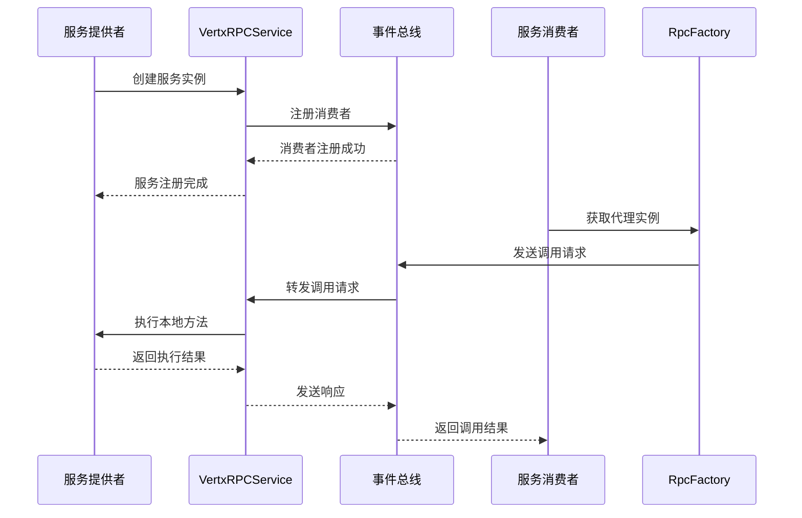
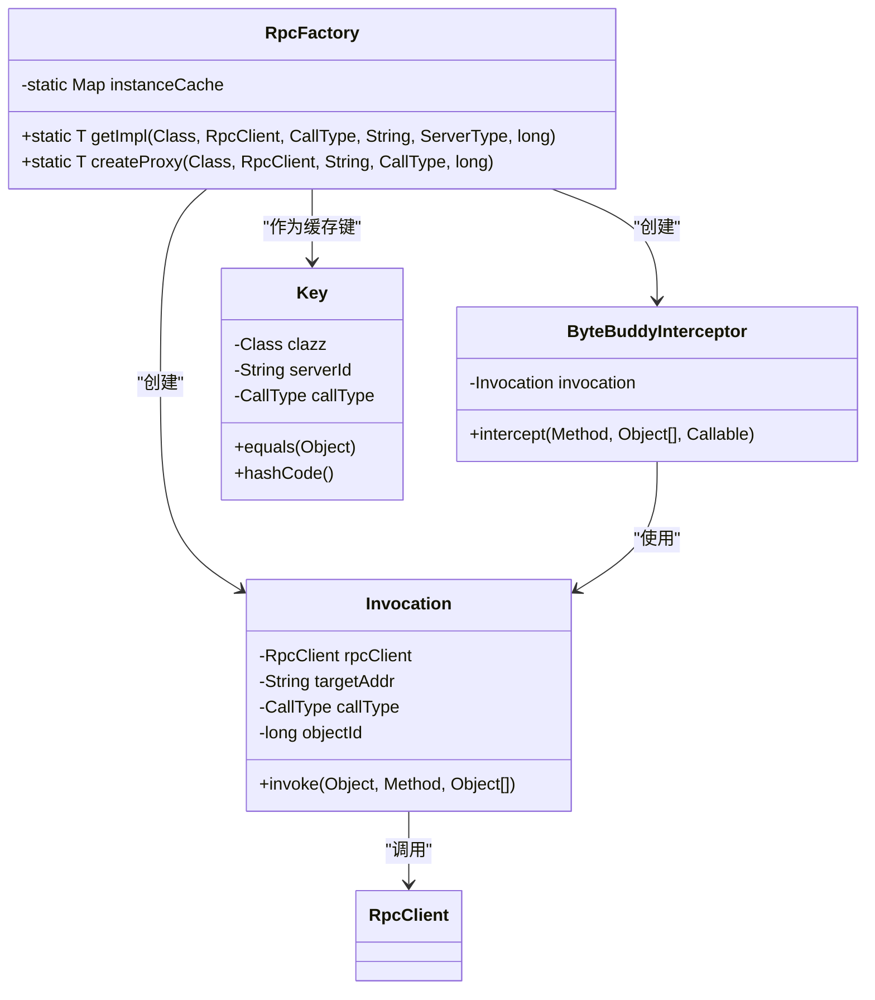
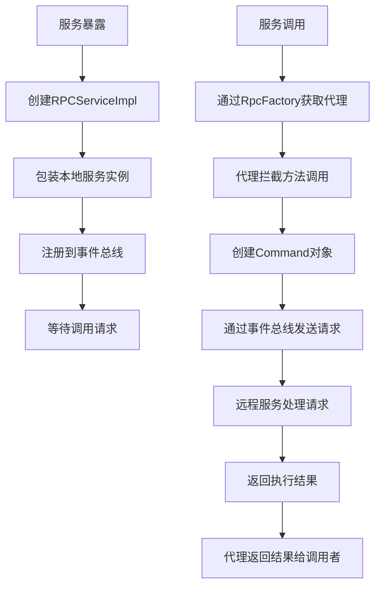
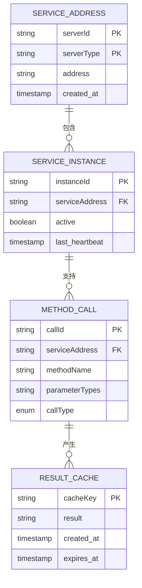
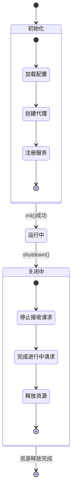

# 服务注册与发现

<cite>
**本文档引用的文件**   
- [RPCServiceImpl.java](file://core/src/main/java/cn/game/core/net/rpc/RPCServiceImpl.java)
- [RpcFactory.java](file://core/src/main/java/cn/game/core/net/rpc/RpcFactory.java)
- [VertxRPCService.java](file://core/src/main/java/cn/game/core/net/rpc/vertx/VertxRPCService.java)
- [VxHolder.java](file://core/src/main/java/cn/game/core/net/vertx/VxHolder.java)
- [VirtualServerRegistry.java](file://core/src/main/java/cn/game/core/base/VirtualServerRegistry.java)
- [RPCService.java](file://core/src/main/java/cn/game/core/net/rpc/RPCService.java)
- [AbstractMessageHandlerService.java](file://core/src/main/java/cn/game/core/net/message/AbstractMessageHandlerService.java)
- [CallType.java](file://core/src/main/java/cn/game/core/net/rpc/CallType.java)
</cite>

## 目录
1. [简介](#简介)
2. [服务注册流程](#服务注册流程)
3. [动态代理创建机制](#动态代理创建机制)
4. [RPC服务暴露与调用](#rpc服务暴露与调用)
5. [服务地址解析与缓存](#服务地址解析与缓存)
6. [服务生命周期管理](#服务生命周期管理)
7. [最佳实践](#最佳实践)

## 简介

本文档详细阐述了基于Vert.x事件总线的服务注册与发现机制。系统通过Vert.x事件总线实现分布式服务间的通信，利用RPC机制将本地服务暴露为远程可调用接口，并通过动态代理技术实现透明的远程调用。服务注册与发现机制结合了ZooKeeper和Vert.x集群功能，确保服务的高可用性和动态性。

## 服务注册流程

服务注册流程基于Vert.x事件总线和抽象消息处理器机制实现。当服务启动时，通过`VertxRPCService`类将本地服务实例注册到事件总线上，使其能够接收远程调用请求。

**图示来源**
- [VertxRPCService.java](file://core/src/main/java/cn/game/core/net/rpc/vertx/VertxRPCService.java#L33-L101)
- [VxHolder.java](file://core/src/main/java/cn/game/core/net/vertx/VxHolder.java#L340-L346)
- [RpcFactory.java](file://core/src/main/java/cn/game/core/net/rpc/RpcFactory.java#L45-L60)

**本节来源**
- [VertxRPCService.java](file://core/src/main/java/cn/game/core/net/rpc/vertx/VertxRPCService.java#L29-L101)
- [AbstractMessageHandlerService.java](file://core/src/main/java/cn/game/core/net/message/AbstractMessageHandlerService.java#L10-L48)

## 动态代理创建机制

动态代理创建机制通过`RpcFactory`类实现，支持JDK动态代理和Byte Buddy两种方式。系统根据接口类型选择合适的代理生成策略，并通过缓存机制提高性能。

**图示来源**
- [RpcFactory.java](file://core/src/main/java/cn/game/core/net/rpc/RpcFactory.java#L26-L218)
- [CallType.java](file://core/src/main/java/cn/game/core/net/rpc/CallType.java#L3-L5)

**本节来源**
- [RpcFactory.java](file://core/src/main/java/cn/game/core/net/rpc/RpcFactory.java#L26-L218)

## RPC服务暴露与调用

RPC服务暴露与调用机制通过`RPCServiceImpl`类实现，将本地服务包装为可远程调用的接口。系统通过命令模式封装方法调用信息，并在远程执行后处理结果。

**图示来源**
- [RPCServiceImpl.java](file://core/src/main/java/cn/game/core/net/rpc/RPCServiceImpl.java#L18-L113)
- [RpcFactory.java](file://core/src/main/java/cn/game/core/net/rpc/RpcFactory.java#L45-L60)
- [VertxRPCService.java](file://core/src/main/java/cn/game/core/net/rpc/vertx/VertxRPCService.java#L39-L92)

**本节来源**
- [RPCServiceImpl.java](file://core/src/main/java/cn/game/core/net/rpc/RPCServiceImpl.java#L18-L113)
- [RPCService.java](file://core/src/main/java/cn/game/core/net/rpc/RPCService.java#L6-L16)

## 服务地址解析与缓存

服务地址解析通过`VxHolder`类的静态方法实现，将服务器ID或类型转换为事件总线地址。系统使用`Key`类作为缓存键，通过类、地址和调用类型三元组确保缓存的唯一性。

**图示来源**
- [VxHolder.java](file://core/src/main/java/cn/game/core/net/vertx/VxHolder.java#L340-L346)
- [RpcFactory.java](file://core/src/main/java/cn/game/core/net/rpc/RpcFactory.java#L162-L189)
- [VirtualServerRegistry.java](file://core/src/main/java/cn/game/core/base/VirtualServerRegistry.java#L131-L141)

**本节来源**
- [VxHolder.java](file://core/src/main/java/cn/game/core/net/vertx/VxHolder.java#L340-L346)
- [RpcFactory.java](file://core/src/main/java/cn/game/core/net/rpc/RpcFactory.java#L162-L189)

## 服务生命周期管理

服务生命周期管理通过`RPCService`接口定义的标准方法实现，包括初始化和优雅关闭。系统在服务启动时进行必要的初始化工作，在关闭时执行清理操作，确保资源的正确释放。

**图示来源**
- [RPCService.java](file://core/src/main/java/cn/game/core/net/rpc/RPCService.java#L10-L14)
- [RPCServiceImpl.java](file://core/src/main/java/cn/game/core/net/rpc/RPCServiceImpl.java#L33-L36)
- [RPCServiceImpl.java](file://core/src/main/java/cn/game/core/net/rpc/RPCServiceImpl.java#L101-L105)

**本节来源**
- [RPCService.java](file://core/src/main/java/cn/game/core/net/rpc/RPCService.java#L6-L16)
- [RPCServiceImpl.java](file://core/src/main/java/cn/game/core/net/rpc/RPCServiceImpl.java#L33-L36)
- [RPCServiceImpl.java](file://core/src/main/java/cn/game/core/net/rpc/RPCServiceImpl.java#L101-L105)

## 最佳实践

### 服务注册最佳实践
1. **确保服务唯一性**：每个服务实例应有唯一的serverId，避免地址冲突
2. **正确设置服务类型**：通过ServerType标识服务类别，便于负载均衡调用
3. **及时处理异常**：在服务方法中妥善处理异常，避免影响事件总线稳定性

### 动态代理使用最佳实践
1. **合理使用缓存**：对于不带objectId的通用代理实例，充分利用缓存机制
2. **选择合适的代理方式**：接口使用JDK代理，类使用Byte Buddy代理
3. **避免代理过度使用**：仅对需要远程调用的服务接口创建代理

### 性能优化建议
1. **减少序列化开销**：使用高效的序列化协议如Protobuf
2. **优化网络调用**：合理设置超时时间，避免长时间阻塞
3. **监控调用性能**：通过Prometheus等工具监控RPC调用的延迟和成功率

### 故障排查指南
1. **检查服务注册状态**：确认服务是否成功注册到事件总线
2. **验证代理创建**：确保RpcFactory能正确创建代理实例
3. **监控网络连接**：检查Vert.x集群节点间的网络连通性
4. **查看日志信息**：分析RPC调用过程中的错误日志

**本节来源**
- [RPCServiceImpl.java](file://core/src/main/java/cn/game/core/net/rpc/RPCServiceImpl.java)
- [RpcFactory.java](file://core/src/main/java/cn/game/core/net/rpc/RpcFactory.java)
- [VertxRPCService.java](file://core/src/main/java/cn/game/core/net/rpc/vertx/VertxRPCService.java)
- [VxHolder.java](file://core/src/main/java/cn/game/core/net/vertx/VxHolder.java)