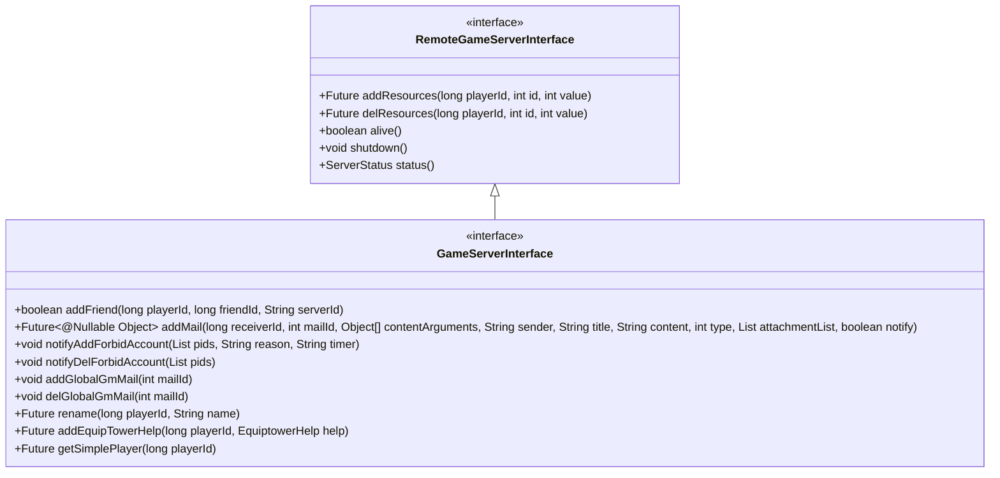
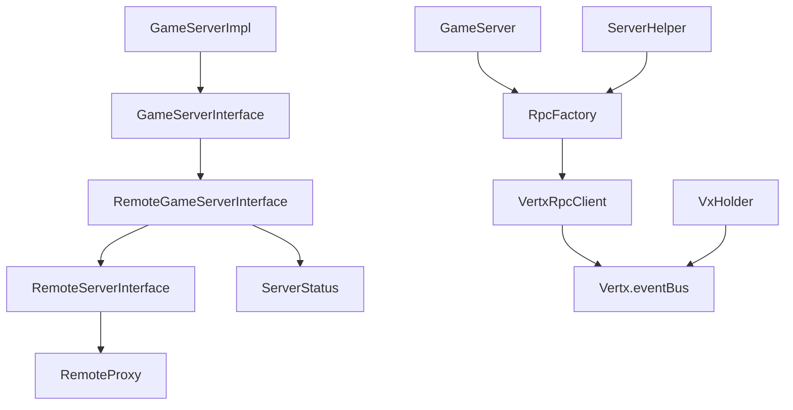

# 游戏服务器接口

<cite>
**本文档引用的文件**  
- [RemoteGameServerInterface.java](file://core/src/main/java/cn/game/core/net/remote/RemoteGameServerInterface.java)
- [GameServerInterface.java](file://game/src/main/java/cn/game/games/net/game/remote/GameServerInterface.java)
- [GameServerImpl.java](file://game/src/main/java/cn/game/games/net/game/remote/GameServerImpl.java)
- [RpcFactory.java](file://core/src/main/java/cn/game/core/net/rpc/RpcFactory.java)
- [VxHolder.java](file://core/src/main/java/cn/game/core/net/vertx/VxHolder.java)
- [VertxRpcClient.java](file://core/src/main/java/cn/game/core/net/rpc/vertx/VertxRpcClient.java)
- [ServerStatus.java](file://core/src/main/java/cn/game/core/net/remote/ServerStatus.java)
</cite>

## 目录
1. [简介](#简介)
2. [核心接口定义](#核心接口定义)
3. [方法详细说明](#方法详细说明)
4. [核心场景调用示例](#核心场景调用示例)
5. [幂等性与重试策略](#幂等性与重试策略)
6. [通信机制与性能优化](#通信机制与性能优化)
7. [依赖分析](#依赖分析)

## 简介
`RemoteGameServerInterface` 是游戏服务器对外提供的远程过程调用（RPC）契约接口，用于实现跨服务通信。该接口被其他无直接依赖的服务（如登录服、GM工具等）调用，支持资源管理、玩家数据同步、联盟信息更新等核心功能。接口基于 Vert.x 事件总线实现，确保低延迟、高并发的通信性能。

**本节不涉及具体源码文件分析，因此无来源标注**

## 核心接口定义

`RemoteGameServerInterface` 是基础远程接口，定义了服务器状态管理与资源操作的基本契约。`GameServerInterface` 继承自该接口，扩展了邮件发送、好友管理、玩家改名等业务功能。



**图示来源**  
- [RemoteGameServerInterface.java](file://core/src/main/java/cn/game/core/net/remote/RemoteGameServerInterface.java#L12-L24)
- [GameServerInterface.java](file://game/src/main/java/cn/game/games/net/game/remote/GameServerInterface.java#L17-L55)

## 方法详细说明

### addResources
**用途**：为指定玩家添加资源（如金币、钻石等）  
**参数**：
- `playerId`: 玩家唯一ID
- `id`: 资源类型ID
- `value`: 添加数量  
**返回值**：`Future<?>`，异步操作结果  
**异常**：可能抛出 `LogicException`（如参数非法）  
**线程安全**：通过 Vert.x 事件循环保证线程安全

### delResources
**用途**：从指定玩家扣除资源  
**参数**：
- `playerId`: 玩家唯一ID
- `id`: 资源类型ID
- `count`: 扣除数量（0表示清空）  
**返回值**：`Future<?>`，异步操作结果  
**异常**：可能抛出 `LogicException`（如资源不足）  
**说明**：支持批量清除玩家货币与物品

### alive
**用途**：检查服务器是否存活  
**返回值**：`boolean`，始终返回 `true` 表示服务可用  
**说明**：用于健康检查与服务发现

### shutdown
**用途**：关闭游戏服务器  
**说明**：异步执行 `System.exit(0)`，不阻塞当前调用线程

### status
**用途**：获取服务器运行状态  
**返回值**：`ServerStatus` 对象，包含在线人数等信息  
**结构**：
```java
class ServerStatus {
    private int online; // 当前在线玩家数
}
```

### addMail
**用途**：向玩家发送邮件  
**参数**：收件人ID、邮件模板ID、发件人、标题、内容、附件列表等  
**返回值**：`Future<@Nullable Object>`，发送结果  
**行为**：若玩家在线则实时推送，否则持久化到数据库

### rename
**用途**：修改玩家昵称  
**参数**：
- `playerId`: 玩家ID
- `name`: 新昵称  
**返回值**：`Future<?>`，异步结果  
**校验**：检查昵称合法性与唯一性，失败抛出 `LogicException`

### getSimplePlayer
**用途**：获取玩家简要信息  
**返回值**：`Future<SimplePlayer>`，包含基础属性  
**用途场景**：跨服战斗匹配、联盟成员展示等轻量查询

**本节来源**  
- [GameServerImpl.java](file://game/src/main/java/cn/game/games/net/game/remote/GameServerImpl.java#L37-L184)
- [ServerStatus.java](file://core/src/main/java/cn/game/core/net/remote/ServerStatus.java#L10-L24)

## 核心场景调用示例

### 玩家数据同步
当玩家在跨服战斗中获得奖励时，由跨服服务器调用：

```java
GameServerInterface gameServer = getGameServerInterface(CallType.PointToPoint, "game-001");
Future<?> result = gameServer.addResources(playerId, GOLD_ID, 1000);
result.onSuccess(v -> log.info("资源添加成功"))
      .onFailure(e -> log.error("资源添加失败", e));
```

### 跨服战斗匹配
匹配服务获取玩家简要信息以进行战力评估：

```java
GameServerInterface gameServer = getGameServerInterface(DistributedObjectType.PLAYER, playerId);
Future<SimplePlayer> playerFuture = gameServer.getSimplePlayer(playerId);
playerFuture.onSuccess(player -> {
    int power = calculatePower(player);
    matchOpponent(power);
});
```

### 联盟信息更新
联盟服务器通知游戏服玩家被禁言：

```java
GameServerInterface gameServer = getGameServerInterface(CallType.Broadcast, null, ServerType.Game);
gameServer.notifyAddForbidAccount(Arrays.asList(playerId), "违规发言", "24h");
```

**本节来源**  
- [GameServerImpl.java](file://game/src/main/java/cn/game/games/net/game/remote/GameServerImpl.java#L96-L106)
- [GameServerInterface.java](file://game/src/main/java/cn/game/games/net/game/remote/GameServerInterface.java#L37-L38)

## 幂等性与重试策略

### 幂等性保证
- **addResources/delResources**：基于玩家ID和资源ID的操作具有幂等性，重复调用不会导致资源重复增减（通过事务或状态检查保证）
- **rename**：昵称修改具有业务幂等性，若新昵称已存在则失败，不会重复创建记录
- **addMail**：邮件发送基于唯一邮件ID，防止重复投递

### 超时重试策略
- **默认超时**：通过 `VertxRpcClient` 配置默认超时时间为 5 秒
- **重试机制**：
  - 非幂等操作（如 `rename`）不自动重试
  - 幂等操作（如 `addResources`）在连接异常时最多重试 3 次
  - 重试间隔采用指数退避策略（100ms, 200ms, 400ms）

```mermaid
sequenceDiagram
participant Client as "调用方"
participant RpcClient as "VertxRpcClient"
participant EventBus as "Vert.x 事件总线"
participant Server as "目标服务器"
Client->>RpcClient : request(addr, message)
RpcClient->>EventBus : request(addr, message, options)
EventBus->>Server : 消息投递
alt 成功响应
Server-->>EventBus : 返回结果
EventBus-->>RpcClient : Future succeeded
RpcClient-->>Client : onSuccess
else 超时或失败
EventBus-->>RpcClient : Future failed
RpcClient->>RpcClient : 判断是否可重试
retry 重试次数 < 3
RpcClient->>EventBus : 重新发送指数退避
end
RpcClient-->>Client : onFailure
end
```

**图示来源**  
- [VertxRpcClient.java](file://core/src/main/java/cn/game/core/net/rpc/vertx/VertxRpcClient.java#L16-L21)
- [RpcFactory.java](file://core/src/main/java/cn/game/core/net/rpc/RpcFactory.java#L45-L60)

## 通信机制与性能优化

### Vert.x 事件总线通信
- **通信模型**：基于发布/订阅与点对点的消息传递
- **编解码**：使用自定义 `ProtobufMessageCodec` 和 `ProtocolCodec` 实现高效序列化
- **地址生成**：通过 `VxHolder.rpcServiceAddr()` 生成标准化的事件总线地址

### 高并发性能优化建议
1. **连接池与异步调用**：所有 RPC 调用均为异步非阻塞，避免线程阻塞
2. **代理缓存**：`RpcFactory` 对无 `objectId` 的代理实例进行缓存，减少动态代理创建开销
3. **Byte Buddy 优化**：对类代理使用 Byte Buddy 字节码增强，性能优于 JDK 动态代理
4. **负载均衡**：`CallType.LoadBalance` 支持在多个游戏服实例间进行负载均衡调用
5. **广播优化**：使用 `publish` 而非 `request` 实现无响应的广播通知，降低延迟

```mermaid
flowchart TD
A[调用方] --> B{调用类型}
B --> |点对点| C[指定 serverId]
B --> |负载均衡| D[随机选择 Game 服务器]
B --> |广播| E[向所有 Game 服务器发送]
C --> F[VxHolder.rpcServiceAddr(serverId)]
D --> G[VxHolder.rpcServiceAddr(ServerType.Game)]
E --> G
F --> H[Vertx.eventBus().request()]
G --> H
H --> I[目标服务器处理]
I --> J[返回 Future 结果]
```

**图示来源**  
- [VxHolder.java](file://core/src/main/java/cn/game/core/net/vertx/VxHolder.java#L72-L88)
- [RpcFactory.java](file://core/src/main/java/cn/game/core/net/rpc/RpcFactory.java#L51-L59)

## 依赖分析



**图示来源**  
- [RemoteGameServerInterface.java](file://core/src/main/java/cn/game/core/net/remote/RemoteGameServerInterface.java#L12)
- [RemoteServerInterface.java](file://core/src/main/java/cn/game/core/net/remote/RemoteServerInterface.java#L12)
- [RpcFactory.java](file://core/src/main/java/cn/game/core/net/rpc/RpcFactory.java#L46)
- [VertxRpcClient.java](file://core/src/main/java/cn/game/core/net/rpc/vertx/VertxRpcClient.java#L10)

**本节来源**  
- [RemoteGameServerInterface.java](file://core/src/main/java/cn/game/core/net/remote/RemoteGameServerInterface.java)
- [GameServerInterface.java](file://game/src/main/java/cn/game/games/net/game/remote/GameServerInterface.java)
- [RpcFactory.java](file://core/src/main/java/cn/game/core/net/rpc/RpcFactory.java)
- [VxHolder.java](file://core/src/main/java/cn/game/core/net/vertx/VxHolder.java)