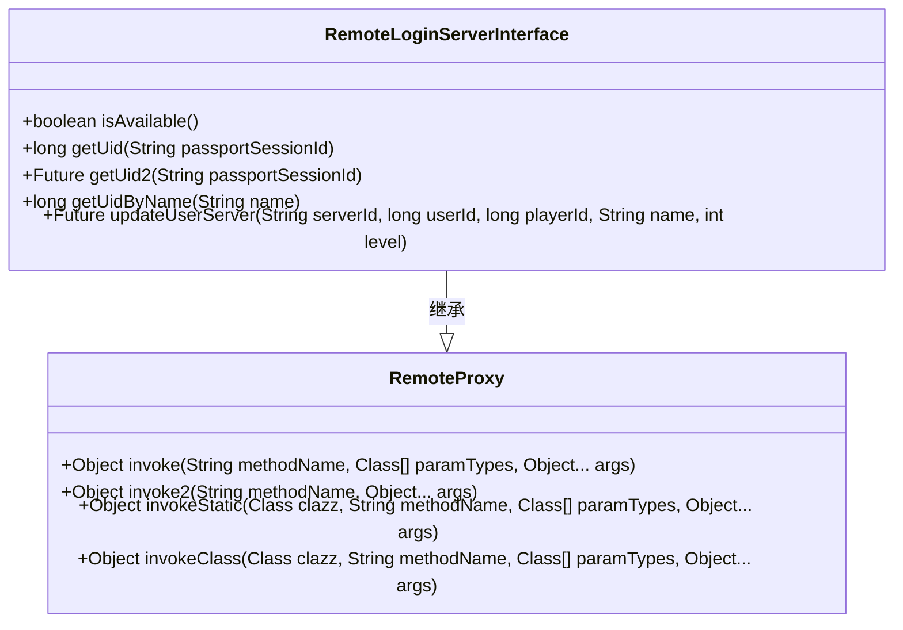
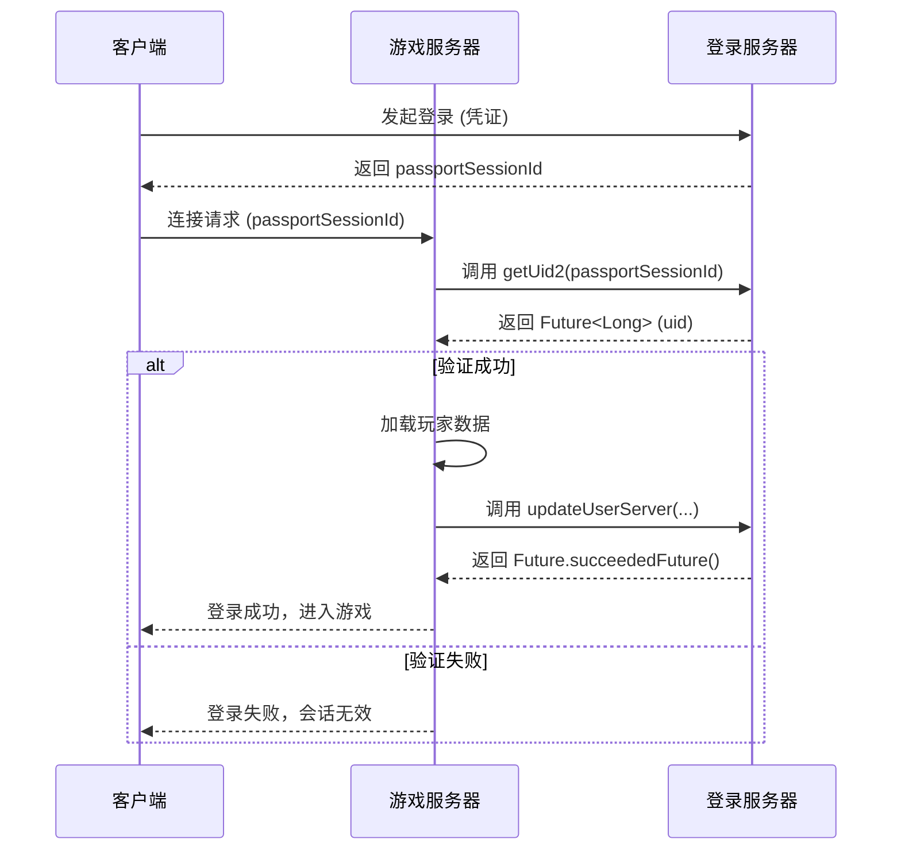
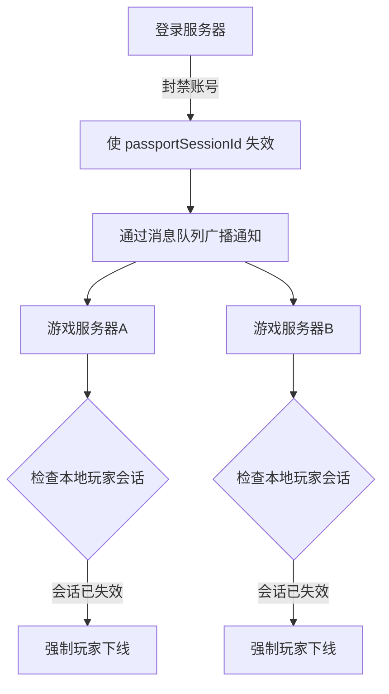
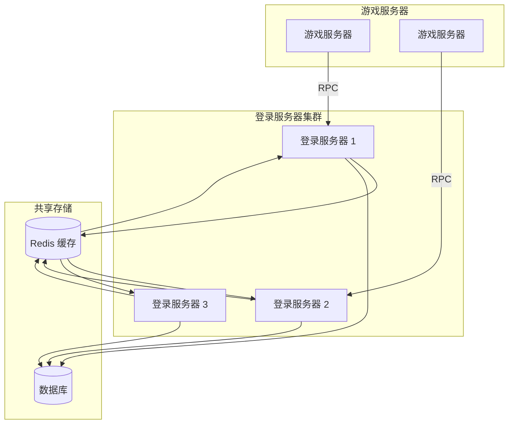
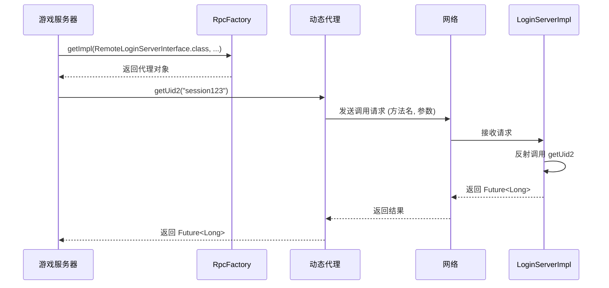

# 登录服务器接口

<cite>
**本文档引用的文件**  
- [RemoteLoginServerInterface.java](file://core\src\main\java\cn\game\core\net\remote\RemoteLoginServerInterface.java)
- [LoginServerImpl.java](file://login\src\main\java\cn\game\login\net\remote\LoginServerImpl.java)
- [RemoteProxy.java](file://core\src\main\java\cn\game\core\net\remote\RemoteProxy.java)
- [RpcFactory.java](file://core\src\main\java\cn\game\core\net\rpc\RpcFactory.java)
- [CallType.java](file://core\src\main\java\cn\game\core\net\rpc\CallType.java)
- [ServerContext.java](file://core\src\main\java\cn\game\core\base\ServerContext.java)
- [GameServer.java](file://game\src\main\java\cn\game\games\net\game\GameServer.java)
- [ServerHelper.java](file://game\src\main\java\cn\game\games\net\game\helper\ServerHelper.java)
</cite>

## 目录
1. [简介](#简介)
2. [核心接口定义](#核心接口定义)
3. [认证状态同步机制](#认证状态同步机制)
4. [会话验证与登录状态查询](#会话验证与登录状态查询)
5. [强制下线与状态更新](#强制下线与状态更新)
6. [安全机制与防劫持策略](#安全机制与防劫持策略)
7. [分布式环境下的状态一致性](#分布式环境下的状态一致性)
8. [RPC调用机制与实现原理](#rpc调用机制与实现原理)
9. [降级策略与网络分区处理](#降级策略与网络分区处理)
10. [最佳实践与使用示例](#最佳实践与使用示例)

## 简介

本技术文档详细阐述了 `RemoteLoginServerInterface` 接口的设计与实现，该接口是登录服务器与游戏服务器之间进行认证状态同步的核心远程调用接口。通过该接口，游戏服务器可以验证用户会话、查询登录状态、更新玩家信息，并在必要时接收强制下线通知。文档还深入分析了其在分布式架构中的安全性、一致性保障机制及网络异常下的降级策略。

**本接口主要服务于游戏服务器（Game Server）与登录服务器（Login Server）之间的跨服务通信**，采用基于 Vert.x 的异步 RPC 框架实现，确保高并发下的性能与稳定性。

## 核心接口定义

`RemoteLoginServerInterface` 是登录服务器对外暴露的远程服务接口，定义了游戏服务器所需的核心认证功能。



**图示来源**  
- [RemoteLoginServerInterface.java](file://core\src\main\java\cn\game\core\net\remote\RemoteLoginServerInterface.java#L12-L33)
- [RemoteProxy.java](file://core\src\main\java\cn\game\core\net\remote\RemoteProxy.java#L19-L94)

### 接口方法说明

| 方法名 | 参数 | 返回值 | 语义说明 |
|-------|------|--------|---------|
| `isAvailable()` | 无 | boolean | 检查登录服务器当前是否可用。在当前实现中，此方法返回 `false`，可能用于健康检查或服务发现。 |
| `getUid(String passportSessionId)` | passportSessionId: 会话ID | long | 同步检查会话ID是否有效，并返回对应的用户ID（uid）。若会话无效，行为未明确定义。 |
| `getUid2(String passportSessionId)` | passportSessionId: 会话ID | Future<Long> | 异步版本的会话验证，返回一个 `Future` 对象，成功时包含有效的用户ID。这是推荐的调用方式，避免阻塞事件循环。 |
| `getUidByName(String name)` | name: 用户名 | long | **测试用途**，根据用户名获取用户ID，若用户不存在则创建新用户并返回其ID。生产环境不应使用此方法。 |
| `updateUserServer(...)` | serverId, userId, playerId, name, level | Future<Void> | 异步更新用户所在服务器的信息，包括玩家ID、等级等，用于维护用户-服务器映射关系。 |

**本节来源**  
- [RemoteLoginServerInterface.java](file://core\src\main\java\cn\game\core\net\remote\RemoteLoginServerInterface.java#L12-L33)

## 认证状态同步机制

登录服务器与游戏服务器之间的认证状态同步依赖于 **远程过程调用（RPC）** 机制。当玩家在登录服务器完成身份验证后，游戏服务器需要通过调用 `RemoteLoginServerInterface` 来验证玩家的会话令牌（`passportSessionId`）并获取其用户身份。

### 同步流程

1.  **玩家登录**：玩家在客户端发起登录请求，登录服务器验证凭证后生成 `passportSessionId` 并返回给客户端。
2.  **连接游戏服务器**：客户端使用 `passportSessionId` 连接目标游戏服务器。
3.  **会话验证**：游戏服务器通过 `getUid2` 方法异步调用登录服务器，验证 `passportSessionId` 的有效性。
4.  **状态同步**：验证成功后，游戏服务器获取到 `uid`，并据此加载玩家数据，完成登录流程。同时，通过 `updateUserServer` 方法更新用户当前所在服务器的信息。

此机制确保了游戏服务器不直接处理敏感的身份凭证，所有认证逻辑集中在登录服务器，实现了职责分离和安全性提升。



**图示来源**  
- [RemoteLoginServerInterface.java](file://core\src\main\java\cn\game\core\net\remote\RemoteLoginServerInterface.java#L20-L22)
- [LoginServerImpl.java](file://login\src\main\java\cn\game\login\net\remote\LoginServerImpl.java#L45-L48)
- [GameServer.java](file://game\src\main\java\cn\game\games\net\game\GameServer.java#L542-L545)

## 会话验证与登录状态查询

会话验证是确保玩家身份合法性的关键步骤。接口提供了同步和异步两种验证方式。

### 同步验证 (getUid)

`getUid` 方法是同步调用，会阻塞当前线程直到登录服务器返回结果。在高并发的游戏服务器中，**强烈不推荐使用此方法**，因为它会消耗宝贵的事件循环线程，可能导致服务器性能下降甚至无响应。

### 异步验证 (getUid2)

`getUid2` 方法是推荐的验证方式。它返回一个 `io.vertx.core.Future<Long>` 对象，允许游戏服务器发起调用后立即返回，继续处理其他任务。当登录服务器的响应到达时，通过回调或链式调用处理结果。

```java
// 示例：使用 getUid2 进行异步验证
Future<Long> future = gameServer.getRemoteLoginServerInterface(CallType.LoadBalancer).getUid2(passportSessionId);
future.onSuccess(uid -> {
    // 验证成功，处理登录逻辑
    logger.info("用户 {} 会话验证成功", uid);
    // ... 加载玩家数据
}).onFailure(err -> {
    // 验证失败，拒绝连接
    logger.warn("会话验证失败: {}", err.getMessage());
    // ... 断开客户端连接
});
```

**本节来源**  
- [RemoteLoginServerInterface.java](file://core\src\main\java\cn\game\core\net\remote\RemoteLoginServerInterface.java#L20-L22)
- [LoginServerImpl.java](file://login\src\main\java\cn\game\login\net\remote\LoginServerImpl.java#L45-L48)

## 强制下线与状态更新

当需要强制玩家下线（例如，账号被封禁、在其他设备登录导致踢下线）时，登录服务器可以通过更新用户状态来间接实现。虽然 `RemoteLoginServerInterface` 本身没有直接的“踢人”方法，但可以通过以下机制实现：

1.  **使会话失效**：登录服务器在内部将 `passportSessionId` 标记为无效。
2.  **游戏服务器轮询或监听**：游戏服务器可以定期调用 `getUid2` 来检查玩家会话状态，或者登录服务器通过其他消息通道（如消息队列）主动通知游戏服务器。
3.  **游戏服务器执行下线**：当游戏服务器检测到玩家会话已失效时，主动断开其连接。

`updateUserServer` 方法用于维护用户与服务器的映射关系。当玩家登录到某个游戏服务器时，会调用此方法更新数据库中的记录。这有助于：
- 实现玩家跨服查询。
- 在玩家被强制下线时，登录服务器可以知道该玩家当前在哪个服务器上，从而定向通知。



**本节来源**  
- [RemoteLoginServerInterface.java](file://core\src\main\java\cn\game\core\net\remote\RemoteLoginServerInterface.java#L31-L32)
- [LoginServerImpl.java](file://login\src\main\java\cn\game\login\net\remote\LoginServerImpl.java#L90-L103)

## 安全机制与防劫持策略

为防止会话劫持（Session Hijacking），系统设计了以下安全措施：

### 令牌刷新机制

虽然当前代码未直接体现，但最佳实践是使用短期有效的访问令牌（Access Token）和长期有效的刷新令牌（Refresh Token）。`passportSessionId` 应设计为短期令牌，过期后客户端需使用刷新令牌向登录服务器申请新的访问令牌，减少令牌被窃取后可利用的时间窗口。

### 双向认证流程

当前的 `getUid2` 调用是单向的（游戏服务器 -> 登录服务器）。为了增强安全性，可以引入双向认证：
- **服务端认证**：登录服务器在响应前，验证调用方（游戏服务器）的身份，例如通过预共享密钥或基于证书的认证。
- **客户端绑定**：在生成 `passportSessionId` 时，将其与客户端的设备指纹（如 IP、设备ID）进行绑定。当 `getUid2` 被调用时，登录服务器可以检查调用来源的 IP 是否与绑定的 IP 一致，如果不一致则拒绝验证。

### 代码实现中的安全考量

在 `LoginServerImpl` 的实现中，`getUid2` 方法目前直接返回一个固定的 `666L`，这是一个占位符实现。在生产环境中，该方法应：
1.  查询缓存（如 Redis）或数据库，验证 `passportSessionId` 的有效性。
2.  检查会话是否过期。
3.  返回与该会话关联的真实 `uid`。

**本节来源**  
- [LoginServerImpl.java](file://login\src\main\java\cn\game\login\net\remote\LoginServerImpl.java#L45-L48)

## 分布式环境下的状态一致性

在分布式部署中，保持登录状态的一致性面临挑战，主要来自网络分区和服务器故障。

### 挑战

- **网络延迟与超时**：RPC 调用可能因网络问题而超时，导致游戏服务器无法及时验证玩家会话。
- **数据不一致**：如果登录服务器集群的节点间状态同步延迟，可能导致一个节点认为会话有效，而另一个节点认为无效。
- **单点故障**：登录服务器宕机将导致所有新玩家无法登录。

### 解决方案

- **缓存层**：使用 Redis 等分布式缓存存储会话信息（`passportSessionId` -> `uid` 映射），所有登录服务器节点共享同一缓存，保证数据一致性。
- **服务发现与负载均衡**：通过 ZooKeeper 或类似服务实现登录服务器的注册与发现，`RpcFactory` 结合 `CallType.LoadBalancer` 可以实现对多个登录服务器实例的负载均衡调用，提高可用性。
- **幂等性设计**：`updateUserServer` 方法的实现（`insertOrUpdate`）是幂等的，即使同一条更新请求被重复发送，最终状态也是一致的。



**图示来源**  
- [LoginServerImpl.java](file://login\src\main\java\cn\game\login\net\remote\LoginServerImpl.java#L90-L103)
- [ServerContext.java](file://core\src\main\java\cn\game\core\base\ServerContext.java)

## RPC调用机制与实现原理

`RemoteLoginServerInterface` 的远程调用由 `RpcFactory` 类实现，其核心原理是基于动态代理。

### 调用流程

1.  **获取代理实例**：游戏服务器通过 `RpcFactory.getImpl()` 方法获取 `RemoteLoginServerInterface` 的代理对象。
2.  **方法调用**：当游戏服务器代码调用代理对象的方法（如 `getUid2`）时，调用被拦截。
3.  **序列化与发送**：代理将方法名、参数类型和参数值序列化，并通过底层通信框架（如 Netty）发送到指定的登录服务器。
4.  **反序列化与执行**：登录服务器接收到请求，反序列化后，通过反射调用本地 `LoginServerImpl` 实例的对应方法。
5.  **返回结果**：执行结果被序列化并返回给游戏服务器，代理对象将结果反序列化后返回给调用者。

### 关键组件

- **`RpcFactory`**：负责创建远程接口的动态代理。
- **`CallType`**：枚举类型，定义了调用方式，如 `LoadBalancer`（负载均衡）、`Direct`（直连）等。
- **`ServerContext`**：提供当前服务器的上下文信息，如服务器类型、RPC客户端实例等。



**本节来源**  
- [RpcFactory.java](file://core\src\main\java\cn\game\core\net\rpc\RpcFactory.java)
- [CallType.java](file://core\src\main\java\cn\game\core\net\rpc\CallType.java)
- [ServerContext.java](file://core\src\main\java\cn\game\core\base\ServerContext.java)
- [ServerHelper.java](file://game\src\main\java\cn\game\games\net\game\helper\ServerHelper.java#L78-L85)

## 降级策略与网络分区处理

当登录服务器不可用或网络分区发生时，游戏服务器需要有相应的降级策略来保证服务的可用性。

### 降级策略

1.  **缓存兜底**：游戏服务器可以本地缓存最近验证成功的会话信息。在网络短暂中断时，允许已知的“老玩家”凭缓存的会话信息登录，但新玩家或缓存过期的玩家将无法登录。
2.  **返回默认值或失败**：对于非关键操作，可以返回默认值或直接失败。例如，`isAvailable()` 方法可以返回 `false`，`getUid2` 可以返回一个失败的 `Future`，游戏服务器据此拒绝新连接。
3.  **只读模式**：在极端情况下，游戏服务器可以进入只读模式，允许已登录玩家继续游戏，但禁止新玩家登录和任何需要调用登录服务器的写操作。

### 网络分区处理

- **超时设置**：RPC 调用应设置合理的超时时间（如 3 秒），避免线程长时间阻塞。
- **熔断机制**：集成熔断器（如 Hystrix），当对登录服务器的失败率超过阈值时，自动熔断，直接返回失败，防止故障蔓延。
- **日志与监控**：详细记录 RPC 调用的失败情况，并通过监控系统（如 Prometheus）告警，以便运维人员及时介入。

**本节来源**  
- [RemoteLoginServerInterface.java](file://core\src\main\java\cn\game\core\net\remote\RemoteLoginServerInterface.java#L13)
- [LoginServerImpl.java](file://login\src\main\java\cn\game\login\net\remote\LoginServerImpl.java#L29-L31)

## 最佳实践与使用示例

### 推荐使用方式

1.  **始终使用异步方法**：优先使用返回 `Future` 的方法（如 `getUid2`），避免阻塞事件循环。
2.  **正确处理 Future**：使用 `onSuccess` 和 `onFailure` 回调来处理异步结果，确保错误被妥善处理。
3.  **使用负载均衡**：通过 `CallType.LoadBalancer` 调用，实现对登录服务器集群的负载均衡。
4.  **优雅降级**：在代码中预设网络异常的处理逻辑，保证核心游戏功能的可用性。

### 获取接口实例

```java
// 在游戏服务器中获取 RemoteLoginServerInterface 实例
RemoteLoginServerInterface loginInterface = 
    GameServer.getInstance().getRemoteLoginServerInterface(CallType.LoadBalancer);
// 或通过 ServerHelper
RemoteLoginServerInterface loginInterface = ServerHelper.getRemoteLoginInterfaceProxy();
```

**本节来源**  
- [GameServer.java](file://game\src\main\java\cn\game\games\net\game\GameServer.java#L542-L545)
- [ServerHelper.java](file://game\src\main\java\cn\game\games\net\game\helper\ServerHelper.java#L78-L85)