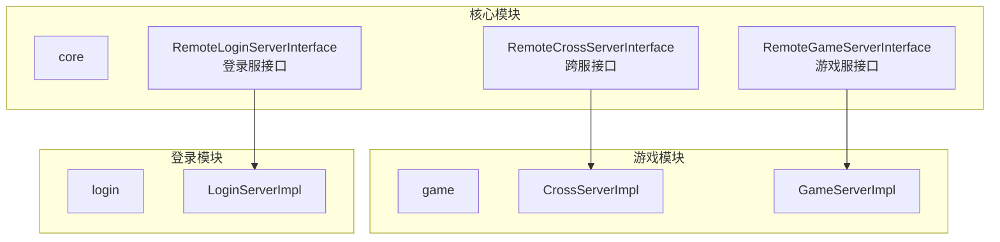
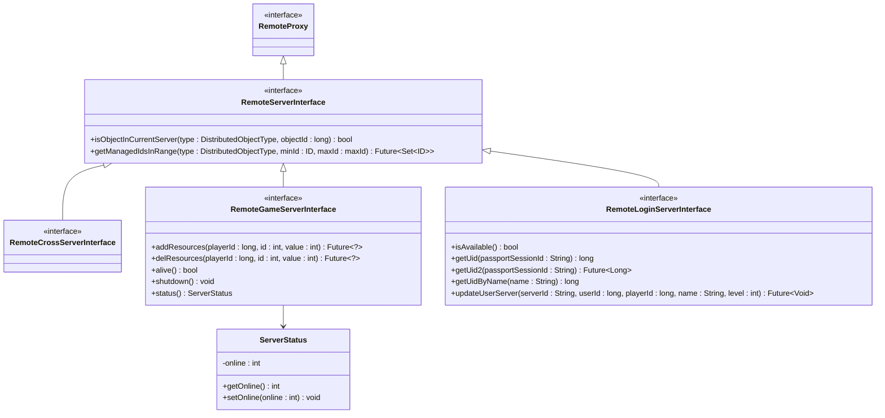
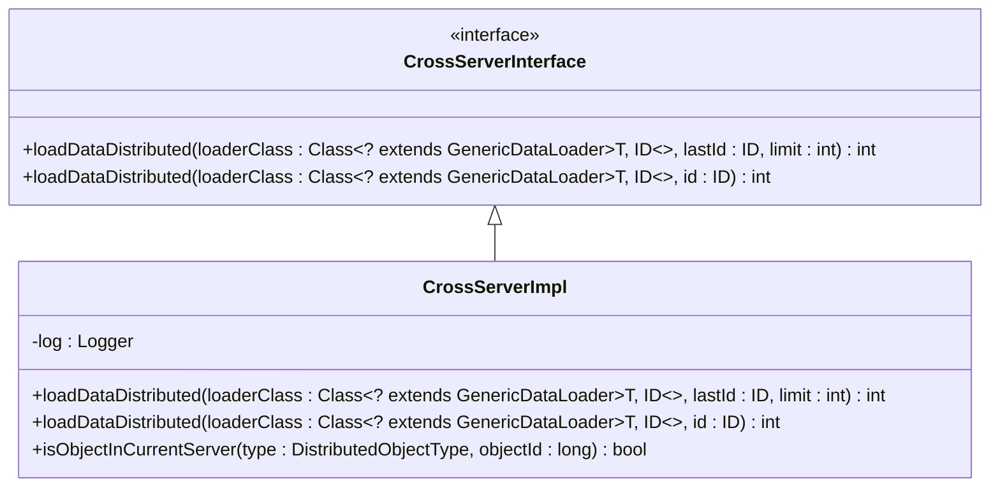
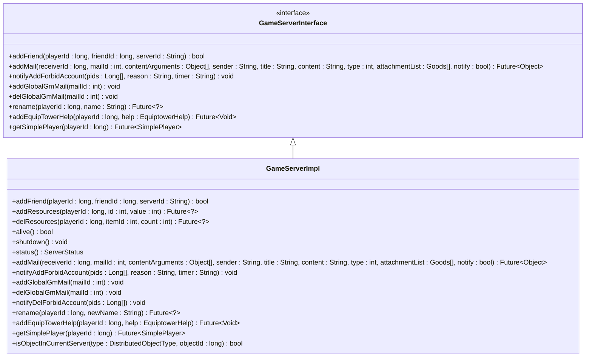
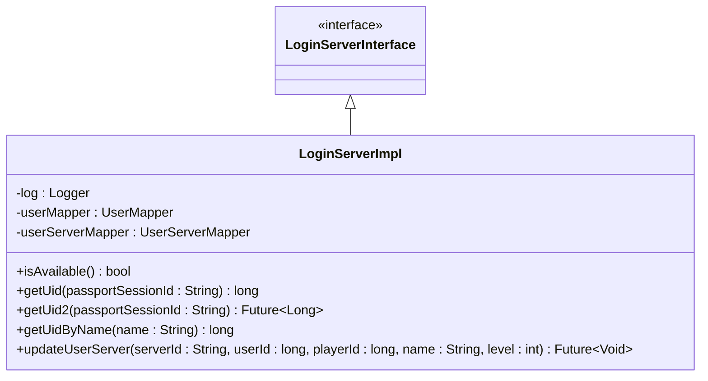
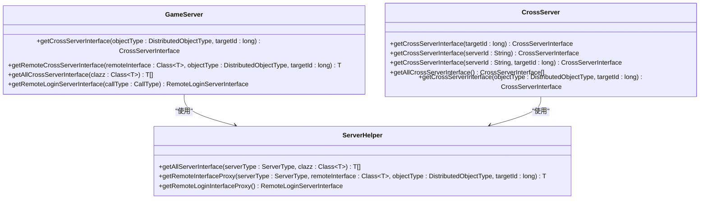
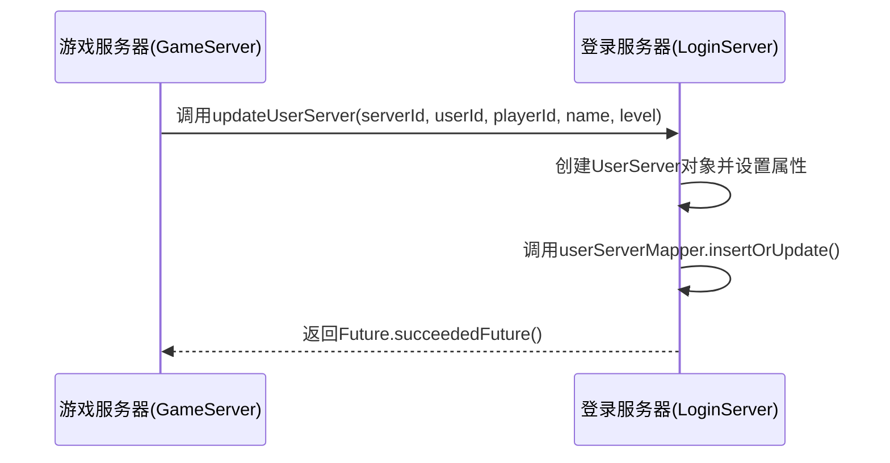
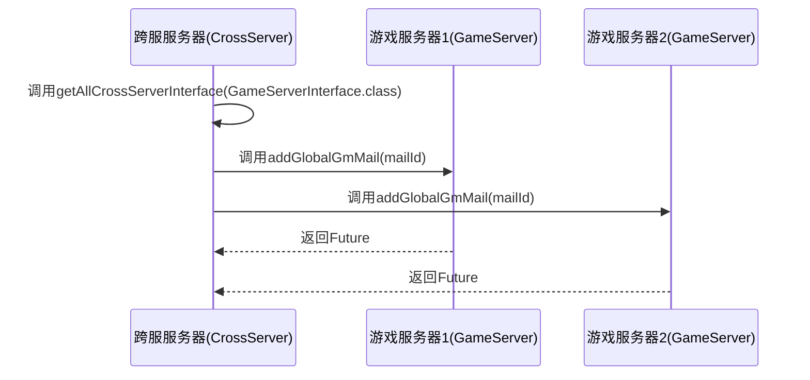
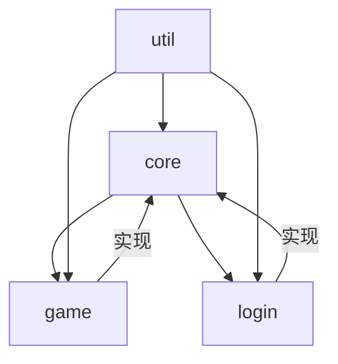

# 跨服通信接口

<cite>
**本文档引用的文件**   
- [RemoteCrossServerInterface.java](file://core/src/main/java/cn/game/core/net/remote/RemoteCrossServerInterface.java)
- [RemoteGameServerInterface.java](file://core/src/main/java/cn/game/core/net/remote/RemoteGameServerInterface.java)
- [RemoteLoginServerInterface.java](file://core/src/main/java/cn/game/core/net/remote/RemoteLoginServerInterface.java)
- [CrossServerInterface.java](file://game/src/main/java/cn/game/games/net/cross/remote/CrossServerInterface.java)
- [GameServerInterface.java](file://game/src/main/java/cn/game/games/net/game/remote/GameServerInterface.java)
- [LoginServerInterface.java](file://login/src/main/java/cn/game/login/net/remote/LoginServerInterface.java)
- [CrossServerImpl.java](file://game/src/main/java/cn/game/games/net/cross/remote/CrossServerImpl.java)
- [GameServerImpl.java](file://game/src/main/java/cn/game/games/net/game/remote/GameServerImpl.java)
- [LoginServerImpl.java](file://login/src/main/java/cn/game/login/net/remote/LoginServerImpl.java)
- [GameServer.java](file://game/src/main/java/cn/game/games/net/game/GameServer.java)
- [CrossServer.java](file://game/src/main/java/cn/game/games/net/cross/CrossServer.java)
- [ServerStatus.java](file://core/src/main/java/cn/game/core/net/remote/ServerStatus.java)
- [RemoteServerInterface.java](file://core/src/main/java/cn/game/core/net/remote/RemoteServerInterface.java)
</cite>

## 目录
1. [简介](#简介)
2. [项目结构](#项目结构)
3. [核心组件](#核心组件)
4. [架构概述](#架构概述)
5. [详细组件分析](#详细组件分析)
6. [依赖分析](#依赖分析)
7. [性能考虑](#性能考虑)
8. [故障排除指南](#故障排除指南)
9. [结论](#结论)

## 简介
本文档详细说明了游戏服务器系统中跨服通信接口的设计与实现。系统包含三种主要服务器类型：游戏服务器（Game）、跨服服务器（Cross）和登录服务器（Login），它们通过定义良好的远程接口进行通信。文档重点描述了`RemoteCrossServerInterface`、`RemoteGameServerInterface`和`RemoteLoginServerInterface`三个核心接口，以及它们在不同服务器间的交互契约。此外，还涵盖了典型跨服场景的调用流程和接口版本管理策略。

## 项目结构
项目采用模块化设计，主要分为`core`、`game`、`login`和`util`四个模块。`core`模块定义了所有服务器共享的基础远程接口和通用组件。`game`模块实现了游戏服务器和跨服服务器的具体业务逻辑。`login`模块负责用户登录和会话管理。`util`模块提供了通用的工具类。跨服通信的核心接口定义在`core`模块中，而具体的实现则分布在`game`和`login`模块中。

**图示来源**
- [RemoteCrossServerInterface.java](file://core/src/main/java/cn/game/core/net/remote/RemoteCrossServerInterface.java)
- [RemoteGameServerInterface.java](file://core/src/main/java/cn/game/core/net/remote/RemoteGameServerInterface.java)
- [RemoteLoginServerInterface.java](file://core/src/main/java/cn/game/core/net/remote/RemoteLoginServerInterface.java)
- [CrossServerImpl.java](file://game/src/main/java/cn/game/games/net/cross/remote/CrossServerImpl.java)
- [GameServerImpl.java](file://game/src/main/java/cn/game/games/net/game/remote/GameServerImpl.java)
- [LoginServerImpl.java](file://login/src/main/java/cn/game/login/net/remote/LoginServerImpl.java)

**本节来源**
- [RemoteCrossServerInterface.java](file://core/src/main/java/cn/game/core/net/remote/RemoteCrossServerInterface.java)
- [RemoteGameServerInterface.java](file://core/src/main/java/cn/game/core/net/remote/RemoteGameServerInterface.java)
- [RemoteLoginServerInterface.java](file://core/src/main/java/cn/game/core/net/remote/RemoteLoginServerInterface.java)

## 核心组件
系统的跨服通信基于三个核心远程接口：`RemoteCrossServerInterface`、`RemoteGameServerInterface`和`RemoteLoginServerInterface`。这些接口定义了不同服务器类型之间的交互契约。`RemoteCrossServerInterface`是跨服服务器提供给其他服务器调用的接口，主要用于数据同步。`RemoteGameServerInterface`是游戏服务器提供的接口，允许其他服务（如跨服服务器）操作玩家数据。`RemoteLoginServerInterface`是登录服务器的核心接口，负责会话验证和用户状态同步。每个接口都有对应的实现类，如`CrossServerImpl`、`GameServerImpl`和`LoginServerImpl`，它们在各自的服务器进程中运行。

**本节来源**
- [RemoteCrossServerInterface.java](file://core/src/main/java/cn/game/core/net/remote/RemoteCrossServerInterface.java)
- [RemoteGameServerInterface.java](file://core/src/main/java/cn/game/core/net/remote/RemoteGameServerInterface.java)
- [RemoteLoginServerInterface.java](file://core/src/main/java/cn/game/core/net/remote/RemoteLoginServerInterface.java)
- [CrossServerImpl.java](file://game/src/main/java/cn/game/games/net/cross/remote/CrossServerImpl.java)
- [GameServerImpl.java](file://game/src/main/java/cn/game/games/net/game/remote/GameServerImpl.java)
- [LoginServerImpl.java](file://login/src/main/java/cn/game/login/net/remote/LoginServerImpl.java)

## 架构概述
系统采用分布式微服务架构，各服务器通过RPC进行通信。`RemoteServerInterface`是所有远程接口的基类，它继承自`RemoteProxy`，并提供了`isObjectInCurrentServer`等通用方法。`RemoteCrossServerInterface`、`RemoteGameServerInterface`和`RemoteLoginServerInterface`都继承自`RemoteServerInterface`，形成了清晰的接口层次。客户端通过`GameServer`和`CrossServer`类中的工厂方法获取远程接口的代理实例，这些代理封装了底层的RPC调用细节。

**图示来源**
- [RemoteCrossServerInterface.java](file://core/src/main/java/cn/game/core/net/remote/RemoteCrossServerInterface.java)
- [RemoteGameServerInterface.java](file://core/src/main/java/cn/game/core/net/remote/RemoteGameServerInterface.java)
- [RemoteLoginServerInterface.java](file://core/src/main/java/cn/game/core/net/remote/RemoteLoginServerInterface.java)
- [RemoteServerInterface.java](file://core/src/main/java/cn/game/core/net/remote/RemoteServerInterface.java)
- [ServerStatus.java](file://core/src/main/java/cn/game/core/net/remote/ServerStatus.java)

**本节来源**
- [RemoteCrossServerInterface.java](file://core/src/main/java/cn/game/core/net/remote/RemoteCrossServerInterface.java)
- [RemoteGameServerInterface.java](file://core/src/main/java/cn/game/core/net/remote/RemoteGameServerInterface.java)
- [RemoteLoginServerInterface.java](file://core/src/main/java/cn/game/core/net/remote/RemoteLoginServerInterface.java)
- [RemoteServerInterface.java](file://core/src/main/java/cn/game/core/net/remote/RemoteServerInterface.java)

## 详细组件分析
本节深入分析跨服通信的各个核心组件，包括接口定义、实现类和客户端调用方式。

### 跨服服务器接口分析
`CrossServerInterface`继承自`RemoteCrossServerInterface`，为游戏服务器和跨服服务器之间的数据同步提供了具体方法。其核心功能是`loadDataDistributed`，用于分页加载分布式数据。该接口的实现类`CrossServerImpl`通过Spring容器获取`GenericDataLoader`实例来执行数据加载和处理。

**图示来源**
- [CrossServerInterface.java](file://game/src/main/java/cn/game/games/net/cross/remote/CrossServerInterface.java)
- [CrossServerImpl.java](file://game/src/main/java/cn/game/games/net/cross/remote/CrossServerImpl.java)

**本节来源**
- [CrossServerInterface.java](file://game/src/main/java/cn/game/games/net/cross/remote/CrossServerInterface.java)
- [CrossServerImpl.java](file://game/src/main/java/cn/game/games/net/cross/remote/CrossServerImpl.java)

### 游戏服务器接口分析
`GameServerInterface`继承自`RemoteGameServerInterface`，定义了游戏服务器对外提供的所有功能。这些功能包括资源管理（`addResources`、`delResources`）、玩家操作（`rename`、`addFriend`）、邮件系统（`addMail`）和状态查询（`status`）。`GameServerImpl`是其具体实现，它通过调用`PlayerHelper`、`MailHelper`等业务组件来完成实际工作。

**图示来源**
- [GameServerInterface.java](file://game/src/main/java/cn/game/games/net/game/remote/GameServerInterface.java)
- [GameServerImpl.java](file://game/src/main/java/cn/game/games/net/game/remote/GameServerImpl.java)

**本节来源**
- [GameServerInterface.java](file://game/src/main/java/cn/game/games/net/game/remote/GameServerInterface.java)
- [GameServerImpl.java](file://game/src/main/java/cn/game/games/net/game/remote/GameServerImpl.java)

### 登录服务器接口分析
`LoginServerInterface`继承自`RemoteLoginServerInterface`，是登录服务器的核心接口。它提供了会话验证（`getUid`）、用户状态同步（`updateUserServer`）和用户管理（`getUidByName`）等功能。`LoginServerImpl`是其具体实现，它直接操作数据库（`UserMapper`、`UserServerMapper`）来持久化用户数据。

**图示来源**
- [LoginServerInterface.java](file://login/src/main/java/cn/game/login/net/remote/LoginServerInterface.java)
- [LoginServerImpl.java](file://login/src/main/java/cn/game/login/net/remote/LoginServerImpl.java)

**本节来源**
- [LoginServerInterface.java](file://login/src/main/java/cn/game/login/net/remote/LoginServerInterface.java)
- [LoginServerImpl.java](file://login/src/main/java/cn/game/login/net/remote/LoginServerImpl.java)

### 跨服通信客户端分析
`GameServer`和`CrossServer`类提供了获取远程接口代理的工厂方法。客户端通过调用`getCrossServerInterface`、`getRemoteLoginServerInterface`等方法来获取远程服务的代理实例，然后像调用本地方法一样进行RPC调用。

**图示来源**
- [GameServer.java](file://game/src/main/java/cn/game/games/net/game/GameServer.java)
- [CrossServer.java](file://game/src/main/java/cn/game/games/net/cross/CrossServer.java)
- [ServerHelper.java](file://game/src/main/java/cn/game/games/net/game/helper/ServerHelper.java)

**本节来源**
- [GameServer.java](file://game/src/main/java/cn/game/games/net/game/GameServer.java)
- [CrossServer.java](file://game/src/main/java/cn/game/games/net/cross/CrossServer.java)
- [ServerHelper.java](file://game/src/main/java/cn/game/games/net/game/helper/ServerHelper.java)

### 典型跨服场景调用序列
以下序列图展示了玩家迁移、联盟操作和全局活动等典型跨服场景的调用流程。

#### 玩家迁移场景
当玩家从一个游戏服务器迁移到另一个时，需要同步其状态到登录服务器。

**图示来源**
- [GameServer.java](file://game/src/main/java/cn/game/games/net/game/GameServer.java#L543-L545)
- [LoginServerImpl.java](file://login/src/main/java/cn/game/login/net/remote/LoginServerImpl.java#L90-L102)

#### 联盟操作场景
跨服服务器需要向所有游戏服务器发送联盟操作指令。

**图示来源**
- [CrossServer.java](file://game/src/main/java/cn/game/games/net/cross/CrossServer.java#L208-L209)
- [GameServerInterface.java](file://game/src/main/java/cn/game/games/net/game/remote/GameServerInterface.java#L39)
- [GameServerImpl.java](file://game/src/main/java/cn/game/games/net/game/remote/GameServerImpl.java#L116-L117)

## 依赖分析
系统通过清晰的接口定义和依赖注入实现了松耦合。`core`模块是所有其他模块的基础依赖，它定义了远程通信的契约。`game`和`login`模块依赖`core`模块，并各自实现具体的业务逻辑。`util`模块被所有其他模块所依赖，提供通用工具。远程接口的调用通过RPC代理实现，调用方无需直接依赖实现类，这进一步降低了模块间的耦合度。

**图示来源**
- [pom.xml](file://core/pom.xml)
- [pom.xml](file://game/pom.xml)
- [pom.xml](file://login/pom.xml)
- [pom.xml](file://util/pom.xml)

**本节来源**
- [pom.xml](file://core/pom.xml)
- [pom.xml](file://game/pom.xml)
- [pom.xml](file://login/pom.xml)
- [pom.xml](file://util/pom.xml)

## 性能考虑
跨服通信的性能主要受RPC调用延迟和网络带宽的影响。系统采用异步非阻塞的Future模式，避免了同步调用导致的线程阻塞。对于批量操作（如`getAllCrossServerInterface`），可以并行发起多个RPC调用以提高效率。数据序列化使用高效的Protostuff或Kryo，减少了网络传输开销。此外，`ServerStatus`等状态信息的获取非常轻量，仅包含在线人数等基本指标，避免了不必要的数据传输。

## 故障排除指南
在跨服通信中常见的问题包括连接超时、序列化错误和业务逻辑异常。对于连接问题，应检查服务器间的网络连通性和RPC服务是否正常启动。对于序列化错误，需确保调用方和被调用方使用的类定义完全一致。对于业务逻辑异常，应查看`GameServerImpl`、`CrossServerImpl`和`LoginServerImpl`中的日志输出，这些实现类包含了详细的错误处理和日志记录。

**本节来源**
- [GameServerImpl.java](file://game/src/main/java/cn/game/games/net/game/remote/GameServerImpl.java)
- [CrossServerImpl.java](file://game/src/main/java/cn/game/games/net/cross/remote/CrossServerImpl.java)
- [LoginServerImpl.java](file://login/src/main/java/cn/game/login/net/remote/LoginServerImpl.java)

## 结论
本文档详细阐述了游戏系统中跨服通信接口的设计与实现。通过定义`RemoteCrossServerInterface`、`RemoteGameServerInterface`和`RemoteLoginServerInterface`三个核心接口，系统实现了清晰的服务间契约。接口的层次化设计和异步编程模型确保了系统的可扩展性和高性能。工厂模式和代理模式的运用使得客户端代码简洁且易于维护。该架构为玩家迁移、联盟操作和全局活动等复杂跨服场景提供了可靠的技术支持。