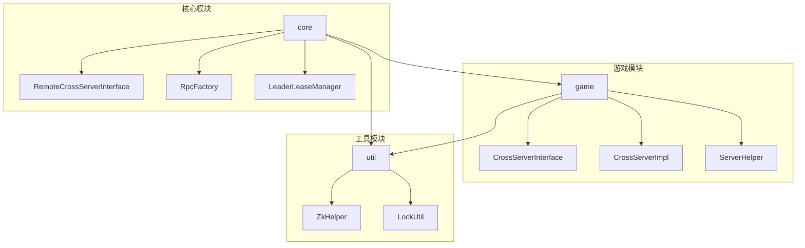
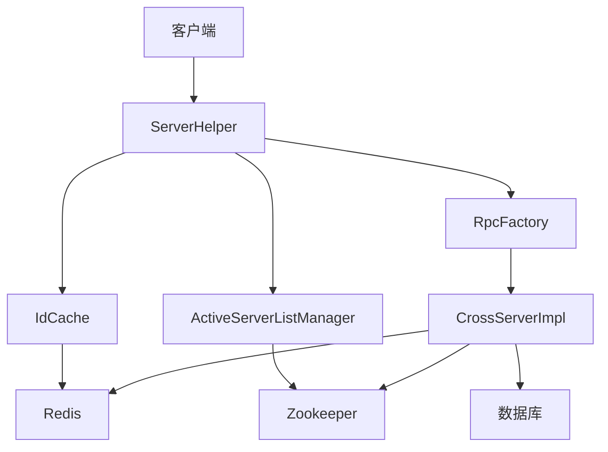
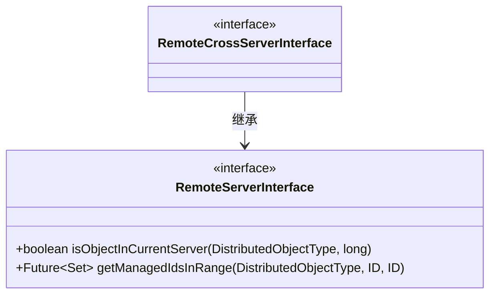
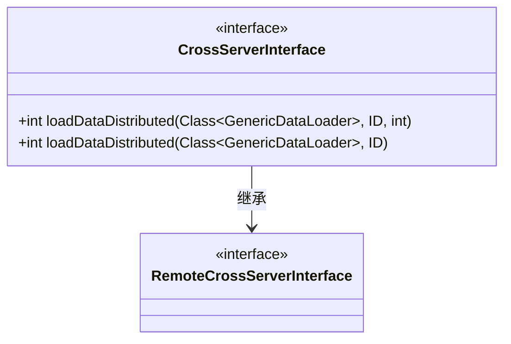
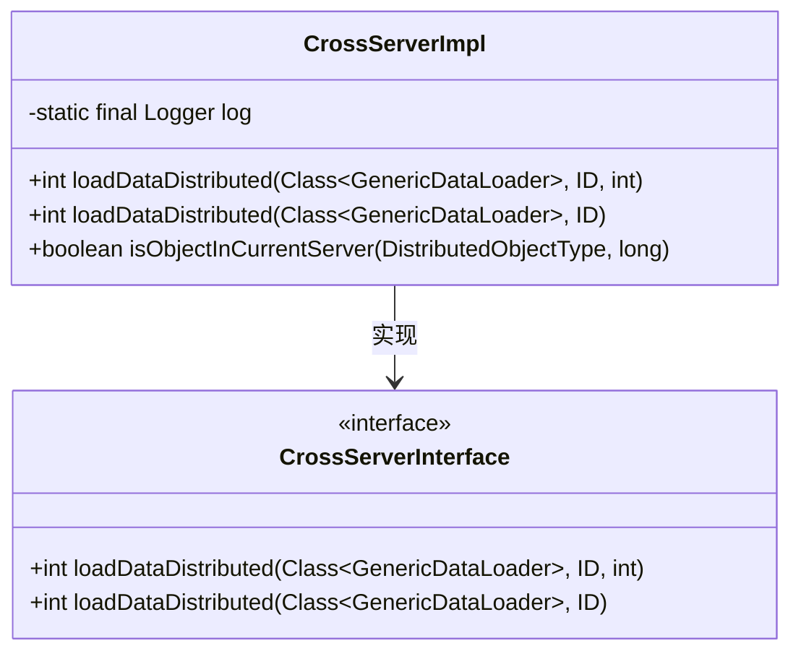
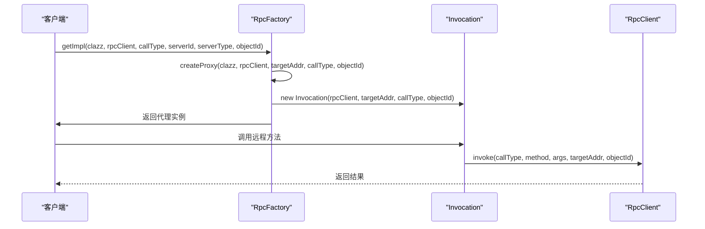
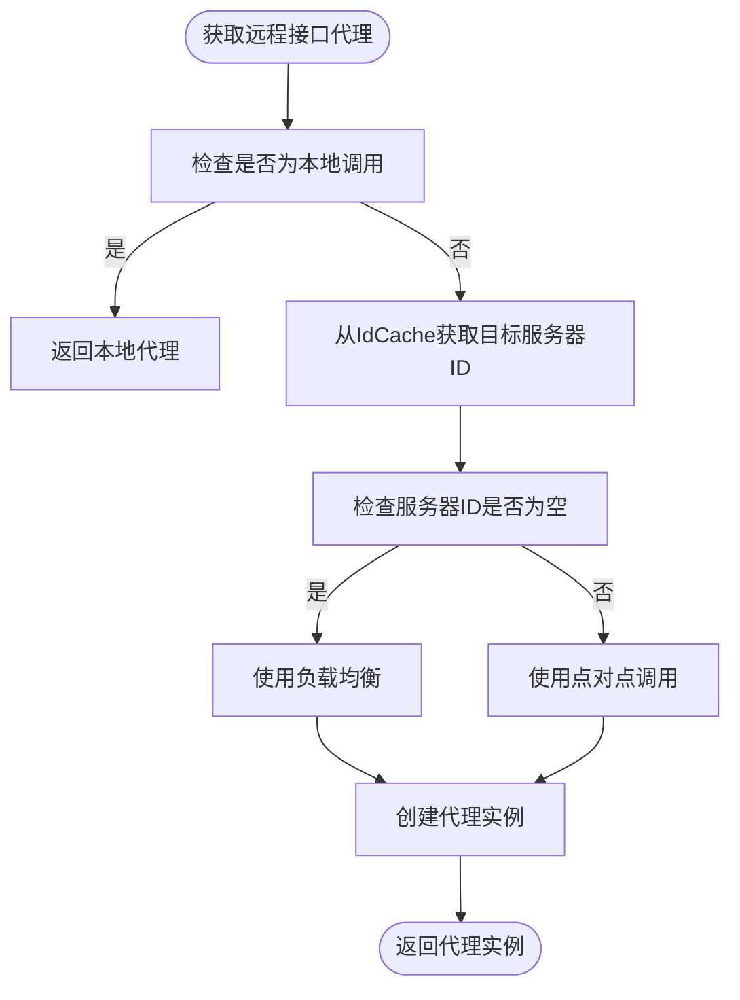
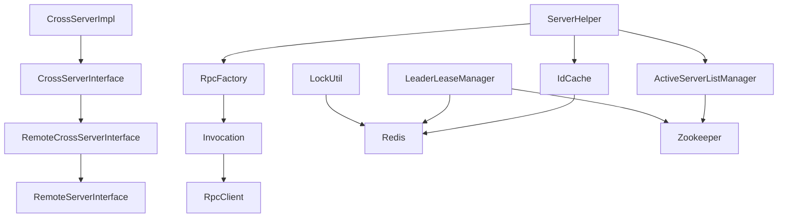

# 跨服通信核心接口

<cite>
**本文档引用文件**  
- [RemoteCrossServerInterface.java](file://core/src/main/java/cn/game/core/net/remote/RemoteCrossServerInterface.java)
- [CrossServerInterface.java](file://game/src/main/java/cn/game/games/net/cross/remote/CrossServerInterface.java)
- [CrossServerImpl.java](file://game/src/main/java/cn/game/games/net/cross/remote/CrossServerImpl.java)
- [RpcFactory.java](file://core/src/main/java/cn/game/core/net/rpc/RpcFactory.java)
- [ServerHelper.java](file://game/src/main/java/cn/game/games/net/game/helper/ServerHelper.java)
- [IdCache.java](file://core/src/main/java/cn/game/core/cache/id/IdCache.java)
- [ZkHelper.java](file://util/src/main/java/cn/game/util/ZkHelper.java)
- [ActiveServerListManager.java](file://core/src/main/java/cn/game/core/base/ActiveServerListManager.java)
- [LeaderLeaseManager.java](file://core/src/main/java/cn/game/core/leader/LeaderLeaseManager.java)
- [LockUtil.java](file://util/src/main/java/cn/game/util/LockUtil.java)
</cite>

## 目录
1. [引言](#引言)
2. [项目结构](#项目结构)
3. [核心组件](#核心组件)
4. [架构概述](#架构概述)
5. [详细组件分析](#详细组件分析)
6. [依赖分析](#依赖分析)
7. [性能考虑](#性能考虑)
8. [故障排查指南](#故障排查指南)
9. [结论](#结论)

## 引言
本文档深入解析 `RemoteCrossServerInterface` 的设计与实现，作为跨服通信的基础契约。详细说明跨服消息路由、数据一致性保障、分布式锁协调等核心功能的方法签名和行为规范。提供跨服事务处理的两阶段提交模式示例，以及在出现网络故障时的补偿机制。解释接口如何与 Zookeeper 服务发现机制集成，确保目标服务器地址的动态解析和故障转移。

## 项目结构
本项目采用模块化设计，主要分为 `core`、`game`、`login`、`simulationclient` 和 `util` 五个模块。`core` 模块包含跨服通信的核心接口和基础服务，`game` 模块包含游戏逻辑和跨服通信的具体实现，`login` 模块负责用户登录和认证，`simulationclient` 模块用于模拟客户端进行压力测试，`util` 模块提供通用工具类。

**图示来源**
- [RemoteCrossServerInterface.java](file://core/src/main/java/cn/game/core/net/remote/RemoteCrossServerInterface.java)
- [CrossServerInterface.java](file://game/src/main/java/cn/game/games/net/cross/remote/CrossServerInterface.java)
- [CrossServerImpl.java](file://game/src/main/java/cn/game/games/net/cross/remote/CrossServerImpl.java)
- [RpcFactory.java](file://core/src/main/java/cn/game/core/net/rpc/RpcFactory.java)
- [ServerHelper.java](file://game/src/main/java/cn/game/games/net/game/helper/ServerHelper.java)
- [ZkHelper.java](file://util/src/main/java/cn/game/util/ZkHelper.java)
- [LockUtil.java](file://util/src/main/java/cn/game/util/LockUtil.java)

**章节来源**
- [RemoteCrossServerInterface.java](file://core/src/main/java/cn/game/core/net/remote/RemoteCrossServerInterface.java)
- [CrossServerInterface.java](file://game/src/main/java/cn/game/games/net/cross/remote/CrossServerInterface.java)
- [CrossServerImpl.java](file://game/src/main/java/cn/game/games/net/cross/remote/CrossServerImpl.java)
- [RpcFactory.java](file://core/src/main/java/cn/game/core/net/rpc/RpcFactory.java)
- [ServerHelper.java](file://game/src/main/java/cn/game/games/net/game/helper/ServerHelper.java)
- [ZkHelper.java](file://util/src/main/java/cn/game/util/ZkHelper.java)
- [LockUtil.java](file://util/src/main/java/cn/game/util/LockUtil.java)

## 核心组件
`RemoteCrossServerInterface` 是跨服通信的核心接口，定义了跨服调用的基本契约。`CrossServerInterface` 继承自 `RemoteCrossServerInterface`，提供了具体的跨服调用方法。`CrossServerImpl` 实现了 `CrossServerInterface`，负责具体的跨服调用逻辑。`RpcFactory` 负责创建远程调用的代理实例，`ServerHelper` 提供了获取远程接口代理的便捷方法。

**章节来源**
- [RemoteCrossServerInterface.java](file://core/src/main/java/cn/game/core/net/remote/RemoteCrossServerInterface.java)
- [CrossServerInterface.java](file://game/src/main/java/cn/game/games/net/cross/remote/CrossServerInterface.java)
- [CrossServerImpl.java](file://game/src/main/java/cn/game/games/net/cross/remote/CrossServerImpl.java)
- [RpcFactory.java](file://core/src/main/java/cn/game/core/net/rpc/RpcFactory.java)
- [ServerHelper.java](file://game/src/main/java/cn/game/games/net/game/helper/ServerHelper.java)

## 架构概述
系统采用微服务架构，通过 `RemoteCrossServerInterface` 实现跨服通信。`RpcFactory` 使用 JDK 动态代理和 Byte Buddy 字节码增强技术创建远程调用代理。`ServerHelper` 结合 `IdCache` 和 `ActiveServerListManager` 实现服务发现和负载均衡。`ZkHelper` 和 `LeaderLeaseManager` 利用 Zookeeper 实现分布式协调和故障转移。

**图示来源**
- [ServerHelper.java](file://game/src/main/java/cn/game/games/net/game/helper/ServerHelper.java)
- [IdCache.java](file://core/src/main/java/cn/game/core/cache/id/IdCache.java)
- [ActiveServerListManager.java](file://core/src/main/java/cn/game/core/base/ActiveServerListManager.java)
- [RpcFactory.java](file://core/src/main/java/cn/game/core/net/rpc/RpcFactory.java)
- [CrossServerImpl.java](file://game/src/main/java/cn/game/games/net/cross/remote/CrossServerImpl.java)
- [ZkHelper.java](file://util/src/main/java/cn/game/util/ZkHelper.java)

**章节来源**
- [ServerHelper.java](file://game/src/main/java/cn/game/games/net/game/helper/ServerHelper.java)
- [IdCache.java](file://core/src/main/java/cn/game/core/cache/id/IdCache.java)
- [ActiveServerListManager.java](file://core/src/main/java/cn/game/core/base/ActiveServerListManager.java)
- [RpcFactory.java](file://core/src/main/java/cn/game/core/net/rpc/RpcFactory.java)
- [CrossServerImpl.java](file://game/src/main/java/cn/game/games/net/cross/remote/CrossServerImpl.java)
- [ZkHelper.java](file://util/src/main/java/cn/game/util/ZkHelper.java)

## 详细组件分析
### RemoteCrossServerInterface 分析
`RemoteCrossServerInterface` 是跨服通信的基础接口，继承自 `RemoteServerInterface`，定义了跨服调用的基本契约。它本身不定义具体方法，而是作为其他跨服接口的基类。

#### 类图

**图示来源**
- [RemoteCrossServerInterface.java](file://core/src/main/java/cn/game/core/net/remote/RemoteCrossServerInterface.java)
- [RemoteServerInterface.java](file://core/src/main/java/cn/game/core/net/remote/RemoteServerInterface.java)

**章节来源**
- [RemoteCrossServerInterface.java](file://core/src/main/java/cn/game/core/net/remote/RemoteCrossServerInterface.java)
- [RemoteServerInterface.java](file://core/src/main/java/cn/game/core/net/remote/RemoteServerInterface.java)

### CrossServerInterface 分析
`CrossServerInterface` 继承自 `RemoteCrossServerInterface`，定义了具体的跨服调用方法，包括加载分布式数据等。

#### 类图

**图示来源**
- [CrossServerInterface.java](file://game/src/main/java/cn/game/games/net/cross/remote/CrossServerInterface.java)
- [RemoteCrossServerInterface.java](file://core/src/main/java/cn/game/core/net/remote/RemoteCrossServerInterface.java)

**章节来源**
- [CrossServerInterface.java](file://game/src/main/java/cn/game/games/net/cross/remote/CrossServerInterface.java)
- [RemoteCrossServerInterface.java](file://core/src/main/java/cn/game/core/net/remote/RemoteCrossServerInterface.java)

### CrossServerImpl 分析
`CrossServerImpl` 实现了 `CrossServerInterface`，负责具体的跨服调用逻辑。它通过 Spring 容器获取 `GenericDataLoader` 实例，执行数据加载和处理。

#### 类图

**图示来源**
- [CrossServerImpl.java](file://game/src/main/java/cn/game/games/net/cross/remote/CrossServerImpl.java)
- [CrossServerInterface.java](file://game/src/main/java/cn/game/games/net/cross/remote/CrossServerInterface.java)

**章节来源**
- [CrossServerImpl.java](file://game/src/main/java/cn/game/games/net/cross/remote/CrossServerImpl.java)
- [CrossServerInterface.java](file://game/src/main/java/cn/game/games/net/cross/remote/CrossServerInterface.java)

### RpcFactory 分析
`RpcFactory` 负责创建远程调用的代理实例。它使用 JDK 动态代理和 Byte Buddy 字节码增强技术，根据调用类型和目标地址创建相应的代理实例。

#### 序列图

**图示来源**
- [RpcFactory.java](file://core/src/main/java/cn/game/core/net/rpc/RpcFactory.java)

**章节来源**
- [RpcFactory.java](file://core/src/main/java/cn/game/core/net/rpc/RpcFactory.java)

### ServerHelper 分析
`ServerHelper` 提供了获取远程接口代理的便捷方法。它结合 `IdCache` 和 `ActiveServerListManager` 实现服务发现和负载均衡。

#### 流程图

**图示来源**
- [ServerHelper.java](file://game/src/main/java/cn/game/games/net/game/helper/ServerHelper.java)
- [IdCache.java](file://core/src/main/java/cn/game/core/cache/id/IdCache.java)
- [ActiveServerListManager.java](file://core/src/main/java/cn/game/core/base/ActiveServerListManager.java)

**章节来源**
- [ServerHelper.java](file://game/src/main/java/cn/game/games/net/game/helper/ServerHelper.java)
- [IdCache.java](file://core/src/main/java/cn/game/core/cache/id/IdCache.java)
- [ActiveServerListManager.java](file://core/src/main/java/cn/game/core/base/ActiveServerListManager.java)

## 依赖分析
系统依赖于 Zookeeper 实现服务发现和分布式协调，依赖于 Redis 实现分布式锁和数据缓存，依赖于 Spring 框架实现依赖注入和 Bean 管理。

**图示来源**
- [RemoteCrossServerInterface.java](file://core/src/main/java/cn/game/core/net/remote/RemoteCrossServerInterface.java)
- [RemoteServerInterface.java](file://core/src/main/java/cn/game/core/net/remote/RemoteServerInterface.java)
- [CrossServerInterface.java](file://game/src/main/java/cn/game/games/net/cross/remote/CrossServerInterface.java)
- [CrossServerImpl.java](file://game/src/main/java/cn/game/games/net/cross/remote/CrossServerImpl.java)
- [RpcFactory.java](file://core/src/main/java/cn/game/core/net/rpc/RpcFactory.java)
- [Invocation.java](file://core/src/main/java/cn/game/core/net/rpc/RpcFactory.java)
- [RpcClient.java](file://core/src/main/java/cn/game/core/net/rpc/RpcClient.java)
- [ServerHelper.java](file://game/src/main/java/cn/game/games/net/game/helper/ServerHelper.java)
- [IdCache.java](file://core/src/main/java/cn/game/core/cache/id/IdCache.java)
- [ActiveServerListManager.java](file://core/src/main/java/cn/game/core/base/ActiveServerListManager.java)
- [LeaderLeaseManager.java](file://core/src/main/java/cn/game/core/leader/LeaderLeaseManager.java)
- [LockUtil.java](file://util/src/main/java/cn/game/util/LockUtil.java)

**章节来源**
- [RemoteCrossServerInterface.java](file://core/src/main/java/cn/game/core/net/remote/RemoteCrossServerInterface.java)
- [RemoteServerInterface.java](file://core/src/main/java/cn/game/core/net/remote/RemoteServerInterface.java)
- [CrossServerInterface.java](file://game/src/main/java/cn/game/games/net/cross/remote/CrossServerInterface.java)
- [CrossServerImpl.java](file://game/src/main/java/cn/game/games/net/cross/remote/CrossServerImpl.java)
- [RpcFactory.java](file://core/src/main/java/cn/game/core/net/rpc/RpcFactory.java)
- [ServerHelper.java](file://game/src/main/java/cn/game/games/net/game/helper/ServerHelper.java)
- [IdCache.java](file://core/src/main/java/cn/game/core/cache/id/IdCache.java)
- [ActiveServerListManager.java](file://core/src/main/java/cn/game/core/base/ActiveServerListManager.java)
- [LeaderLeaseManager.java](file://core/src/main/java/cn/game/core/leader/LeaderLeaseManager.java)
- [LockUtil.java](file://util/src/main/java/cn/game/util/LockUtil.java)

## 性能考虑
- 使用缓存减少重复的远程调用
- 使用异步调用提高响应速度
- 使用批量操作减少网络开销
- 使用连接池复用网络连接

## 故障排查指南
- 检查 Zookeeper 和 Redis 服务是否正常运行
- 检查网络连接是否正常
- 检查日志文件中的错误信息
- 使用监控工具查看系统性能指标

**章节来源**
- [ZkHelper.java](file://util/src/main/java/cn/game/util/ZkHelper.java)
- [LockUtil.java](file://util/src/main/java/cn/game/util/LockUtil.java)
- [RpcFactory.java](file://core/src/main/java/cn/game/core/net/rpc/RpcFactory.java)

## 结论
`RemoteCrossServerInterface` 及其相关组件构成了跨服通信的核心基础。通过合理的架构设计和实现，系统能够高效、可靠地处理跨服通信需求。未来可以进一步优化性能，增强容错能力，提高系统的可维护性。