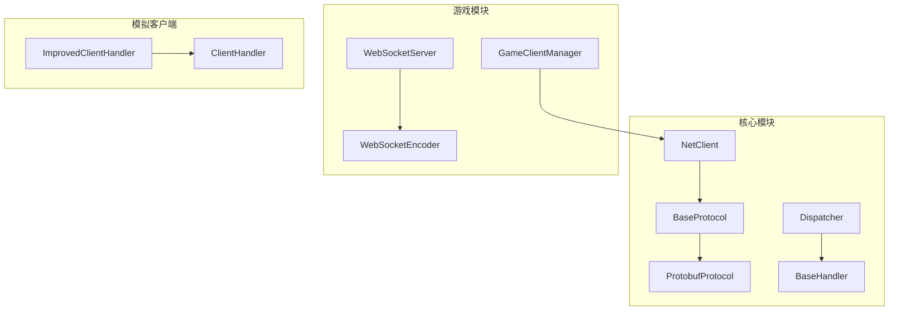
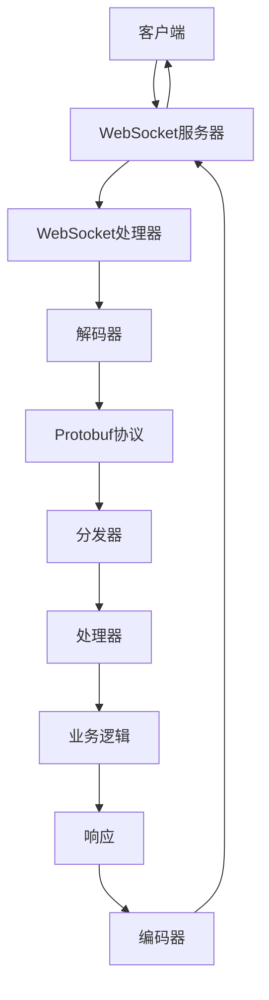
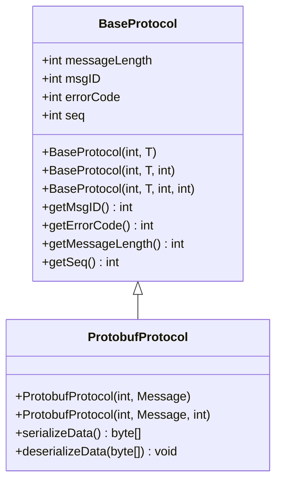
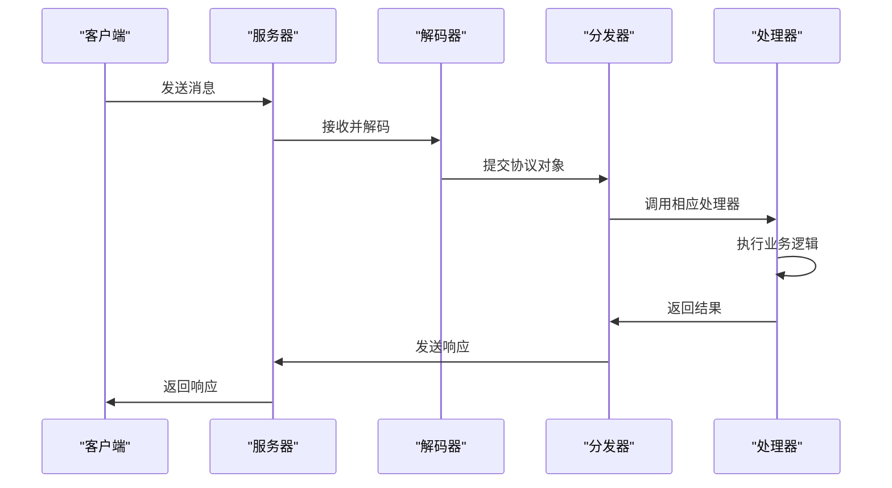
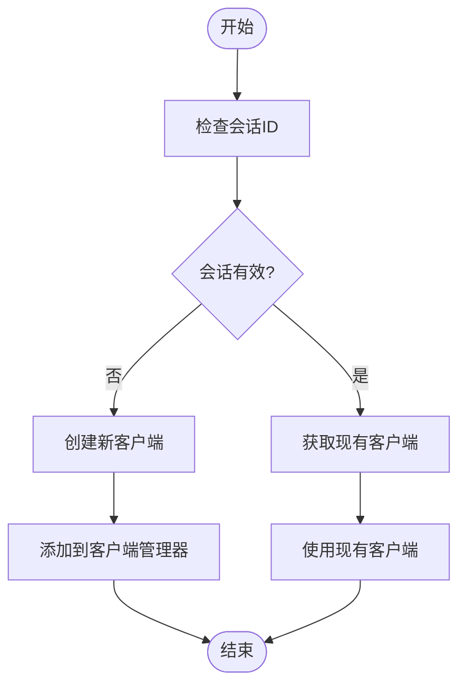
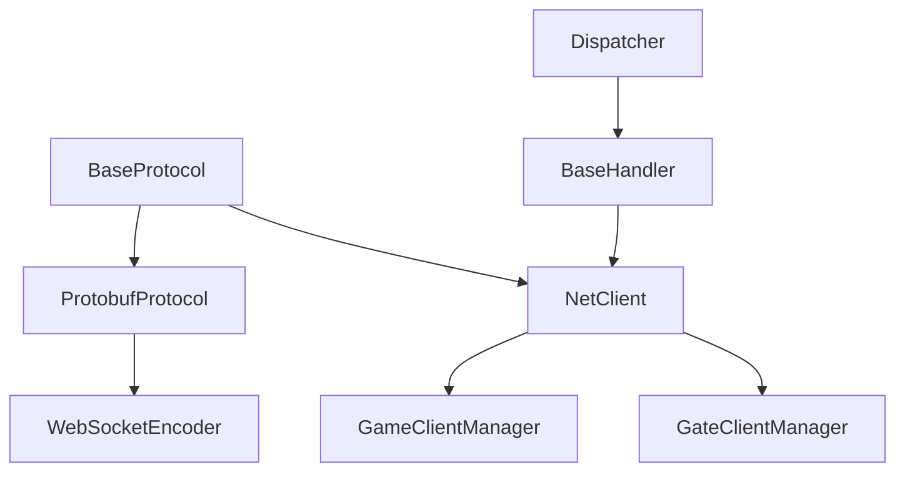

# Socket API

<cite>
**本文档引用文件**  
- [ProtobufProtocol.java](file://core/src/main/java/cn/game/core/net/protocol/object/ProtobufProtocol.java)
- [BaseProtocol.java](file://core/src/main/java/cn/game/core/net/protocol/BaseProtocol.java)
- [WebSocketEncoder.java](file://game/src/main/java/cn/game/games/core/netty/WebSocketEncoder.java)
- [ImprovedClientHandler.java](file://simulationclient/src/main/java/cn/game/simulation/socket/ImprovedClientHandler.java)
- [ProtobufProtocolCodec.java](file://core/src/main/java/cn/game/core/net/vertx/codec/ProtobufProtocolCodec.java)
- [ProtocolCodec.java](file://core/src/main/java/cn/game/core/net/vertx/codec/ProtocolCodec.java)
- [BaseHandler.java](file://core/src/main/java/cn/game/core/net/socket/handler/BaseHandler.java)
- [NetClient.java](file://core/src/main/java/cn/game/core/net/client/NetClient.java)
- [Dispatcher.java](file://core/src/main/java/cn/game/core/net/socket/controller/Dispatcher.java)
- [DispatcherImpl.java](file://core/src/main/java/cn/game/core/net/socket/controller/DispatcherImpl.java)
- [WebSocketServer.java](file://game/src/main/java/cn/game/games/core/netty/WebSocketServer.java)
- [WebSocketServerInitializer.java](file://game/src/main/java/cn/game/games/core/netty/WebSocketServerInitializer.java)
- [GameClientManager.java](file://game/src/main/java/cn/game/games/net/game/manager/GameClientManager.java)
- [GateClientManager.java](file://game/src/main/java/cn/game/games/net/gateway/GateClientManager.java)
</cite>

## 目录
1. [引言](#引言)
2. [项目结构](#项目结构)
3. [核心组件](#核心组件)
4. [架构概述](#架构概述)
5. [详细组件分析](#详细组件分析)
6. [依赖分析](#依赖分析)
7. [性能考虑](#性能考虑)
8. [故障排除指南](#故障排除指南)
9. [结论](#结论)

## 引言
本文档详细描述了基于TCP的Socket通信协议，重点涵盖连接建立过程、数据包结构、状态机管理、会话保持机制、命令路由、消息分发和异常处理流程。文档还提供了数据包捕获示例、解析工具使用指南、性能调优建议、连接池配置和网络异常处理最佳实践。

## 项目结构
本项目采用模块化设计，主要分为核心模块、游戏模块、登录模块、模拟客户端和工具模块。核心模块提供基础网络通信功能，游戏模块实现具体业务逻辑，登录模块处理用户认证，模拟客户端用于压力测试，工具模块包含各种实用工具。

**图示来源**  
- [NetClient.java](file://core/src/main/java/cn/game/core/net/client/NetClient.java)
- [BaseProtocol.java](file://core/src/main/java/cn/game/core/net/protocol/BaseProtocol.java)
- [ProtobufProtocol.java](file://core/src/main/java/cn/game/core/net/protocol/object/ProtobufProtocol.java)
- [Dispatcher.java](file://core/src/main/java/cn/game/core/net/socket/controller/Dispatcher.java)
- [BaseHandler.java](file://core/src/main/java/cn/game/core/net/socket/handler/BaseHandler.java)
- [WebSocketServer.java](file://game/src/main/java/cn/game/games/core/netty/WebSocketServer.java)
- [WebSocketEncoder.java](file://game/src/main/java/cn/game/games/core/netty/WebSocketEncoder.java)
- [GameClientManager.java](file://game/src/main/java/cn/game/games/net/game/manager/GameClientManager.java)
- [ImprovedClientHandler.java](file://simulationclient/src/main/java/cn/game/simulation/socket/ImprovedClientHandler.java)

**本节来源**  
- [NetClient.java](file://core/src/main/java/cn/game/core/net/client/NetClient.java)
- [BaseProtocol.java](file://core/src/main/java/cn/game/core/net/protocol/BaseProtocol.java)
- [ProtobufProtocol.java](file://core/src/main/java/cn/game/core/net/protocol/object/ProtobufProtocol.java)
- [Dispatcher.java](file://core/src/main/java/cn/game/core/net/socket/controller/Dispatcher.java)
- [BaseHandler.java](file://core/src/main/java/cn/game/core/net/socket/handler/BaseHandler.java)
- [WebSocketServer.java](file://game/src/main/java/cn/game/games/core/netty/WebSocketServer.java)
- [WebSocketEncoder.java](file://game/src/main/java/cn/game/games/core/netty/WebSocketEncoder.java)
- [GameClientManager.java](file://game/src/main/java/cn/game/games/net/game/manager/GameClientManager.java)
- [ImprovedClientHandler.java](file://simulationclient/src/main/java/cn/game/simulation/socket/ImprovedClientHandler.java)

## 核心组件
核心组件包括协议基类、消息处理器、客户端管理器和编码器。这些组件共同构成了Socket通信的基础。

**本节来源**  
- [BaseProtocol.java](file://core/src/main/java/cn/game/core/net/protocol/BaseProtocol.java)
- [ProtobufProtocol.java](file://core/src/main/java/cn/game/core/net/protocol/object/ProtobufProtocol.java)
- [BaseHandler.java](file://core/src/main/java/cn/game/core/net/socket/handler/BaseHandler.java)
- [NetClient.java](file://core/src/main/java/cn/game/core/net/client/NetClient.java)
- [WebSocketEncoder.java](file://game/src/main/java/cn/game/games/core/netty/WebSocketEncoder.java)

## 架构概述
系统采用Netty作为网络通信框架，通过WebSocket实现全双工通信。协议层基于Protobuf进行序列化，消息分发通过Dispatcher实现，客户端状态由GameClientManager管理。

**图示来源**  
- [WebSocketServer.java](file://game/src/main/java/cn/game/games/core/netty/WebSocketServer.java)
- [WebSocketHandler.java](file://game/src/main/java/cn/game/games/core/netty/WebSocketHandler.java)
- [WebSocketEncoder.java](file://game/src/main/java/cn/game/games/core/netty/WebSocketEncoder.java)
- [ProtobufProtocol.java](file://core/src/main/java/cn/game/core/net/protocol/object/ProtobufProtocol.java)
- [Dispatcher.java](file://core/src/main/java/cn/game/core/net/socket/controller/Dispatcher.java)
- [BaseHandler.java](file://core/src/main/java/cn/game/core/net/socket/handler/BaseHandler.java)

## 详细组件分析

### 协议组件分析
协议组件负责数据的序列化和反序列化，确保数据在网络传输中的完整性和一致性。

#### 类图

**图示来源**  
- [BaseProtocol.java](file://core/src/main/java/cn/game/core/net/protocol/BaseProtocol.java)
- [ProtobufProtocol.java](file://core/src/main/java/cn/game/core/net/protocol/object/ProtobufProtocol.java)

### 消息分发组件分析
消息分发组件负责将接收到的消息路由到相应的处理器，实现命令的解耦和灵活扩展。

#### 序列图

**图示来源**  
- [NetClient.java](file://core/src/main/java/cn/game/core/net/client/NetClient.java)
- [ProtobufProtocol.java](file://core/src/main/java/cn/game/core/net/protocol/object/ProtobufProtocol.java)
- [Dispatcher.java](file://core/src/main/java/cn/game/core/net/socket/controller/Dispatcher.java)
- [BaseHandler.java](file://core/src/main/java/cn/game/core/net/socket/handler/BaseHandler.java)

### 客户端管理组件分析
客户端管理组件负责维护客户端连接状态，支持广播和定向消息发送。

#### 流程图

**图示来源**  
- [GameClientManager.java](file://game/src/main/java/cn/game/games/net/game/manager/GameClientManager.java)
- [GateClientManager.java](file://game/src/main/java/cn/game/games/net/gateway/GateClientManager.java)
- [NetClient.java](file://core/src/main/java/cn/game/core/net/client/NetClient.java)

**本节来源**  
- [BaseProtocol.java](file://core/src/main/java/cn/game/core/net/protocol/BaseProtocol.java)
- [ProtobufProtocol.java](file://core/src/main/java/cn/game/core/net/protocol/object/ProtobufProtocol.java)
- [BaseHandler.java](file://core/src/main/java/cn/game/core/net/socket/handler/BaseHandler.java)
- [NetClient.java](file://core/src/main/java/cn/game/core/net/client/NetClient.java)
- [Dispatcher.java](file://core/src/main/java/cn/game/core/net/socket/controller/Dispatcher.java)
- [DispatcherImpl.java](file://core/src/main/java/cn/game/core/net/socket/controller/DispatcherImpl.java)
- [GameClientManager.java](file://game/src/main/java/cn/game/games/net/game/manager/GameClientManager.java)
- [GateClientManager.java](file://game/src/main/java/cn/game/games/net/gateway/GateClientManager.java)

## 依赖分析
系统各组件之间存在明确的依赖关系，核心协议组件被网络通信组件依赖，消息分发组件依赖于客户端管理组件。

**图示来源**  
- [BaseProtocol.java](file://core/src/main/java/cn/game/core/net/protocol/BaseProtocol.java)
- [ProtobufProtocol.java](file://core/src/main/java/cn/game/core/net/protocol/object/ProtobufProtocol.java)
- [NetClient.java](file://core/src/main/java/cn/game/core/net/client/NetClient.java)
- [WebSocketEncoder.java](file://game/src/main/java/cn/game/games/core/netty/WebSocketEncoder.java)
- [GameClientManager.java](file://game/src/main/java/cn/game/games/net/game/manager/GameClientManager.java)
- [GateClientManager.java](file://game/src/main/java/cn/game/games/net/gateway/GateClientManager.java)
- [Dispatcher.java](file://core/src/main/java/cn/game/core/net/socket/controller/Dispatcher.java)
- [BaseHandler.java](file://core/src/main/java/cn/game/core/net/socket/handler/BaseHandler.java)

**本节来源**  
- [BaseProtocol.java](file://core/src/main/java/cn/game/core/net/protocol/BaseProtocol.java)
- [ProtobufProtocol.java](file://core/src/main/java/cn/game/core/net/protocol/object/ProtobufProtocol.java)
- [NetClient.java](file://core/src/main/java/cn/game/core/net/client/NetClient.java)
- [WebSocketEncoder.java](file://game/src/main/java/cn/game/games/core/netty/WebSocketEncoder.java)
- [GameClientManager.java](file://game/src/main/java/cn/game/games/net/game/manager/GameClientManager.java)
- [GateClientManager.java](file://game/src/main/java/cn/game/games/net/gateway/GateClientManager.java)
- [Dispatcher.java](file://core/src/main/java/cn/game/core/net/socket/controller/Dispatcher.java)
- [BaseHandler.java](file://core/src/main/java/cn/game/core/net/socket/handler/BaseHandler.java)

## 性能考虑
系统在设计时充分考虑了性能因素，采用Netty的NIO模型提高并发处理能力，使用Protobuf进行高效序列化，通过连接池管理减少资源消耗。

## 故障排除指南
常见问题包括连接超时、消息丢失和序列化错误。建议检查网络连接、协议版本和序列化配置。

**本节来源**  
- [NetClient.java](file://core/src/main/java/cn/game/core/net/client/NetClient.java)
- [BaseHandler.java](file://core/src/main/java/cn/game/core/net/socket/handler/BaseHandler.java)
- [ProtobufProtocol.java](file://core/src/main/java/cn/game/core/net/protocol/object/ProtobufProtocol.java)

## 结论
本文档详细描述了Socket API的设计和实现，为开发者提供了全面的技术参考。通过合理的架构设计和组件划分，系统实现了高效、可靠的网络通信。