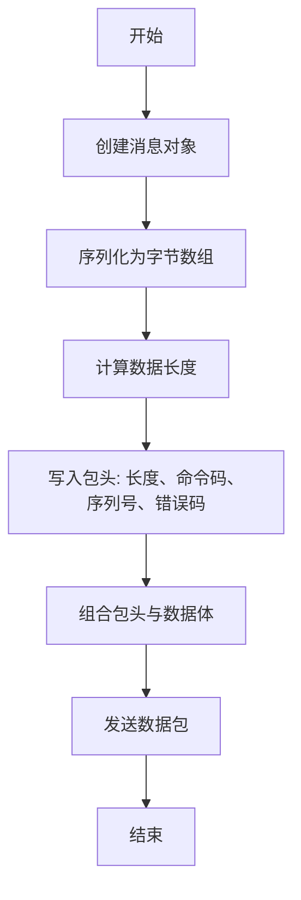
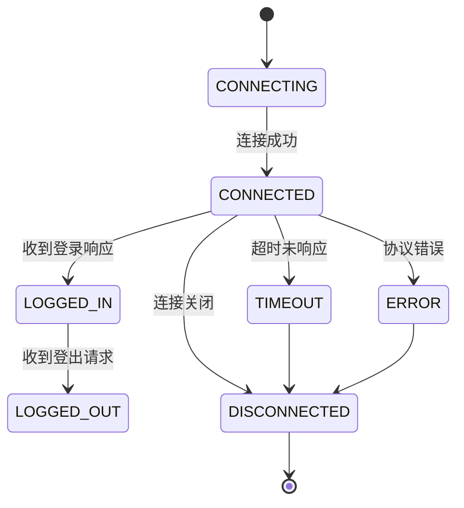

# Socket协议规范

<cite>
**本文档引用的文件**   
- [BaseProtocol.java](file://core/src/main/java/cn/game/core/net/protocol/BaseProtocol.java)
- [PbProtocol.java](file://protocol/src/main/java/cn/game/protocol/protobuf/PbProtocol.java)
- [ByteHelp.java](file://util/src/main/java/cn/game/util/ByteHelp.java)
- [Config.java](file://util/src/main/java/cn/game/util/Config.java)
- [GameClient.java](file://game/src/main/java/cn/game/games/net/client/GameClient.java)
- [Client.java](file://simulationclient/src/main/java/cn/game/simulation/client/Client.java)
- [WebSocketEncoder.java](file://game/src/main/java/cn/game/games/core/netty/WebSocketEncoder.java)
</cite>

## 目录
1. [引言](#引言)
2. [连接管理](#连接管理)
3. [数据包结构](#数据包结构)
4. [状态机管理](#状态机管理)
5. [性能调优建议](#性能调优建议)
6. [附录](#附录)

## 引言
本文档详细描述了基于TCP的Socket通信协议，涵盖连接建立与断开流程、数据包结构、状态机管理以及性能调优建议。该协议用于游戏服务器与客户端之间的通信，确保数据传输的可靠性和高效性。

## 连接管理

### 连接建立与断开
连接建立通过WebSocket握手完成，客户端发送握手请求，服务器响应后建立连接。连接断开时，客户端或服务器发送`PlayerLogoutRequest`协议包，对方回应`PlayerLogoutResponse`完成断开流程。

### 握手协议
握手过程遵循标准WebSocket协议，通过HTTP升级请求完成。客户端发送包含`Upgrade: websocket`头的HTTP请求，服务器返回`101 Switching Protocols`状态码确认升级。

### 心跳机制
心跳机制通过定期发送`PlayerHeartbeatRequest`和接收`PlayerHeartbeatResponse`来维持连接活跃。客户端每15秒发送一次心跳请求，若在超时时间内未收到响应，则认为连接已断开。

### 会话超时处理
会话超时由`lastRecvPacketTime`参数控制，当客户端在指定时间内未发送任何数据包时，服务器将主动关闭连接。超时时间可通过配置文件中的`lastRecvPacketTime`参数进行调整。

**Section sources**
- [GameClient.java](file://game/src/main/java/cn/game/games/net/client/GameClient.java#L223-L226)
- [Config.java](file://util/src/main/java/cn/game/util/Config.java#L153)

## 数据包结构

### 包头格式
数据包头部包含以下字段：
- **长度**：4字节，表示整个数据包的字节长度（大端序）
- **命令码**：4字节，标识消息类型（大端序）
- **序列号**：4字节，用于匹配请求与响应（大端序）
- **错误码**：4字节，表示操作结果状态（大端序）

### 字节序
所有多字节数值均采用**大端序**（Big-Endian）进行编码和解码，确保跨平台兼容性。

### 数据类型编码规则
- `int` 类型使用4字节表示
- `long` 类型使用8字节表示
- 字符串使用UTF-8编码
- Protobuf序列化数据直接作为二进制流传输

### 校验机制
协议未显式实现CRC32等校验机制，依赖TCP底层传输的可靠性保证数据完整性。

**Diagram sources **
- [WebSocketEncoder.java](file://game/src/main/java/cn/game/games/core/netty/WebSocketEncoder.java#L17-L28)
- [Client.java](file://simulationclient/src/main/java/cn/game/simulation/client/Client.java#L743-L752)

**Section sources**
- [BaseProtocol.java](file://core/src/main/java/cn/game/core/net/protocol/BaseProtocol.java#L5-L12)
- [ByteHelp.java](file://util/src/main/java/cn/game/util/ByteHelp.java#L85-L89)

## 状态机管理

### 连接状态
连接状态包括：
- **CONNECTING**：正在连接
- **CONNECTED**：已连接
- **DISCONNECTED**：已断开

状态转换由Netty框架的`ChannelFuture`监听器自动管理。

### 会话状态
会话状态包括：
- **INITIALIZING**：初始化阶段
- **LOGGED_IN**：已登录
- **LOGGED_OUT**：已登出

客户端通过`PlayerLoginRequest`进入`LOGGED_IN`状态，通过`PlayerLogoutRequest`进入`LOGGED_OUT`状态。

### 异常状态
异常状态包括：
- **TIMEOUT**：通信超时
- **ERROR**：协议解析错误
- **CLOSED**：连接被强制关闭

异常发生时，系统记录日志并尝试重连或通知用户。

**Diagram sources **
- [GameClient.java](file://game/src/main/java/cn/game/games/net/client/GameClient.java#L223-L226)
- [Client.java](file://simulationclient/src/main/java/cn/game/simulation/client/Client.java#L846-L859)

**Section sources**
- [GameClient.java](file://game/src/main/java/cn/game/games/net/client/GameClient.java#L223-L226)
- [Client.java](file://simulationclient/src/main/java/cn/game/simulation/client/Client.java#L846-L859)

## 性能调优建议

### TCP_NODELAY配置
启用`TCP_NODELAY`选项以禁用Nagle算法，减少小数据包的延迟，适用于实时性要求高的场景。

### 连接池大小设置
根据并发用户数合理设置连接池大小，避免资源耗尽。建议初始值为1024，可根据实际负载动态调整。

### 网络异常重试策略
实现指数退避重试机制，初始重试间隔为1.5秒，最大重试次数为3次。对于可重试异常（如网络超时），自动进行重试；对于不可重试异常（如认证失败），立即返回错误。

**Section sources**
- [Config.java](file://util/src/main/java/cn/game/util/Config.java#L147-L149)
- [redisson.yaml](file://util/src/main/resources/redisson.yaml#L10-L11)

## 附录

### 常见命令码列表
| 命令码名称 | 值 | 说明 |
| --- | --- | --- |
| PlayerLoginRequest | 0x01000001 | 玩家登录请求 |
| PlayerLoginResponse | 0x01000002 | 玩家登录响应 |
| PlayerLogoutRequest | 0x01000003 | 玩家登出请求 |
| PlayerLogoutResponse | 0x01000004 | 玩家登出响应 |
| PlayerHeartbeatRequest | 0x01000005 | 心跳请求 |
| PlayerHeartbeatResponse | 0x01000006 | 心跳响应 |

**Section sources**
- [PbProtocol.java](file://protocol/src/main/java/cn/game/protocol/protobuf/PbProtocol.java#L527-L547)