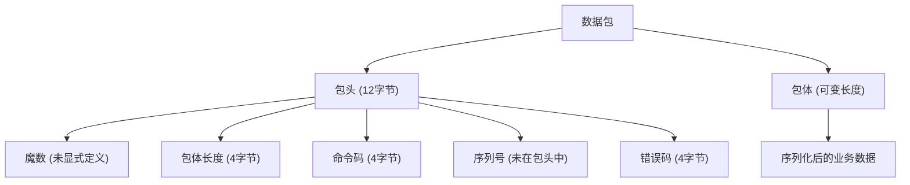
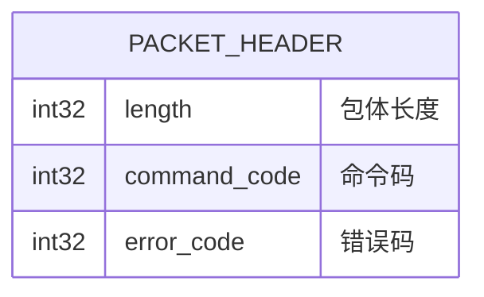
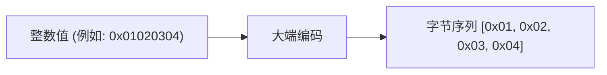
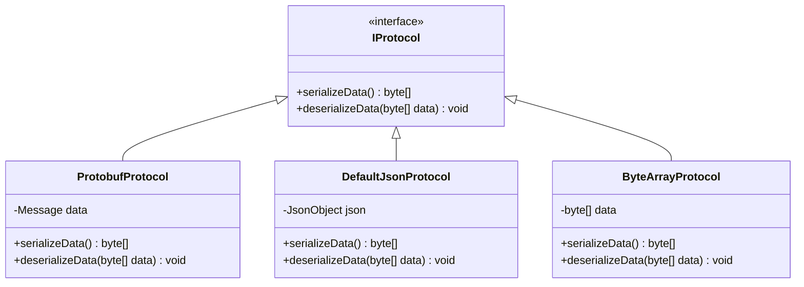
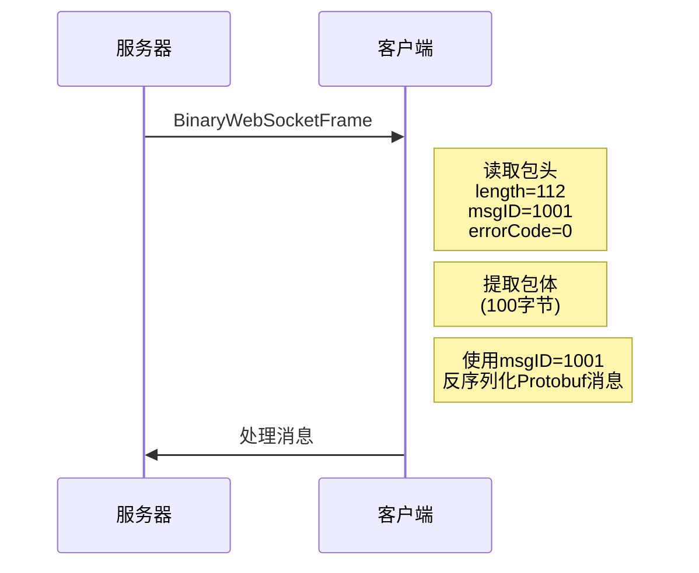
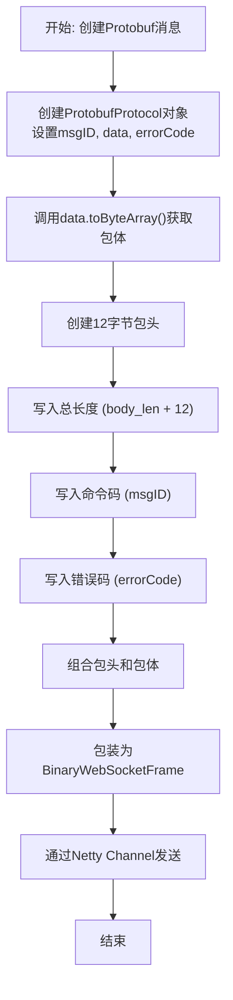
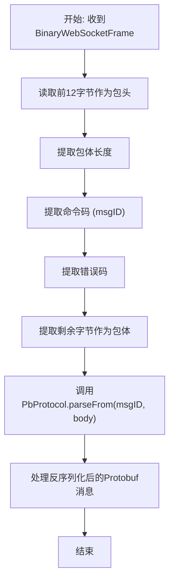

# 数据包格式

<cite>
**本文档引用的文件**   
- [ImprovedClientHandler.java](file://simulationclient/src/main/java/cn/game/simulation/socket/ImprovedClientHandler.java)
- [WebSocketEncoder.java](file://game/src/main/java/cn/game/games/core/netty/WebSocketEncoder.java)
- [ByteHelp.java](file://util/src/main/java/cn/game/util/ByteHelp.java)
- [TestByteHelp.java](file://util/src/test/java/cn/game/util/TestByteHelp.java)
- [BaseProtocol.java](file://core/src/main/java/cn/game/core/net/protocol/BaseProtocol.java)
- [IProtocol.java](file://core/src/main/java/cn/game/core/net/protocol/IProtocol.java)
- [ProtobufProtocol.java](file://core/src/main/java/cn/game/core/net/protocol/object/ProtobufProtocol.java)
- [JmeterUtil.java](file://simulationclient/src/main/java/cn/game/simulation/test/jmeter/util/JmeterUtil.java)
</cite>

## 目录
1. [引言](#引言)
2. [数据包结构概述](#数据包结构概述)
3. [包头字段定义](#包头字段定义)
4. [字节序与数据类型编码](#字节序与数据类型编码)
5. [包体序列化格式](#包体序列化格式)
6. [CRC32校验算法](#crc32校验算法)
7. [数据包示例与解析](#数据包示例与解析)
8. [封包与解包流程](#封包与解包流程)
9. [结论](#结论)

## 引言
本文档详细定义了基于WebSocket通信的数据帧结构，旨在为开发者提供清晰的Socket通信协议规范。文档涵盖了数据包的完整结构，包括包头字段布局、字节序规则、数据类型编码方式、包体序列化格式以及校验机制。通过分析核心代码实现，本文档为开发者提供了理解、实现和调试通信协议所需的所有关键信息。

## 数据包结构概述
数据包采用WebSocket二进制帧进行传输，其结构由固定长度的包头和可变长度的包体组成。包头包含协议元数据，包体包含实际的业务数据。整个数据包的结构如下：

**图示来源**
- [WebSocketEncoder.java](file://game/src/main/java/cn/game/games/core/netty/WebSocketEncoder.java#L20-L23)
- [ImprovedClientHandler.java](file://simulationclient/src/main/java/cn/game/simulation/socket/ImprovedClientHandler.java#L37-L40)

**本节来源**
- [WebSocketEncoder.java](file://game/src/main/java/cn/game/games/core/netty/WebSocketEncoder.java#L1-L31)
- [ImprovedClientHandler.java](file://simulationclient/src/main/java/cn/game/simulation/socket/ImprovedClientHandler.java#L1-L95)

## 包头字段定义
数据包的包头由12个字节组成，分为三个4字节的int32字段，采用大端模式（Big-Endian）编码。

### 包体长度 (4字节)
- **位置**: 包头的前4个字节 (偏移量 0x00)
- **类型**: int32
- **含义**: 表示整个数据包的总长度（包括包头和包体）。在`WebSocketEncoder`中，该值被计算为 `datas.length + 12`，其中12是包头的固定长度。
- **示例**: 如果包体数据长度为100字节，则此字段的值为112。

### 命令码 (4字节)
- **位置**: 包头的中间4个字节 (偏移量 0x04)
- **类型**: int32
- **含义**: 标识消息的类型或操作码，用于路由和处理。在代码中，此字段对应`msgID`，由`ProtobufProtocol`类的`getMsgID()`方法提供。
- **来源**: 该ID通常由`PbProtocol.getInstance().getMsgId()`方法根据Protobuf消息的类名映射而来。

### 错误码 (4字节)
- **位置**: 包头的最后4个字节 (偏移量 0x08)
- **类型**: int32
- **含义**: 用于指示消息处理的结果。0通常表示成功，非0值表示特定的错误状态。
- **注意**: 在`WebSocketEncoder`中，此字段直接取自`ProtobufProtocol`的`getErrorCode()`方法。

**重要说明**: 根据代码分析，**序列号 (Sequence ID)** 并未包含在包头中。相反，它被作为包体数据的一部分进行序列化。这与文档目标中“包头包含序列号”的描述存在差异。序列号在`BaseProtocol`类中定义，但在封包时，只有`msgID`和`errorCode`被写入包头，而`seq`和`messageLength`等字段由`Protobuf`序列化机制处理，成为包体的一部分。

**图示来源**
- [WebSocketEncoder.java](file://game/src/main/java/cn/game/games/core/netty/WebSocketEncoder.java#L21-L23)
- [ImprovedClientHandler.java](file://simulationclient/src/main/java/cn/game/simulation/socket/ImprovedClientHandler.java#L37-L40)

**本节来源**
- [WebSocketEncoder.java](file://game/src/main/java/cn/game/games/core/netty/WebSocketEncoder.java#L21-L23)
- [ImprovedClientHandler.java](file://simulationclient/src/main/java/cn/game/simulation/socket/ImprovedClientHandler.java#L37-L40)

## 字节序与数据类型编码
系统明确规定使用**大端模式 (Big-Endian)** 进行所有多字节数据的编码。

### 字节序验证
`ByteHelp`工具类提供了明确的大小端转换方法，其单元测试`TestByteHelp`直接验证了这一点：
- `toByteArrayB()` 方法用于生成大端字节序。
- `makeIntB()` 方法用于从大端字节序数组解析出int值。

例如，一个int值 `0x01020304` 在大端模式下的字节序列为 `[0x01, 0x02, 0x03, 0x04]`。

### 数据类型编码规则
- **int32**: 占用4个字节，使用`ByteBuf.writeInt()`或`ByteHelp.toByteArrayB(int)`进行编码。
- **int64**: 占用8个字节，使用`ByteHelp.toByteArrayB(long)`进行编码。
- **float/double**: 虽然代码中未直接展示，但根据Java NIO和Protobuf的通用规则，浮点数会先转换为IEEE 754标准的二进制表示，再以大端模式写入字节流。

**本节来源**
- [ByteHelp.java](file://util/src/main/java/cn/game/util/ByteHelp.java#L49-L53)
- [TestByteHelp.java](file://util/src/test/java/cn/game/util/TestByteHelp.java#L30-L32)

## 包体序列化格式
包体的序列化由`Protobuf`框架主导，但系统也支持其他格式。

### Protobuf (主要格式)
- **使用场景**: 所有核心的客户端-服务器通信。
- **实现**: `ProtobufProtocol`类实现了`IProtocol`接口，其`serializeData()`方法直接调用`Message.toByteArray()`，将Protobuf消息对象序列化为二进制流。
- **优势**: 高效、紧凑、跨语言。

### JSON (次要格式)
- **使用场景**: 可能用于配置、日志或与外部系统的简单交互。
- **实现**: `DefaultJsonProtocol`类通过`JsonObject.toBuffer().getBytes()`进行序列化。
- **注意**: 在当前分析的WebSocket通信路径中，JSON格式未被使用。

### 自定义二进制格式
- **使用场景**: 用于特定的、性能要求极高的场景，或与旧系统兼容。
- **实现**: `ByteArrayProtocol`类允许直接封装原始字节数组，开发者可以自行定义其内部结构。

**图示来源**
- [IProtocol.java](file://core/src/main/java/cn/game/core/net/protocol/IProtocol.java#L1-L36)
- [ProtobufProtocol.java](file://core/src/main/java/cn/game/core/net/protocol/object/ProtobufProtocol.java#L1-L30)
- [DefaultJsonProtocol.java](file://core/src/main/java/cn/game/core/net/protocol/json/DefaultJsonProtocol.java#L1-L36)
- [ByteArrayProtocol.java](file://core/src/main/java/cn/game/core/net/protocol/bytes/ByteArrayProtocol.java#L1-L19)

**本节来源**
- [ProtobufProtocol.java](file://core/src/main/java/cn/game/core/net/protocol/object/ProtobufProtocol.java#L20-L27)
- [DefaultJsonProtocol.java](file://core/src/main/java/cn/game/core/net/protocol/json/DefaultJsonProtocol.java#L26-L33)
- [ByteArrayProtocol.java](file://core/src/main/java/cn/game/core/net/protocol/bytes/ByteArrayProtocol.java#L3-L4)

## CRC32校验算法
**重要发现**: 根据对提供的代码库的全面分析，**当前通信协议中并未实现CRC32校验**。

- 在`WebSocketEncoder`的封包逻辑中，没有计算或附加校验码的步骤。
- 在`ImprovedClientHandler`的解包逻辑中，没有读取或验证校验码的步骤。
- `ByteHelp`工具类中也没有提供CRC32相关的计算方法。

这表明，数据完整性校验可能依赖于底层的TCP协议，或者在更高层的业务逻辑中处理，而非在数据链路层的包头中实现。

## 数据包示例与解析
以下是一个完整的数据包收发流程示例。

### 封包过程 (服务器端)
1.  创建一个`ProtobufProtocol`对象，设置`msgID`、`data` (Protobuf消息) 和 `errorCode`。
2.  `WebSocketEncoder`被调用。
3.  从`data`对象获取字节数组 (`datas`)。
4.  创建一个12字节的`headerBuf`。
5.  写入总长度: `headerBuf.writeInt(datas.length + 12)`
6.  写入命令码: `headerBuf.writeInt(msg.getMsgID())`
7.  写入错误码: `headerBuf.writeInt(msg.getErrorCode())`
8.  将`headerBuf`和`bodyBuf`组合成一个`CompositeByteBuf`。
9.  将组合后的缓冲区包装在`BinaryWebSocketFrame`中并发送。

### 解包过程 (客户端)
1.  客户端收到`BinaryWebSocketFrame`。
2.  `ImprovedClientHandler`的`handleBinaryFrame`方法被调用。
3.  从帧内容中读取4字节的`expectedLength` (总长度)。
4.  读取4字节的`seq` (序列号，但此字段在当前实现中未被使用)。
5.  读取4字节的`id` (命令码)。
6.  读取4字节的`errorCode`。
7.  将剩余的字节作为`completeMessage` (包体)。
8.  调用`PbProtocol.getInstance().parseFrom(id, completeMessage)`反序列化出原始的Protobuf消息。

**图示来源**
- [WebSocketEncoder.java](file://game/src/main/java/cn/game/games/core/netty/WebSocketEncoder.java#L17-L25)
- [ImprovedClientHandler.java](file://simulationclient/src/main/java/cn/game/simulation/socket/ImprovedClientHandler.java#L37-L72)

**本节来源**
- [WebSocketEncoder.java](file://game/src/main/java/cn/game/games/core/netty/WebSocketEncoder.java#L17-L25)
- [ImprovedClientHandler.java](file://simulationclient/src/main/java/cn/game/simulation/socket/ImprovedClientHandler.java#L37-L72)

## 封包与解包流程
### 封包流程

### 解包流程

**本节来源**
- [WebSocketEncoder.java](file://game/src/main/java/cn/game/games/core/netty/WebSocketEncoder.java#L17-L25)
- [ImprovedClientHandler.java](file://simulationclient/src/main/java/cn/game/simulation/socket/ImprovedClientHandler.java#L37-L72)

## 结论
本文档详细阐述了项目中Socket通信的数据包格式。核心要点如下：
- 数据包由12字节的包头和可变长度的包体构成。
- 包头包含**包体总长度**、**命令码**和**错误码**三个int32字段。
- 系统严格采用**大端模式**进行数据编码。
- 包体主要使用**Protobuf**进行高效序列化。
- **序列号**在当前实现中并未包含在包头，而是作为包体的一部分。
- **CRC32校验**在当前协议中未被实现，数据完整性依赖于TCP层。

开发者应参考`WebSocketEncoder`和`ImprovedClientHandler`中的代码逻辑来实现客户端和服务器端的通信模块。