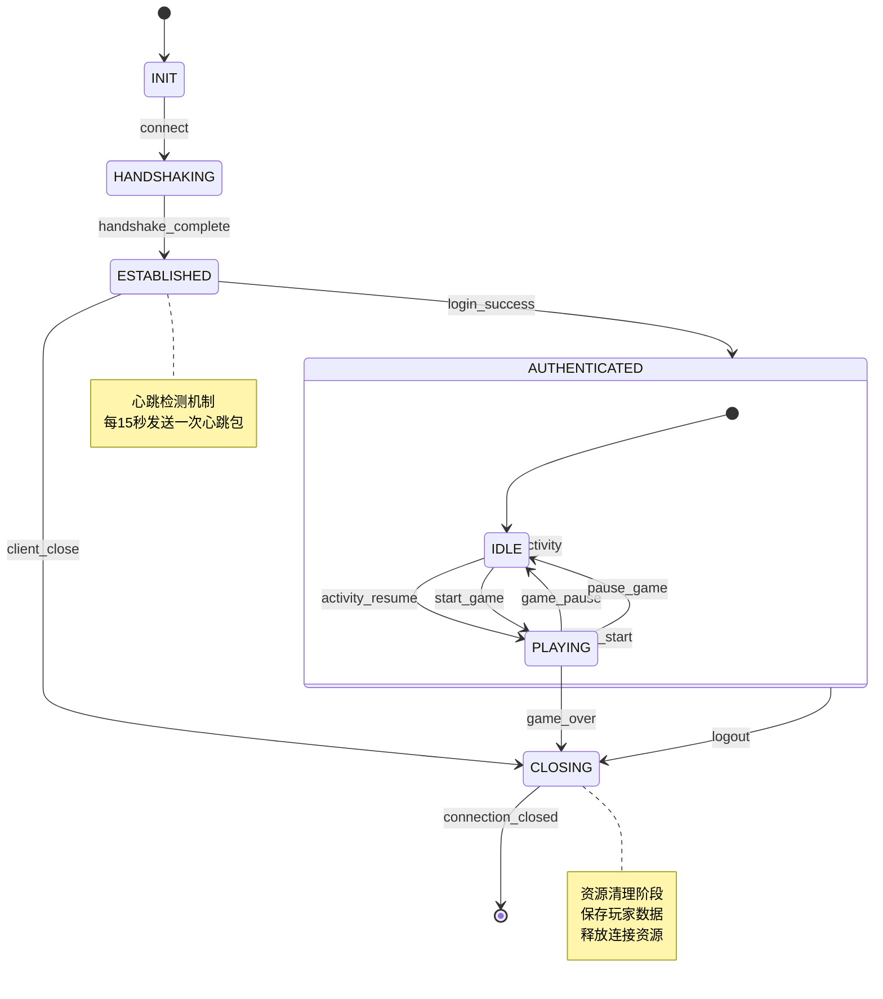
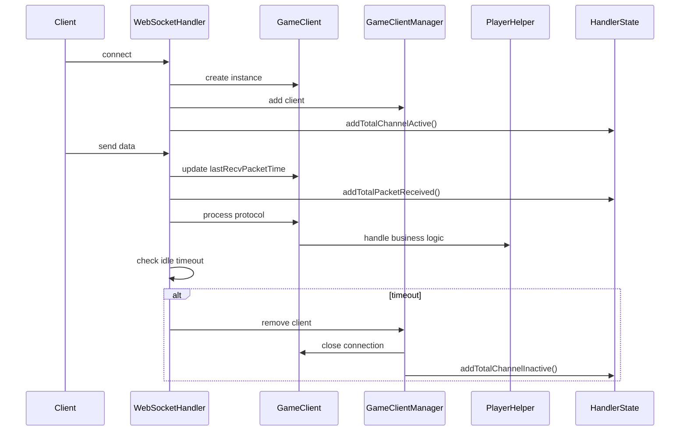

# 状态机管理

<cite>
**本文档引用的文件**  
- [GameClient.java](file://game/src/main/java/cn/game/games/net/client/GameClient.java)
- [WebSocketHandler.java](file://game/src/main/java/cn/game/games/core/netty/WebSocketHandler.java)
- [WebSocketServerInitializer.java](file://game/src/main/java/cn/game/games/core/netty/WebSocketServerInitializer.java)
- [HandlerState.java](file://game/src/main/java/cn/game/games/core/netty/HandlerState.java)
- [GameClientManager.java](file://game/src/main/java/cn/game/games/net/game/manager/GameClientManager.java)
- [PlayerHelper.java](file://game/src/main/java/cn/game/games/net/game/helper/PlayerHelper.java)
- [AI.md](file://AI.md)
</cite>

## 目录
1. [引言](#引言)
2. [连接状态管理](#连接状态管理)
3. [会话状态管理](#会话状态管理)
4. [状态转换机制](#状态转换机制)
5. [状态异常处理](#状态异常处理)
6. [状态转换图](#状态转换图)
7. [核心实现与监听机制](#核心实现与监听机制)
8. [总结](#总结)

## 引言

本文档系统描述了游戏服务器中Socket通信的状态机管理机制。文档详细定义了连接状态和会话状态的枚举值、转换条件以及触发事件，涵盖了网络事件（如connect、read、write、close）和业务事件（如login、logout）。同时，文档化了状态异常处理流程，包括超时、断线重连和状态不一致的恢复策略，并提供了清晰的状态转换图和核心实现示例。

**Section sources**
- [AI.md](file://AI.md#L192-L216)

## 连接状态管理

在Socket通信中，连接状态管理是确保通信稳定性的关键。系统通过`GameClient`类中的`GameClientState`枚举来管理客户端的连接状态。

### 连接状态枚举

`GameClientState`枚举定义了以下状态：
- **CONNECTED**：连接已建立
- **OFFCONNECTED**：连接已断开
- **AUTHED**：已授权
- **IN_GAME**：游戏中
- **MANAGER**：管理
- **LOGOUT**：退出

这些状态通过`GameClient`类的`state`字段进行管理，并在连接的不同阶段进行状态转换。

### 连接状态转换

连接状态的转换主要由网络事件触发：
- **connect**：当客户端与服务器建立连接时，状态从初始状态转换为`CONNECTED`
- **read**：当服务器成功读取客户端数据时，更新最后接收数据包的时间
- **write**：当服务器向客户端发送数据时，记录发送的数据包
- **close**：当连接关闭时，状态转换为`OFFCONNECTED`

**Section sources**
- [GameClient.java](file://game/src/main/java/cn/game/games/net/client/GameClient.java#L94-L96)

## 会话状态管理

会话状态管理关注于用户在游戏中的活动状态，通过事件系统来驱动状态转换。

### 会话状态事件

系统通过`EventTypeEnum`定义了多种会话状态事件：
- **玩家生命周期事件**：`PLAYER_INIT`（创建新玩家）、`PLAYER_CREATE`（创建新玩家）、`LoginStart`（开始登录）、`LoginFinish`（登录完成）、`Relogin`（客户端重新登录）、`Reconnect`（重连）、`LoginSuccess`（登录成功）
- **时间事件**：`NewDay5`（早5点跨天）、`NewDay`（晚12点跨天）、`NewWeek`（跨周）、`NewMonth`（跨月）
- **业务事件**：`Charge`（充值）、`FuncOpen`（功能开启）、`ResourceAdd`（新增资源）、`ResourceRemove`（移除资源）、`LevelUp`（升级）、`Level`（通关关卡）

### 会话状态转换

会话状态的转换主要由业务事件触发：
- **login**：当用户成功登录时，触发`LoginSuccess`事件，将用户状态设置为已认证
- **logout**：当用户退出游戏时，触发`Logout`事件，清理用户数据并关闭连接

**Section sources**
- [AI.md](file://AI.md#L194-L200)

## 状态转换机制

状态转换机制是状态机管理的核心，通过事件驱动的方式实现状态的平滑转换。

### 状态转换触发事件

状态转换由以下两类事件触发：
- **网络事件**：包括connect、read、write、close等底层网络操作
- **业务事件**：包括login、logout、reconnect等与用户操作相关的事件

### 状态转换条件

状态转换需要满足特定的条件：
- **连接有效性**：在进行状态转换前，需要检查连接是否仍然有效
- **数据一致性**：确保状态转换时数据的一致性，避免出现脏数据
- **并发控制**：在多线程环境下，需要使用适当的同步机制保证状态转换的原子性

**Section sources**
- [GameClient.java](file://game/src/main/java/cn/game/games/net/client/GameClient.java#L223-L226)
- [PlayerHelper.java](file://game/src/main/java/cn/game/games/net/game/helper/PlayerHelper.java#L1292-L1335)

## 状态异常处理

状态异常处理是确保系统稳定性的关键环节，主要包括超时处理、断线重连和状态不一致恢复。

### 超时处理

系统通过`isIdleTimeOut`方法检测连接是否超时：
```java
public boolean isIdleTimeOut(long timeOut) {
    long time = System.currentTimeMillis() - lastRecvPacketTime - timeOut;
    return time > 0;
}
```
当连接空闲时间超过指定阈值时，系统会自动关闭连接并清理相关资源。

### 断线重连

断线重连机制通过`reconnect`方法实现：
- 检查是否存在旧的`GameClient`实例
- 如果存在且与新实例不同，则移除旧实例
- 将新实例添加到客户端管理器中
- 触发相应的事件（`Reconnect`或`Relogin`）

### 状态不一致恢复

当检测到状态不一致时，系统会：
- 记录异常日志
- 尝试恢复到一致状态
- 如果无法恢复，则关闭连接并通知用户

**Section sources**
- [GameClient.java](file://game/src/main/java/cn/game/games/net/client/GameClient.java#L223-L226)
- [PlayerHelper.java](file://game/src/main/java/cn/game/games/net/game/helper/PlayerHelper.java#L1292-L1335)
- [GameClientManager.java](file://game/src/main/java/cn/game/games/net/game/manager/GameClientManager.java#L158-L160)

## 状态转换图



**Diagram sources**
- [GameClient.java](file://game/src/main/java/cn/game/games/net/client/GameClient.java#L94-L96)
- [WebSocketHandler.java](file://game/src/main/java/cn/game/games/core/netty/WebSocketHandler.java#L51-L86)

## 核心实现与监听机制

### 核心状态管理类

系统通过`HandlerState`类管理连接的统计信息：
- 接收数据包总数
- 发送数据包总数
- 异常总数
- 读取空闲超时次数
- 写出空闲超时次数

这些统计信息通过`HandlerStateMBean`接口暴露，便于监控和管理。

### 状态监听机制

状态监听通过以下方式实现：
- **Netty事件监听**：`WebSocketHandler`监听`IdleStateEvent`等网络事件
- **业务事件总线**：通过`ServerEventBus`分发业务事件
- **MBean注册**：将状态信息注册为MBean，便于JMX监控

### 状态管理流程

1. 客户端连接时，创建`GameClient`实例
2. 通过`WebSocketHandler`处理网络事件
3. 状态变更时更新`HandlerState`统计信息
4. 通过`GameClientManager`管理客户端生命周期
5. 异常发生时执行相应的恢复策略



**Diagram sources**
- [WebSocketHandler.java](file://game/src/main/java/cn/game/games/core/netty/WebSocketHandler.java#L51-L86)
- [GameClient.java](file://game/src/main/java/cn/game/games/net/client/GameClient.java#L223-L226)
- [GameClientManager.java](file://game/src/main/java/cn/game/games/net/game/manager/GameClientManager.java#L70-L90)
- [HandlerState.java](file://game/src/main/java/cn/game/games/core/netty/HandlerState.java#L86-L89)

**Section sources**
- [WebSocketHandler.java](file://game/src/main/java/cn/game/games/core/netty/WebSocketHandler.java#L51-L86)
- [HandlerState.java](file://game/src/main/java/cn/game/games/core/netty/HandlerState.java#L86-L89)
- [WebSocketServerInitializer.java](file://game/src/main/java/cn/game/games/core/netty/WebSocketServerInitializer.java#L47-L62)

## 总结

本文档系统地描述了游戏服务器中Socket通信的状态机管理机制。通过定义清晰的连接状态和会话状态，实现了对客户端连接和用户会话的精细化管理。状态转换机制采用事件驱动的方式，确保了状态转换的可靠性和可预测性。异常处理流程完善，能够有效应对超时、断线重连等常见问题。通过MBean监控和统计信息收集，为系统运维提供了有力支持。整体设计充分考虑了高并发场景下的性能和稳定性需求，为游戏服务器的稳定运行提供了保障。