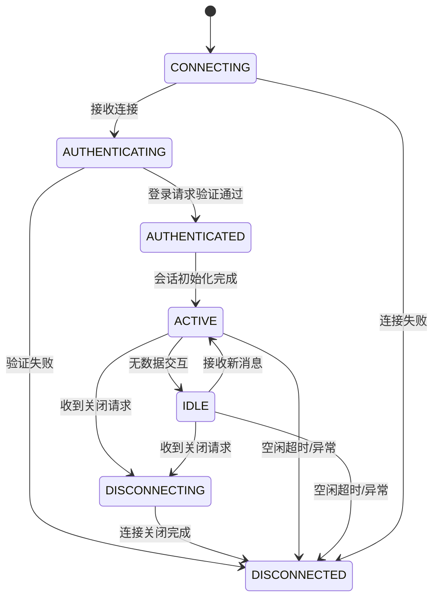
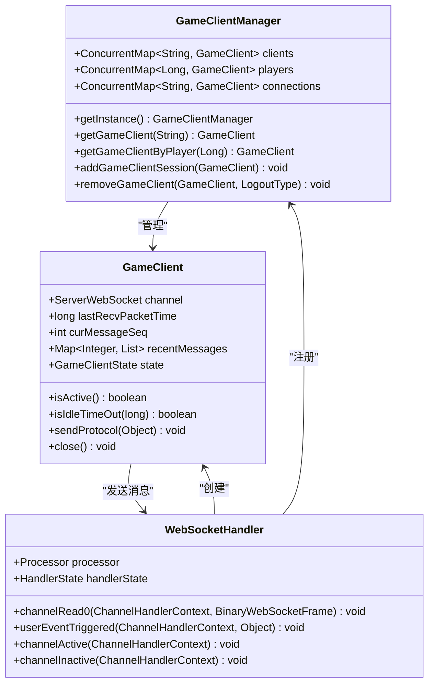

# 连接管理

<cite>
**本文档引用文件**  
- [WebSocketServer.java](file://game/src/main/java/cn/game/games/core/netty/WebSocketServer.java)
- [WebSocketServerInitializer.java](file://game/src/main/java/cn/game/games/core/netty/WebSocketServerInitializer.java)
- [WebSocketHandler.java](file://game/src/main/java/cn/game/games/core/netty/WebSocketHandler.java)
- [GameClient.java](file://game/src/main/java/cn/game/games/net/client/GameClient.java)
- [GameClientManager.java](file://game/src/main/java/cn/game/games/net/game/manager/GameClientManager.java)
- [WebSocketClientHandler.java](file://simulationclient/src/main/java/cn/game/simulation/client/handler/WebSocketClientHandler.java)
- [applicationContext-dataSource.xml](file://login/src/main/resources/spring/applicationContext-dataSource.xml)
- [redisson.yaml](file://util/src/main/resources/redisson.yaml)
- [TaskExecutionConfig.java](file://core/src/main/java/cn/game/core/execute/TaskExecutionConfig.java)
</cite>

## 目录
1. [连接生命周期管理](#连接生命周期管理)
2. [连接建立流程](#连接建立流程)
3. [心跳机制实现](#心跳机制实现)
4. [连接断开处理](#连接断开处理)
5. [连接状态转换图](#连接状态转换图)
6. [连接池配置参数](#连接池配置参数)
7. [连接管理器核心实现](#连接管理器核心实现)

## 连接生命周期管理

Socket连接的生命周期管理是系统稳定运行的核心。连接从创建到销毁经历多个状态，包括连接建立、认证、会话初始化、活跃通信、空闲检测、心跳维护和最终断开。系统通过Netty框架实现WebSocket连接管理，结合Vert.x进行异步处理，确保高并发场景下的连接稳定性。

连接生命周期的关键管理点包括：
- 连接建立时的三次握手与WebSocket协议升级
- 自定义握手协议的客户端认证流程
- 会话初始化与连接注册
- 心跳机制维护连接活跃状态
- 空闲超时检测与异常断开处理
- 正常关闭流程与资源释放

**本文档引用文件**  
- [WebSocketServer.java](file://game/src/main/java/cn/game/games/core/netty/WebSocketServer.java)
- [WebSocketServerInitializer.java](file://game/src/main/java/cn/game/games/core/netty/WebSocketServerInitializer.java)
- [WebSocketHandler.java](file://game/src/main/java/cn/game/games/core/netty/WebSocketHandler.java)

## 连接建立流程

连接建立过程包含TCP三次握手和WebSocket协议升级，随后执行自定义握手协议完成客户端认证和会话初始化。

### TCP连接与WebSocket升级

当客户端发起连接请求时，首先完成TCP三次握手建立基础连接。服务器端通过WebSocketServer组件监听指定端口，接收连接请求。WebSocketServerInitializer负责配置连接管道，添加必要的处理器：

1. SSL上下文处理（可选）
2. HTTP编解码器（HttpServerCodec）
3. HTTP对象聚合器（HttpObjectAggregator）
4. 空闲状态检测处理器（IdleStateHandler）
5. WebSocket协议处理器（WebSocketServerProtocolHandler）
6. 自定义消息处理器（WebSocketHandler）

### 自定义握手协议交互

在WebSocket连接建立后，系统执行自定义握手协议完成客户端认证：

1. **连接初始化**：WebSocketHandler在channelActive事件中记录连接激活，更新连接统计
2. **登录请求验证**：客户端必须首先发送登录请求（PlayerLoginRequest），否则连接将被拒绝
3. **会话创建**：验证通过后创建GameClient会话对象，关联连接通道
4. **连接注册**：将新创建的GameClient注册到GameClientManager的会话映射中

连接建立过程中，系统通过AttributeKey机制在Netty通道中存储客户端会话信息，确保后续消息处理时能够快速定位对应的客户端实例。

**本文档引用文件**  
- [WebSocketServerInitializer.java](file://game/src/main/java/cn/game/games/core/netty/WebSocketServerInitializer.java)
- [WebSocketHandler.java](file://game/src/main/java/cn/game/games/core/netty/WebSocketHandler.java)
- [GameClient.java](file://game/src/main/java/cn/game/games/net/client/GameClient.java)

## 心跳机制实现

心跳机制是维持长连接稳定性的关键，系统通过客户端和服务端协同工作实现连接健康检测。

### 心跳包发送间隔

客户端负责定期发送心跳包，发送间隔配置为15秒。在模拟客户端实现中，heartbeat方法检查距离上次心跳时间是否超过15秒，若是则发送PlayerHeartbeatRequest消息：

```java
if (currentTime - lastHeartbeatTime > 15000) {
    sendWsPack(PlayerHeartbeatRequest_01000005.getDefaultInstance());
    lastHeartbeatTime = currentTime;
}
```

### 超时判定规则

服务端通过IdleStateHandler实现空闲超时检测，配置读写空闲超时均为120秒：

```java
pipeline.addLast(new IdleStateHandler(120, 120, 120, TimeUnit.SECONDS));
```

当检测到读空闲事件时，服务端主动关闭连接：

```java
@Override
public void userEventTriggered(ChannelHandlerContext ctx, Object evt) throws Exception {
    if (evt instanceof IdleStateEvent) {
        ctx.close();
    } else {
        super.userEventTriggered(ctx, evt);
    }
}
```

### 异常断开处理

异常断开处理包括：
- **连接异常**：在exceptionCaught事件中记录异常并关闭连接
- **通道非活跃**：在channelInactive事件中更新连接统计
- **资源清理**：确保连接断开后相关资源被正确释放

系统通过HandlerState组件统计各类连接事件，包括接收/发送消息数、异常数、空闲超时次数等，为监控和诊断提供数据支持。

**本文档引用文件**  
- [WebSocketHandler.java](file://game/src/main/java/cn/game/games/core/netty/WebSocketHandler.java)
- [Client.java](file://simulationclient/src/main/java/cn/game/simulation/client/Client.java)
- [HandlerState.java](file://game/src/main/java/cn/game/games/core/netty/HandlerState.java)

## 连接断开处理

连接断开分为正常关闭和异常中断两种情况，系统采用不同的处理策略确保数据一致性和资源回收。

### 正常关闭流程

正常关闭流程由客户端或服务端主动发起：

1. **关闭请求**：调用GameClient的close方法
2. **连接注销**：从GameClientManager的会话映射中移除
3. **资源释放**：清理与连接相关的内存数据
4. **状态更新**：记录连接断开日志

```java
@Override
public void close() {
    channel.close().onSuccess(r -> {
        log.info("client[{}] close success", this);
    }).onFailure(e -> {
        log.info("client[{" + this + "}] close fail", e);
    });
}
```

### 异常中断处理

异常中断可能由网络故障、客户端崩溃或超时引起，处理策略包括：

1. **连接检测**：通过isActive方法检查连接状态
2. **自动清理**：在channelInactive事件中执行清理逻辑
3. **会话恢复**：支持断线重连时的会话恢复

系统通过removeAbandoned功能检测并清理异常连接，配置超时时间为1800秒（30分钟）：

```xml
<property name="removeAbandoned" value="true" />
<property name="removeAbandonedTimeout" value="1800" />
```

**本文档引用文件**  
- [GameClient.java](file://game/src/main/java/cn/game/games/net/client/GameClient.java)
- [GameClientManager.java](file://game/src/main/java/cn/game/games/net/game/manager/GameClientManager.java)
- [applicationContext-dataSource.xml](file://login/src/main/resources/spring/applicationContext-dataSource.xml)

## 连接状态转换图



**图示来源**  
- [WebSocketHandler.java](file://game/src/main/java/cn/game/games/core/netty/WebSocketHandler.java)
- [GameClient.java](file://game/src/main/java/cn/game/games/net/client/GameClient.java)

## 连接池配置参数

系统配置了多种连接池参数以优化性能和资源利用。

### 最大连接数

Redis连接池配置最大连接数为64：

```yaml
connectionPoolSize: 64 #设置对于master节点的连接池中连接数
```

数据库连接池通过Druid配置，最大空闲连接由maxIdleTime变量控制。

### 空闲超时时间

连接池空闲超时配置：
- Redis连接池最小空闲时间：10000毫秒
- 数据库连接池最小生存时间：由minEvictableIdleTimeMillis变量控制
- 空闲连接检测间隔：由timeBetweenEvictionRunsMillis变量控制

### 连接预热策略

系统通过以下方式实现连接预热：
- 初始化时创建最小空闲连接
- 使用连接前进行健康检查
- 定期检测和清理无效连接

```yaml
connectionMinimumIdleSize: 32
subscriptionConnectionMinimumIdleSize: 1
```

**本文档引用文件**  
- [redisson.yaml](file://util/src/main/resources/redisson.yaml)
- [applicationContext-dataSource.xml](file://login/src/main/resources/spring/applicationContext-dataSource.xml)

## 连接管理器核心实现

连接管理器的核心实现基于Netty和Vert.x框架，通过GameClientManager统一管理所有客户端连接。

### 核心组件



**图示来源**  
- [GameClientManager.java](file://game/src/main/java/cn/game/games/net/game/manager/GameClientManager.java)
- [GameClient.java](file://game/src/main/java/cn/game/games/net/client/GameClient.java)
- [WebSocketHandler.java](file://game/src/main/java/cn/game/games/core/netty/WebSocketHandler.java)

### 连接管理逻辑

连接管理器的主要职责包括：
- **会话管理**：维护sessionId、playerId和connectionId到GameClient的映射
- **连接注册**：新连接建立后注册到相应的映射表中
- **连接查找**：根据不同标识快速定位客户端会话
- **连接清理**：连接断开时从所有映射表中移除

```java
public void addGameClientSession(GameClient gameClient) {
    clients.put(gameClient.getSessionId(), gameClient);
}

public void removeGameClient(GameClient gameClient, LogoutType logoutType) {
    clients.remove(gameClient.getSessionId());
    players.remove(gameClient.getPlayerId());
    connections.remove(gameClient.getChannel().binaryHandlerID());
}
```

系统通过并发哈希表确保多线程环境下的连接操作安全，同时提供详细的日志记录便于问题排查。

**本文档引用文件**  
- [GameClientManager.java](file://game/src/main/java/cn/game/games/net/game/manager/GameClientManager.java)
- [GameClient.java](file://game/src/main/java/cn/game/games/net/client/GameClient.java)
- [WebSocketHandler.java](file://game/src/main/java/cn/game/games/core/netty/WebSocketHandler.java)