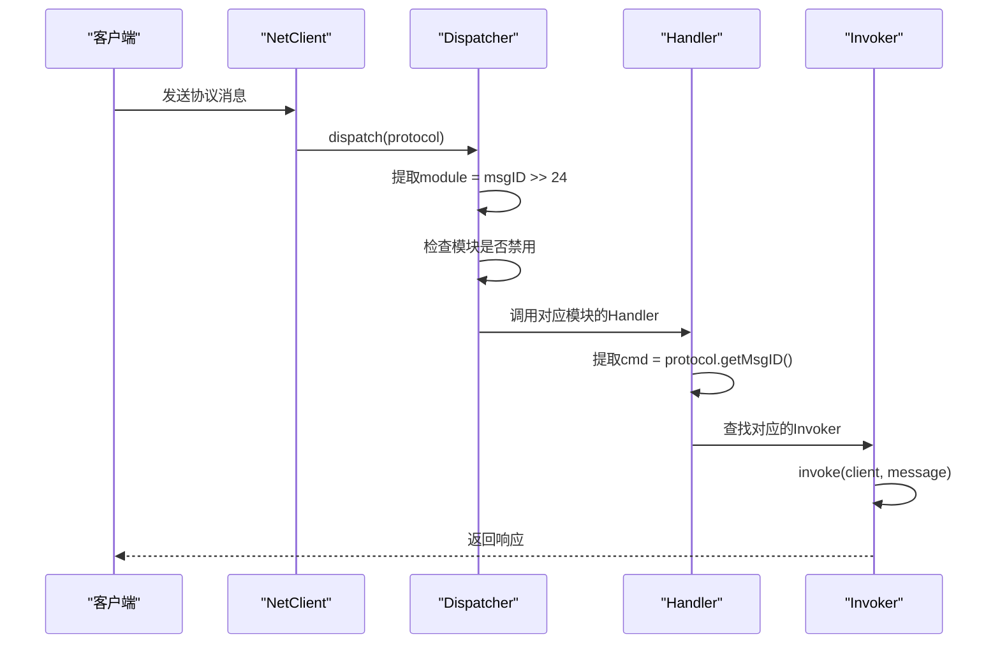
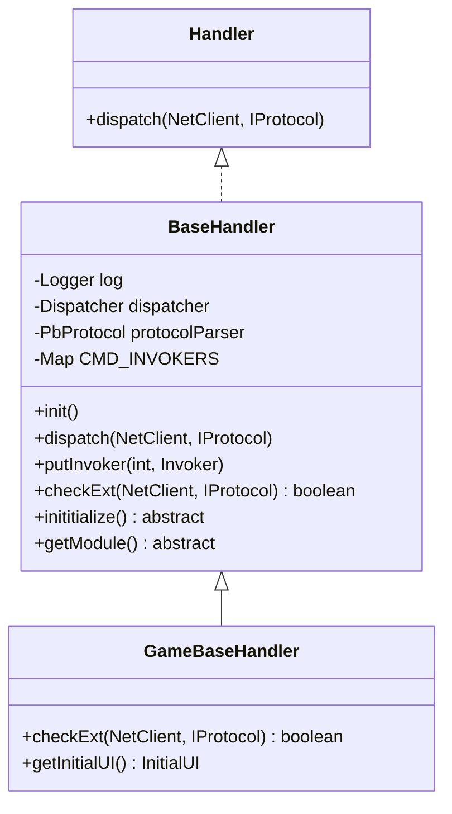
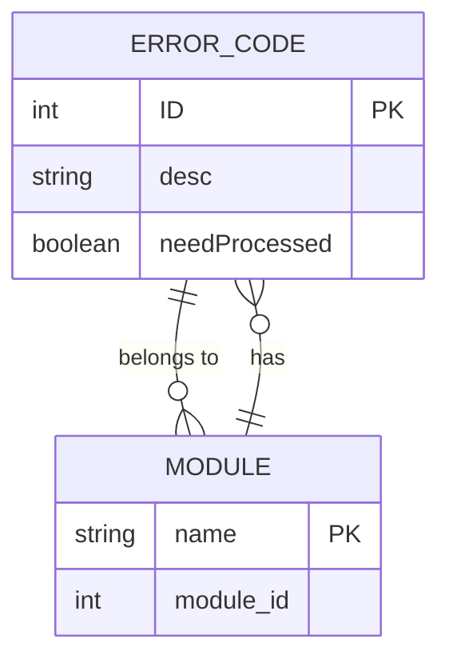
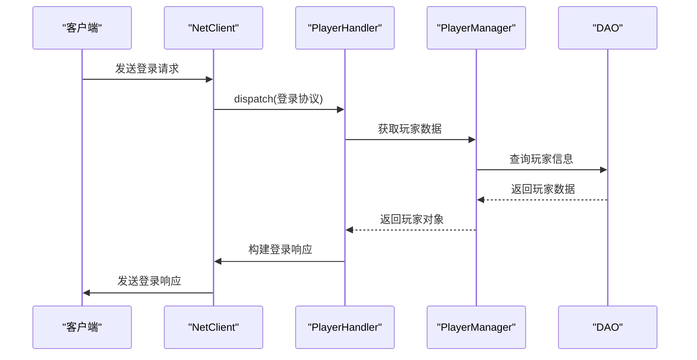
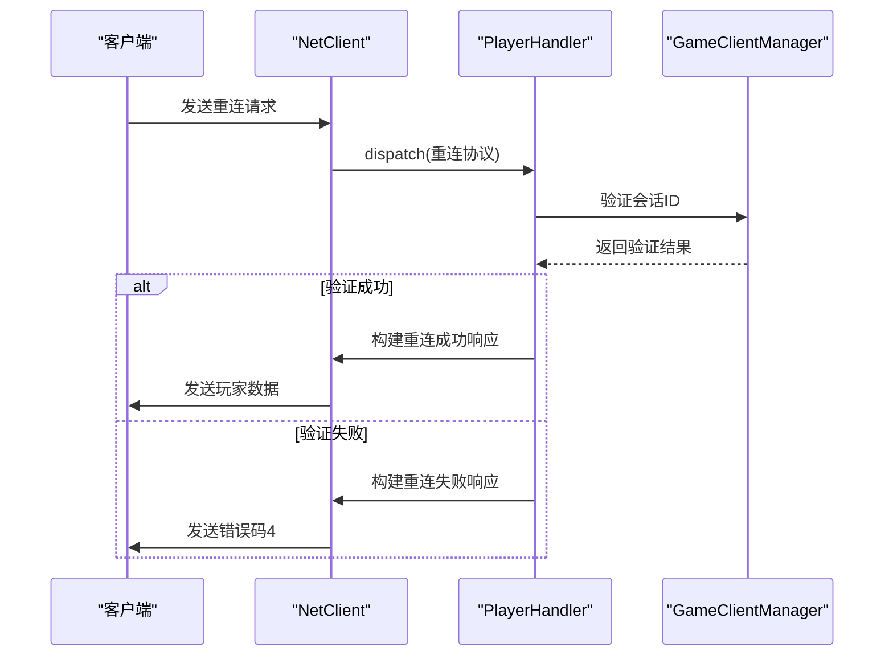
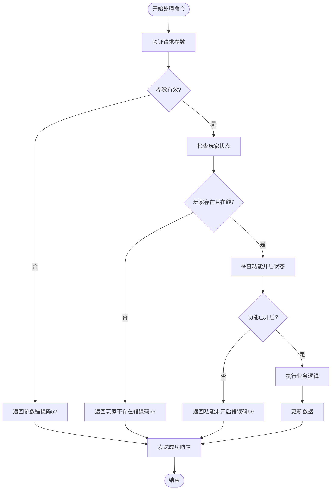

# 命令集

<cite>
**本文档引用的文件**  
- [Dispatcher.java](file://core/src/main/java/cn/game/core/net/socket/controller/Dispatcher.java)
- [DispatcherImpl.java](file://core/src/main/java/cn/game/core/net/socket/controller/DispatcherImpl.java)
- [BaseHandler.java](file://core/src/main/java/cn/game/core/net/socket/handler/BaseHandler.java)
- [Handler.java](file://core/src/main/java/cn/game/core/net/socket/handler/Handler.java)
- [Invoker.java](file://core/src/main/java/cn/game/core/net/socket/handler/Invoker.java)
- [IProtocol.java](file://core/src/main/java/cn/game/core/net/protocol/IProtocol.java)
- [PlayerHandler.java](file://game/src/main/java/cn/game/games/net/game/handler/PlayerHandler.java)
- [ErrorMsgEnum.java](file://protocol/src/main/java/cn/game/protocol/manual/ErrorMsgEnum.java)
</cite>

## 目录
1. [简介](#简介)
2. [命令路由机制](#命令路由机制)
3. [核心组件分析](#核心组件分析)
4. [命令集详细说明](#命令集详细说明)
5. [错误码定义](#错误码定义)
6. [调用时序与示例](#调用时序与示例)
7. [最佳实践](#最佳实践)

## 简介
本文档全面记录了系统中所有可用的Socket命令码及其功能。文档详细说明了每个命令的命令码值、请求/响应数据结构、调用条件和使用场景。同时，文档化了命令的路由机制，说明了Dispatcher如何根据命令码将消息分发到相应的处理器。特别关注了命令的版本管理、兼容性考虑和错误码定义，并提供了命令调用的最佳实践。

## 命令路由机制
系统采用模块化命令路由机制，通过Dispatcher将接收到的协议消息分发到相应的处理器。命令码采用32位整数，其中高8位表示模块ID，低24位表示具体命令ID。

**图示来源**
- [DispatcherImpl.java](file://core/src/main/java/cn/game/core/net/socket/controller/DispatcherImpl.java#L36-L52)
- [BaseHandler.java](file://core/src/main/java/cn/game/core/net/socket/handler/BaseHandler.java#L59-L97)

## 核心组件分析

### Dispatcher组件
Dispatcher是命令分发的核心组件，负责根据协议消息的模块ID将消息路由到相应的处理器。

**组件来源**
- [Dispatcher.java](file://core/src/main/java/cn/game/core/net/socket/controller/Dispatcher.java#L7-L13)
- [DispatcherImpl.java](file://core/src/main/java/cn/game/core/net/socket/controller/DispatcherImpl.java#L20-L52)

### Handler组件
Handler是命令处理的抽象基类，每个模块都有一个对应的Handler实现，负责注册该模块下的所有命令处理器。

**图示来源**
- [Handler.java](file://core/src/main/java/cn/game/core/net/socket/handler/Handler.java#L6-L10)
- [BaseHandler.java](file://core/src/main/java/cn/game/core/net/socket/handler/BaseHandler.java#L28-L110)
- [GameBaseHandler.java](file://game/src/main/java/cn/game/games/net/game/handler/GameBaseHandler.java#L12-L44)

### Invoker组件
Invoker是具体命令的执行器，通过函数式编程的方式将命令码与具体的处理方法绑定。

**组件来源**
- [Invoker.java](file://core/src/main/java/cn/game/core/net/socket/handler/Invoker.java#L5-L9)

## 命令集详细说明

### 玩家模块命令 (模块ID: 0x01)
玩家模块负责处理与玩家相关的所有操作，包括登录、登出、重连、信息查询等。

| 命令码 | 命令名称 | 请求消息类型 | 响应消息类型 | 功能描述 | 调用条件 |
|--------|---------|-------------|-------------|---------|---------|
| 0x01000001 | PlayerLoginRequest | PlayerLoginRequest_01000001 | PlayerLoginResponse_01000002 | 玩家登录 | 初始连接时调用 |
| 0x01000003 | PlayerLogoutRequest | PlayerLogoutRequest_01000003 | PlayerLogoutResponse_01000004 | 玩家登出 | 玩家主动断开连接 |
| 0x01000065 | PlayerReconnecRequest | PlayerReconnecRequest_01000065 | PlayerReconnecResponse_01000066 | 玩家重连 | 网络中断后重新连接 |
| 0x01000005 | PlayerHeartbeatRequest | PlayerHeartbeatRequest_01000005 | PlayerHeartbeatResponse_01000006 | 心跳检测 | 定期发送保持连接 |
| 0x01000007 | PlayerBriefInfoRequest | PlayerBriefInfoRequest_01000007 | PlayerBriefInfoResponse_01000008 | 获取玩家简要信息 | 需要查看其他玩家信息 |
| 0x01000011 | PlayerNameRequest | PlayerNameRequest_01000011 | PlayerNameResponse_01000012 | 修改玩家名称 | 玩家首次创建角色 |
| 0x01000013 | PlayerHeadRequest | PlayerHeadRequest_01000013 | PlayerHeadResponse_01000014 | 修改玩家头像 | 玩家自定义头像 |
| 0x01000015 | PlayerHeadFrameRequest | PlayerHeadFrameRequest_01000015 | PlayerHeadFrameResponse_01000016 | 修改头像框 | 玩家拥有特殊头像框 |
| 0x01000019 | PlayerImageRequest | PlayerImageRequest_01000019 | PlayerImageResponse_0100001a | 修改形象 | 玩家自定义形象 |

**组件来源**
- [PlayerHandler.java](file://game/src/main/java/cn/game/games/net/game/handler/PlayerHandler.java#L152-L190)

## 错误码定义
系统定义了统一的错误码枚举，用于标准化错误处理和客户端提示。

### 系统级错误 (1-49)
| 错误码 | 错误名称 | 描述 | 客户端处理 |
|--------|---------|------|----------|
| 0 | ok | 正常 | 无需处理 |
| 1 | unknown | 未知错误 | 显示通用错误提示 |
| 2 | module_disabled | 功能暂时不能使用 | 隐藏对应功能入口 |
| 3 | login_forbidden | 暂时不能登录 | 显示维护公告 |
| 4 | reconnect_fail | 重连失败，需要重新登录 | 引导用户重新登录 |
| 5 | need_login | 需要重新登录 | 跳转到登录界面 |
| 6 | version_mismatch | 版本不匹配 | 引导用户更新客户端 |

### 通用错误 (50-99)
| 错误码 | 错误名称 | 描述 | 处理建议 |
|--------|---------|------|----------|
| 50 | player_check_error | 玩家数据校验错误 | 检查数据完整性 |
| 51 | repeat_request | 非法的重复操作 | 防止重复提交 |
| 52 | request_parameter_error | 请求参数校验错误 | 检查参数合法性 |
| 53 | request_parameter_null | 请求参数为null | 确保参数不为空 |
| 54 | player_data_not_found | 玩家数据不存在 | 检查玩家ID有效性 |
| 55 | condition_check_error | 条件校验错误 | 检查前置条件 |
| 56 | config_data_not_found | 配置表数据找不到 | 检查配置文件 |

**组件来源**
- [ErrorMsgEnum.java](file://protocol/src/main/java/cn/game/protocol/manual/ErrorMsgEnum.java#L6-L211)

## 调用时序与示例

### 登录流程时序图

**图示来源**
- [PlayerHandler.java](file://game/src/main/java/cn/game/games/net/game/handler/PlayerHandler.java#L152)
- [PlayerManager.java](file://game/src/main/java/cn/game/games/net/game/manager/PlayerManager.java)

### 重连流程时序图

**图示来源**
- [PlayerHandler.java](file://game/src/main/java/cn/game/games/net/game/handler/PlayerHandler.java#L727-L745)
- [GameClientManager.java](file://game/src/main/java/cn/game/games/net/game/manager/GameClientManager.java)

## 最佳实践

### 参数验证
在处理任何命令之前，必须对请求参数进行严格验证，确保数据的完整性和合法性。

**组件来源**
- [BaseHandler.java](file://core/src/main/java/cn/game/core/net/socket/handler/BaseHandler.java#L67)
- [GameBaseHandler.java](file://game/src/main/java/cn/game/games/net/game/handler/GameBaseHandler.java#L22-L42)

### 权限检查
所有敏感操作都需要进行权限检查，确保只有授权用户才能执行相应操作。

**组件来源**
- [GameBaseHandler.java](file://game/src/main/java/cn/game/games/net/game/handler/GameBaseHandler.java#L36-L38)

### 性能监控
对关键命令的执行时间进行监控，及时发现性能瓶颈。

**组件来源**
- [BaseHandler.java](file://core/src/main/java/cn/game/core/net/socket/handler/BaseHandler.java#L71-L93)

### 版本管理
通过协议版本号管理兼容性，确保新旧客户端能够正常通信。

**组件来源**
- [ErrorMsgEnum.java](file://protocol/src/main/java/cn/game/protocol/manual/ErrorMsgEnum.java#L22)