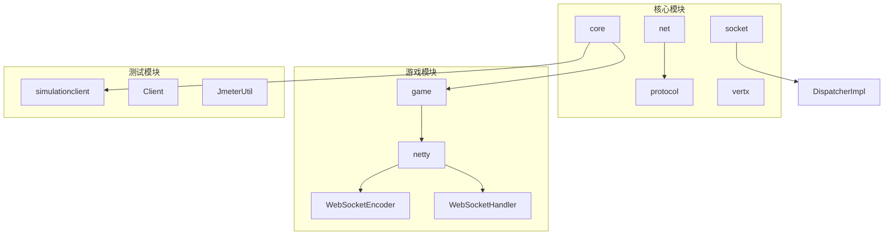
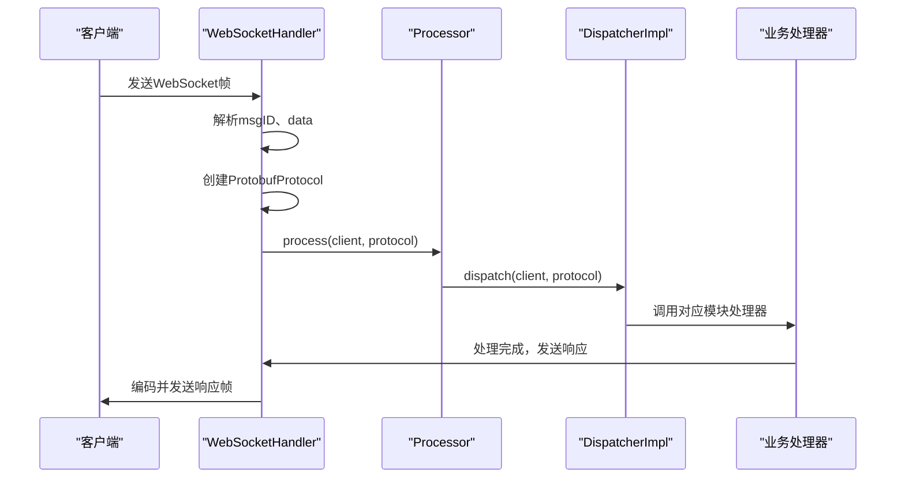
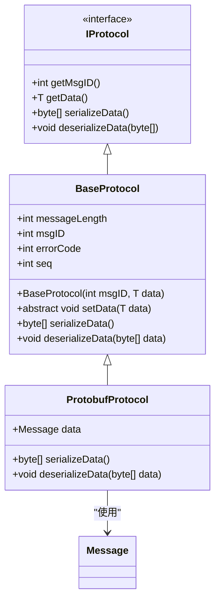
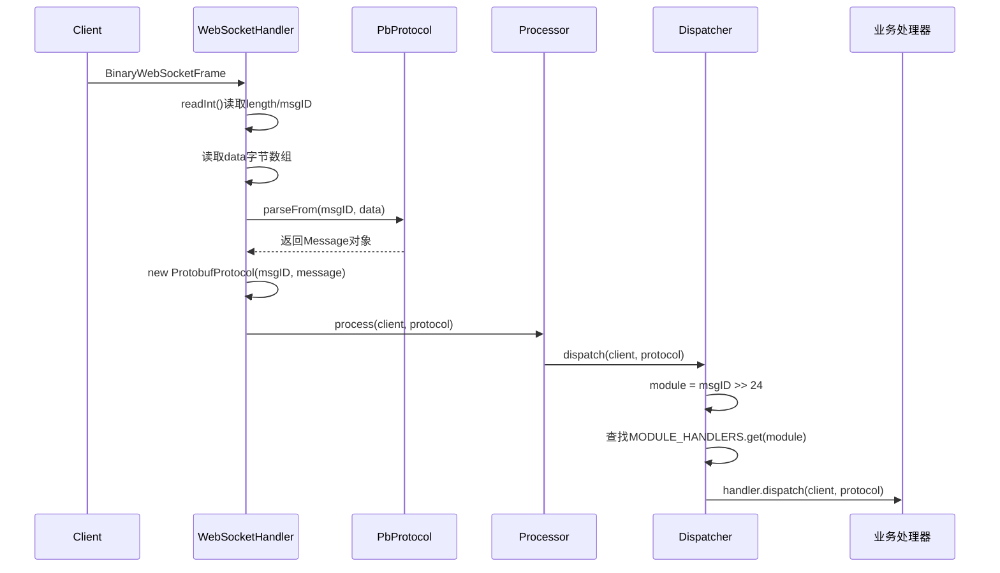
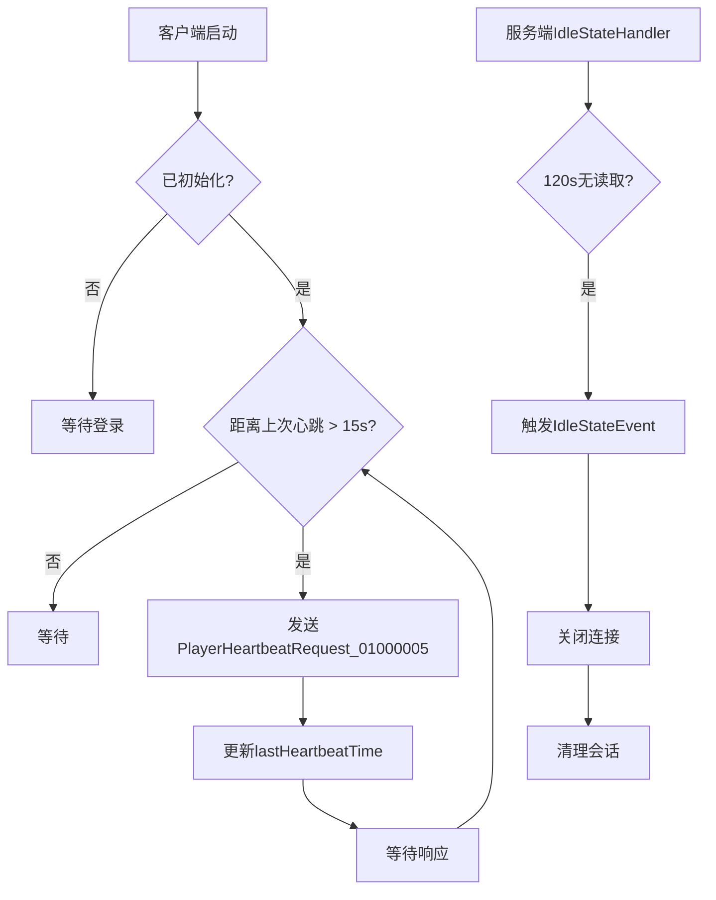
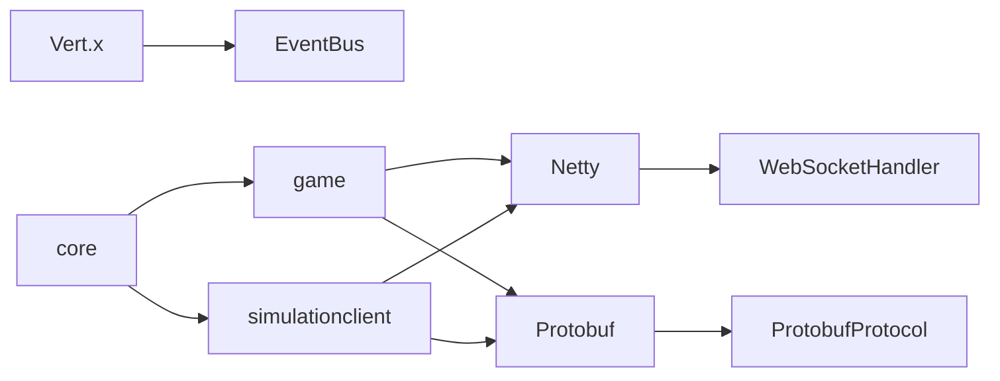

# 基础命令

<cite>
**本文档引用文件**  
- [ProtobufProtocol.java](file://core\src\main\java\cn\game\core\net\protocol\object\ProtobufProtocol.java)
- [BaseProtocol.java](file://core\src\main\java\cn\game\core\net\protocol\BaseProtocol.java)
- [IProtocol.java](file://core\src\main\java\cn\game\core\net\protocol\IProtocol.java)
- [DispatcherImpl.java](file://core\src\main\java\cn\game\core\net\socket\controller\DispatcherImpl.java)
- [WebSocketServerInitializer.java](file://game\src\main\java\cn\game\games\core\netty\WebSocketServerInitializer.java)
- [WebSocketHandler.java](file://game\src\main\java\cn\game\games\core\netty\WebSocketHandler.java)
- [WebSocketEncoder.java](file://game\src\main\java\cn\game\games\core\netty\WebSocketEncoder.java)
- [PlayerLoginRequest_01000001Test.java](file://simulationclient\src\main\java\cn\game\simulation\test\gen\PlayerLoginRequest_01000001Test.java)
- [PlayerHeartbeatRequest_01000005Test.java](file://simulationclient\src\main\java\cn\game\simulation\test\gen\PlayerHeartbeatRequest_01000005Test.java)
- [JmeterUtil.java](file://simulationclient\src\main\java\cn\game\simulation\test\jmeter\util\JmeterUtil.java)
- [HandlerState.java](file://game\src\main\java\cn\game\games\core\netty\HandlerState.java)
- [HandlerStateMBean.java](file://game\src\main\java\cn\game\games\core\netty\HandlerStateMBean.java)
- [ImprovedClientHandler.java](file://simulationclient\src\main\java\cn\game\simulation\socket\ImprovedClientHandler.java)
</cite>

## 目录
1. [简介](#简介)
2. [项目结构](#项目结构)
3. [核心组件](#核心组件)
4. [架构概述](#架构概述)
5. [详细组件分析](#详细组件分析)
6. [依赖分析](#依赖分析)
7. [性能考虑](#性能考虑)
8. [故障排除指南](#故障排除指南)
9. [结论](#结论)

## 简介
本文档详细说明了系统级Socket命令协议，涵盖连接建立、心跳检测、会话管理、断线重连等基础通信机制。文档定义了基础命令码的编码规则与命名规范，描述了请求/响应数据结构，阐明了消息从接收、解码、路由到响应的完整生命周期处理流程。同时包含错误处理机制（如超时重试、连接异常处理）及性能优化建议（如心跳间隔设置、连接池管理）。

## 项目结构
系统采用模块化分层架构，核心网络通信功能位于`core`模块，游戏业务逻辑在`game`模块，登录服务由`login`模块处理，`simulationclient`用于压力测试与协议验证。

**图示来源**  
- [ProtobufProtocol.java](file://core\src\main\java\cn\game\core\net\protocol\object\ProtobufProtocol.java)
- [WebSocketHandler.java](file://game\src\main\java\cn\game\games\core\netty\WebSocketHandler.java)
- [WebSocketEncoder.java](file://game\src\main\java\cn\game\games\core\netty\WebSocketEncoder.java)

**本节来源**  
- [ProtobufProtocol.java](file://core\src\main\java\cn\game\core\net\protocol\object\ProtobufProtocol.java)
- [WebSocketHandler.java](file://game\src\main\java\cn\game\games\core\netty\WebSocketHandler.java)

## 核心组件
系统基于Netty实现WebSocket通信，使用Protobuf进行消息序列化。核心组件包括协议封装（ProtobufProtocol）、消息分发器（DispatcherImpl）、WebSocket处理器（WebSocketHandler）和编码器（WebSocketEncoder）。命令码采用32位整型，高8位表示模块ID，低24位为消息ID，支持模块化路由与权限控制。

**本节来源**  
- [BaseProtocol.java](file://core\src\main\java\cn\game\core\net\protocol\BaseProtocol.java)
- [IProtocol.java](file://core\src\main\java\cn\game\core\net\protocol\IProtocol.java)
- [DispatcherImpl.java](file://core\src\main\java\cn\game\core\net\socket\controller\DispatcherImpl.java)

## 架构概述
系统采用事件驱动架构，客户端通过WebSocket连接服务器，消息经Netty管道处理，由WebSocketHandler解析并交由Processor异步处理。消息分发基于命令码的模块ID进行路由，确保高并发下的低延迟响应。

**图示来源**  
- [WebSocketHandler.java](file://game\src\main\java\cn\game\games\core\netty\WebSocketHandler.java)
- [DispatcherImpl.java](file://core\src\main\java\cn\game\core\net\socket\controller\DispatcherImpl.java)
- [Processor.java](file://core\src\main\java\cn\game\core\net\process\Processor.java)

## 详细组件分析

### 协议与消息处理分析
系统使用Protobuf作为序列化协议，通过ProtobufProtocol封装消息体。消息格式包含长度、msgID、errorCode、seq和数据体，支持请求响应模式与消息重发机制。

#### 类图：协议结构

**图示来源**  
- [BaseProtocol.java](file://core\src\main\java\cn\game\core\net\protocol\BaseProtocol.java)
- [IProtocol.java](file://core\src\main\java\cn\game\core\net\protocol\IProtocol.java)
- [ProtobufProtocol.java](file://core\src\main\java\cn\game\core\net\protocol\object\ProtobufProtocol.java)

#### 序列图：消息接收流程

**图示来源**  
- [WebSocketHandler.java](file://game\src\main\java\cn\game\games\core\netty\WebSocketHandler.java)
- [ProtobufProtocol.java](file://core\src\main\java\cn\game\core\net\protocol\object\ProtobufProtocol.java)
- [DispatcherImpl.java](file://core\src\main\java\cn\game\core\net\socket\controller\DispatcherImpl.java)

#### 心跳与连接管理流程

**图示来源**  
- [Client.java](file://simulationclient\src\main\java\cn\game\simulation\client\Client.java)
- [WebSocketServerInitializer.java](file://game\src\main\java\cn\game\games\core\netty\WebSocketServerInitializer.java)
- [WebSocketHandler.java](file://game\src\main\java\cn\game\games\core\netty\WebSocketHandler.java)

**本节来源**  
- [WebSocketHandler.java](file://game\src\main\java\cn\game\games\core\netty\WebSocketHandler.java)
- [ProtobufProtocol.java](file://core\src\main\java\cn\game\core\net\protocol\object\ProtobufProtocol.java)
- [Client.java](file://simulationclient\src\main\java\cn\game\simulation\client\Client.java)

## 依赖分析
系统依赖Netty进行网络通信，Protobuf进行序列化，Vert.x用于事件总线通信。核心模块`core`提供基础网络功能，`game`模块依赖其构建游戏服务器，`simulationclient`用于协议测试与压测。

**图示来源**  
- [pom.xml](file://core\pom.xml)
- [pom.xml](file://game\pom.xml)
- [pom.xml](file://simulationclient\pom.xml)

**本节来源**  
- [pom.xml](file://core\pom.xml)
- [pom.xml](file://game\pom.xml)

## 性能考虑
- **心跳间隔**：客户端每15秒发送一次心跳，服务端设置120秒读空闲超时，平衡连接保活与资源消耗。
- **流量控制**：使用GlobalTrafficShapingHandler限制全局流量，防止突发流量导致服务过载。
- **连接监控**：通过HandlerStateMBean暴露JMX指标，监控收发包量、异常数、连接状态等。
- **序列化优化**：使用Protobuf高效序列化，避免JSON解析开销。
- **线程模型**：Processor支持多种处理模式（单线程、多线程、虚拟线程），可根据业务负载选择。

## 故障排除指南
- **连接频繁断开**：检查客户端心跳是否正常发送（15秒间隔），服务端IdleStateHandler超时设置（120秒）。
- **消息丢失**：确认客户端seq机制是否正确，服务端是否按序处理。
- **高CPU占用**：检查流量整形配置，监控HandlerState中的读写吞吐量。
- **序列化失败**：确保msgID与Protobuf消息类型匹配，PbProtocol注册正确。
- **模块无处理器**：检查DispatcherImpl中是否注册了对应模块的Handler。

**本节来源**  
- [WebSocketHandler.java](file://game\src\main\java\cn\game\games\core\netty\WebSocketHandler.java)
- [HandlerState.java](file://game\src\main\java\cn\game\games\core\netty\HandlerState.java)
- [ProtobufProtocol.java](file://core\src\main\java\cn\game\core\net\protocol\object\ProtobufProtocol.java)

## 结论
本系统实现了基于WebSocket与Protobuf的高效Socket通信协议，具备完善的连接管理、心跳机制、消息路由与错误处理能力。通过模块化设计与灵活的处理器机制，支持高并发、低延迟的游戏服务器通信需求。建议生产环境合理配置心跳间隔与流量控制参数，结合JMX监控确保系统稳定性。