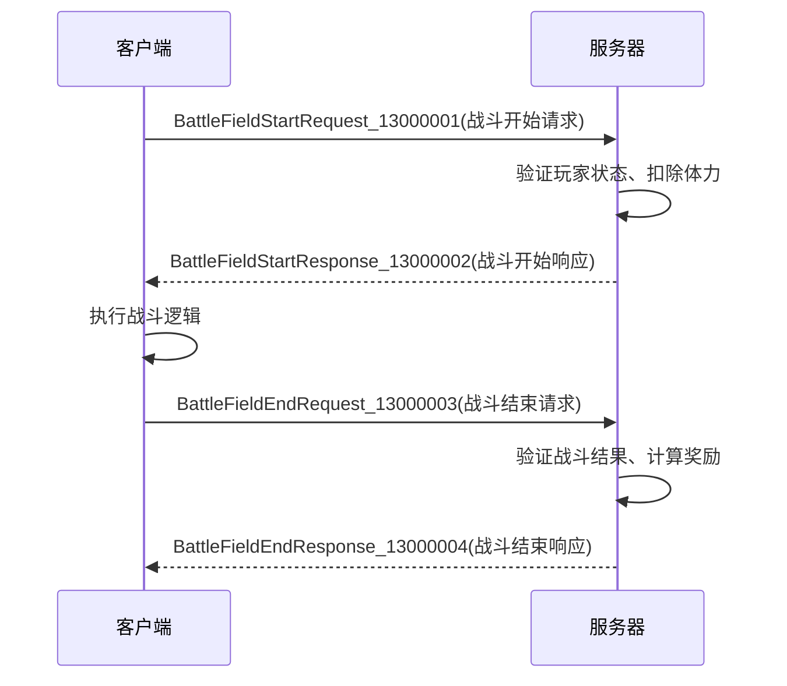
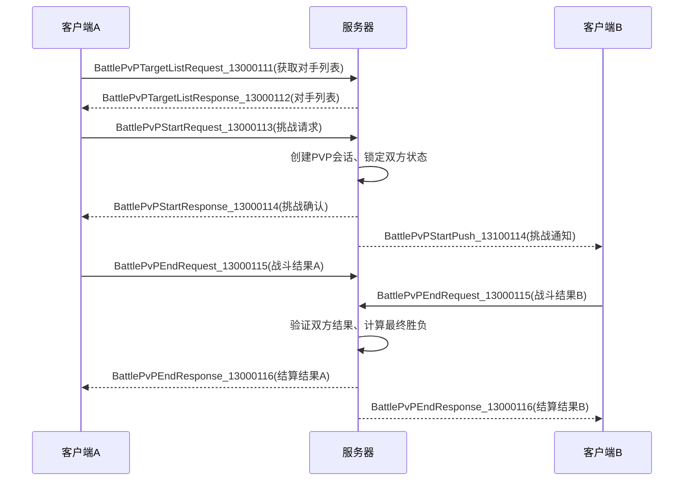
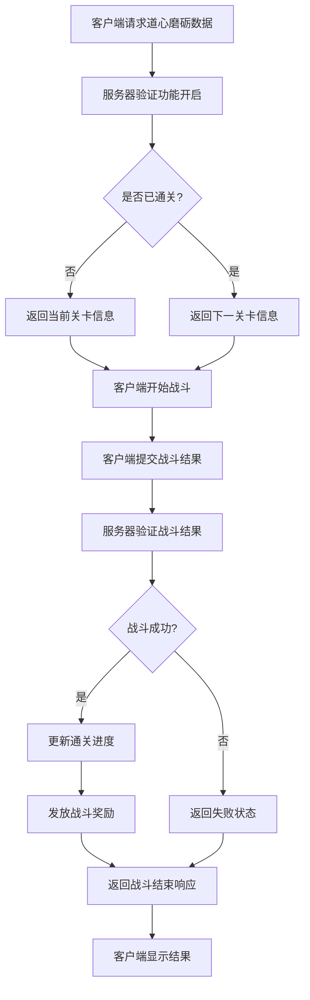

# 战斗系统命令

<cite>
**本文档引用文件**   
- [BattleHandler.java](file://game/src/main/java/cn/game/games/net/game/module/battle/BattleHandler.java)
- [BattleMsg.proto](file://protocol/src/main/proto/BattleMsg.proto)
- [PbProtocol.java](file://protocol/src/main/java/cn/game/protocol/protobuf/PbProtocol.java)
- [BattleModule.java](file://game/src/main/java/cn/game/games/net/game/module/battle/BattleModule.java)
- [DaoHeartBattle.java](file://game/src/main/java/cn/game/games/net/game/module/battle/DaoHeartBattle.java)
- [LingPoBattle.java](file://game/src/main/java/cn/game/games/net/game/module/battle/LingPoBattle.java)
- [HCBattleHandler.java](file://game/src/main/java/cn/game/games/net/game/module/battle/HCBattleHandler.java)
</cite>

## 目录
1. [战斗系统概述](#战斗系统概述)
2. [核心战斗流程命令](#核心战斗流程命令)
3. [战斗命令数据结构](#战斗命令数据结构)
4. [权限控制与安全校验](#权限控制与安全校验)
5. [典型战斗交互流程](#典型战斗交互流程)
6. [附录：战斗命令码完整列表](#附录战斗命令码完整列表)

## 战斗系统概述

战斗系统是游戏核心玩法的重要组成部分，通过Socket命令实现客户端与服务器之间的实时交互。系统支持多种战斗模式，包括PVE、PVP以及特殊玩法如道心磨砺、心魔试炼、梦魇秘境等。所有战斗命令均基于Protocol Buffer进行序列化，确保数据传输的高效性和一致性。

战斗流程通常遵循"开始-进行-结束-结算"的基本模式，每个阶段都有对应的请求和响应命令。系统通过`BattleHandler`类集中管理所有战斗相关的命令处理逻辑，并通过`BattleModule`维护玩家的战斗状态和数据。

**Section sources**
- [BattleHandler.java](file://game/src/main/java/cn/game/games/net/game/module/battle/BattleHandler.java#L190-L800)
- [BattleModule.java](file://game/src/main/java/cn/game/games/net/game/module/battle/BattleModule.java#L1-L200)

## 核心战斗流程命令

### 战斗开始命令

#### BattleFieldStartRequest_13000001 (战斗开始请求)
- **业务场景**: 玩家点击进入关卡或副本时触发
- **触发条件**: 玩家选择特定战斗类型和关卡
- **前置验证**: 
  - 检查玩家功能是否开启
  - 验证战斗前置条件是否满足
  - 扣除战斗消耗资源（如体力）
- **后置效果**: 
  - 记录战斗开始状态
  - 初始化战斗相关数据
  - 返回玩家战斗属性数据

#### BattlePvPStartRequest_13000113 (PVP战斗开始请求)
- **业务场景**: 玩家在PVP模式中选择对手进行挑战
- **触发条件**: 玩家从对手列表中选择目标并确认挑战
- **前置验证**: 
  - 检查PVP挑战次数
  - 验证目标玩家状态
  - 扣除挑战券或相应资源
- **后置效果**: 
  - 创建PVP战斗会话
  - 初始化双方战斗数据
  - 进入战斗准备阶段

### 战斗结束命令

#### BattleFieldEndRequest_13000003 (战斗结束请求)
- **业务场景**: 客户端完成战斗逻辑后提交战斗结果
- **触发条件**: 战斗动画播放完毕，客户端计算出战斗结果
- **前置验证**: 
  - 验证战斗结果的合法性
  - 校验伤害、击杀数等战斗数据的合理性
  - 防止作弊行为（如异常高的伤害值）
- **后置效果**: 
  - 计算战斗奖励
  - 更新玩家战斗进度
  - 记录战斗日志用于反作弊分析

#### BattlePvPEndRequest_13000115 (PVP战斗结束请求)
- **业务场景**: PVP对战结束后提交战斗结果
- **触发条件**: PVP战斗逻辑完成，客户端提交结果
- **前置验证**: 
  - 验证PVP战斗会话的有效性
  - 校验战斗结果与服务器预测的一致性
  - 检查是否存在异常行为
- **后置效果**: 
  - 更新双方排名和积分
  - 发放PVP奖励
  - 记录战斗回放数据

### 技能释放与角色移动

#### BattleHandCardRequest_13000600 (手操卡使用请求)
- **业务场景**: 玩家在战斗中使用特殊技能或道具
- **触发条件**: 玩家点击技能按钮或使用特殊道具
- **前置验证**: 
  - 检查技能冷却时间
  - 验证玩家是否拥有该技能使用权
  - 扣除技能使用消耗
- **后置效果**: 
  - 应用技能效果
  - 更新技能冷却状态
  - 广播技能释放信息给所有相关客户端

### 战斗结算命令

#### BattleRewardRequest_13000022 (战役奖励领取请求)
- **业务场景**: 玩家领取首次胜利、半血胜利等特殊奖励
- **触发条件**: 玩家完成特定战斗成就后点击领取按钮
- **前置验证**: 
  - 验证奖励领取资格
  - 检查是否已领取过该奖励
  - 防止重复领取
- **后置效果**: 
  - 发放对应奖励
  - 更新奖励领取状态
  - 触发相关成就系统

#### BattleChapterRewardRequest_13000222 (章节奖励领取请求)
- **业务场景**: 玩家通关一章后领取章节奖励
- **触发条件**: 玩家完成章节最后一关并点击领取奖励
- **前置验证**: 
  - 验证章节是否已通关
  - 检查是否已领取过该章节奖励
  - 防止跨章节领取
- **后置效果**: 
  - 发放章节奖励
  - 更新章节奖励状态
  - 触发后续章节解锁逻辑

**Section sources**
- [BattleHandler.java](file://game/src/main/java/cn/game/games/net/game/module/battle/BattleHandler.java#L200-L239)
- [BattleMsg.proto](file://protocol/src/main/proto/BattleMsg.proto#L12-L113)

## 战斗命令数据结构

### Protocol Buffer 序列化格式

所有战斗命令均使用Protocol Buffer进行序列化，确保数据传输的高效性和跨平台兼容性。主要数据结构定义在`BattleMsg.proto`文件中。

#### 请求消息结构
```protobuf
message BattleFieldStartRequest_13000001 {
    uint32 type = 1;     // 玩法类型
    uint32 typeId = 2;   // 配置表ID
    uint32 fieldId = 3;  // 关卡ID
    int64 helpPlayerId = 4; // 助战玩家ID
}
```

#### 响应消息结构
```protobuf
message BattleFieldStartResponse_13000002 {
    PlayerBattleAttrs attrs = 1; // 玩家战斗属性
}

message PlayerBattleAttrs {
    map<int32,int32> playerAttrs = 4; // 玩家属性
    repeated HeroAttr heroAttrs = 1;  // 英雄属性
    map<int32,int32> dragonAttrs = 2; // 龙属性
    map<int32,int32> wallAttrs = 3;  // 城池属性
}
```

#### 战斗结束请求结构
```protobuf
message BattleFieldEndRequest_13000003 {
    uint32 killMonsterCount = 1;    // 击杀怪物数量
    uint32 killMonsterBossCount = 6; // 击杀首领数量
    uint32 hpPercent = 2;           // 城池剩余血量百分比
    bool win = 3;                   // 战斗是否成功
    uint32 battleTime = 4;          // 战斗时长（秒）
    uint32 damage = 8;              // 战斗伤害
    repeated int32 richManItems = 10; // 特殊大富翁地格
}
```

#### 战斗结束响应结构
```protobuf
message BattleFieldEndResponse_13000004 {
    repeated RewardInfo rewards = 1; // 获得的奖励
    repeated int32 params = 2;       // 附带参数
}
```

### 数据结构特点

1. **模块化设计**: 将玩家属性、英雄属性等分离为独立的消息类型，便于复用和维护
2. **扩展性**: 使用`repeated`关键字支持可变长度的数组，适应不同战斗场景的需求
3. **类型安全**: 严格定义字段类型和编号，确保序列化/反序列化的正确性
4. **向后兼容**: 通过保留字段编号和使用可选字段，支持协议的平滑升级

**Section sources**
- [BattleMsg.proto](file://protocol/src/main/proto/BattleMsg.proto#L12-L300)

## 权限控制与安全校验

### 命令访问级别

战斗系统实现了多层次的权限控制机制，确保不同命令只能由授权的客户端访问。

#### 高权限命令
- `BattleFieldEndRequest_13000003`: 战斗结果提交，需严格验证
- `BattlePvPEndRequest_13000115`: PVP战斗结算，需会话验证
- `BattleDaoHeartSweepRequest_13000066`: 特殊玩法奖励领取，需进度验证

#### 中权限命令
- `BattleFieldStartRequest_13000001`: 战斗开始，需功能开启验证
- `BattleReliveRequest_13000010`: 复活请求，需次数限制
- `BattleSweepRequest_13000024`: 扫荡请求，需通关验证

#### 低权限命令
- `BattleLineupRequest_13000048`: 阵容保存，仅数据存储
- `BattleStaminaRequest_13000050`: 体力领取，基础功能
- `BattleShareRequest_13000007`: 分享奖励，广告相关

### 安全校验机制

#### 数据合法性校验
```java
protected void end(NetClient client, Object message) {
    BattleFieldEndRequest_13000003 req = (BattleFieldEndRequest_13000003) message;
    long playerId = client.getPlayerId();
    Player player = PlayerManager.getInstance().getPlayer(playerId);
    
    // 校验战斗结果的合理性
    if (req.getDamage() > MAX_DAMAGE_THRESHOLD) {
        client.sendProtocol(resp, ErrorMsgEnum.cheat_detected.getId());
        return;
    }
    
    // 验证战斗时长是否合理
    if (req.getBattleTime() < MIN_BATTLE_TIME || req.getBattleTime() > MAX_BATTLE_TIME) {
        client.sendProtocol(resp, ErrorMsgEnum.invalid_request.getId());
        return;
    }
}
```

#### 防作弊措施
1. **结果验证**: 服务器端重新计算关键战斗指标，与客户端提交结果进行比对
2. **行为分析**: 记录战斗过程中的关键事件，用于后续的异常行为分析
3. **频率限制**: 对敏感操作设置调用频率限制，防止自动化脚本滥用
4. **会话绑定**: PVP战斗与特定会话绑定，防止结果篡改

#### 状态一致性校验
```java
protected void start(NetClient client, Object message) {
    BattleFieldStartRequest_13000001 req = (BattleFieldStartRequest_13000001) message;
    long playerId = client.getPlayerId();
    Player player = PlayerManager.getInstance().getPlayer(playerId);
    BattleModule battleModule = player.getModule(BattleModule.class);
    
    // 验证当前无正在进行的战斗
    if (battleModule.getAttackingType() != 0) {
        client.sendProtocol(resp, ErrorMsgEnum.battle_in_progress.getId());
        return;
    }
}
```

**Section sources**
- [BattleHandler.java](file://game/src/main/java/cn/game/games/net/game/module/battle/BattleHandler.java#L700-L723)
- [DaoHeartBattle.java](file://game/src/main/java/cn/game/games/net/game/module/battle/DaoHeartBattle.java#L190-L200)

## 典型战斗交互流程

### PVE战斗流程



**Diagram sources**
- [BattleHandler.java](file://game/src/main/java/cn/game/games/net/game/module/battle/BattleHandler.java#L200-L201)
- [BattleMsg.proto](file://protocol/src/main/proto/BattleMsg.proto#L12-L57)

### PVP战斗流程



**Diagram sources**
- [BattleHandler.java](file://game/src/main/java/cn/game/games/net/game/module/battle/BattleHandler.java#L237-L239)
- [OfflineBattleHandler.java](file://game/src/main/java/cn/game/games/net/game/module/pvp/OfflineBattleHandler.java)

### 特殊玩法流程（道心磨砺）



**Diagram sources**
- [BattleHandler.java](file://game/src/main/java/cn/game/games/net/game/module/battle/BattleHandler.java#L212-L214)
- [DaoHeartBattle.java](file://game/src/main/java/cn/game/games/net/game/module/battle/DaoHeartBattle.java)

## 附录：战斗命令码完整列表

### 战斗基础命令
| 命令码 | 请求名称 | 响应名称 | 描述 |
|--------|---------|---------|------|
| 13000001 | BattleFieldStartRequest | BattleFieldStartResponse | 战斗开始 |
| 13000003 | BattleFieldEndRequest | BattleFieldEndResponse | 战斗结束 |
| 13000005 | BattleFieldQuickEndRequest | BattleFieldQuickEndResponse | 快速战斗 |
| 13000007 | BattleShareRequest | BattleShareResponse | 分享奖励 |

### 战斗操作命令
| 命令码 | 请求名称 | 响应名称 | 描述 |
|--------|---------|---------|------|
| 13000010 | BattleReliveRequest | BattleReliveResponse | 复活 |
| 13000012 | BattleRogueAdvertiseRequest | BattleRogueAdvertiseResponse | 肉鸽广告 |
| 13000031 | BattleLineupChooseRequest | BattleLineupChooseResponse | 选择阵容 |
| 13000048 | BattleLineupRequest | BattleLineupResponse | 保存阵容 |

### 特殊玩法命令
| 命令码 | 请求名称 | 响应名称 | 描述 |
|--------|---------|---------|------|
| 13000055 | BattleDaoHeartRequest | BattleDaoHeartResponse | 道心磨砺数据 |
| 13000060 | BattleDaoHeartSweepRequest | BattleDaoHeartSweepResponse | 道心扫荡 |
| 13000080 | BattleNightmareRealmRequest | BattleNightmareRealmResponse | 梦魇秘境数据 |
| 13000090 | BattleSpiritualInfoRequest | BattleSpiritualInfoResponse | 灵魄之战数据 |

### PVP相关命令
| 命令码 | 请求名称 | 响应名称 | 描述 |
|--------|---------|---------|------|
| 13000111 | BattlePvPTargetListRequest | BattlePvPTargetListResponse | PVP对手列表 |
| 13000113 | BattlePvPStartRequest | BattlePvPStartResponse | PVP开始战斗 |
| 13000115 | BattlePvPEndRequest | BattlePvPEndResponse | PVP战斗结算 |
| 13000121 | BattleBuyPvPTimeRequest | BattleBuyPvPTimeResponse | 购买PVP次数 |

**Section sources**
- [PbProtocol.java](file://protocol/src/main/java/cn/game/protocol/protobuf/PbProtocol.java#L84-L200)
- [BattleMsg.proto](file://protocol/src/main/proto/BattleMsg.proto)