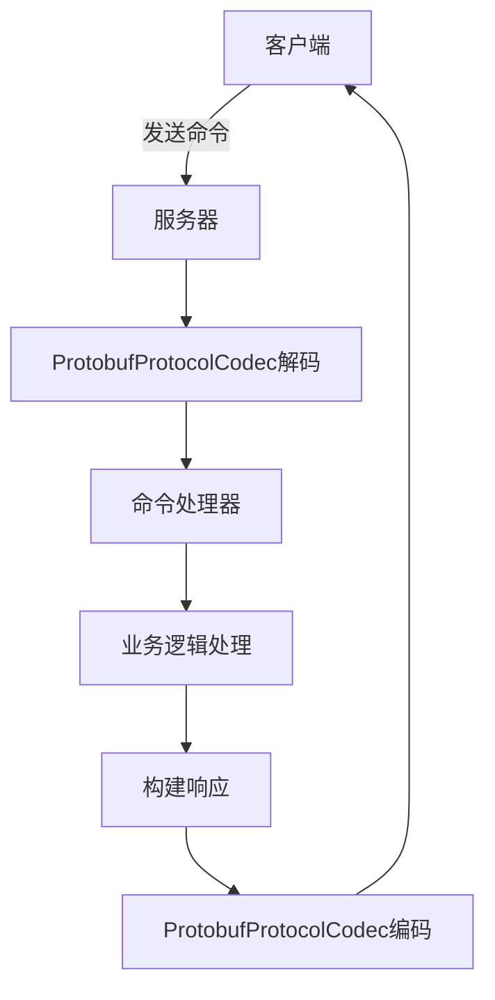
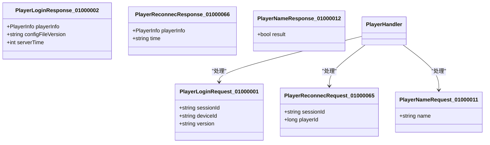
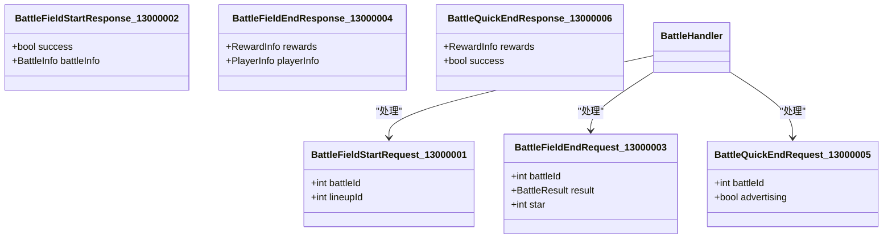
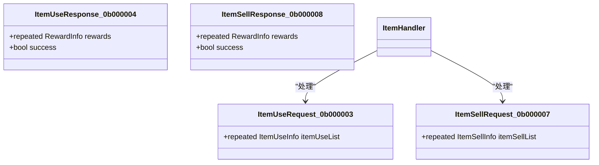
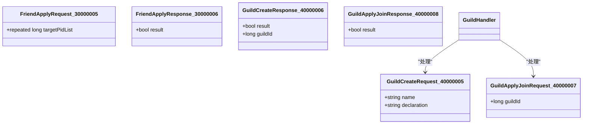
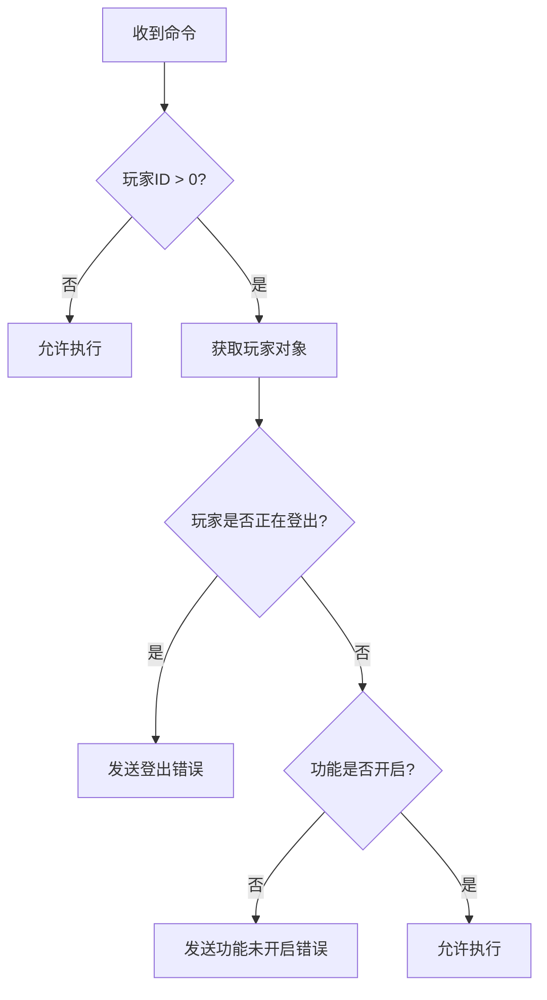
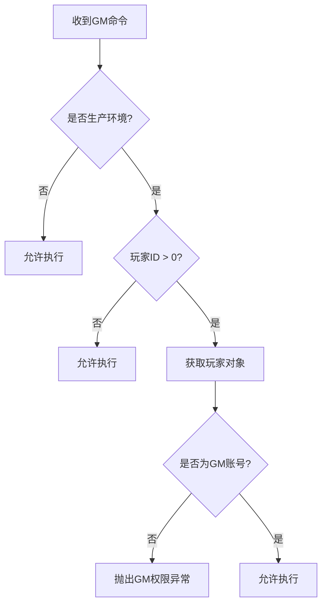
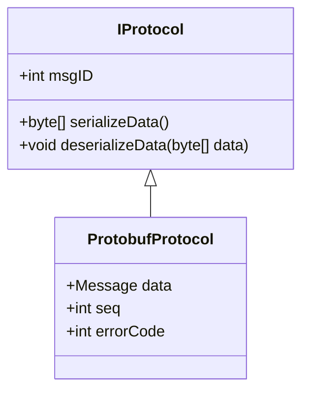
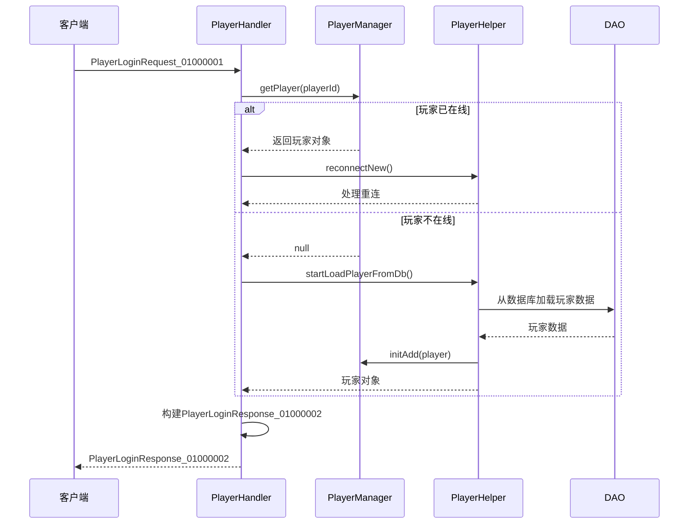

# 游戏命令

<cite>
**本文档引用的文件**   
- [PbProtocol.java](file://protocol\src\main\java\cn\game\protocol\protobuf\PbProtocol.java)
- [PlayerHandler.java](file://game\src\main\java\cn\game\games\net\game\handler\PlayerHandler.java)
- [ItemHandler.java](file://game\src\main\java\cn\game\games\net\game\module\item\ItemHandler.java)
- [GuildHandler.java](file://game\src\main\java\cn\game\games\net\game\module\guild\GuildHandler.java)
- [BattleHandler.java](file://game\src\main\java\cn\game\games\net\game\module\battle\BattleHandler.java)
- [GmHandler.java](file://game\src\main\java\cn\game\games\net\game\gm\GmHandler.java)
- [GameBaseHandler.java](file://game\src\main\java\cn\game\games\net\game\handler\GameBaseHandler.java)
- [GmBaseHandler.java](file://game\src\main\java\cn\game\games\net\game\handler\GmBaseHandler.java)
- [ProtobufProtocol.java](file://core\src\main\java\cn\game\core\net\protocol\object\ProtobufProtocol.java)
- [ProtobufProtocolCodec.java](file://core\src\main\java\cn\game\core\net\vertx\codec\ProtobufProtocolCodec.java)
- [PlayerManager.java](file://game\src\main\java\cn\game\games\net\game\manager\PlayerManager.java)
- [PlayerHelper.java](file://game\src\main\java\cn\game\games\net\game\helper\PlayerHelper.java)
</cite>

## 目录
1. [引言](#引言)
2. [游戏命令系统架构](#游戏命令系统架构)
3. [核心游戏命令](#核心游戏命令)
4. [命令权限控制机制](#命令权限控制机制)
5. [协议缓冲区序列化格式](#协议缓冲区序列化格式)
6. [典型游戏交互流程示例](#典型游戏交互流程示例)
7. [结论](#结论)

## 引言

本文档旨在全面记录游戏核心功能相关的Socket命令，涵盖玩家操作、战斗系统、物品交互、社交功能等游戏内行为的命令定义。文档详细说明了每个游戏命令的业务场景，包括触发条件、前置验证和后置效果。同时，文档化了游戏命令的数据结构，特别是协议缓冲区（Protocol Buffer）的序列化格式，并包含了游戏命令的权限控制机制，说明不同命令的访问级别和安全校验。

## 游戏命令系统架构

游戏命令系统基于协议缓冲区（Protocol Buffer）实现，通过WebSocket进行通信。系统使用`ProtobufProtocol`类作为协议对象，包含消息ID和序列化数据。`ProtobufProtocolCodec`类负责编码和解码协议数据，将消息ID和数据字节数组写入缓冲区或从缓冲区读取。



**图源**
- [ProtobufProtocolCodec.java](file://core\src\main\java\cn\game\core\net\vertx\codec\ProtobufProtocolCodec.java)
- [ProtobufProtocol.java](file://core\src\main\java\cn\game\core\net\protocol\object\ProtobufProtocol.java)

**本节源**
- [ProtobufProtocolCodec.java](file://core\src\main\java\cn\game\core\net\vertx\codec\ProtobufProtocolCodec.java)
- [ProtobufProtocol.java](file://core\src\main\java\cn\game\core\net\protocol\object\ProtobufProtocol.java)

## 核心游戏命令

### 玩家操作命令

玩家操作命令包括登录、重连、修改个人信息等基本功能。



**图源**
- [PlayerHandler.java](file://game\src\main\java\cn\game\games\net\game\handler\PlayerHandler.java)
- [PbProtocol.java](file://protocol\src\main\java\cn\game\protocol\protobuf\PbProtocol.java)

**本节源**
- [PlayerHandler.java](file://game\src\main\java\cn\game\games\net\game\handler\PlayerHandler.java)

### 战斗系统命令

战斗系统命令涵盖关卡战斗、快速战斗、复活、领取奖励等操作。



**图源**
- [BattleHandler.java](file://game\src\main\java\cn\game\games\net\game\module\battle\BattleHandler.java)
- [PbProtocol.java](file://protocol\src\main\java\cn\game\protocol\protobuf\PbProtocol.java)

**本节源**
- [BattleHandler.java](file://game\src\main\java\cn\game\games\net\game\module\battle\BattleHandler.java)

### 物品交互命令

物品交互命令包括使用道具、出售道具等操作。



**图源**
- [ItemHandler.java](file://game\src\main\java\cn\game\games\net\game\module\item\ItemHandler.java)
- [PbProtocol.java](file://protocol\src\main\java\cn\game\protocol\protobuf\PbProtocol.java)

**本节源**
- [ItemHandler.java](file://game\src\main\java\cn\game\games\net\game\module\item\ItemHandler.java)

### 社交功能命令

社交功能命令包括好友管理、公会操作等。



**图源**
- [GuildHandler.java](file://game\src\main\java\cn\game\games\net\game\module\guild\GuildHandler.java)
- [PbProtocol.java](file://protocol\src\main\java\cn\game\protocol\protobuf\PbProtocol.java)

**本节源**
- [GuildHandler.java](file://game\src\main\java\cn\game\games\net\game\module\guild\GuildHandler.java)

## 命令权限控制机制

游戏命令系统实现了严格的权限控制机制，通过继承`GameBaseHandler`和`GmBaseHandler`类来实现不同级别的访问控制。

### 普通玩家命令权限

普通玩家命令通过`GameBaseHandler`进行权限检查，主要验证玩家是否在线、是否正在登出以及功能是否开启。



**图源**
- [GameBaseHandler.java](file://game\src\main\java\cn\game\games\net\game\handler\GameBaseHandler.java)

**本节源**
- [GameBaseHandler.java](file://game\src\main\java\cn\game\games\net\game\handler\GameBaseHandler.java)

### GM命令权限

GM命令通过`GmBaseHandler`进行权限检查，除了普通玩家的检查外，还额外验证玩家是否为GM账号。



**图源**
- [GmBaseHandler.java](file://game\src\main\java\cn\game\games\net\game\handler\GmBaseHandler.java)

**本节源**
- [GmBaseHandler.java](file://game\src\main\java\cn\game\games\net\game\handler\GmBaseHandler.java)

## 协议缓冲区序列化格式

游戏命令使用协议缓冲区（Protocol Buffer）进行序列化，确保高效的数据传输和跨平台兼容性。

### 命令协议结构

所有命令协议都继承自`IProtocol`接口，包含消息ID和序列化数据。



**图源**
- [ProtobufProtocol.java](file://core\src\main\java\cn\game\core\net\protocol\object\ProtobufProtocol.java)

**本节源**
- [ProtobufProtocol.java](file://core\src\main\java\cn\game\core\net\protocol\object\ProtobufProtocol.java)

### 数据包格式

网络数据包采用固定头部格式，包含长度、序列号、消息ID和错误码。

```mermaid
flowchart LR
A[数据包] --> B[长度(4字节)]
A --> C[序列号(4字节)]
A --> D[消息ID(4字节)]
A --> E[错误码(4字节)]
A --> F[消息数据]
```

**本节源**
- [ProtobufProtocolCodec.java](file://core\src\main\java\cn\game\core\net\vertx\codec\ProtobufProtocolCodec.java)

## 典型游戏交互流程示例

### 玩家登录流程

玩家登录是游戏交互的起点，涉及会话验证、玩家数据加载和状态同步。



**图源**
- [PlayerHandler.java](file://game\src\main\java\cn\game\games\net\game\handler\PlayerHandler.java)
- [PlayerManager.java](file://game\src\main\java\cn\game\games\net\game\manager\PlayerManager.java)
- [PlayerHelper.java](file://game\src\main\java\cn\game\games\net\game\helper\PlayerHelper.java)

**本节源**
- [PlayerHandler.java](file://game\src\main\java\cn\game\games\net\game\handler\PlayerHandler.java)

### 使用道具流程

使用道具是常见的游戏交互，涉及资源验证、道具消耗和奖励发放。

```mermaid
sequenceDiagram
participant Client as 客户端
participant ItemHandler as ItemHandler
participant Player as Player
participant PlayerHelper as PlayerHelper
Client->>ItemHandler : ItemUseRequest_0b000003
ItemHandler->>Player : checkClientRequestCount()
Player-->>ItemHandler : 验证请求次数
loop 验证每个道具使用
ItemHandler->>Player : checkEnough()
alt 资源不足
Player-->>ItemHandler : false
ItemHandler-->>Client : 错误响应
break
end
end
loop 处理每个道具使用
ItemHandler->>Player : 获取道具配置
alt 配置不存在
ItemHandler-->>Client : 配置不存在错误
break
end
alt 道具类型为手操卡
ItemHandler->>ItemHandler : 概率性不消耗
end
ItemHandler->>PlayerHelper : addResources()
PlayerHelper-->>ItemHandler : 奖励信息
end
ItemHandler->>ItemHandler : 构建ItemUseResponse_0b000004
ItemHandler-->>Client : ItemUseResponse_0b000004
```

**图源**
- [ItemHandler.java](file://game\src\main\java\cn\game\games\net\game\module\item\ItemHandler.java)
- [PlayerHelper.java](file://game\src\main\java\cn\game\games\net\game\helper\PlayerHelper.java)

**本节源**
- [ItemHandler.java](file://game\src\main\java\cn\game\games\net\game\module\item\ItemHandler.java)

## 结论

本文档全面记录了游戏核心功能相关的Socket命令，涵盖了玩家操作、战斗系统、物品交互、社交功能等游戏内行为的命令定义。文档详细说明了每个游戏命令的业务场景，包括触发条件、前置验证和后置效果。同时，文档化了游戏命令的数据结构，特别是协议缓冲区（Protocol Buffer）的序列化格式，并包含了游戏命令的权限控制机制，说明不同命令的访问级别和安全校验。通过本文档，开发人员可以更好地理解和使用游戏命令系统，确保游戏功能的正确实现和安全运行。