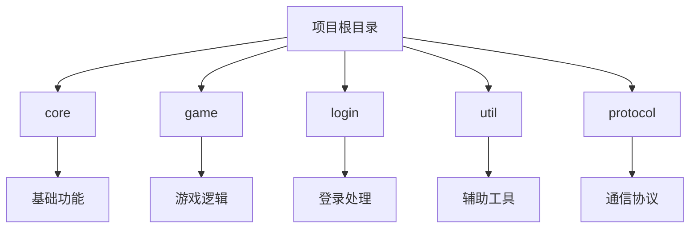
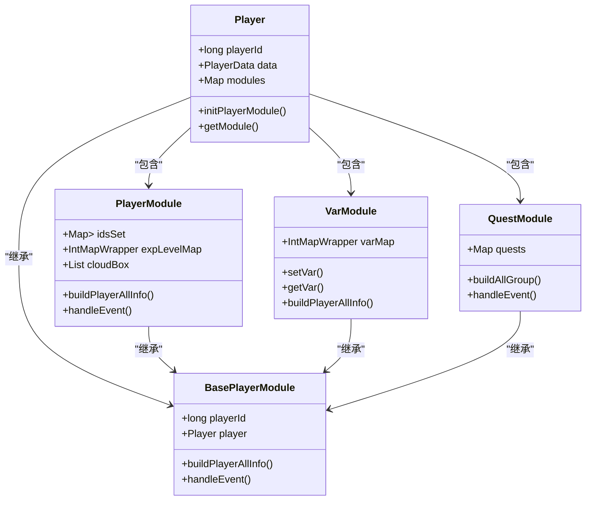
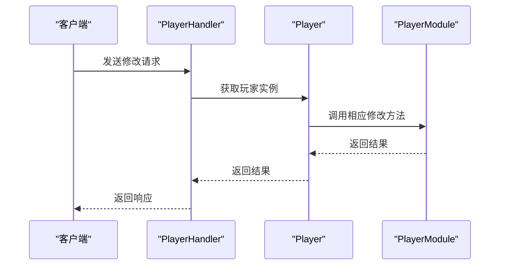
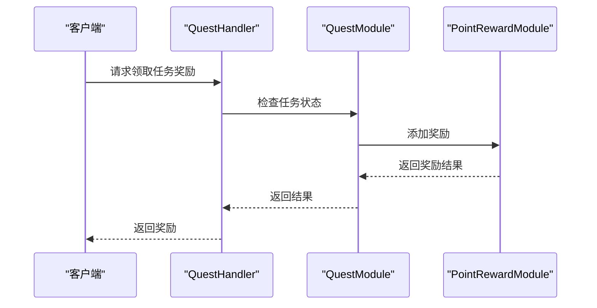
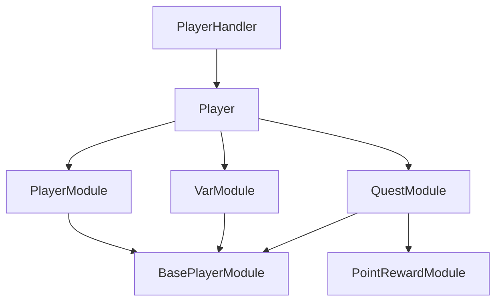

# 玩家管理命令

<cite>
**本文档引用文件**   
- [PlayerMsg.proto](file://protocol/src/main/proto/PlayerMsg.proto)
- [QuestMsg.proto](file://protocol/src/main/proto/QuestMsg.proto)
- [PlayerHandler.java](file://game/src/main/java/cn/game/games/net/game/handler/PlayerHandler.java)
- [PlayerModule.java](file://game/src/main/java/cn/game/games/net/game/module/player/PlayerModule.java)
- [VarModule.java](file://game/src/main/java/cn/game/games/net/game/module/player/VarModule.java)
- [QuestModule.java](file://game/src/main/java/cn/game/games/net/game/module/quest/QuestModule.java)
- [Player.java](file://game/src/main/java/cn/game/games/cache/entity/Player.java)
</cite>

## 目录
1. [简介](#简介)
2. [项目结构](#项目结构)
3. [核心组件](#核心组件)
4. [架构概述](#架构概述)
5. [详细组件分析](#详细组件分析)
6. [依赖分析](#依赖分析)
7. [性能考虑](#性能考虑)
8. [故障排除指南](#故障排除指南)
9. [结论](#结论)

## 简介
本文档全面记录了与玩家基本信息管理相关的所有Socket命令码，涵盖玩家属性查看、信息修改、成就系统、任务系统等核心功能。文档详细说明了每个命令的业务场景、触发条件、前置验证、后置效果、数据结构、权限控制机制及调用示例。

## 项目结构
项目结构清晰，主要分为核心、游戏、登录、工具和协议模块。核心模块包含基础功能，游戏模块实现具体游戏逻辑，登录模块处理用户登录，工具模块提供辅助功能，协议模块定义通信协议。

**图表来源**
- [PlayerMsg.proto](file://protocol/src/main/proto/PlayerMsg.proto)
- [QuestMsg.proto](file://protocol/src/main/proto/QuestMsg.proto)

**章节来源**
- [PlayerMsg.proto](file://protocol/src/main/proto/PlayerMsg.proto)
- [QuestMsg.proto](file://protocol/src/main/proto/QuestMsg.proto)

## 核心组件
核心组件包括玩家管理、任务系统、成就系统等，通过Socket命令实现客户端与服务器的交互。

**章节来源**
- [PlayerHandler.java](file://game/src/main/java/cn/game/games/net/game/handler/PlayerHandler.java)
- [PlayerModule.java](file://game/src/main/java/cn/game/games/net/game/module/player/PlayerModule.java)

## 架构概述
系统采用模块化设计，各功能模块通过事件驱动机制进行通信，确保高内聚低耦合。

**图表来源**
- [Player.java](file://game/src/main/java/cn/game/games/cache/entity/Player.java)
- [BasePlayerModule.java](file://game/src/main/java/cn/game/games/core/BasePlayerModule.java)
- [PlayerModule.java](file://game/src/main/java/cn/game/games/net/game/module/player/PlayerModule.java)
- [VarModule.java](file://game/src/main/java/cn/game/games/net/game/module/player/VarModule.java)
- [QuestModule.java](file://game/src/main/java/cn/game/games/net/game/module/quest/QuestModule.java)

## 详细组件分析
### 玩家信息管理
玩家信息管理通过`PlayerHandler`处理各种Socket命令，如登录、登出、修改信息等。

#### 玩家信息修改流程

**图表来源**
- [PlayerHandler.java](file://game/src/main/java/cn/game/games/net/game/handler/PlayerHandler.java)
- [Player.java](file://game/src/main/java/cn/game/games/cache/entity/Player.java)
- [PlayerModule.java](file://game/src/main/java/cn/game/games/net/game/module/player/PlayerModule.java)

### 成就与任务系统
成就与任务系统通过`QuestModule`管理，支持任务的领取、完成和奖励发放。

#### 任务领取流程

**图表来源**
- [QuestModule.java](file://game/src/main/java/cn/game/games/net/game/module/quest/QuestModule.java)
- [PointRewardModule.java](file://game/src/main/java/cn/game/games/net/game/module/player/pointreward/PointRewardModule.java)

## 依赖分析
系统各模块间依赖关系清晰，通过事件驱动机制解耦，确保模块独立性和可维护性。

**图表来源**
- [PlayerHandler.java](file://game/src/main/java/cn/game/games/net/game/handler/PlayerHandler.java)
- [Player.java](file://game/src/main/java/cn/game/games/cache/entity/Player.java)
- [PlayerModule.java](file://game/src/main/java/cn/game/games/net/game/module/player/PlayerModule.java)
- [VarModule.java](file://game/src/main/java/cn/game/games/net/game/module/player/VarModule.java)
- [QuestModule.java](file://game/src/main/java/cn/game/games/net/game/module/quest/QuestModule.java)

**章节来源**
- [PlayerHandler.java](file://game/src/main/java/cn/game/games/net/game/handler/PlayerHandler.java)
- [Player.java](file://game/src/main/java/cn/game/games/cache/entity/Player.java)

## 性能考虑
系统通过分布式锁、缓存机制和异步处理优化性能，确保高并发下的稳定运行。

## 故障排除指南
常见问题包括登录失败、任务无法领取等，可通过检查日志、验证数据和重启服务解决。

**章节来源**
- [PlayerHandler.java](file://game/src/main/java/cn/game/games/net/game/handler/PlayerHandler.java)
- [PlayerHelper.java](file://game/src/main/java/cn/game/games/net/game/helper/PlayerHelper.java)

## 结论
本文档全面记录了玩家管理Socket命令，为开发和维护提供了详尽的参考。系统设计合理，性能优越，具备良好的可扩展性和可维护性。