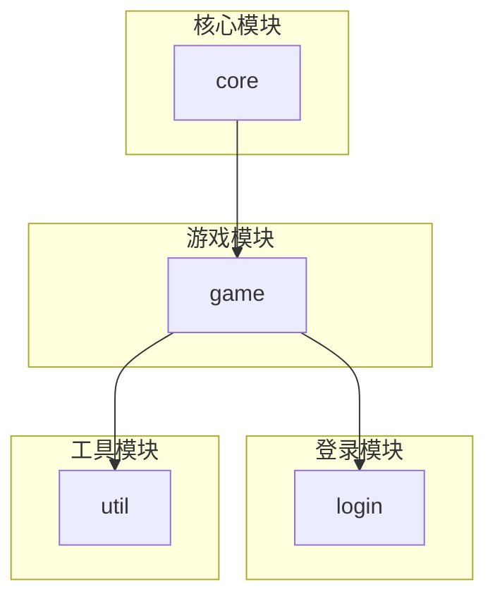
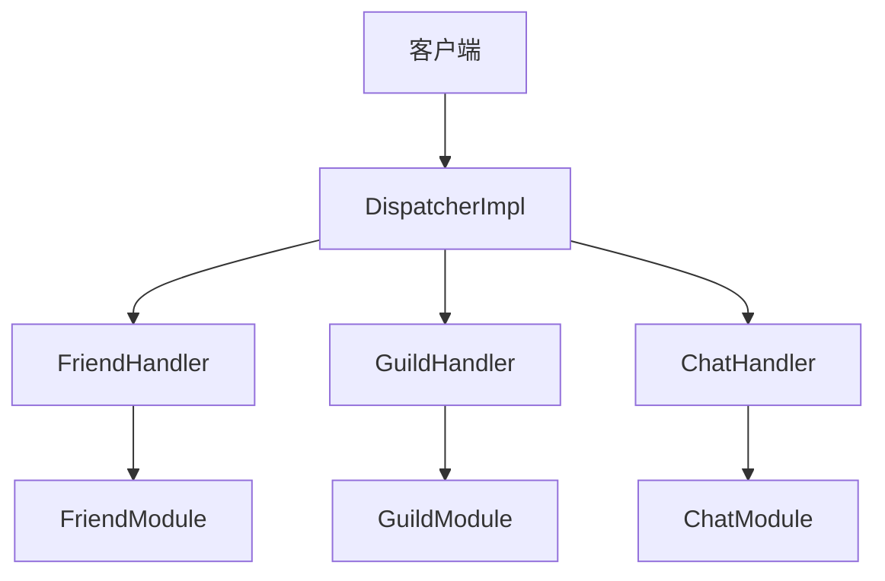
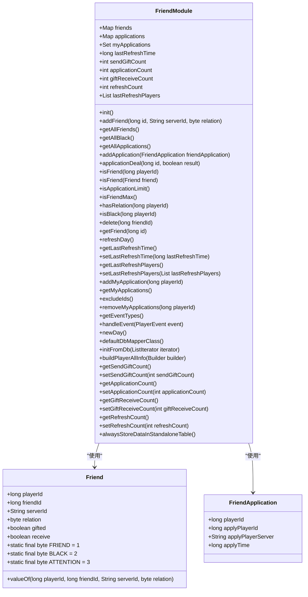
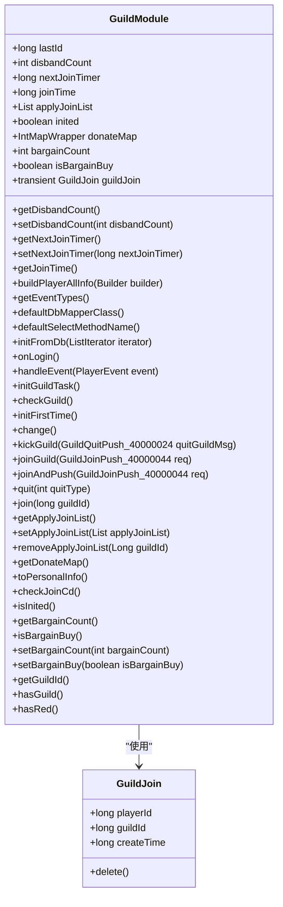
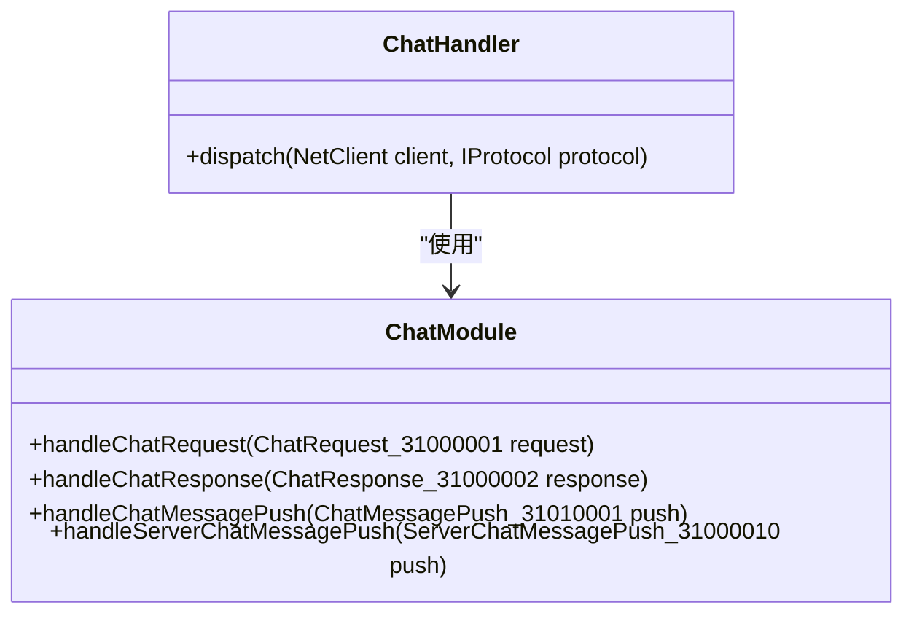
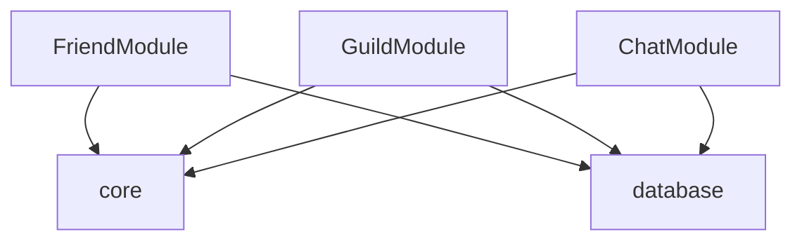

# 社交系统命令

<cite>
**本文档引用的文件**
- [FriendMsg.proto](file://protocol/src/main/proto/FriendMsg.proto)
- [GuildMsg.proto](file://protocol/src/main/proto/GuildMsg.proto)
- [ChatMsg.proto](file://protocol/src/main/proto/ChatMsg.proto)
- [FriendModule.java](file://game/src/main/java/cn/game/games/net/game/module/friend/FriendModule.java)
- [GuildModule.java](file://game/src/main/java/cn/game/games/net/game/module/guild/GuildModule.java)
- [ChatModule.java](file://game/src/main/java/cn/game/games/net/game/module/chat/ChatModule.java)
- [DispatcherImpl.java](file://core/src/main/java/cn/game/core/net/socket/controller/DispatcherImpl.java)
- [chatfilter.txt](file://game/src/main/resources/chatfilter.txt)
</cite>

## 目录
1. [简介](#简介)
2. [项目结构](#项目结构)
3. [核心组件](#核心组件)
4. [架构概述](#架构概述)
5. [详细组件分析](#详细组件分析)
6. [依赖分析](#依赖分析)
7. [性能考虑](#性能考虑)
8. [故障排除指南](#故障排除指南)
9. [结论](#结论)

## 简介
本文档详细记录了社交系统中与玩家互动相关的所有Socket命令，涵盖好友系统、公会系统和聊天系统的功能。文档包括命令的业务场景说明、数据结构定义、权限控制机制以及调用示例。

## 项目结构
项目结构包括核心模块、游戏模块、登录模块和工具模块。社交功能主要集中在`game`模块下的`net`包中，涉及好友、公会和聊天系统的实现。

**图表来源**
- [FriendMsg.proto](file://protocol/src/main/proto/FriendMsg.proto)
- [GuildMsg.proto](file://protocol/src/main/proto/GuildMsg.proto)
- [ChatMsg.proto](file://protocol/src/main/proto/ChatMsg.proto)

**章节来源**
- [FriendMsg.proto](file://protocol/src/main/proto/FriendMsg.proto)
- [GuildMsg.proto](file://protocol/src/main/proto/GuildMsg.proto)
- [ChatMsg.proto](file://protocol/src/main/proto/ChatMsg.proto)

## 核心组件
核心组件包括好友系统、公会系统和聊天系统，分别通过`FriendModule`、`GuildModule`和`ChatModule`实现。

**章节来源**
- [FriendModule.java](file://game/src/main/java/cn/game/games/net/game/module/friend/FriendModule.java)
- [GuildModule.java](file://game/src/main/java/cn/game/games/net/game/module/guild/GuildModule.java)
- [ChatModule.java](file://game/src/main/java/cn/game/games/net/game/module/chat/ChatModule.java)

## 架构概述
系统架构采用模块化设计，各模块通过Socket通信进行交互。消息处理由`DispatcherImpl`负责，根据消息ID分发到相应的处理器。

**图表来源**
- [DispatcherImpl.java](file://core/src/main/java/cn/game/core/net/socket/controller/DispatcherImpl.java)
- [FriendHandler.java](file://game/src/main/java/cn/game/games/net/game/module/friend/FriendHandler.java)
- [GuildHandler.java](file://game/src/main/java/cn/game/games/net/game/module/guild/GuildHandler.java)
- [ChatHandler.java](file://game/src/main/java/cn/game/games/net/game/module/chat/ChatHandler.java)

## 详细组件分析
### 好友系统分析
好友系统支持添加、删除好友及好友聊天功能。通过`FriendMsg.proto`定义相关命令码。

#### 类图

**图表来源**
- [FriendModule.java](file://game/src/main/java/cn/game/games/net/game/module/friend/FriendModule.java)
- [Friend.java](file://game/src/main/java/cn/game/games/cache/entity/Friend.java)
- [FriendApplication.java](file://game/src/main/java/cn/game/games/cache/entity/FriendApplication.java)

**章节来源**
- [FriendModule.java](file://game/src/main/java/cn/game/games/net/game/module/friend/FriendModule.java)

### 公会系统分析
公会系统支持创建、加入公会及公会聊天功能。通过`GuildMsg.proto`定义相关命令码。

#### 类图

**图表来源**
- [GuildModule.java](file://game/src/main/java/cn/game/games/net/game/module/guild/GuildModule.java)
- [GuildJoin.java](file://game/src/main/java/cn/game/games/cache/entity/GuildJoin.java)

**章节来源**
- [GuildModule.java](file://game/src/main/java/cn/game/games/net/game/module/guild/GuildModule.java)

### 聊天系统分析
聊天系统支持世界频道、私聊和公会频道。通过`ChatMsg.proto`定义相关命令码。

#### 类图

**图表来源**
- [ChatModule.java](file://game/src/main/java/cn/game/games/net/game/module/chat/ChatModule.java)
- [ChatHandler.java](file://game/src/main/java/cn/game/games/net/game/module/chat/ChatHandler.java)

**章节来源**
- [ChatModule.java](file://game/src/main/java/cn/game/games/net/game/module/chat/ChatModule.java)

## 依赖分析
系统依赖于核心模块提供的网络通信和消息处理功能，以及数据库模块提供的数据持久化功能。

**图表来源**
- [FriendModule.java](file://game/src/main/java/cn/game/games/net/game/module/friend/FriendModule.java)
- [GuildModule.java](file://game/src/main/java/cn/game/games/net/game/module/guild/GuildModule.java)
- [ChatModule.java](file://game/src/main/java/cn/game/games/net/game/module/chat/ChatModule.java)

**章节来源**
- [FriendModule.java](file://game/src/main/java/cn/game/games/net/game/module/friend/FriendModule.java)
- [GuildModule.java](file://game/src/main/java/cn/game/games/net/game/module/guild/GuildModule.java)
- [ChatModule.java](file://game/src/main/java/cn/game/games/net/game/module/chat/ChatModule.java)

## 性能考虑
系统在处理大量并发请求时，需注意消息队列的管理和数据库的优化。建议使用缓存机制减少数据库访问频率。

## 故障排除指南
常见问题包括消息丢失、数据库连接失败等。可通过日志分析和监控工具进行排查。

**章节来源**
- [FriendModule.java](file://game/src/main/java/cn/game/games/net/game/module/friend/FriendModule.java)
- [GuildModule.java](file://game/src/main/java/cn/game/games/net/game/module/guild/GuildModule.java)
- [ChatModule.java](file://game/src/main/java/cn/game/games/net/game/module/chat/ChatModule.java)

## 结论
本文档详细记录了社交系统的Socket命令，为开发者提供了全面的参考。通过合理的架构设计和优化，系统能够高效地处理玩家的社交互动。