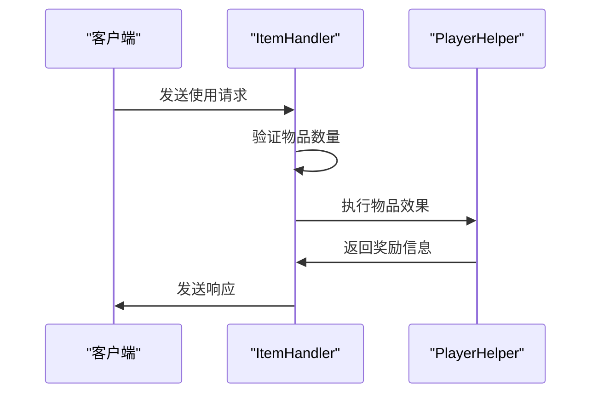
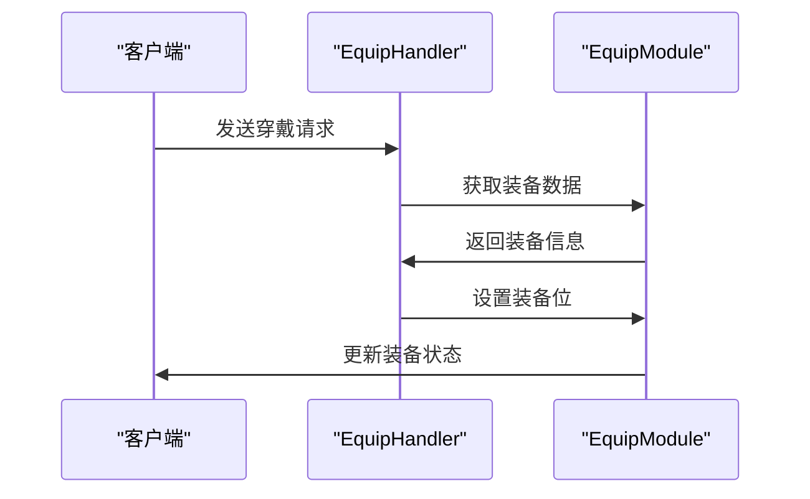
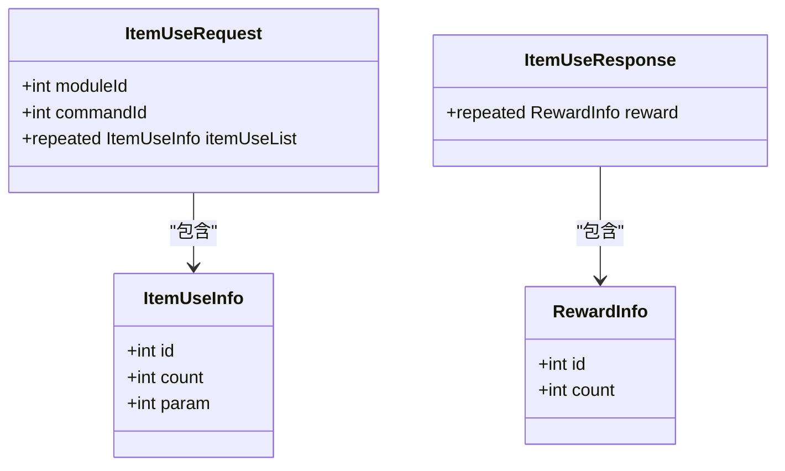
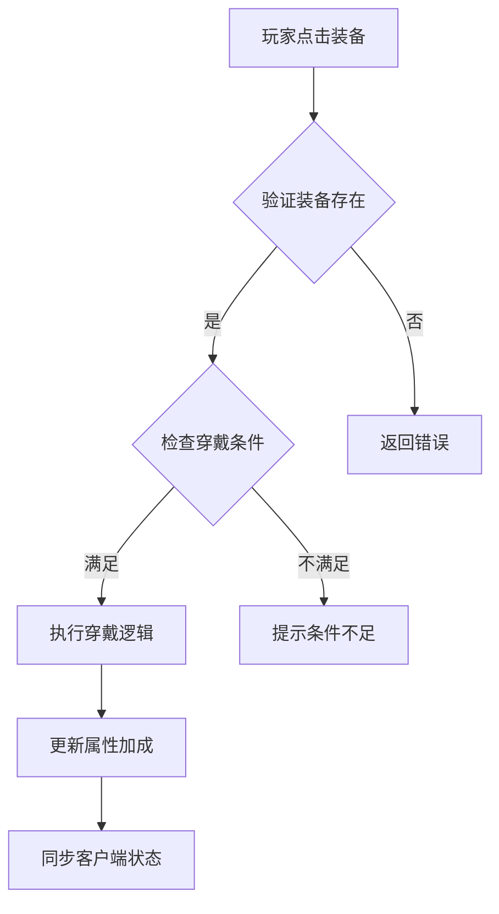

# 背包系统命令

<cite>
**本文档引用文件**   
- [BackpackModule.java](file://game\src\main\java\cn\game\games\net\game\module\backpack\BackpackModule.java)
- [BackpackSystem.java](file://game\src\main\java\cn\game\games\net\game\module\backpack\BackpackSystem.java)
- [Backpack.java](file://game\src\main\java\cn\game\games\net\game\module\backpack\Backpack.java)
- [ItemHandler.java](file://game\src\main\java\cn\game\games\net\game\module\item\ItemHandler.java)
- [EquipHandler.java](file://game\src\main\java\cn\game\games\net\game\module\develop\equip\EquipHandler.java)
- [BackpackType.java](file://game\src\main\java\cn\game\games\net\game\module\backpack\BackpackType.java)
- [ItemSlot.java](file://game\src\main\java\cn\game\games\net\game\module\backpack\ItemSlot.java)
</cite>

## 目录
1. [简介](#简介)
2. [核心背包命令](#核心背包命令)
3. [背包命令数据结构](#背包命令数据结构)
4. [权限控制与安全校验](#权限控制与安全校验)
5. [调用示例与交互流程](#调用示例与交互流程)
6. [附录](#附录)

## 简介
本文档全面记录了游戏服务器中背包系统的Socket命令，涵盖物品获取、使用、分解、穿戴及背包扩展等核心功能。通过分析代码实现，详细说明了各命令的业务场景、触发条件、前置验证、后置效果以及数据结构定义。文档还包含了权限控制机制和典型调用示例，为开发者提供完整的背包系统操作指南。

## 核心背包命令

### 物品获取与添加
物品获取命令用于将新物品添加至玩家背包。该操作通常由任务奖励、战斗掉落或商店购买等场景触发。

**前置验证：**
- 验证目标背包是否存在
- 检查背包是否有足够空间容纳新物品
- 验证物品配置的有效性

**后置效果：**
- 物品成功添加至背包，更新物品数量
- 若为可堆叠物品，优先合并到现有堆叠
- 触发相关事件（如成就系统）

**Section sources**
- [BackpackSystem.java](file://game\src\main\java\cn\game\games\net\game\module\backpack\BackpackSystem.java#L69-L80)
- [Backpack.java](file://game\src\main\java\cn\game\games\net\game\module\backpack\Backpack.java#L226-L298)

### 物品使用
物品使用命令允许玩家消耗背包中的道具以获得相应效果。此命令由玩家点击使用物品触发。

**前置验证：**
- 验证物品存在性和数量充足
- 检查物品使用条件（如等级限制）
- 验证玩家操作频率

**后置效果：**
- 减少相应物品数量
- 执行物品效果逻辑（如恢复生命值、获得增益状态）
- 更新客户端显示

**Diagram sources**
- [ItemHandler.java](file://game\src\main\java\cn\game\games\net\game\module\item\ItemHandler.java#L46-L85)

### 物品分解
物品分解命令用于将装备等物品分解为材料资源。此功能常用于回收无用装备。

**前置验证：**
- 验证待分解物品的存在性
- 检查物品是否可分解
- 验证目标背包空间是否足够存放分解产物

**后置效果：**
- 移除被分解的物品
- 向玩家添加分解获得的材料
- 更新相关统计信息

**Section sources**
- [EquipHandler.java](file://game\src\main\java\cn\game\games\net\game\module\develop\equip\EquipHandler.java#L114-L137)

### 物品穿戴
物品穿戴命令实现装备的装备与卸下操作。该命令由玩家在装备界面点击操作触发。

**前置验证：**
- 验证装备是否存在
- 检查装备穿戴条件（如职业、等级）
- 验证目标装备位是否空闲

**后置效果：**
- 更新装备位状态
- 应用装备属性加成
- 触发装备相关事件

**Diagram sources**
- [EquipHandler.java](file://game\src\main\java\cn\game\games\net\game\module\develop\equip\EquipHandler.java#L51-L70)

### 背包扩展
背包扩展命令允许玩家增加特定类型背包的容量上限。

**前置验证：**
- 验证背包类型有效性
- 检查扩展后容量是否超过最大限制
- 验证扩展所需资源是否充足

**后置效果：**
- 增加背包格子数量
- 更新客户端背包界面
- 持久化存储新的背包配置

**Section sources**
- [BackpackSystem.java](file://game\src\main\java\cn\game\games\net\game\module\backpack\BackpackSystem.java#L57-L65)
- [Backpack.java](file://game\src\main\java\cn\game\games\net\game\module\backpack\Backpack.java#L76-L102)

## 背包命令数据结构

### 协议缓冲区序列化格式
背包系统使用Protocol Buffer进行网络通信数据的序列化。主要消息结构包括请求和响应两类。

#### 请求消息结构
- **命令码字段**：标识具体操作类型
- **参数字段**：包含操作所需的具体参数
- **校验字段**：用于安全验证

#### 响应消息结构
- **状态码字段**：指示操作结果
- **奖励信息字段**：包含获得的物品或资源
- **更新数据字段**：需要同步到客户端的变更数据

**Diagram sources**
- [ItemHandler.java](file://game\src\main\java\cn\game\games\net\game\module\item\ItemHandler.java#L47-L48)

## 权限控制与安全校验

### 访问级别控制
不同背包命令具有不同的访问权限级别：
- **高权限命令**：如背包扩展，需验证付费状态
- **中权限命令**：如物品分解，需验证操作合法性
- **基础权限命令**：如物品使用，仅需基本验证

### 安全校验机制
系统实施多层安全校验：
- **请求频率限制**：防止自动化脚本滥用
- **数据一致性校验**：确保客户端与服务器数据同步
- **操作合法性验证**：防止非法物品操作

**Section sources**
- [ItemHandler.java](file://game\src\main\java\cn\game\games\net\game\module\item\ItemHandler.java#L52-L57)
- [EquipHandler.java](file://game\src\main\java\cn\game\games\net\game\module\develop\equip\EquipHandler.java#L58-L60)

## 调用示例与交互流程

### 装备穿戴流程
典型装备穿戴交互流程如下：

**Diagram sources**
- [EquipHandler.java](file://game\src\main\java\cn\game\games\net\game\module\develop\equip\EquipHandler.java#L51-L70)

### 物品合成流程
物品合成涉及多个背包命令的组合调用：

1. 验证合成材料是否齐全
2. 消耗合成材料
3. 添加合成产物
4. 更新背包状态

**Section sources**
- [ItemHandler.java](file://game\src\main\java\cn\game\games\net\game\module\item\ItemHandler.java#L46-L85)
- [BackpackSystem.java](file://game\src\main\java\cn\game\games\net\game\module\backpack\BackpackSystem.java#L149-L157)

## 附录

### 背包类型定义
系统支持多种背包类型，每种类型具有不同的特性：

| 背包类型 | 初始容量 | 最大容量 | 最大堆叠数 |
|---------|---------|---------|----------|
| 装备背包 | 30 | 100 | 1 |
| 材料背包 | 40 | 200 | 999 |
| 任务背包 | 20 | 50 | 50 |

**Section sources**
- [BackpackType.java](file://game\src\main\java\cn\game\games\net\game\module\backpack\BackpackType.java#L6-L9)
- [BackpackSystem.java](file://game\src\main\java\cn\game\games\net\game\module\backpack\BackpackSystem.java#L36-L43)

### 格子状态管理
背包格子支持锁定状态，用于保护重要物品：

- **锁定状态**：防止误操作移除物品
- **解锁状态**：允许正常操作
- 状态变更需通过专门命令

**Section sources**
- [ItemSlot.java](file://game\src\main\java\cn\game\games\net\game\module\backpack\ItemSlot.java#L9-L36)
- [Backpack.java](file://game\src\main\java\cn\game\games\net\game\module\backpack\Backpack.java#L165-L186)