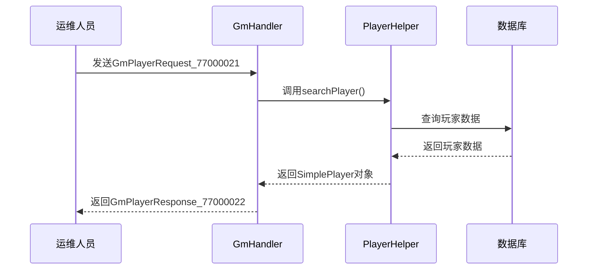
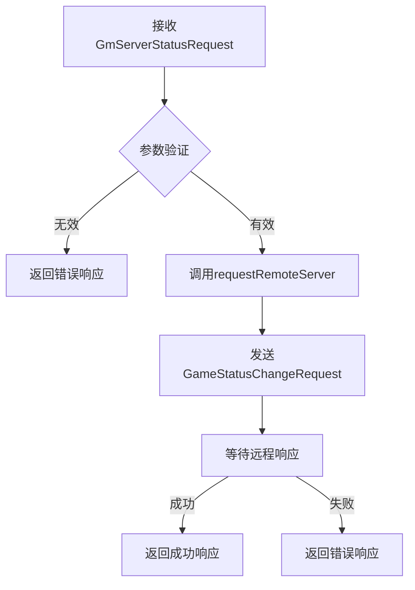
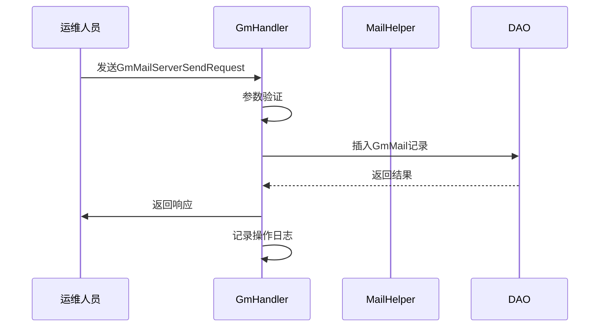
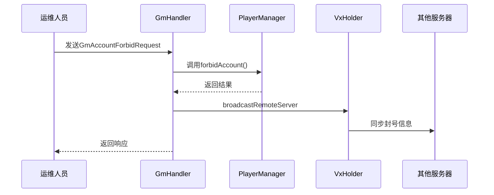
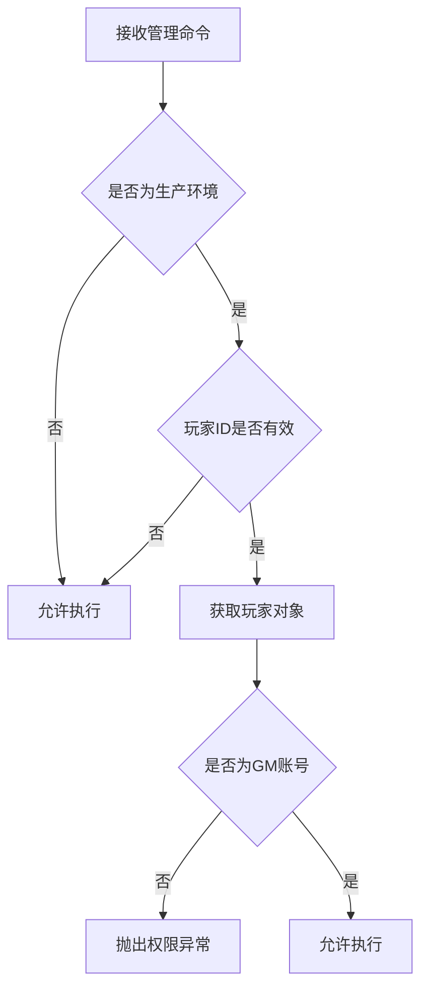
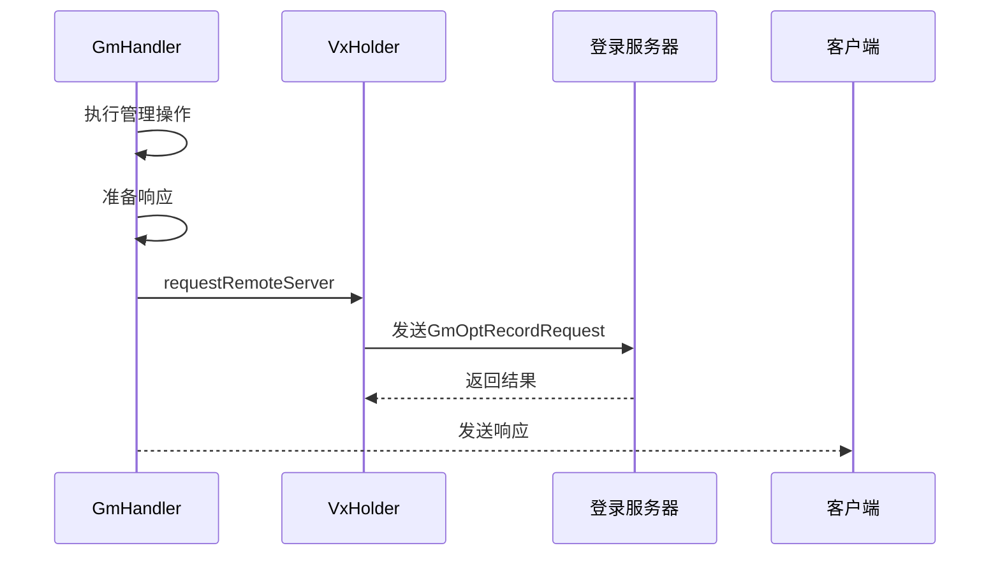
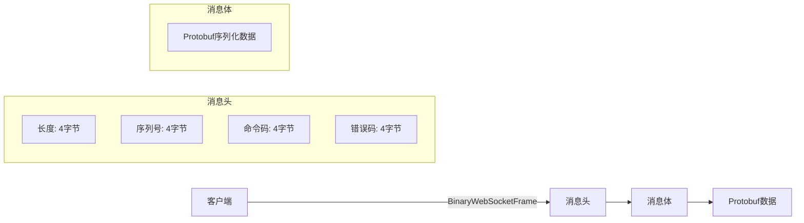
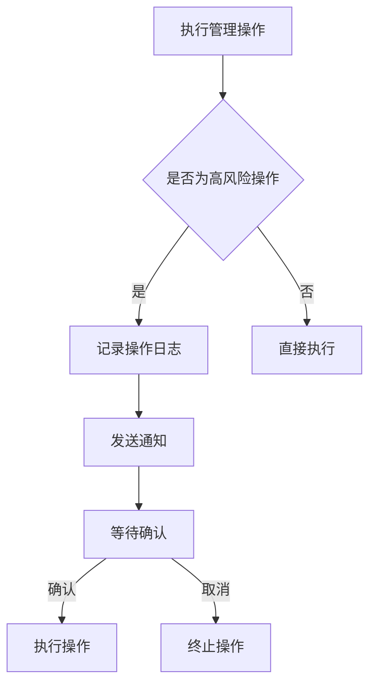

# 管理命令

<cite>
**本文档引用文件**   
- [GmHandler.java](file://game/src/main/java/cn/game/games/net/game/gm/GmHandler.java)
- [GmBaseHandler.java](file://game/src/main/java/cn/game/games/net/game/handler/GmBaseHandler.java)
- [GmMsg.proto](file://protocol/src/main/proto/GmMsg.proto)
- [ServerHandler.java](file://game/src/main/java/cn/game/games/net/game/handler/ServerHandler.java)
- [PlayerHelper.java](file://game/src/main/java/cn/game/games/net/game/helper/PlayerHelper.java)
- [GmOpt.java](file://game/src/main/java/cn/game/games/cache/entity/GmOpt.java)
- [GmOptData.java](file://login/src/main/java/cn/game/login/cache/entity/GmOpt.java)
- [WebSocketEncoder.java](file://game/src/main/java/cn/game/games/core/netty/WebSocketEncoder.java)
- [ImprovedClientHandler.java](file://simulationclient/src/main/java/cn/game/simulation/socket/ImprovedClientHandler.java)
</cite>

## 目录
1. [引言](#引言)
2. [管理命令体系](#管理命令体系)
3. [核心管理功能](#核心管理功能)
4. [权限验证机制](#权限验证机制)
5. [操作审计与日志记录](#操作审计与日志记录)
6. [调用流程与通信协议](#调用流程与通信协议)
7. [风险控制措施](#风险控制措施)
8. [使用场景示例](#使用场景示例)
9. [安全说明](#安全说明)
10. [附录](#附录)

## 引言

本文档详细说明了游戏服务器运维和管理功能相关的Socket命令，涵盖服务器状态查询、玩家数据修改、系统参数调整、批量操作等核心管理功能。文档重点阐述了管理命令的安全机制，包括权限验证、操作审计、风险控制等关键措施，确保管理操作的安全性和可追溯性。

管理命令系统通过专用的GmHandler处理所有管理请求，所有命令均以0x77作为模块标识，通过Protobuf协议进行通信。系统实现了完整的操作日志记录机制，所有管理操作都会被记录到数据库中，便于后续审计和追踪。

**Section sources**
- [GmHandler.java](file://game/src/main/java/cn/game/games/net/game/gm/GmHandler.java#L73-L79)

## 管理命令体系

管理命令系统基于Protobuf协议定义，所有命令码均以0x77开头，形成独立的管理模块。命令体系分为多个功能类别，包括玩家管理、服务器管理、邮件管理、封号管理等。

```mermaid
graph TD
A[管理命令体系] --> B[玩家管理]
A --> C[服务器管理]
A --> D[邮件管理]
A --> E[封号管理]
A --> F[数据查询]
B --> B1[GmPlayerRequest_77000021]
B --> B2[GmPlayerRenameRequest_77000050]
B --> B3[GmPlayerDeleteRequest_77000052]
B --> B4[GmPlayerTDLevelRequest_77000054]
B --> B5[GmPlayerLogoutRequest_77000009]
C --> C1[GmServerStatusRequest_77000032]
C --> C2[GmServerOpRequest_77000030]
C --> C3[GmShutdownServerRequest_77000001]
D --> D1[GmMailServerSendRequest_77000048]
D --> D2[GmMailListRequest_77000042]
D --> D3[GmMailCheckRequest_77000044]
D --> D4[GmMailDeleteRequest_77000046]
E --> E1[GmAccountForbidRequest_77000005]
E --> E2[GmAccountUnblockRequest_77000007]
E --> E3[GmAccountForbidListRequest_77000003]
F --> F1[GmOperationRequest_77000071]
```

**Diagram sources**
- [GmMsg.proto](file://protocol/src/main/proto/GmMsg.proto#L8-L376)

**Section sources**
- [GmMsg.proto](file://protocol/src/main/proto/GmMsg.proto#L8-L376)
- [GmHandler.java](file://game/src/main/java/cn/game/games/net/game/gm/GmHandler.java#L84-L98)

## 核心管理功能

### 玩家数据管理

玩家数据管理功能允许管理员查询和修改玩家数据，包括基本信息、等级、装备等。系统通过PlayerHelper工具类实现玩家数据的加载、修改和保存，支持在线和离线玩家的操作。

**Diagram sources**
- [GmHandler.java](file://game/src/main/java/cn/game/games/net/game/gm/GmHandler.java#L335-L344)
- [PlayerHelper.java](file://game/src/main/java/cn/game/games/net/game/helper/PlayerHelper.java#L1985-L2097)

**Section sources**
- [GmHandler.java](file://game/src/main/java/cn/game/games/net/game/gm/GmHandler.java#L335-L344)
- [PlayerHelper.java](file://game/src/main/java/cn/game/games/net/game/helper/PlayerHelper.java#L1985-L2097)

### 服务器状态管理

服务器状态管理功能允许管理员查询和修改服务器状态，包括正常开放和维护模式的切换。系统通过VxHolder.requestRemoteServer与远程服务器通信，实现跨服务器的状态管理。

**Diagram sources**
- [GmHandler.java](file://game/src/main/java/cn/game/games/net/game/gm/GmHandler.java#L143-L159)

**Section sources**
- [GmHandler.java](file://game/src/main/java/cn/game/games/net/game/gm/GmHandler.java#L143-L159)

### 邮件管理

邮件管理功能支持全服邮件和个人邮件的发送、审核、删除等操作。系统实现了完整的邮件审核流程，所有邮件在发送前必须经过审核，确保内容合规。

**Diagram sources**
- [GmHandler.java](file://game/src/main/java/cn/game/games/net/game/gm/GmHandler.java#L172-L229)

**Section sources**
- [GmHandler.java](file://game/src/main/java/cn/game/games/net/game/gm/GmHandler.java#L172-L229)

### 封号管理

封号管理功能允许管理员对违规玩家进行封禁或解封操作。系统支持永久封禁和限时封禁，并会自动将封号信息同步到所有游戏服务器节点。

**Diagram sources**
- [GmHandler.java](file://game/src/main/java/cn/game/games/net/game/gm/GmHandler.java#L401-L444)

**Section sources**
- [GmHandler.java](file://game/src/main/java/cn/game/games/net/game/gm/GmHandler.java#L401-L444)

## 权限验证机制

管理命令系统实现了严格的权限验证机制，确保只有授权人员才能执行管理操作。权限验证在GmBaseHandler.checkExt方法中实现，采用多层验证策略。

权限验证流程包括：
1. 环境检查：非生产环境允许所有操作
2. 玩家ID验证：检查请求来源的玩家ID
3. GM身份验证：检查玩家是否具有GM权限

**Diagram sources**
- [GmBaseHandler.java](file://game/src/main/java/cn/game/games/net/game/handler/GmBaseHandler.java#L13-L29)

**Section sources**
- [GmBaseHandler.java](file://game/src/main/java/cn/game/games/net/game/handler/GmBaseHandler.java#L13-L29)

## 操作审计与日志记录

系统实现了完整的操作审计机制，所有管理操作都会被记录到操作日志中。日志记录在sendAndRecordOpt方法中实现，包含操作详情、参数和结果。

操作日志包含以下信息：
- 操作时间
- 操作原因
- 操作玩家ID
- 请求参数
- 操作结果

**Diagram sources**
- [GmHandler.java](file://game/src/main/java/cn/game/games/net/game/gm/GmHandler.java#L360-L378)

**Section sources**
- [GmHandler.java](file://game/src/main/java/cn/game/games/net/game/gm/GmHandler.java#L360-L378)
- [GmOpt.java](file://game/src/main/java/cn/game/games/cache/entity/GmOpt.java#L1-L81)
- [GmOptData.java](file://login/src/main/java/cn/game/login/cache/entity/GmOpt.java#L1-L85)

## 调用流程与通信协议

管理命令通过WebSocket协议进行通信，采用二进制帧格式传输数据。通信协议包含消息头和消息体，消息头包含长度、序列号、命令码和错误码。

通信流程：
1. 客户端构造Protobuf消息
2. 序列化为字节数组
3. 添加消息头（长度、序列号、命令码、错误码）
4. 封装为BinaryWebSocketFrame
5. 通过WebSocket发送

**Diagram sources**
- [WebSocketEncoder.java](file://game/src/main/java/cn/game/games/core/netty/WebSocketEncoder.java#L13-L31)
- [ImprovedClientHandler.java](file://simulationclient/src/main/java/cn/game/simulation/socket/ImprovedClientHandler.java#L16-L95)

**Section sources**
- [WebSocketEncoder.java](file://game/src/main/java/cn/game/games/core/netty/WebSocketEncoder.java#L13-L31)
- [ImprovedClientHandler.java](file://simulationclient/src/main/java/cn/game/simulation/socket/ImprovedClientHandler.java#L16-L95)

## 风险控制措施

系统实施了多项风险控制措施，防止误操作和恶意操作。包括操作确认、批量操作限制、敏感操作保护等机制。

### 操作确认机制

对于高风险操作（如删除玩家数据、关闭服务器），系统要求二次确认。通过记录操作日志并发送通知，确保操作可追溯。

### 批量操作限制

批量操作（如批量封号）有数量限制，防止一次性处理过多数据导致系统压力过大。系统采用异步处理方式，避免阻塞主线程。

### 敏感操作保护

敏感操作（如修改玩家等级）需要额外验证，确保操作的合法性和安全性。系统记录所有敏感操作的详细信息，便于审计。

**Section sources**
- [GmHandler.java](file://game/src/main/java/cn/game/games/net/game/gm/GmHandler.java#L123-L124)
- [GmHandler.java](file://game/src/main/java/cn/game/games/net/game/gm/GmHandler.java#L382-L384)

## 使用场景示例

### 日常运维场景

**场景：服务器维护模式切换**
1. 运维人员登录管理后台
2. 发送GmServerStatusRequest命令
3. 设置服务器状态为维护模式
4. 系统验证参数并执行操作
5. 记录操作日志并返回结果

**场景：玩家数据查询**
1. 运维人员输入玩家ID或名称
2. 发送GmPlayerRequest命令
3. 系统查询玩家数据
4. 返回玩家基本信息、等级、战力等数据
5. 记录查询操作日志

### 紧急处理场景

**场景：违规玩家封禁**
1. 发现玩家违规行为
2. 发送GmAccountForbidRequest命令
3. 指定玩家ID、封禁原因和时长
4. 系统执行封禁并同步到所有服务器
5. 记录封禁操作日志

**场景：全服邮件发送**
1. 准备邮件内容和附件
2. 发送GmMailServerSendRequest命令
3. 系统验证参数并创建邮件记录
4. 邮件进入审核流程
5. 审核通过后发送给符合条件的玩家

**Section sources**
- [GmHandler.java](file://game/src/main/java/cn/game/games/net/game/gm/GmHandler.java)
- [GmMsg.proto](file://protocol/src/main/proto/GmMsg.proto)

## 安全说明

管理命令系统必须严格遵守安全规范，确保系统和数据的安全性。主要安全要求包括：

1. **权限最小化**：只授予必要的管理权限，避免权限滥用
2. **操作审计**：所有管理操作必须记录详细日志，确保可追溯性
3. **环境隔离**：生产环境和测试环境严格分离，禁止在生产环境进行测试操作
4. **敏感数据保护**：禁止通过管理命令获取或修改敏感用户数据
5. **定期审查**：定期审查管理操作日志，发现异常操作及时处理

**Section sources**
- [GmBaseHandler.java](file://game/src/main/java/cn/game/games/net/game/handler/GmBaseHandler.java#L13-L29)
- [GmHandler.java](file://game/src/main/java/cn/game/games/net/game/gm/GmHandler.java#L360-L378)

## 附录

### 管理命令码列表

| 命令码 | 请求类型 | 响应类型 | 功能描述 |
|--------|---------|---------|---------|
| 77000001 | GmShutdownServerRequest | GmShutdownServerResponse | 关闭服务器 |
| 77000003 | GmAccountForbidListRequest | GmAccountForbidListResponse | 获取封号列表 |
| 77000005 | GmAccountForbidRequest | GmAccountForbidResponse | 封禁账号 |
| 77000007 | GmAccountUnblockRequest | GmAccountUnblockResponse | 解封账号 |
| 77000009 | GmPlayerLogoutRequest | GmPlayerLogouttResponse | 踢玩家下线 |
| 77000021 | GmPlayerRequest | GmPlayerResponse | 查询玩家信息 |
| 77000030 | GmServerOpRequest | GmServerOpResponse | 服务器操作 |
| 77000032 | GmServerStatusRequest | GmServerStatusResponse | 服务器状态管理 |
| 77000042 | GmMailListRequest | GmMailResponse | 邮件列表查询 |
| 77000044 | GmMailCheckRequest | GmMailCheckResponse | 邮件审核 |
| 77000046 | GmMailDeleteRequest | GmMailDeleteResponse | 删除邮件 |
| 77000048 | GmMailServerSendRequest | GmMailServerSendResponse | 发送全服邮件 |
| 77000050 | GmPlayerRenameRequest | GmPlayerRenameResponse | 玩家改名 |
| 77000052 | GmPlayerDeleteRequest | GmPlayerDeleteResponse | 删除玩家数据 |
| 77000054 | GmPlayerTDLevelRequest | GmPlayerTDLevelResponse | 设置天道修为等级 |
| 77000071 | GmOperationRequest | GmOperationResponse | 操作记录查询 |

**Section sources**
- [GmMsg.proto](file://protocol/src/main/proto/GmMsg.proto#L8-L376)