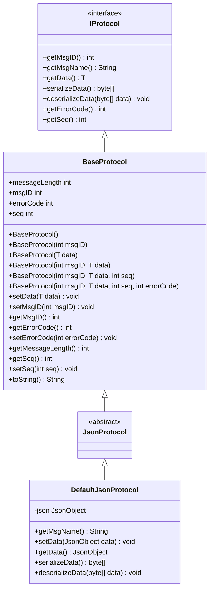
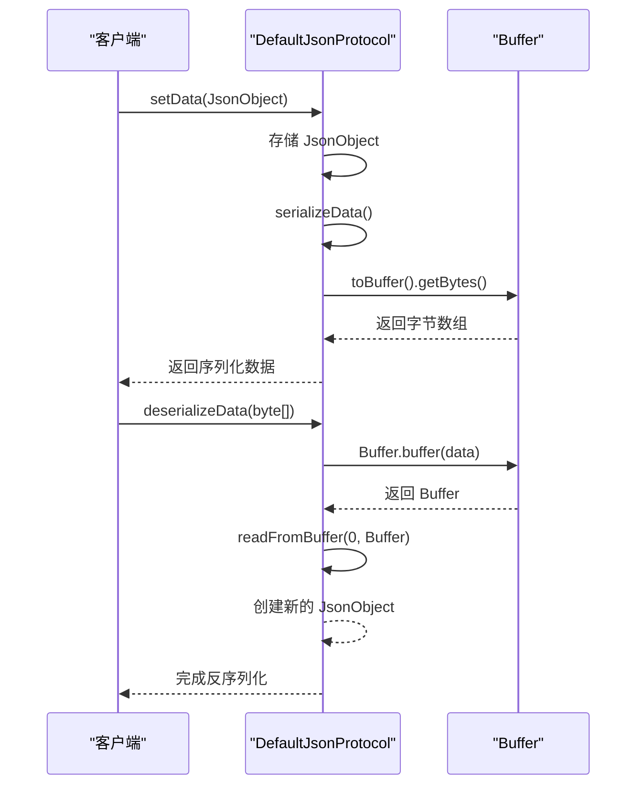
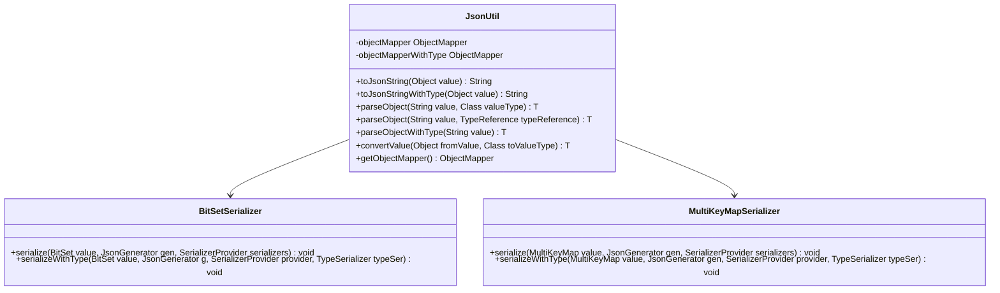
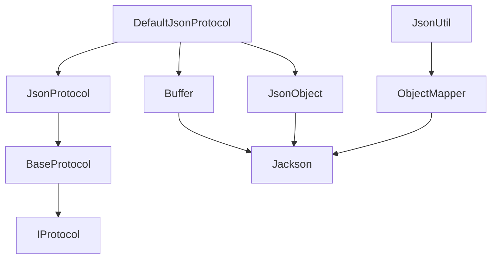

# JSON序列化

<cite>
**本文档引用的文件**  
- [DefaultJsonProtocol.java](file://core\src\main\java\cn\game\core\net\protocol\json\DefaultJsonProtocol.java)
- [JsonProtocol.java](file://core\src\main\java\cn\game\core\net\protocol\json\JsonProtocol.java)
- [JsonUtil.java](file://util\src\main\java\cn\game\util\JsonUtil.java)
- [BaseProtocol.java](file://core\src\main\java\cn\game\core\net\protocol\BaseProtocol.java)
- [IProtocol.java](file://core\src\main\java\cn\game\core\net\protocol\IProtocol.java)
- [GameServer.java](file://game\src\main\java\cn\game\games\net\game\GameServer.java)
- [DateUtil.java](file://util\src\main\java\cn\game\util\DateUtil.java)
- [VirtualServerRegistry.java](file://core\src\main\java\cn\game\core\base\VirtualServerRegistry.java)
</cite>

## 目录
1. [引言](#引言)
2. [核心组件](#核心组件)
3. [架构概述](#架构概述)
4. [详细组件分析](#详细组件分析)
5. [依赖分析](#依赖分析)
6. [性能考量](#性能考量)
7. [安全防护](#安全防护)
8. [结论](#结论)

## 引言
本文档全面介绍游戏服务器中JSON序列化的核心技术细节，重点分析`JsonProtocol`及其默认实现`DefaultJsonProtocol`的设计与应用。文档涵盖JSON协议的映射规则、配置选项、性能优化策略以及安全防护措施，旨在为开发者提供一个完整的JSON序列化技术参考。

## 核心组件
`JsonProtocol`是游戏服务器中用于处理JSON数据的核心抽象类，它继承自`BaseProtocol`，并定义了JSON数据的序列化和反序列化行为。`DefaultJsonProtocol`是`JsonProtocol`的具体实现，负责将`JsonObject`对象转换为字节数组，并在接收数据时将其还原。

**本节引用**
- [DefaultJsonProtocol.java](file://core\src\main\java\cn\game\core\net\protocol\json\DefaultJsonProtocol.java#L6-L36)
- [JsonProtocol.java](file://core\src\main\java\cn\game\core\net\protocol\json\JsonProtocol.java#L6-L9)

## 架构概述
JSON序列化在游戏服务器中扮演着关键角色，主要用于网络通信、数据持久化和配置管理。`JsonProtocol`通过`IProtocol`接口与网络层交互，确保数据在传输过程中的完整性和一致性。

**图表来源**
- [IProtocol.java](file://core\src\main\java\cn\game\core\net\protocol\IProtocol.java#L3-L36)
- [BaseProtocol.java](file://core\src\main\java\cn\game\core\net\protocol\BaseProtocol.java#L3-L73)
- [JsonProtocol.java](file://core\src\main\java\cn\game\core\net\protocol\json\JsonProtocol.java#L6-L9)
- [DefaultJsonProtocol.java](file://core\src\main\java\cn\game\core\net\protocol\json\DefaultJsonProtocol.java#L6-L36)

## 详细组件分析

### JsonProtocol 与 DefaultJsonProtocol 分析
`JsonProtocol`作为抽象基类，继承了`BaseProtocol`的所有基础属性和方法，并专注于JSON数据的处理。`DefaultJsonProtocol`实现了具体的序列化和反序列化逻辑，使用`JsonObject`作为数据载体。

#### 序列化与反序列化流程

**图表来源**
- [DefaultJsonProtocol.java](file://core\src\main\java\cn\game\core\net\protocol\json\DefaultJsonProtocol.java#L26-L34)

### JsonUtil 工具类分析
`JsonUtil`是项目中对Jackson库的封装，提供了统一的JSON序列化和反序列化接口。它支持自定义序列化器，如`BitSetSerializer`和`MultiKeyMapSerializer`，以处理特殊数据类型。

**图表来源**
- [JsonUtil.java](file://util\src\main\java\cn\game\util\JsonUtil.java#L43-L305)

## 依赖分析
JSON序列化模块依赖于`vertx-core`库中的`JsonObject`和`Buffer`类，以及`Jackson`库进行底层的JSON处理。`JsonUtil`通过静态初始化配置`ObjectMapper`，确保序列化行为的一致性。

**图表来源**
- [DefaultJsonProtocol.java](file://core\src\main\java\cn\game\core\net\protocol\json\DefaultJsonProtocol.java#L3-L4)
- [JsonUtil.java](file://util\src\main\java\cn\game\util\JsonUtil.java#L23-L30)

## 性能考量
为了优化JSON序列化的性能，建议使用流式API减少内存占用，并预编译序列化器以提升速度。此外，避免在高频率操作中使用`toJsonStringWithType`，因为它会增加额外的类型信息，导致数据体积增大。

**本节引用**
- [JsonUtil.java](file://util\src\main\java\cn\game\util\JsonUtil.java#L113-L120)
- [ToStringMapTest.java](file://game\src\test\java\performance\ToStringMapTest.java#L18-L26)

## 安全防护
为了防止JSON注入攻击和大型负载导致的拒绝服务问题，应在反序列化时严格验证输入数据，并限制请求体的大小。使用`JsonUtil.parseObject`时，应指定明确的目标类型，避免类型混淆。

**本节引用**
- [JsonUtil.java](file://util\src\main\java\cn\game\util\JsonUtil.java#L136-L144)
- [GameServer.java](file://game\src\main\java\cn\game\games\net\game\GameServer.java#L357-L360)

## 结论
`JsonProtocol`及其默认实现`DefaultJsonProtocol`为游戏服务器提供了高效、灵活的JSON序列化解决方案。通过合理配置和优化，可以在保证数据可读性的同时，有效控制性能开销。开发者应遵循最佳实践，确保序列化过程的安全性和稳定性。