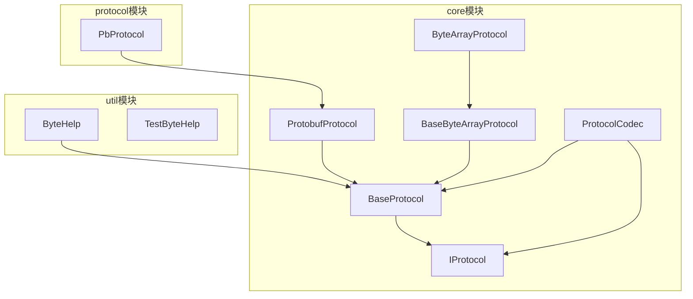
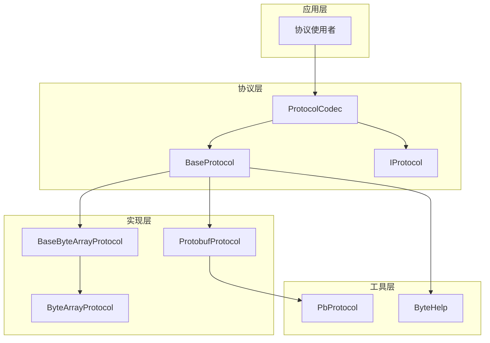
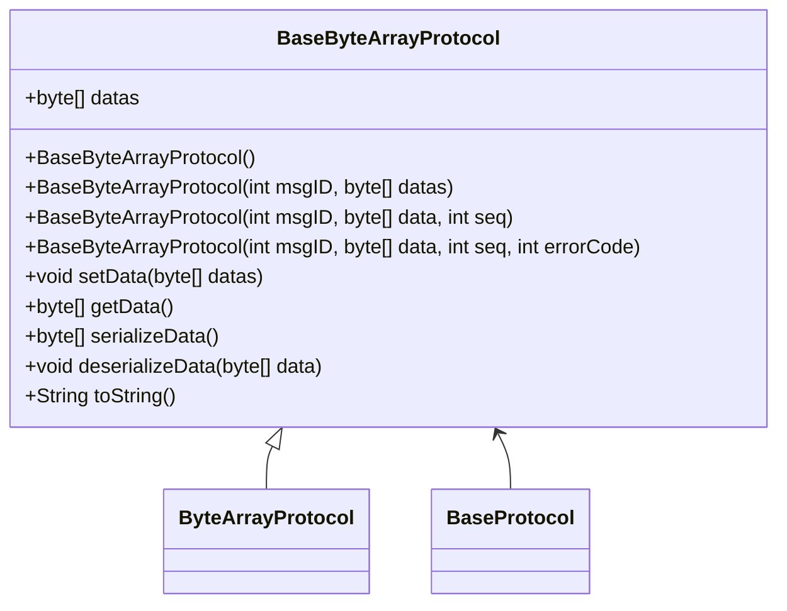
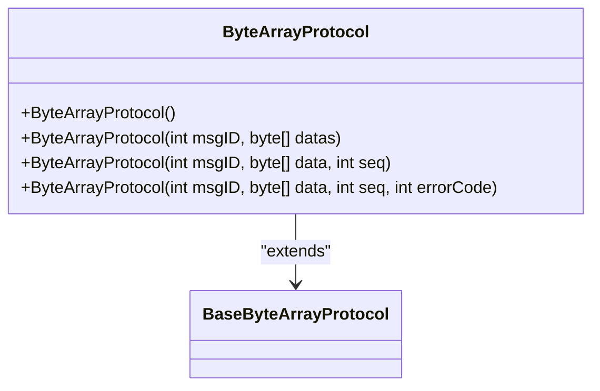
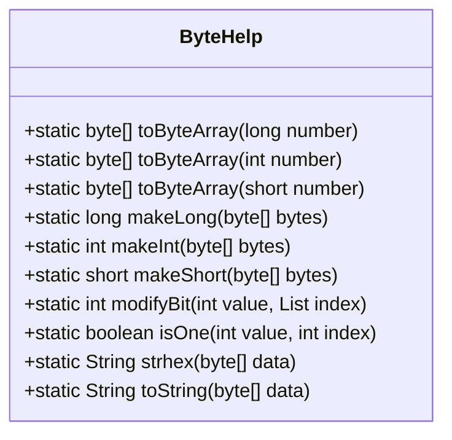
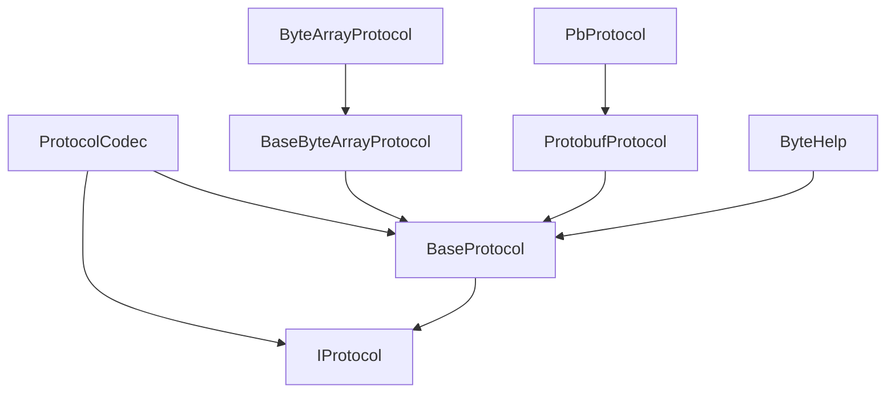

# 字节数组序列化

<cite>
**本文档引用的文件**   
- [BaseByteArrayProtocol.java](file://core/src/main/java/cn/game/core/net/protocol/bytes/BaseByteArrayProtocol.java)
- [ByteArrayProtocol.java](file://core/src/main/java/cn/game/core/net/protocol/bytes/ByteArrayProtocol.java)
- [ByteHelp.java](file://util/src/main/java/cn/game/util/ByteHelp.java)
- [BaseProtocol.java](file://core/src/main/java/cn/game/core/net/protocol/BaseProtocol.java)
- [IProtocol.java](file://core/src/main/java/cn/game/core/net/protocol/IProtocol.java)
- [PbProtocol.java](file://protocol/src/main/java/cn/game/protocol/protobuf/PbProtocol.java)
- [ProtobufProtocol.java](file://core/src/main/java/cn/game/core/net/protocol/object/ProtobufProtocol.java)
- [ProtocolCodec.java](file://core/src/main/java/cn/game/core/net/vertx/codec/ProtocolCodec.java)
- [TestByteHelp.java](file://util/src/test/java/cn/game/util/TestByteHelp.java)
</cite>

## 目录
1. [引言](#引言)
2. [项目结构](#项目结构)
3. [核心组件](#核心组件)
4. [架构概述](#架构概述)
5. [详细组件分析](#详细组件分析)
6. [依赖分析](#依赖分析)
7. [性能考虑](#性能考虑)
8. [故障排除指南](#故障排除指南)
9. [结论](#结论)

## 引言
本文档深入解析了字节数组序列化协议的实现细节，重点分析了BaseByteArrayProtocol和ByteArrayProtocol的设计与实现。文档详细说明了二进制协议的数据结构设计，包括头部信息、长度字段、校验码的布局和编码方式。同时，文档化了基本数据类型的序列化规则，如整数的变长编码、浮点数的IEEE 754表示和字符串的UTF-8编码。此外，还提供了位操作优化技巧，说明如何通过位域压缩减少数据包大小。文档还涵盖了协议版本管理和向后兼容性策略，指导开发者在协议升级时保持旧客户端的兼容性，并通过实际案例分析展示了如何设计高效的二进制通信协议。

## 项目结构
项目结构清晰地展示了字节数组序列化相关组件的组织方式。核心协议实现位于`core`模块的`cn.game.core.net.protocol`包中，而工具类则位于`util`模块的`cn.game.util`包中。协议解析器和生成器位于`protocol`模块中，测试代码则分布在各个模块的test目录下。

**图表来源**
- [BaseProtocol.java](file://core/src/main/java/cn/game/core/net/protocol/BaseProtocol.java)
- [IProtocol.java](file://core/src/main/java/cn/game/core/net/protocol/IProtocol.java)
- [BaseByteArrayProtocol.java](file://core/src/main/java/cn/game/core/net/protocol/bytes/BaseByteArrayProtocol.java)
- [ByteArrayProtocol.java](file://core/src/main/java/cn/game/core/net/protocol/bytes/ByteArrayProtocol.java)
- [ProtobufProtocol.java](file://core/src/main/java/cn/game/core/net/protocol/object/ProtobufProtocol.java)
- [ProtocolCodec.java](file://core/src/main/java/cn/game/core/net/vertx/codec/ProtocolCodec.java)
- [ByteHelp.java](file://util/src/main/java/cn/game/util/ByteHelp.java)
- [PbProtocol.java](file://protocol/src/main/java/cn/game/protocol/protobuf/PbProtocol.java)

**章节来源**
- [BaseProtocol.java](file://core/src/main/java/cn/game/core/net/protocol/BaseProtocol.java)
- [IProtocol.java](file://core/src/main/java/cn/game/core/net/protocol/IProtocol.java)
- [BaseByteArrayProtocol.java](file://core/src/main/java/cn/game/core/net/protocol/bytes/BaseByteArrayProtocol.java)
- [ByteArrayProtocol.java](file://core/src/main/java/cn/game/core/net/protocol/bytes/ByteArrayProtocol.java)
- [ProtobufProtocol.java](file://core/src/main/java/cn/game/core/net/protocol/object/ProtobufProtocol.java)
- [ProtocolCodec.java](file://core/src/main/java/cn/game/core/net/vertx/codec/ProtocolCodec.java)
- [ByteHelp.java](file://util/src/main/java/cn/game/util/ByteHelp.java)
- [PbProtocol.java](file://protocol/src/main/java/cn/game/protocol/protobuf/PbProtocol.java)

## 核心组件
字节数组序列化的核心组件包括BaseByteArrayProtocol、ByteArrayProtocol和ByteHelp。BaseByteArrayProtocol是所有字节数组协议的基类，提供了基本的序列化和反序列化功能。ByteArrayProtocol是BaseByteArrayProtocol的具体实现，用于处理字节数组数据。ByteHelp是一个工具类，提供了各种字节操作方法，如字节数组与基本数据类型的转换、位操作等。

**章节来源**
- [BaseByteArrayProtocol.java](file://core/src/main/java/cn/game/core/net/protocol/bytes/BaseByteArrayProtocol.java)
- [ByteArrayProtocol.java](file://core/src/main/java/cn/game/core/net/protocol/bytes/ByteArrayProtocol.java)
- [ByteHelp.java](file://util/src/main/java/cn/game/util/ByteHelp.java)

## 架构概述
字节数组序列化架构基于分层设计，底层是字节操作工具类ByteHelp，中间层是协议基类BaseProtocol和接口IProtocol，上层是具体的协议实现类如BaseByteArrayProtocol和ByteArrayProtocol。协议编解码器ProtocolCodec负责将协议对象序列化为字节数组并在网络上传输，以及将接收到的字节数组反序列化为协议对象。

**图表来源**
- [BaseProtocol.java](file://core/src/main/java/cn/game/core/net/protocol/BaseProtocol.java)
- [IProtocol.java](file://core/src/main/java/cn/game/core/net/protocol/IProtocol.java)
- [BaseByteArrayProtocol.java](file://core/src/main/java/cn/game/core/net/protocol/bytes/BaseByteArrayProtocol.java)
- [ByteArrayProtocol.java](file://core/src/main/java/cn/game/core/net/protocol/bytes/ByteArrayProtocol.java)
- [ProtobufProtocol.java](file://core/src/main/java/cn/game/core/net/protocol/object/ProtobufProtocol.java)
- [ProtocolCodec.java](file://core/src/main/java/cn/game/core/net/vertx/codec/ProtocolCodec.java)
- [ByteHelp.java](file://util/src/main/java/cn/game/util/ByteHelp.java)
- [PbProtocol.java](file://protocol/src/main/java/cn/game/protocol/protobuf/PbProtocol.java)

## 详细组件分析
### BaseByteArrayProtocol分析
BaseByteArrayProtocol是字节数组协议的抽象基类，继承自BaseProtocol<byte[]>。它定义了字节数组协议的基本结构和行为，包括消息ID、错误码、序列号和数据字段。该类提供了setData、getData、serializeData和deserializeData等方法，用于设置和获取协议数据，以及序列化和反序列化数据。

**图表来源**
- [BaseByteArrayProtocol.java](file://core/src/main/java/cn/game/core/net/protocol/bytes/BaseByteArrayProtocol.java)
- [ByteArrayProtocol.java](file://core/src/main/java/cn/game/core/net/protocol/bytes/ByteArrayProtocol.java)
- [BaseProtocol.java](file://core/src/main/java/cn/game/core/net/protocol/BaseProtocol.java)

**章节来源**
- [BaseByteArrayProtocol.java](file://core/src/main/java/cn/game/core/net/protocol/bytes/BaseByteArrayProtocol.java)

### ByteArrayProtocol分析
ByteArrayProtocol是BaseByteArrayProtocol的具体实现，提供了字节数组协议的完整功能。它继承了BaseByteArrayProtocol的所有方法，并可以添加特定于字节数组协议的额外功能。

**图表来源**
- [ByteArrayProtocol.java](file://core/src/main/java/cn/game/core/net/protocol/bytes/ByteArrayProtocol.java)
- [BaseByteArrayProtocol.java](file://core/src/main/java/cn/game/core/net/protocol/bytes/BaseByteArrayProtocol.java)

**章节来源**
- [ByteArrayProtocol.java](file://core/src/main/java/cn/game/core/net/protocol/bytes/ByteArrayProtocol.java)

### ByteHelp分析
ByteHelp是一个工具类，提供了各种字节操作方法。它包括将基本数据类型转换为字节数组的方法，如toByteArray(long)、toByteArray(int)和toByteArray(short)，以及将字节数组转换为基本数据类型的方法，如makeLong(byte[])、makeInt(byte[])和makeShort(byte[])。此外，它还提供了位操作方法，如modifyBit和isOne，用于处理位域压缩和解压缩。

**图表来源**
- [ByteHelp.java](file://util/src/main/java/cn/game/util/ByteHelp.java)

**章节来源**
- [ByteHelp.java](file://util/src/main/java/cn/game/util/ByteHelp.java)

## 依赖分析
字节数组序列化组件之间的依赖关系清晰，形成了一个分层架构。高层组件依赖于低层组件，但低层组件不依赖于高层组件。这种设计使得组件可以独立开发和测试，提高了代码的可维护性和可扩展性。

**图表来源**
- [BaseProtocol.java](file://core/src/main/java/cn/game/core/net/protocol/BaseProtocol.java)
- [IProtocol.java](file://core/src/main/java/cn/game/core/net/protocol/IProtocol.java)
- [BaseByteArrayProtocol.java](file://core/src/main/java/cn/game/core/net/protocol/bytes/BaseByteArrayProtocol.java)
- [ByteArrayProtocol.java](file://core/src/main/java/cn/game/core/net/protocol/bytes/ByteArrayProtocol.java)
- [ProtobufProtocol.java](file://core/src/main/java/cn/game/core/net/protocol/object/ProtobufProtocol.java)
- [ProtocolCodec.java](file://core/src/main/java/cn/game/core/net/vertx/codec/ProtocolCodec.java)
- [ByteHelp.java](file://util/src/main/java/cn/game/util/ByteHelp.java)
- [PbProtocol.java](file://protocol/src/main/java/cn/game/protocol/protobuf/PbProtocol.java)

**章节来源**
- [BaseProtocol.java](file://core/src/main/java/cn/game/core/net/protocol/BaseProtocol.java)
- [IProtocol.java](file://core/src/main/java/cn/game/core/net/protocol/IProtocol.java)
- [BaseByteArrayProtocol.java](file://core/src/main/java/cn/game/core/net/protocol/bytes/BaseByteArrayProtocol.java)
- [ByteArrayProtocol.java](file://core/src/main/java/cn/game/core/net/protocol/bytes/ByteArrayProtocol.java)
- [ProtobufProtocol.java](file://core/src/main/java/cn/game/core/net/protocol/object/ProtobufProtocol.java)
- [ProtocolCodec.java](file://core/src/main/java/cn/game/core/net/vertx/codec/ProtocolCodec.java)
- [ByteHelp.java](file://util/src/main/java/cn/game/util/ByteHelp.java)
- [PbProtocol.java](file://protocol/src/main/java/cn/game/protocol/protobuf/PbProtocol.java)

## 性能考虑
字节数组序列化在性能方面有多个优化点。首先，使用字节数组作为数据载体可以减少对象创建和垃圾回收的开销。其次，通过位域压缩可以减少数据包大小，从而降低网络传输成本。此外，使用直接内存和零拷贝技术可以进一步提高序列化和反序列化的性能。

## 故障排除指南
在使用字节数组序列化时，可能会遇到一些常见问题。例如，字节序问题可能导致数据解析错误，解决方法是统一使用大端序或小端序。数据长度不匹配可能导致解析失败，解决方法是在协议中包含长度字段。位域压缩错误可能导致数据损坏，解决方法是仔细检查位操作逻辑。

**章节来源**
- [TestByteHelp.java](file://util/src/test/java/cn/game/util/TestByteHelp.java)

## 结论
字节数组序列化是一种高效、灵活的通信协议设计方法。通过合理设计协议结构和使用位操作优化，可以显著提高通信效率和性能。本文档详细分析了BaseByteArrayProtocol和ByteArrayProtocol的实现细节，为开发者提供了设计和实现高效二进制通信协议的指导。