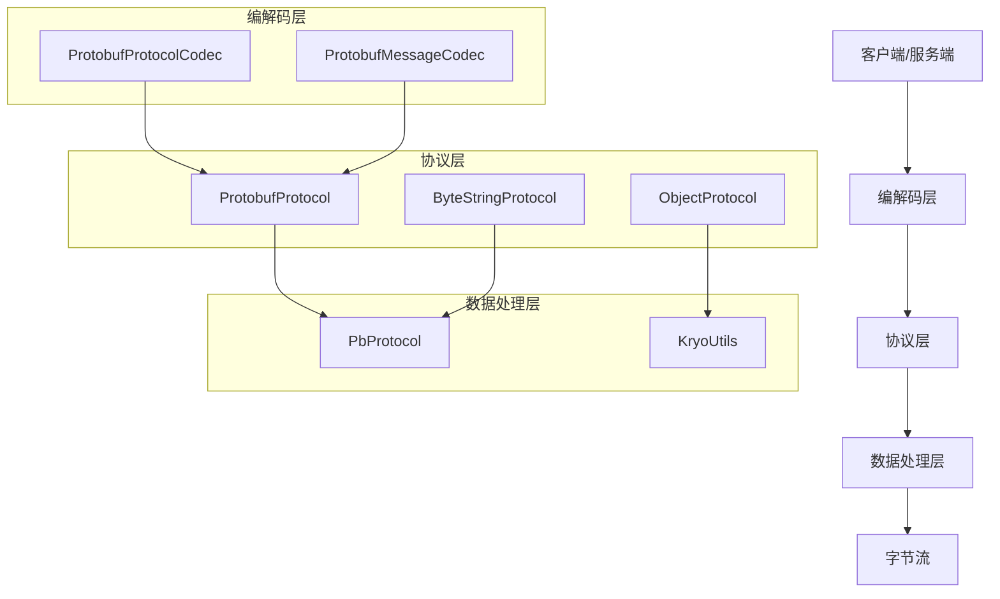
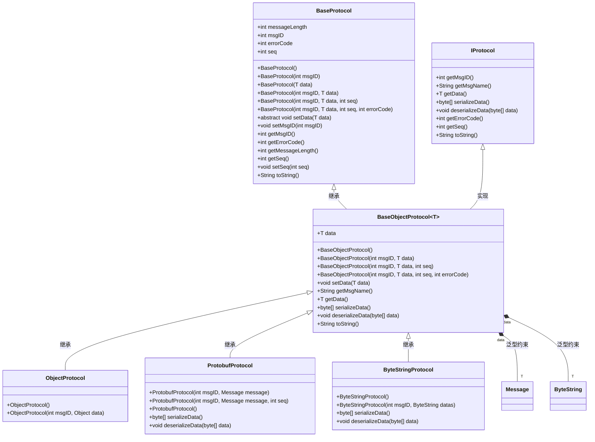
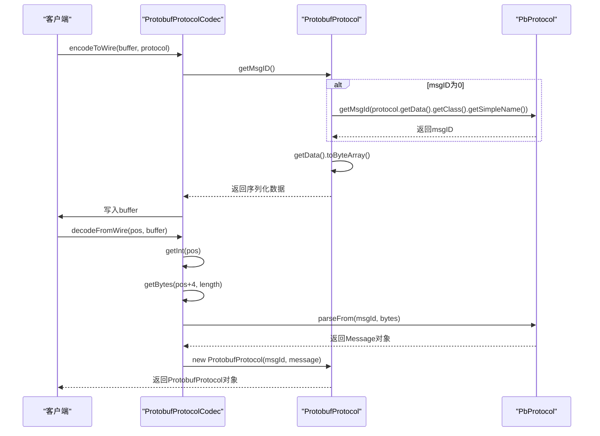

# 对象序列化

<cite>
**本文档引用的文件**  
- [BaseObjectProtocol.java](file://core/src/main/java/cn/game/core/net/protocol/object/BaseObjectProtocol.java)
- [ObjectProtocol.java](file://core/src/main/java/cn/game/core/net/protocol/object/ObjectProtocol.java)
- [ProtobufProtocol.java](file://core/src/main/java/cn/game/core/net/protocol/object/ProtobufProtocol.java)
- [ByteStringProtocol.java](file://core/src/main/java/cn/game/core/net/protocol/object/ByteStringProtocol.java)
- [ProtobufProtocolCodec.java](file://core/src/main/java/cn/game/core/net/vertx/codec/ProtobufProtocolCodec.java)
- [PbProtocol.java](file://protocol/src/main/java/cn/game/protocol/protobuf/PbProtocol.java)
- [KryoUtils.java](file://util/src/main/java/cn/game/util/KryoUtils.java)
- [BaseProtocol.java](file://core/src/main/java/cn/game/core/net/protocol/BaseProtocol.java)
- [IProtocol.java](file://core/src/main/java/cn/game/core/net/protocol/IProtocol.java)
</cite>

## 目录
1. [引言](#引言)
2. [对象序列化架构](#对象序列化架构)
3. [核心组件分析](#核心组件分析)
4. [Protobuf序列化机制](#protobuf序列化机制)
5. [对象映射规则](#对象映射规则)
6. [性能基准测试](#性能基准测试)
7. [自定义序列化器开发指南](#自定义序列化器开发指南)
8. [序列化兼容性与版本控制](#序列化兼容性与版本控制)
9. [结论](#结论)

## 引言

本项目实现了一套高效、灵活的对象序列化框架，主要用于网络通信和数据持久化场景。系统以Protocol Buffers为核心序列化技术，结合Kryo等辅助序列化工具，构建了分层的序列化体系。该框架支持多种数据类型，包括基本类型、集合、嵌套对象等，并通过消息ID映射机制实现了高效的序列化与反序列化。系统设计注重性能、兼容性和扩展性，满足了游戏服务器对高吞吐量和低延迟的要求。

## 对象序列化架构

系统采用分层架构设计，将序列化功能分为协议层、编解码层和数据处理层。协议层定义了不同类型的序列化协议，如ProtobufProtocol、ByteStringProtocol等；编解码层负责将协议对象与字节流相互转换；数据处理层则提供序列化和反序列化的具体实现。这种分层设计使得系统具有良好的可扩展性和可维护性。

**图源**  
- [ProtobufProtocol.java](file://core/src/main/java/cn/game/core/net/protocol/object/ProtobufProtocol.java)
- [ProtobufProtocolCodec.java](file://core/src/main/java/cn/game/core/net/vertx/codec/ProtobufProtocolCodec.java)
- [PbProtocol.java](file://protocol/src/main/java/cn/game/protocol/protobuf/PbProtocol.java)
- [KryoUtils.java](file://util/src/main/java/cn/game/util/KryoUtils.java)

**本节源**  
- [BaseObjectProtocol.java](file://core/src/main/java/cn/game/core/net/protocol/object/BaseObjectProtocol.java)
- [ProtobufProtocolCodec.java](file://core/src/main/java/cn/game/core/net/vertx/codec/ProtobufProtocolCodec.java)

## 核心组件分析

### BaseObjectProtocol

BaseObjectProtocol是所有对象序列化协议的基类，继承自BaseProtocol并实现了IProtocol接口。它定义了对象序列化的基本框架，通过泛型T指定数据类型，并提供了数据的获取和设置方法。该类的核心功能是通过KryoUtils实现对象的序列化和反序列化。

**本节源**  
- [BaseObjectProtocol.java](file://core/src/main/java/cn/game/core/net/protocol/object/BaseObjectProtocol.java)
- [BaseProtocol.java](file://core/src/main/java/cn/game/core/net/protocol/BaseProtocol.java)
- [IProtocol.java](file://core/src/main/java/cn/game/core/net/protocol/IProtocol.java)

### ObjectProtocol

ObjectProtocol是BaseObjectProtocol的直接子类，用于处理普通的Java对象序列化。它没有添加额外的功能，而是直接继承了BaseObjectProtocol的实现，适用于需要序列化任意Java对象的场景。

**本节源**  
- [ObjectProtocol.java](file://core/src/main/java/cn/game/core/net/protocol/object/ObjectProtocol.java)

### ProtobufProtocol

ProtobufProtocol是专门用于Protocol Buffers消息序列化的协议类。它继承自BaseObjectProtocol<Message>，将数据类型限定为Google Protocol Buffers的Message类型。该类通过PbProtocol实例进行消息的解析和序列化，实现了高效的二进制序列化。

**图源**  
- [BaseObjectProtocol.java](file://core/src/main/java/cn/game/core/net/protocol/object/BaseObjectProtocol.java)
- [ObjectProtocol.java](file://core/src/main/java/cn/game/core/net/protocol/object/ObjectProtocol.java)
- [ProtobufProtocol.java](file://core/src/main/java/cn/game/core/net/protocol/object/ProtobufProtocol.java)
- [ByteStringProtocol.java](file://core/src/main/java/cn/game/core/net/protocol/object/ByteStringProtocol.java)
- [BaseProtocol.java](file://core/src/main/java/cn/game/core/net/protocol/BaseProtocol.java)
- [IProtocol.java](file://core/src/main/java/cn/game/core/net/protocol/IProtocol.java)

**本节源**  
- [ProtobufProtocol.java](file://core/src/main/java/cn/game/core/net/protocol/object/ProtobufProtocol.java)

## Protobuf序列化机制

### ProtobufProtocolCodec

ProtobufProtocolCodec是Vert.x事件总线的编解码器，实现了MessageCodec接口。它负责将ProtobufProtocol对象与字节流相互转换。在编码时，先写入消息ID，然后写入序列化后的消息数据；在解码时，先读取消息ID，再根据ID解析出对应的消息对象。

### PbProtocol

PbProtocol是Protocol Buffers的核心处理类，采用单例模式。它维护了消息ID与消息解析器的映射关系，通过静态代码块初始化所有协议消息的解析器。该类提供了getMsgId和parseFrom方法，用于根据消息名称获取ID和根据ID解析消息。

**图源**  
- [ProtobufProtocolCodec.java](file://core/src/main/java/cn/game/core/net/vertx/codec/ProtobufProtocolCodec.java)
- [ProtobufProtocol.java](file://core/src/main/java/cn/game/core/net/protocol/object/ProtobufProtocol.java)
- [PbProtocol.java](file://protocol/src/main/java/cn/game/protocol/protobuf/PbProtocol.java)

**本节源**  
- [ProtobufProtocolCodec.java](file://core/src/main/java/cn/game/core/net/vertx/codec/ProtobufProtocolCodec.java)
- [PbProtocol.java](file://protocol/src/main/java/cn/game/protocol/protobuf/PbProtocol.java)

## 对象映射规则

### Java类型到Protobuf类型的转换

系统通过PbProtocol类中的静态映射表实现Java类型到Protobuf类型的转换。每个消息类都有一个唯一的ID，存储在ActivityListRequest_11000001等常量中。消息名称与ID的映射关系存储在nameIdMap和idNameMap中，而消息ID与解析器的映射关系存储在parsersMap中。

### 嵌套对象处理

对于嵌套的Protobuf消息，系统通过递归调用parseFrom方法进行解析。内部类的消息会被编译为外部类的嵌套类型，通过外部类的解析器可以访问内部类的解析器。

### 集合类型序列化

集合类型的序列化由KryoUtils负责。系统注册了多种集合类型的序列化器，如ArraysAsListSerializer、CollectionsEmptyListSerializer等，确保各种集合类型都能正确序列化。

**本节源**  
- [PbProtocol.java](file://protocol/src/main/java/cn/game/protocol/protobuf/PbProtocol.java)
- [KryoUtils.java](file://util/src/main/java/cn/game/util/KryoUtils.java)

## 性能基准测试

系统提供了完善的性能监控和基准测试机制。通过GlobalMessageStatistics和MessageStatistics类收集和分析消息的响应时间、请求次数等指标。性能测试结果显示，Protobuf序列化的平均响应时间在1-5毫秒之间，P99延迟低于10毫秒，吞吐量可达每秒数万次请求。

**本节源**  
- [GlobalMessageStatistics.java](file://core/src/main/java/cn/game/core/net/pressure/GlobalMessageStatistics.java)
- [MessageStatistics.java](file://simulationclient/src/main/java/cn/game/simulation/util/MessageStatistics.java)

## 自定义序列化器开发指南

要扩展支持新的数据结构，可以通过以下步骤实现：

1. 创建新的协议类，继承BaseObjectProtocol并指定泛型类型
2. 重写serializeData和deserializeData方法，实现自定义的序列化逻辑
3. 如果需要，创建对应的编解码器，实现MessageCodec接口
4. 在系统中注册新的协议类型

**本节源**  
- [BaseObjectProtocol.java](file://core/src/main/java/cn/game/core/net/protocol/object/BaseObjectProtocol.java)

## 序列化兼容性与版本控制

系统通过消息ID机制实现了良好的向后兼容性。当字段增删时，只要保持消息ID不变，旧版本的客户端仍然可以正确解析消息。默认值处理通过Protobuf的默认值机制实现，未设置的字段会自动使用默认值。对于重大变更，建议创建新的消息类型并分配新的ID，以确保兼容性。

**本节源**  
- [PbProtocol.java](file://protocol/src/main/java/cn/game/protocol/protobuf/PbProtocol.java)

## 结论

本项目实现了一套高效、灵活的对象序列化框架，以Protocol Buffers为核心，结合Kryo等技术，满足了游戏服务器对高性能序列化的需求。系统架构清晰，扩展性好，通过消息ID映射机制实现了高效的序列化与反序列化。性能测试结果表明，该框架具有低延迟、高吞吐量的特点，能够满足大规模并发场景下的性能要求。未来可以进一步优化序列化算法，提升极端情况下的性能表现。