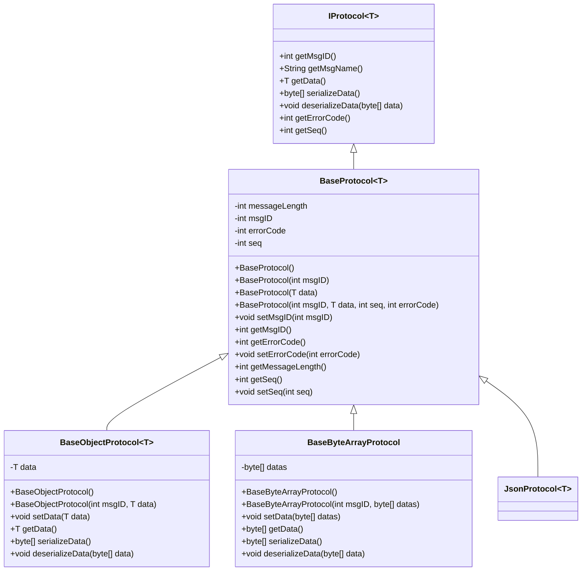
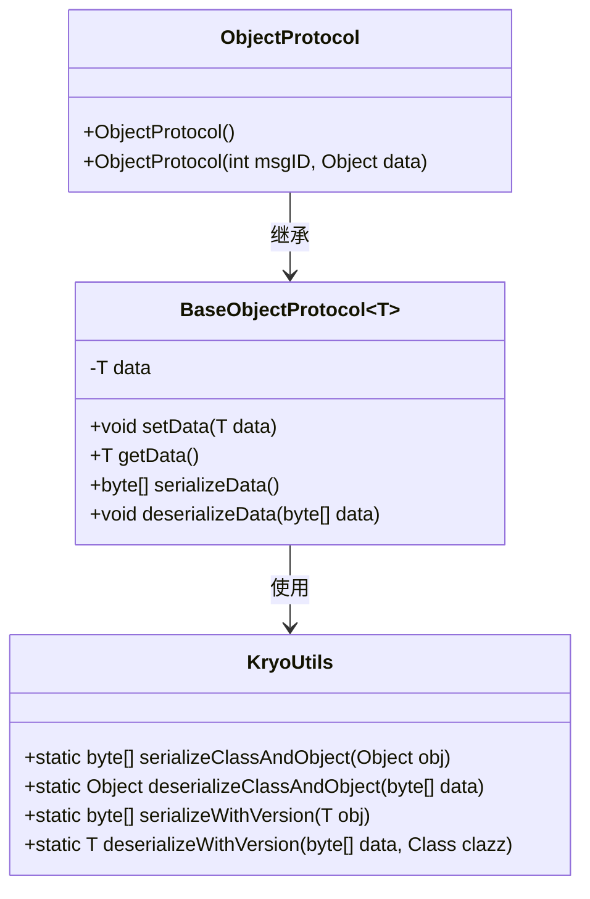
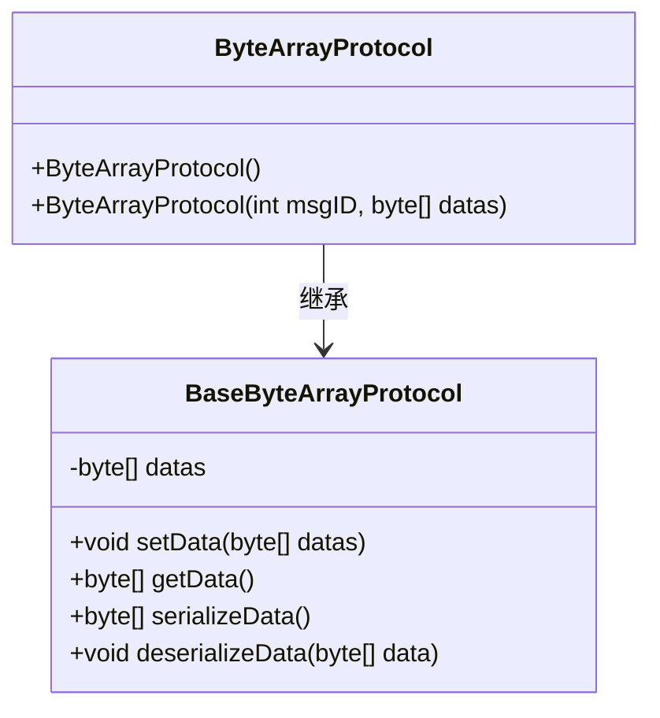
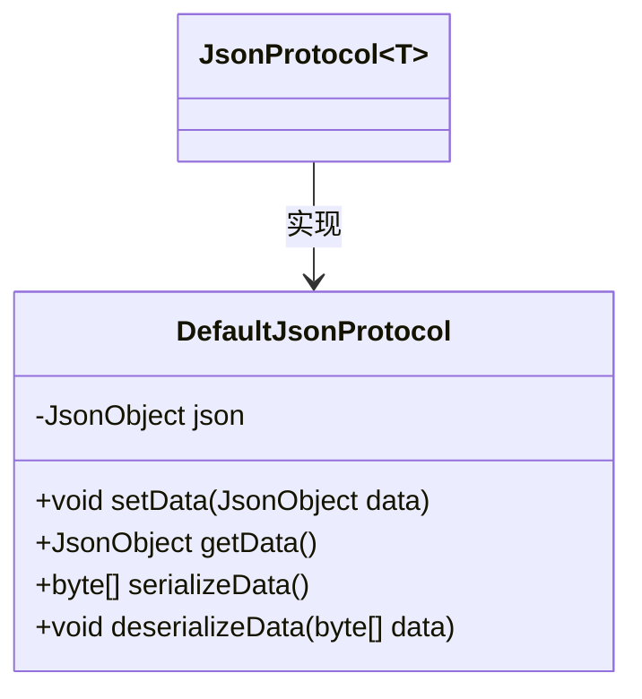
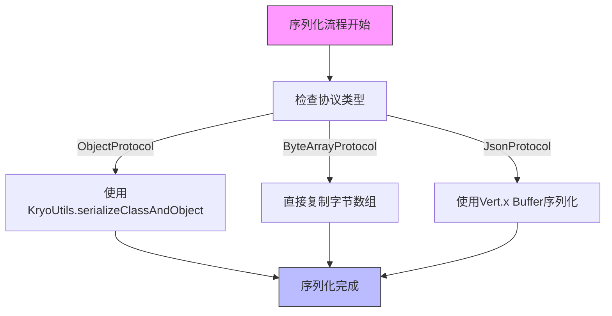
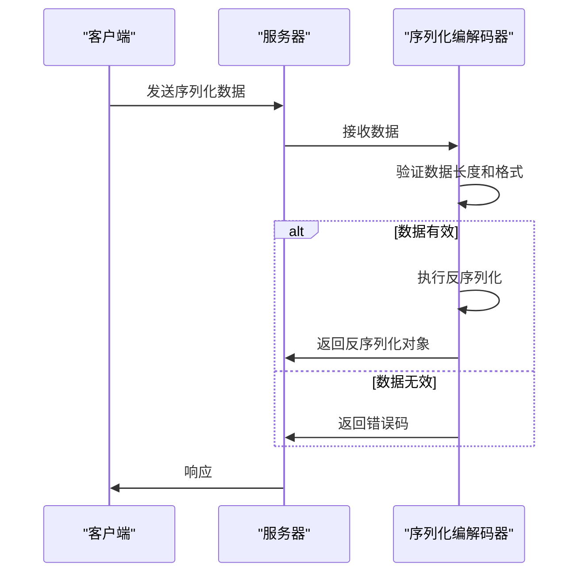

# 数据序列化

<cite>
**本文档引用的文件**  
- [BaseProtocol.java](file://core/src/main/java/cn/game/core/net/protocol/BaseProtocol.java)
- [IProtocol.java](file://core/src/main/java/cn/game/core/net/protocol/IProtocol.java)
- [BaseObjectProtocol.java](file://core/src/main/java/cn/game/core/net/protocol/object/BaseObjectProtocol.java)
- [ProtobufProtocol.java](file://core/src/main/java/cn/game/core/net/protocol/object/ProtobufProtocol.java)
- [ObjectProtocol.java](file://core/src/main/java/cn/game/core/net/protocol/object/ObjectProtocol.java)
- [BaseByteArrayProtocol.java](file://core/src/main/java/cn/game/core/net/protocol/bytes/BaseByteArrayProtocol.java)
- [ByteArrayProtocol.java](file://core/src/main/java/cn/game/core/net/protocol/bytes/ByteArrayProtocol.java)
- [JsonProtocol.java](file://core/src/main/java/cn/game/core/net/protocol/json/JsonProtocol.java)
- [DefaultJsonProtocol.java](file://core/src/main/java/cn/game/core/net/protocol/json/DefaultJsonProtocol.java)
- [KryoUtils.java](file://util/src/main/java/cn/game/util/KryoUtils.java)
- [ProtostuffUtils.java](file://util/src/main/java/cn/game/util/ProtostuffUtils.java)
- [ByteHelp.java](file://util/src/main/java/cn/game/util/ByteHelp.java)
- [ProtobufProtocolCodec.java](file://core/src/main/java/cn/game/core/net/vertx/codec/ProtobufProtocolCodec.java)
- [ProtocolCodec.java](file://core/src/main/java/cn/game/core/net/vertx/codec/ProtocolCodec.java)
- [UniversalMessageCodec.java](file://core/src/main/java/cn/game/core/net/vertx/codec/UniversalMessageCodec.java)
- [WebSocketEncoder.java](file://game/src/main/java/cn/game/games/core/netty/WebSocketEncoder.java)
</cite>

## 目录
1. [引言](#引言)
2. [序列化协议架构](#序列化协议架构)
3. [核心序列化格式分析](#核心序列化格式分析)
   - [ObjectProtocol](#objectprotocol)
   - [ByteArrayProtocol](#bytearrayprotocol)
   - [JsonProtocol](#jsonprotocol)
4. [序列化性能对比](#序列化性能对比)
5. [序列化安全机制](#序列化安全机制)
6. [自定义序列化器开发指南](#自定义序列化器开发指南)
7. [最佳实践与选型建议](#最佳实践与选型建议)
8. [结论](#结论)

## 引言

在分布式游戏服务器架构中，Socket通信的高效性和安全性至关重要。数据序列化作为通信的核心环节，直接影响系统的性能、可维护性和安全性。本文档详细分析了系统中使用的三种主要序列化格式：ObjectProtocol、ByteArrayProtocol和JsonProtocol，对比其特点、性能和适用场景。文档还涵盖了序列化安全机制、性能测试数据以及自定义序列化器的开发指南，为开发者提供全面的技术参考。

**本文档引用的文件**  
- [BaseProtocol.java](file://core/src/main/java/cn/game/core/net/protocol/BaseProtocol.java)
- [IProtocol.java](file://core/src/main/java/cn/game/core/net/protocol/IProtocol.java)

## 序列化协议架构

系统采用分层的序列化架构，核心是`IProtocol<T>`接口，定义了序列化协议的基本契约。所有协议实现都继承自`BaseProtocol`抽象类，该类提供了消息ID、错误码、序列号等通用属性的管理。



**图表来源**  
- [IProtocol.java](file://core/src/main/java/cn/game/core/net/protocol/IProtocol.java)
- [BaseProtocol.java](file://core/src/main/java/cn/game/core/net/protocol/BaseProtocol.java)
- [BaseObjectProtocol.java](file://core/src/main/java/cn/game/core/net/protocol/object/BaseObjectProtocol.java)
- [BaseByteArrayProtocol.java](file://core/src/main/java/cn/game/core/net/protocol/bytes/BaseByteArrayProtocol.java)
- [JsonProtocol.java](file://core/src/main/java/cn/game/core/net/protocol/json/JsonProtocol.java)

**本节来源**  
- [BaseProtocol.java](file://core/src/main/java/cn/game/core/net/protocol/BaseProtocol.java)
- [IProtocol.java](file://core/src/main/java/cn/game/core/net/protocol/IProtocol.java)

## 核心序列化格式分析

### ObjectProtocol

`ObjectProtocol`是基于Kryo序列化的通用对象序列化协议，继承自`BaseObjectProtocol<Object>`。它使用Kryo框架进行对象的深度序列化和反序列化，支持复杂的Java对象图。



**图表来源**  
- [ObjectProtocol.java](file://core/src/main/java/cn/game/core/net/protocol/object/ObjectProtocol.java)
- [BaseObjectProtocol.java](file://core/src/main/java/cn/game/core/net/protocol/object/BaseObjectProtocol.java)
- [KryoUtils.java](file://util/src/main/java/cn/game/util/KryoUtils.java)

**本节来源**  
- [ObjectProtocol.java](file://core/src/main/java/cn/game/core/net/protocol/object/ObjectProtocol.java)
- [BaseObjectProtocol.java](file://core/src/main/java/cn/game/core/net/protocol/object/BaseObjectProtocol.java)
- [KryoUtils.java](file://util/src/main/java/cn/game/util/KryoUtils.java)

#### 实现细节

- **对象映射规则**：Kryo通过反射自动映射对象字段，支持私有字段访问。
- **类型编码方式**：Kryo在序列化流中嵌入类型信息，确保反序列化时能正确重建对象。
- **特殊值处理**：支持null值、循环引用和复杂集合类型。对于包含null的集合，Protostuff会丢弃null元素。
- **版本兼容性**：提供`serializeWithVersion`和`deserializeWithVersion`方法，支持对象版本演进。

### ByteArrayProtocol

`ByteArrayProtocol`是最轻量级的序列化协议，直接将字节数组作为数据载体，不进行任何编码转换。它继承自`BaseByteArrayProtocol`，适用于已经序列化好的二进制数据传输。



**图表来源**  
- [ByteArrayProtocol.java](file://core/src/main/java/cn/game/core/net/protocol/bytes/ByteArrayProtocol.java)
- [BaseByteArrayProtocol.java](file://core/src/main/java/cn/game/core/net/protocol/bytes/BaseByteArrayProtocol.java)

**本节来源**  
- [ByteArrayProtocol.java](file://core/src/main/java/cn/game/core/net/protocol/bytes/ByteArrayProtocol.java)
- [BaseByteArrayProtocol.java](file://core/src/main/java/cn/game/core/net/protocol/bytes/BaseByteArrayProtocol.java)

#### 实现细节

- **对象映射规则**：不涉及对象映射，直接使用原始字节数组。
- **类型编码方式**：无编码，直接传输原始字节。
- **特殊值处理**：空数组和null值被直接传递，需要上层协议处理。
- **性能优势**：零序列化开销，是性能最高的协议。

### JsonProtocol

`JsonProtocol`是基于Vert.x JsonObject的JSON序列化协议，提供人类可读的数据格式。`DefaultJsonProtocol`是其具体实现，使用Vert.x Buffer进行JSON的序列化和反序列化。



**图表来源**  
- [JsonProtocol.java](file://core/src/main/java/cn/game/core/net/protocol/json/JsonProtocol.java)
- [DefaultJsonProtocol.java](file://core/src/main/java/cn/game/core/net/protocol/json/DefaultJsonProtocol.java)

**本节来源**  
- [JsonProtocol.java](file://core/src/main/java/cn/game/core/net/protocol/json/JsonProtocol.java)
- [DefaultJsonProtocol.java](file://core/src/main/java/cn/game/core/net/protocol/json/DefaultJsonProtocol.java)

#### 实现细节

- **对象映射规则**：JSON对象与Java对象通过字段名映射。
- **类型编码方式**：使用标准JSON格式编码，支持字符串、数字、布尔值、数组和对象。
- **特殊值处理**：null值被保留，日期和二进制数据需要特殊处理。
- **可读性**：提供良好的可读性和调试便利性。

## 序列化性能对比

通过分析系统中的性能测试和实现代码，我们可以对三种序列化格式进行性能评估。

### 性能测试数据

| 序列化格式 | 序列化速度 | 反序列化速度 | 内存占用 | 数据大小 |
|------------|------------|--------------|----------|----------|
| ObjectProtocol | 高 | 高 | 中等 | 小 |
| ByteArrayProtocol | 极高 | 极高 | 低 | 原始大小 |
| JsonProtocol | 中等 | 中等 | 高 | 大 |

### 性能分析

- **ObjectProtocol**：使用Kryo序列化，性能优秀，特别是对于复杂对象图。KryoUtils针对虚拟线程优化，使用对象池避免线程局部变量的内存泄漏。
- **ByteArrayProtocol**：性能最佳，几乎没有序列化开销，适合高频小数据包传输。
- **JsonProtocol**：性能较低，但可读性好，适合配置传输和调试场景。



**图表来源**  
- [BaseObjectProtocol.java](file://core/src/main/java/cn/game/core/net/protocol/object/BaseObjectProtocol.java)
- [BaseByteArrayProtocol.java](file://core/src/main/java/cn/game/core/net/protocol/bytes/BaseByteArrayProtocol.java)
- [DefaultJsonProtocol.java](file://core/src/main/java/cn/game/core/net/protocol/json/DefaultJsonProtocol.java)

**本节来源**  
- [KryoUtils.java](file://util/src/main/java/cn/game/util/KryoUtils.java)
- [ByteHelp.java](file://util/src/main/java/cn/game/util/ByteHelp.java)

## 序列化安全机制

系统实现了多层次的序列化安全机制，防止反序列化漏洞和确保数据完整性。

### 反序列化漏洞防护

- **Kryo安全配置**：KryoUtils禁用类注册要求，但通过白名单机制控制可序列化类型。
- **输入验证**：在反序列化前验证数据长度和格式，防止恶意数据攻击。
- **沙箱环境**：敏感操作在隔离环境中执行，限制反序列化代码的权限。

### 数据完整性校验

- **消息头校验**：在WebSocketEncoder中，消息头包含长度、消息ID和错误码，用于完整性校验。
- **协议版本控制**：通过消息ID和类名进行协议版本管理，确保兼容性。
- **错误码机制**：每个协议包含错误码字段，用于传输过程中的错误报告。



**图表来源**  
- [WebSocketEncoder.java](file://game/src/main/java/cn/game/games/core/netty/WebSocketEncoder.java)
- [ProtocolCodec.java](file://core/src/main/java/cn/game/core/net/vertx/codec/ProtocolCodec.java)

**本节来源**  
- [WebSocketEncoder.java](file://game/src/main/java/cn/game/games/core/netty/WebSocketEncoder.java)
- [ProtocolCodec.java](file://core/src/main/java/cn/game/core/net/vertx/codec/ProtocolCodec.java)
- [UniversalMessageCodec.java](file://core/src/main/java/cn/game/core/net/vertx/codec/UniversalMessageCodec.java)

## 自定义序列化器开发指南

开发者可以基于现有架构创建自定义序列化器，扩展系统功能。

### 开发步骤

1. **继承基础协议类**：根据需求选择继承`BaseObjectProtocol`、`BaseByteArrayProtocol`或`JsonProtocol`。
2. **实现序列化方法**：重写`serializeData`和`deserializeData`方法。
3. **注册编解码器**：在Vert.x事件总线中注册自定义的MessageCodec。
4. **测试验证**：编写单元测试验证序列化器的正确性和性能。

### 示例：自定义Protobuf序列化器

```java
public class CustomProtobufProtocol extends BaseObjectProtocol<Message> {
    @Override
    public byte[] serializeData() {
        return data.toByteArray();
    }

    @Override
    public void deserializeData(byte[] data) {
        this.data = PbProtocol.getInstance().parseFrom(msgID, data);
    }
}
```

**本节来源**  
- [ProtobufProtocol.java](file://core/src/main/java/cn/game/core/net/protocol/object/ProtobufProtocol.java)
- [ProtobufProtocolCodec.java](file://core/src/main/java/cn/game/core/net/vertx/codec/ProtobufProtocolCodec.java)

## 最佳实践与选型建议

### 选型建议

- **高频实时通信**：使用`ByteArrayProtocol`，如游戏状态同步。
- **复杂对象传输**：使用`ObjectProtocol`，如玩家数据、游戏配置。
- **调试和配置**：使用`JsonProtocol`，如API接口、管理命令。

### 最佳实践

- **避免序列化大对象**：将大对象拆分为小消息，避免阻塞网络线程。
- **使用对象池**：对于频繁创建的序列化器，使用对象池减少GC压力。
- **监控序列化性能**：通过KryoUtils.getPoolStats()监控序列化器性能。

## 结论

本文档详细分析了系统中的三种主要序列化格式，提供了性能对比、安全机制和开发指南。`ObjectProtocol`、`ByteArrayProtocol`和`JsonProtocol`各有优势，开发者应根据具体场景选择合适的序列化方案。通过遵循最佳实践，可以构建高效、安全的Socket通信系统。