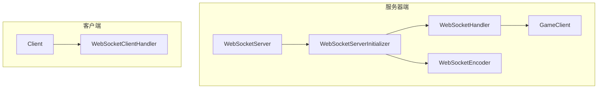
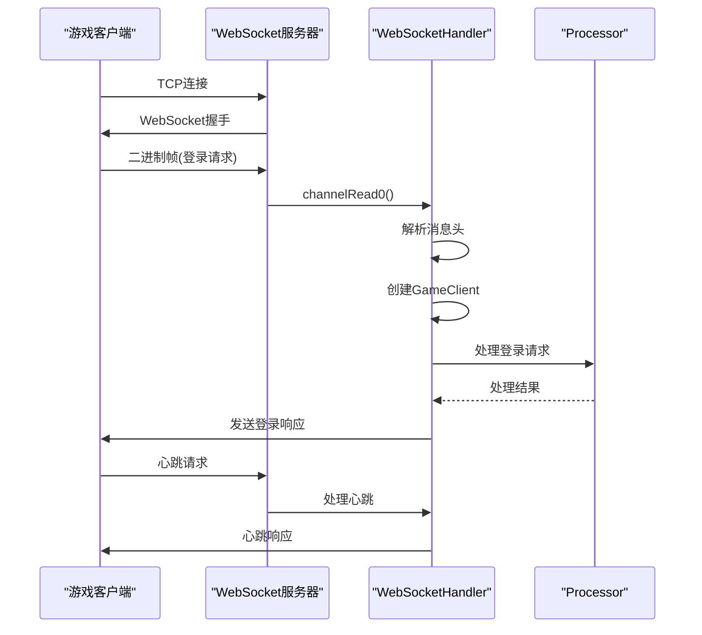
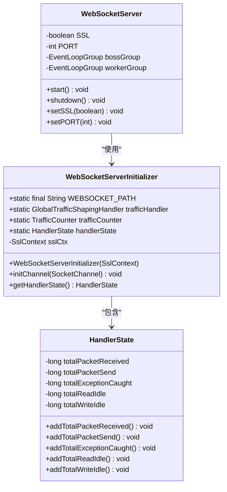
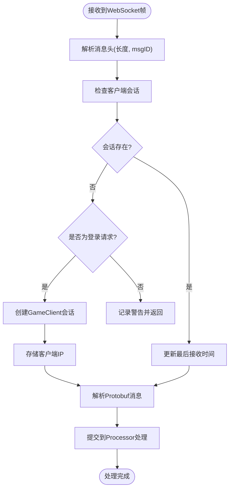
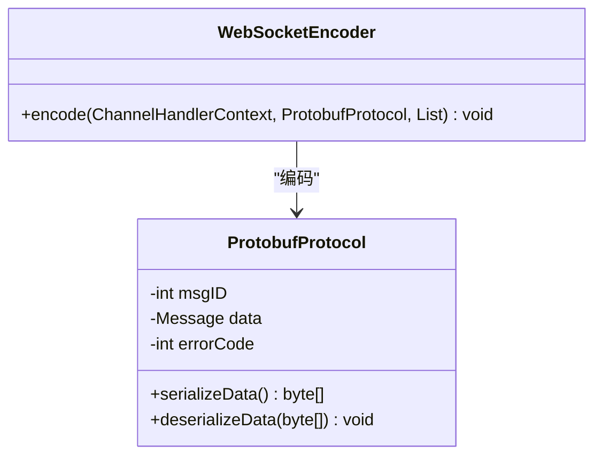
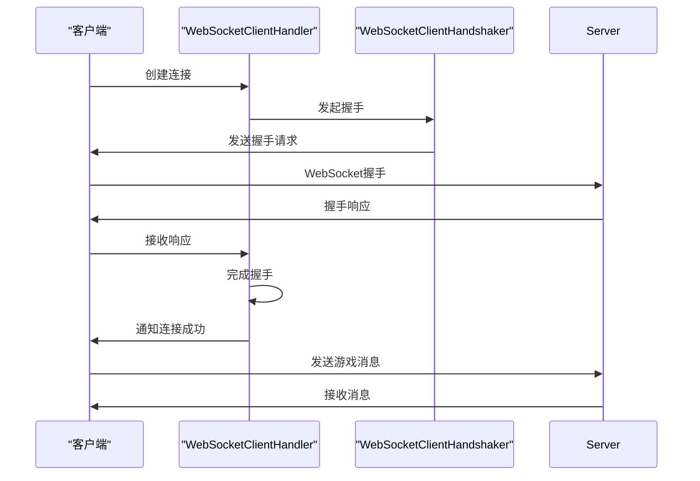
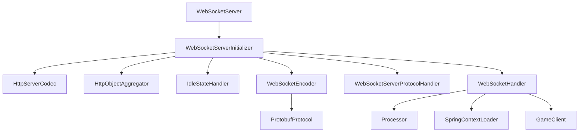

# WebSocket API

<cite>
**本文档引用的文件**  
- [WebSocketServer.java](file://game\src\main\java\cn\game\games\core\netty\WebSocketServer.java)
- [WebSocketServerInitializer.java](file://game\src\main\java\cn\game\games\core\netty\WebSocketServerInitializer.java)
- [WebSocketHandler.java](file://game\src\main\java\cn\game\games\core\netty\WebSocketHandler.java)
- [WebSocketEncoder.java](file://game\src\main\java\cn\game\games\core\netty\WebSocketEncoder.java)
- [WebSocketClientHandler.java](file://simulationclient\src\main\java\cn\game\simulation\client\handler\WebSocketClientHandler.java)
- [GameClient.java](file://game\src\main\java\cn\game\games\net\client\GameClient.java)
- [ProtobufProtocol.java](file://core\src\main\java\cn\game\core\net\protocol\object\ProtobufProtocol.java)
- [PlayerHandler.java](file://game\src\main\java\cn\game\games\net\game\handler\PlayerHandler.java)
- [ChatHandler.java](file://game\src\main\java\cn\game\games\net\game\module\chat\ChatHandler.java)
- [HandlerState.java](file://game\src\main\java\cn\game\games\core\netty\HandlerState.java)
</cite>

## 目录
1. [引言](#引言)
2. [项目结构](#项目结构)
3. [核心组件](#核心组件)
4. [架构概述](#架构概述)
5. [详细组件分析](#详细组件分析)
6. [依赖分析](#依赖分析)
7. [性能考虑](#性能考虑)
8. [故障排除指南](#故障排除指南)
9. [结论](#结论)

## 引言
本文档详细描述了游戏客户端与服务器之间基于WebSocket的实时通信协议。该系统使用Netty作为底层网络框架，结合Protobuf进行高效的消息序列化，实现了低延迟、高并发的实时通信能力。文档涵盖了连接建立、消息格式、心跳机制、错误处理等关键方面，并提供了客户端实现示例。

## 项目结构
游戏服务器的WebSocket通信模块主要位于`game`模块的`netty`包中，使用Netty框架处理WebSocket连接。客户端模拟器位于`simulationclient`模块中，用于压力测试和协议验证。

**图示来源**
- [WebSocketServer.java](file://game\src\main\java\cn\game\games\core\netty\WebSocketServer.java)
- [WebSocketServerInitializer.java](file://game\src\main\java\cn\game\games\core\netty\WebSocketServerInitializer.java)
- [WebSocketHandler.java](file://game\src\main\java\cn\game\games\core\netty\WebSocketHandler.java)
- [WebSocketEncoder.java](file://game\src\main\java\cn\game\games\core\netty\WebSocketEncoder.java)
- [GameClient.java](file://game\src\main\java\cn\game\games\net\client\GameClient.java)
- [WebSocketClientHandler.java](file://simulationclient\src\main\java\cn\game\simulation\client\handler\WebSocketClientHandler.java)

**本节来源**
- [WebSocketServer.java](file://game\src\main\java\cn\game\games\core\netty\WebSocketServer.java)
- [WebSocketServerInitializer.java](file://game\src\main\java\cn\game\games\core\netty\WebSocketServerInitializer.java)

## 核心组件
WebSocket通信系统的核心组件包括服务器启动器、连接处理器、消息编码器和客户端会话管理器。服务器使用Netty的WebSocketServerProtocolHandler处理WebSocket握手协议，通过自定义的WebSocketHandler处理二进制消息，使用WebSocketEncoder将Protobuf消息编码为WebSocket帧。

**本节来源**
- [WebSocketServer.java](file://game\src\main\java\cn\game\games\core\netty\WebSocketServer.java)
- [WebSocketHandler.java](file://game\src\main\java\cn\game\games\core\netty\WebSocketHandler.java)
- [WebSocketEncoder.java](file://game\src\main\java\cn\game\games\core\netty\WebSocketEncoder.java)

## 架构概述
系统采用Netty的事件驱动架构，通过ChannelPipeline处理WebSocket连接的各个阶段。连接建立后，通过二进制WebSocket帧传输Protobuf序列化的游戏消息。服务器维护每个客户端的GameClient会话对象，用于消息发送和状态管理。

**图示来源**
- [WebSocketHandler.java](file://game\src\main\java\cn\game\games\core\netty\WebSocketHandler.java)
- [PlayerHandler.java](file://game\src\main\java\cn\game\games\net\game\handler\PlayerHandler.java)

## 详细组件分析

### WebSocket服务器组件分析
WebSocket服务器使用Netty框架实现，通过WebSocketServer类启动和配置服务器。服务器支持SSL配置，使用NIO事件循环组处理连接。

#### WebSocket服务器初始化

**图示来源**
- [WebSocketServer.java](file://game\src\main\java\cn\game\games\core\netty\WebSocketServer.java)
- [WebSocketServerInitializer.java](file://game\src\main\java\cn\game\games\core\netty\WebSocketServerInitializer.java)
- [HandlerState.java](file://game\src\main\java\cn\game\games\core\netty\HandlerState.java)

**本节来源**
- [WebSocketServer.java](file://game\src\main\java\cn\game\games\core\netty\WebSocketServer.java)
- [WebSocketServerInitializer.java](file://game\src\main\java\cn\game\games\core\netty\WebSocketServerInitializer.java)

### WebSocket消息处理组件分析
WebSocketHandler是核心消息处理器，负责解析WebSocket帧并分发到业务处理器。它维护客户端会话状态，处理连接生命周期事件。

#### 消息处理流程

**图示来源**
- [WebSocketHandler.java](file://game\src\main\java\cn\game\games\core\netty\WebSocketHandler.java)
- [GameClient.java](file://game\src\main\java\cn\game\games\net\client\GameClient.java)

**本节来源**
- [WebSocketHandler.java](file://game\src\main\java\cn\game\games\core\netty\WebSocketHandler.java)

### 消息编码组件分析
WebSocketEncoder负责将Protobuf消息编码为WebSocket二进制帧。它在消息前添加12字节的头部信息，包括总长度、消息ID和错误码。

#### 消息编码实现

**图示来源**
- [WebSocketEncoder.java](file://game\src\main\java\cn\game\games\core\netty\WebSocketEncoder.java)
- [ProtobufProtocol.java](file://core\src\main\java\cn\game\core\net\protocol\object\ProtobufProtocol.java)

**本节来源**
- [WebSocketEncoder.java](file://game\src\main\java\cn\game\games\core\netty\WebSocketEncoder.java)

### 客户端组件分析
客户端使用Netty的WebSocketClientHandler处理WebSocket连接。它管理握手过程，处理各种WebSocket控制帧。

#### 客户端连接流程

**图示来源**
- [WebSocketClientHandler.java](file://simulationclient\src\main\java\cn\game\simulation\client\handler\WebSocketClientHandler.java)

**本节来源**
- [WebSocketClientHandler.java](file://simulationclient\src\main\java\cn\game\simulation\client\handler\WebSocketClientHandler.java)

## 依赖分析
WebSocket通信系统依赖于Netty网络框架、Protobuf序列化库和游戏核心业务逻辑组件。系统通过SpringContextLoader获取业务处理器实例，实现网络层与业务逻辑的解耦。

**图示来源**
- [WebSocketServerInitializer.java](file://game\src\main\java\cn\game\games\core\netty\WebSocketServerInitializer.java)
- [WebSocketHandler.java](file://game\src\main\java\cn\game\games\core\netty\WebSocketHandler.java)
- [WebSocketEncoder.java](file://game\src\main\java\cn\game\games\core\netty\WebSocketEncoder.java)

**本节来源**
- [WebSocketServerInitializer.java](file://game\src\main\java\cn\game\games\core\netty\WebSocketServerInitializer.java)

## 性能考虑
系统通过多种机制优化WebSocket通信性能：
- 使用GlobalTrafficShapingHandler限制全局流量
- 通过HandlerState监控连接和消息统计
- 使用对象池和缓冲区复用减少GC压力
- 异步处理业务逻辑，避免阻塞I/O线程

## 故障排除指南
常见问题及解决方案：
- 连接失败：检查端口是否被占用，防火墙设置
- 消息丢失：检查网络稳定性，客户端重连机制
- 性能下降：监控HandlerState中的统计信息，检查业务处理耗时
- 内存泄漏：检查Netty缓冲区释放，避免内存累积

**本节来源**
- [HandlerState.java](file://game\src\main\java\cn\game\games\core\netty\HandlerState.java)
- [WebSocketHandler.java](file://game\src\main\java\cn\game\games\core\netty\WebSocketHandler.java)

## 结论
WebSocket通信系统为游戏提供了高效、可靠的实时通信能力。通过Netty框架和Protobuf序列化的结合，实现了高性能的消息传输。系统设计考虑了可扩展性和可维护性，为游戏的实时交互功能提供了坚实的基础。