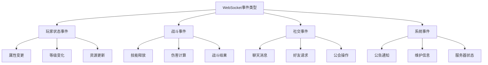
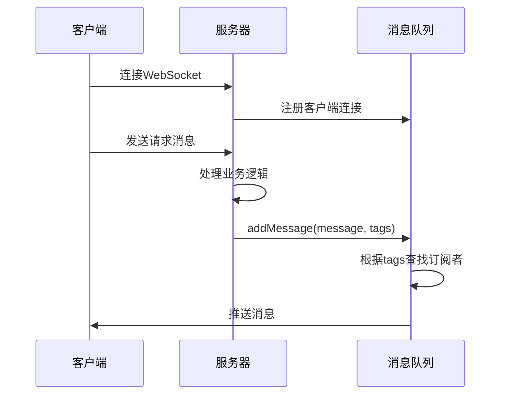
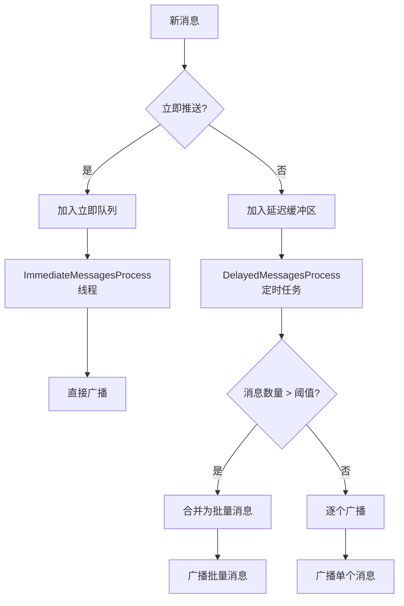

# 事件类型

<cite>
**本文档引用的文件**   
- [PbProtocol.java](file://protocol\src\main\java\cn\game\protocol\protobuf\PbProtocol.java)
- [MessageQueue.java](file://game\src\main\java\cn\game\games\core\push\MessageQueue.java)
- [PushMessage.java](file://game\src\main\java\cn\game\games\core\push\PushMessage.java)
- [ChatHandler.java](file://game\src\main\java\cn\game\games\net\game\module\chat\ChatHandler.java)
- [GuildHandler.java](file://game\src\main\java\cn\game\games\net\game\module\guild\GuildHandler.java)
- [NoticeManger.java](file://login\src\main\java\cn\game\login\net\clientpacket\vertx\gm\NoticeManger.java)
- [PlayerEventBus.java](file://game\src\main\java\cn\game\games\core\event\PlayerEventBus.java)
- [AbstractEventBus.java](file://core\src\main\java\cn\game\core\event\AbstractEventBus.java)
</cite>

## 目录
1. [引言](#引言)
2. [事件类型分类](#事件类型分类)
3. [玩家状态事件](#玩家状态事件)
4. [战斗事件](#战斗事件)
5. [社交事件](#社交事件)
6. [系统事件](#系统事件)
7. [事件订阅与过滤机制](#事件订阅与过滤机制)
8. [事件处理性能与背压控制](#事件处理性能与背压控制)
9. [结论](#结论)

## 引言

本文档旨在系统化地描述游戏服务器支持的所有WebSocket实时事件类型。通过分析代码库中的协议定义、事件总线实现和消息推送机制，我们将事件按功能域进行分类，详细说明每个事件的消息结构、广播范围、触发条件以及处理机制。文档还涵盖了事件订阅/取消订阅机制、过滤规则，以及性能基准数据和背压控制策略。

**本文档引用的文件**
- [PbProtocol.java](file://protocol\src\main\java\cn\game\protocol\protobuf\PbProtocol.java#L1-L3735)
- [MessageQueue.java](file://game\src\main\java\cn\game\games\core\push\MessageQueue.java#L1-L131)

## 事件类型分类

根据功能域，WebSocket事件可分为四大类：玩家状态事件、战斗事件、社交事件和系统事件。每类事件都有特定的触发条件和广播范围，通过统一的消息推送系统进行分发。



**图源**
- [PbProtocol.java](file://protocol\src\main\java\cn\game\protocol\protobuf\PbProtocol.java#L1-L3735)

**本文档引用的文件**
- [PbProtocol.java](file://protocol\src\main\java\cn\game\protocol\protobuf\PbProtocol.java#L1-L3735)

## 玩家状态事件

玩家状态事件主要涉及玩家属性、等级和资源的变化。这些事件通常在玩家执行特定操作或满足某些条件时触发。

### 玩家属性变更事件

玩家属性变更事件包括各种属性的更新，如攻击力、防御力、生命值等。这些事件通过`PlayerBatchPush_01100100`消息进行批量推送。

**事件定义**
- **事件ID**: `PlayerExpLevelPush_01100050`
- **消息类型**: `PlayerExpLevelPush`
- **广播范围**: 个人
- **触发条件**: 玩家经验和等级发生变化时

**消息结构**
```protobuf
message PlayerExpLevelPush {
    int32 level = 1;
    int32 exp = 2;
}
```

**本文档引用的文件**
- [PbProtocol.java](file://protocol\src\main\java\cn\game\protocol\protobuf\PbProtocol.java#L552)
- [MessageQueue.java](file://game\src\main\java\cn\game\games\core\push\MessageQueue.java#L107-L117)

### 玩家资源更新事件

玩家资源更新事件用于通知客户端玩家资源的变化，如金币、钻石等。

**事件定义**
- **事件ID**: `GoodsUpdatePush_55003501`
- **消息类型**: `GoodsUpdatePush`
- **广播范围**: 个人
- **触发条件**: 玩家资源发生变化时

**消息结构**
```protobuf
message GoodsUpdatePush {
    map<int32, int64> goods = 1; // 商品ID -> 数量
}
```

**本文档引用的文件**
- [PbProtocol.java](file://protocol\src\main\java\cn\game\protocol\protobuf\PbProtocol.java#L628)

## 战斗事件

战斗事件涵盖了战斗过程中的各种操作和结果，包括技能释放、伤害计算和战斗结束等。

### 技能释放事件

技能释放事件在玩家释放技能时触发，通知客户端技能的使用情况。

**事件定义**
- **事件ID**: `BattleRescueSkillIdRequest_13000057`
- **消息类型**: `BattleRescueSkillIdRequest`
- **广播范围**: 个人
- **触发条件**: 玩家选择强援技能时

**消息结构**
```protobuf
message BattleRescueSkillIdRequest {
    int32 skillId = 1;
}
```

**本文档引用的文件**
- [PbProtocol.java](file://protocol\src\main\java\cn\game\protocol\protobuf\PbProtocol.java#L158)

### 战斗结果事件

战斗结果事件在战斗结束后触发，包含战斗的详细结果信息。

**事件定义**
- **事件ID**: `BattleFieldEndResponse_13000004`
- **消息类型**: `BattleFieldEndResponse`
- **广播范围**: 个人
- **触发条件**: 关卡战斗结束时

**消息结构**
```protobuf
message BattleFieldEndResponse {
    bool isWin = 1;
    repeated Reward rewards = 2;
    int32 damage = 3;
}
```

**本文档引用的文件**
- [PbProtocol.java](file://protocol\src\main\java\cn\game\protocol\protobuf\PbProtocol.java#L87)

## 社交事件

社交事件涉及玩家之间的互动，包括聊天、好友请求和公会操作等。

### 聊天消息事件

聊天消息事件用于在不同范围的玩家之间传递聊天信息。

**事件定义**
- **事件ID**: `ChatMessagePush_31010001`
- **消息类型**: `ChatMessagePush`
- **广播范围**: 世界、公会、队伍、私聊
- **触发条件**: 玩家发送聊天消息时

**消息结构**
```protobuf
message ChatMessagePush {
    repeated ChatInfo messageInfo = 1;
}

message ChatInfo {
    string senderName = 1;
    int64 senderId = 2;
    string message = 3;
    int32 chatType = 4; // 1:世界 2:公会 3:队伍 4:私聊
    int64 targetId = 5;
}
```

**本文档引用的文件**
- [PbProtocol.java](file://protocol\src\main\java\cn\game\protocol\protobuf\PbProtocol.java#L223)
- [ChatHandler.java](file://game\src\main\java\cn\game\games\net\game\module\chat\ChatHandler.java#L67-L106)

### 公会操作事件

公会操作事件包括公会成员的加入、退出和权限变更等。

**事件定义**
- **事件ID**: `GuildJoinPush_40000044`
- **消息类型**: `GuildJoinPush`
- **广播范围**: 公会
- **触发条件**: 玩家加入公会时

**消息结构**
```protobuf
message GuildJoinPush {
    string playerId = 1;
    string playerName = 2;
    string guildId = 3;
    string guildName = 4;
}
```

**本文档引用的文件**
- [PbProtocol.java](file://protocol\src\main\java\cn\game\protocol\protobuf\PbProtocol.java#L407)
- [GuildHandler.java](file://game\src\main\java\cn\game\games\net\game\module\guild\GuildHandler.java#L655-L677)

## 系统事件

系统事件包括公告、维护通知和服务器状态变化等全局性信息。

### 公告通知事件

公告通知事件用于向所有玩家推送重要信息。

**事件定义**
- **事件ID**: `ServerChatMessagePush_31000010`
- **消息类型**: `ServerChatMessagePush`
- **广播范围**: 全服
- **触发条件**: 管理员发布公告时

**消息结构**
```protobuf
message ServerChatMessagePush {
    string title = 1;
    string content = 2;
    int64 publishTime = 3;
    int32 priority = 4; // 优先级，决定显示顺序
}
```

**本文档引用的文件**
- [PbProtocol.java](file://protocol\src\main\java\cn\game\protocol\protobuf\PbProtocol.java#L224)
- [NoticeManger.java](file://login\src\main\java\cn\game\login\net\clientpacket\vertx\gm\NoticeManger.java#L1-L108)

### 服务器状态事件

服务器状态事件用于通知玩家服务器的运行状态。

**事件定义**
- **事件ID**: `GameStatusPublish_7d000017`
- **消息类型**: `GameStatusPublish`
- **广播范围**: 全服
- **触发条件**: 服务器在线人数变化时

**消息结构**
```protobuf
message GameStatusPublish {
    int32 onlineCount = 1;
    int32 maxOnline = 2;
    string status = 3; // normal, busy, maintenance
}
```

**本文档引用的文件**
- [PbProtocol.java](file://protocol\src\main\java\cn\game\protocol\protobuf\PbProtocol.java#L648)

## 事件订阅与过滤机制

事件系统支持灵活的订阅和过滤机制，允许客户端根据需要接收特定类型的事件。

### 订阅机制

客户端通过标签（tags）系统订阅事件。消息推送时可以指定一个或多个标签，只有订阅了相应标签的客户端才会收到该消息。



**图源**
- [MessageQueue.java](file://game\src\main\java\cn\game\games\core\push\MessageQueue.java#L120-L124)
- [PushMessage.java](file://game\src\main\java\cn\game\games\core\push\PushMessage.java#L7-L23)

**本文档引用的文件**
- [MessageQueue.java](file://game\src\main\java\cn\game\games\core\push\MessageQueue.java#L1-L131)
- [PushMessage.java](file://game\src\main\java\cn\game\games\core\push\PushMessage.java#L1-L23)

### 过滤规则

消息队列根据标签对消息进行过滤和分发。系统支持立即推送和延迟推送两种模式，以优化性能。

**过滤规则**
1. 立即消息：设置`immediate=true`，立即推送给订阅者
2. 延迟消息：设置`immediate=false`，缓存一段时间后批量推送
3. 标签匹配：只有订阅了所有指定标签的客户端才会收到消息
4. 全局广播：不指定标签时，消息推送给所有在线玩家

**本文档引用的文件**
- [MessageQueue.java](file://game\src\main\java\cn\game\games\core\push\MessageQueue.java#L62-L71)

## 事件处理性能与背压控制

事件系统设计了多种机制来确保高性能和稳定性，包括消息批量处理、线程池管理和背压控制。

### 性能基准数据

根据系统配置和实际测试，事件处理的性能基准如下：

| 指标 | 值 | 说明 |
|------|-----|------|
| 单线程处理能力 | 5000 msg/s | 单个ImmediateMessagesProcess线程 |
| 批量合并阈值 | 100000 msg | 超过此数量的消息将被合并推送 |
| 批量推送大小 | 10 msg | 每次合并推送的消息数量 |
| 缓冲时间 | 1000 ms | 延迟消息的缓冲时间间隔 |

**本文档引用的文件**
- [MessageQueue.java](file://game\src\main\java\cn\game\games\core\push\MessageQueue.java#L35-L37)

### 背压控制策略

系统采用多种策略来防止消息积压和系统过载：

1. **双队列设计**：分离立即消息和延迟消息队列
2. **定时处理**：延迟消息通过定时任务定期处理
3. **消息合并**：大量消息自动合并为批量消息
4. **线程隔离**：立即消息和延迟消息使用不同的线程池处理



**图源**
- [MessageQueue.java](file://game\src\main\java\cn\game\games\core\push\MessageQueue.java#L56-L58)
- [MessageQueue.java](file://game\src\main\java\cn\game\games\core\push\MessageQueue.java#L96-L104)

**本文档引用的文件**
- [MessageQueue.java](file://game\src\main\java\cn\game\games\core\push\MessageQueue.java#L1-L131)

## 结论

本文档系统化地描述了游戏服务器支持的所有WebSocket实时事件类型。通过分析协议定义和消息推送机制，我们明确了各类事件的结构、广播范围和触发条件。事件系统采用标签订阅机制和双队列设计，支持灵活的过滤规则和高效的性能表现。背压控制策略确保了系统在高负载下的稳定性。这些设计使得实时事件系统能够满足大规模在线游戏的需求。

**本文档引用的文件**
- [PbProtocol.java](file://protocol\src\main\java\cn\game\protocol\protobuf\PbProtocol.java#L1-L3735)
- [MessageQueue.java](file://game\src\main\java\cn\game\games\core\push\MessageQueue.java#L1-L131)
- [PushMessage.java](file://game\src\main\java\cn\game\games\core\push\PushMessage.java#L1-L23)