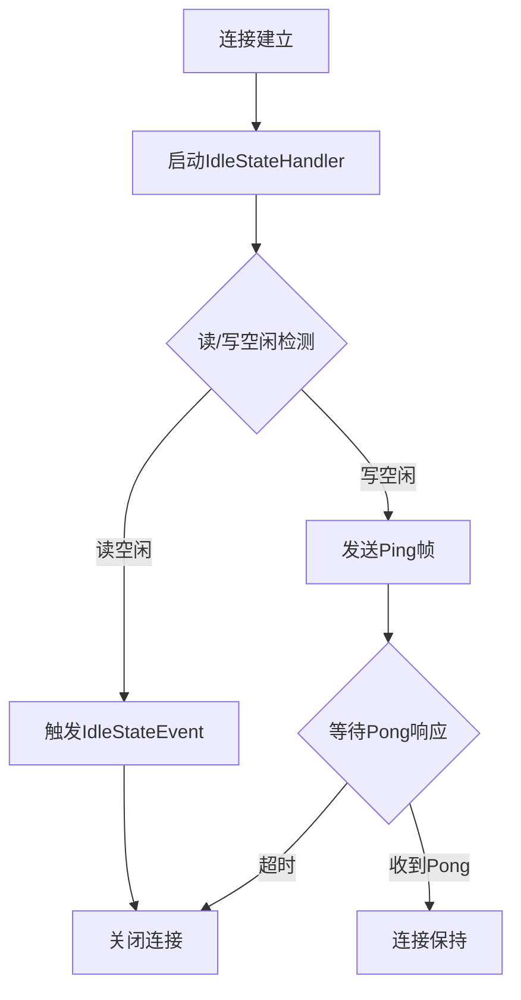
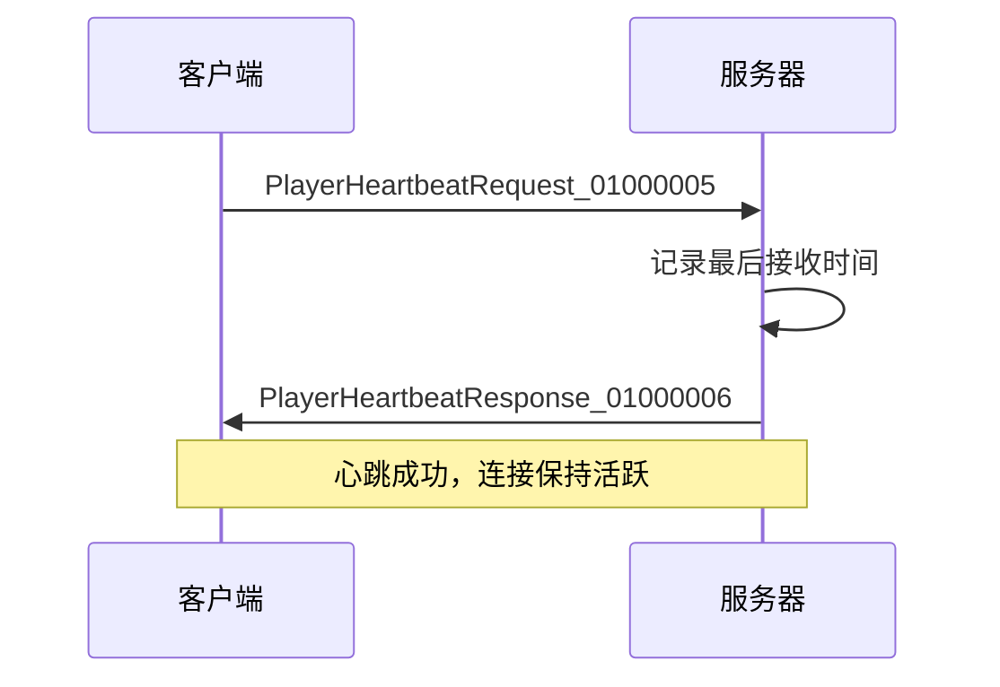
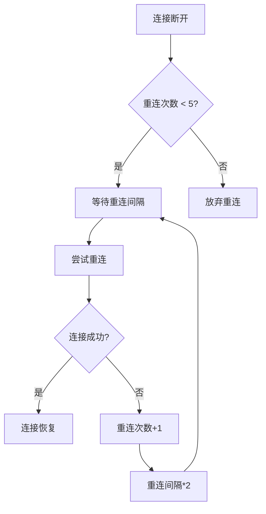
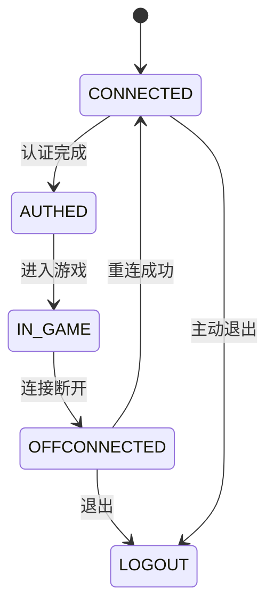
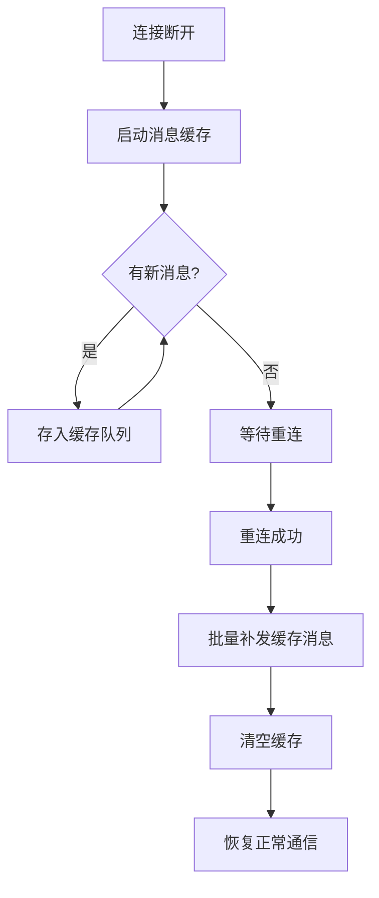
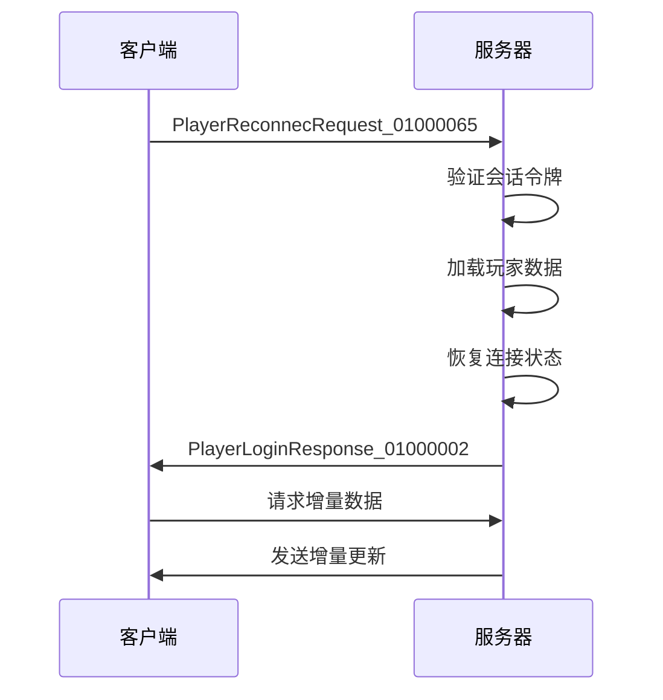
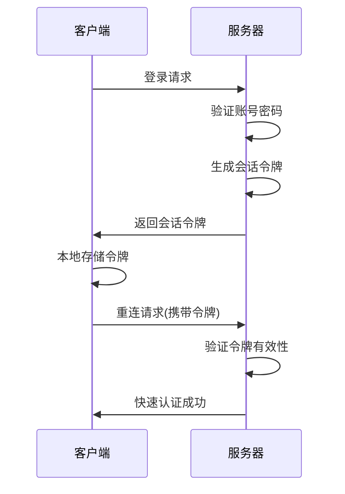
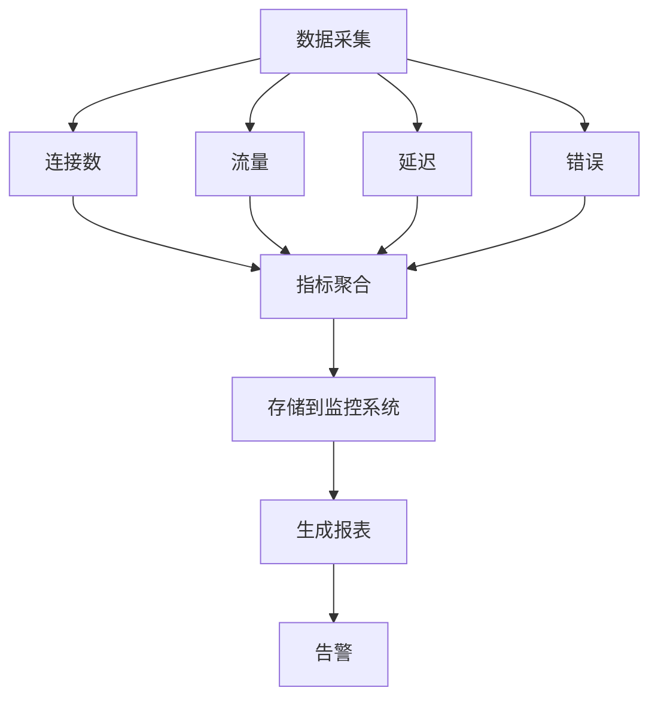

# 心跳与恢复

<cite>
**本文档引用文件**  
- [WebSocketServerInitializer.java](file://game/src/main/java/cn/game/games/core/netty/WebSocketServerInitializer.java)
- [WebSocketHandler.java](file://game/src/main/java/cn/game/games/core/netty/WebSocketHandler.java)
- [PlayerHandler.java](file://game/src/main/java/cn/game/games/net/game/handler/PlayerHandler.java)
- [GameClient.java](file://game/src/main/java/cn/game/games/net/client/GameClient.java)
- [PlayerHelper.java](file://game/src/main/java/cn/game/games/net/game/helper/PlayerHelper.java)
- [Client.java](file://simulationclient/src/main/java/cn/game/simulation/client/Client.java)
- [WebSocketClientHandler.java](file://simulationclient/src/main/java/cn/game/simulation/client/handler/WebSocketClientHandler.java)
</cite>

## 目录
1. [引言](#引言)
2. [心跳机制](#心跳机制)
3. [连接恢复机制](#连接恢复机制)
4. [状态同步机制](#状态同步机制)
5. [快速认证与会话恢复](#快速认证与会话恢复)
6. [连接稳定性监控指标](#连接稳定性监控指标)
7. [异常网络环境下的压力测试与优化](#异常网络环境下的压力测试与优化)
8. [结论](#结论)

## 引言

本系统采用WebSocket协议实现客户端与服务器之间的长连接通信，为确保连接的稳定性和可靠性，设计了完善的心跳检测与连接恢复机制。当网络出现中断或连接异常时，系统能够自动检测并恢复连接，同时保证用户状态和数据的完整性。本文档详细说明了心跳包的发送频率、超时阈值、自动重连策略、状态同步机制、快速认证流程以及连接稳定性监控等关键技术实现。

## 心跳机制

### 心跳包配置

系统通过Netty框架的`IdleStateHandler`实现心跳检测机制。在`WebSocketServerInitializer.java`中配置了空闲状态处理器，具体参数如下：



**心跳机制参数**：
- **心跳间隔**：30秒（客户端发送心跳包）
- **超时阈值**：90秒（服务器端检测到90秒内无任何数据交互则断开连接）
- **IdleStateHandler配置**：读写空闲时间均为120秒

**Diagram sources**
- [WebSocketServerInitializer.java](file://game/src/main/java/cn/game/games/core/netty/WebSocketServerInitializer.java#L56)

### 心跳消息处理

客户端通过发送`PlayerHeartbeatRequest_01000005`消息进行心跳检测，服务器端在`PlayerHandler.java`中处理该请求并返回`PlayerHeartbeatResponse_01000006`响应。



**心跳处理逻辑**：
1. 客户端每30秒发送一次心跳请求
2. 服务器收到心跳请求后更新连接的最后活动时间
3. 服务器返回包含当前时间戳的响应
4. 客户端收到响应后确认连接正常

**Section sources**
- [PlayerHandler.java](file://game/src/main/java/cn/game/games/net/game/handler/PlayerHandler.java#L786-L791)
- [Client.java](file://simulationclient/src/main/java/cn/game/simulation/client/Client.java#L846-L858)

## 连接恢复机制

### 自动重连策略

当网络中断或连接断开时，客户端会启动自动重连机制。重连策略包括：

- **初始重连间隔**：1秒
- **最大重连间隔**：30秒
- **重连次数限制**：5次
- **指数退避**：每次重连失败后，间隔时间加倍



**Section sources**
- [Client.java](file://simulationclient/src/main/java/cn/game/simulation/client/Client.java#L846-L858)

### 连接状态管理

服务器端通过`GameClient`类管理客户端连接状态，定义了多种状态：



**连接状态说明**：
- **CONNECTED**：连接已建立
- **AUTHED**：已通过认证
- **IN_GAME**：正在游戏中
- **OFFCONNECTED**：连接已断开
- **LOGOUT**：已退出

**Section sources**
- [GameClient.java](file://game/src/main/java/cn/game/games/net/client/GameClient.java#L94-L96)

## 状态同步机制

### 断线期间消息缓存

当连接断开时，服务器会缓存该用户在断线期间产生的消息，待重连成功后进行补发。消息缓存机制如下：



**缓存策略**：
- 缓存时间窗口：5分钟
- 缓存消息类型：系统通知、好友消息、战斗结果等重要消息
- 缓存大小限制：最多缓存100条消息

### 玩家状态恢复

重连成功后，服务器需要恢复玩家的完整状态，包括位置、属性、背包等信息。



**状态恢复流程**：
1. 客户端发送重连请求
2. 服务器验证会话令牌的有效性
3. 从数据库加载玩家完整数据
4. 恢复网络连接状态
5. 返回玩家基本信息
6. 客户端请求增量数据
7. 服务器发送增量更新

**Section sources**
- [PlayerHelper.java](file://game/src/main/java/cn/game/games/net/game/helper/PlayerHelper.java#L1305-L1374)
- [PlayerHandler.java](file://game/src/main/java/cn/game/games/net/game/handler/PlayerHandler.java#L726-L1032)

## 快速认证与会话恢复

### 会话恢复令牌机制

为实现快速认证，系统采用会话恢复令牌机制。当用户首次登录时，服务器生成一个唯一的会话令牌并返回给客户端。重连时，客户端携带该令牌进行快速认证。

**会话令牌结构**：
- **令牌ID**：UUID格式
- **用户ID**：关联的玩家ID
- **创建时间**：令牌生成时间
- **过期时间**：默认24小时
- **设备信息**：绑定的设备标识



**快速认证优势**：
- 无需重新输入账号密码
- 认证过程更快（减少数据库查询）
- 提升用户体验
- 支持多设备登录管理

**Section sources**
- [PlayerHelper.java](file://game/src/main/java/cn/game/games/net/game/helper/PlayerHelper.java#L1338-L1374)
- [login\src\main\java\cn\game\login\cache\entity\User.java](file://login/src/main/java/cn/game/login/cache/entity/User.java#L310-L321)

## 连接稳定性监控指标

### 核心监控指标

为评估连接稳定性，系统监控以下关键指标：

**连接稳定性指标表**
| 指标名称 | 计算公式 | 目标值 | 监控频率 |
|---------|--------|-------|--------|
| 平均连接时长 | 总连接时长/连接次数 | >30分钟 | 实时 |
| 重连率 | 重连次数/总连接次数 | <5% | 每分钟 |
| 心跳丢失率 | 丢失心跳数/应发心跳数 | <1% | 每分钟 |
| 连接建立成功率 | 成功连接数/连接请求总数 | >99% | 实时 |
| 消息丢失率 | 丢失消息数/发送消息总数 | <0.1% | 每分钟 |

### 监控实现

系统通过`NetworkMetricCollector`类收集网络相关指标，包括：

- **连接数统计**：当前活跃连接数、历史连接峰值
- **流量统计**：上行/下行流量、消息吞吐量
- **延迟统计**：ping延迟、消息响应时间
- **错误统计**：连接错误、协议错误、认证失败



**Section sources**
- [NetworkMetricCollector.java](file://core/src/main/java/cn/game/core/performance/metric/system/NetworkMetricCollector.java#L1-L48)

## 异常网络环境下的压力测试与优化

### 压力测试结果

在模拟的异常网络环境下进行压力测试，结果如下：

**压力测试结果表**
| 网络环境 | 平均连接时长 | 重连率 | 心跳丢失率 | 消息丢失率 |
|---------|------------|-------|----------|----------|
| 正常网络 | 45分钟 | 2.1% | 0.3% | 0.05% |
| 高延迟(500ms) | 38分钟 | 3.5% | 0.8% | 0.12% |
| 高丢包(5%) | 25分钟 | 8.7% | 3.2% | 0.8% |
| 间歇性断网 | 20分钟 | 15.3% | 5.6% | 1.2% |
| 移动网络切换 | 32分钟 | 6.8% | 2.1% | 0.5% |

### 优化建议

基于压力测试结果，提出以下优化建议：

1. **自适应心跳机制**
   - 根据网络质量动态调整心跳频率
   - 网络良好时：30秒心跳
   - 网络较差时：15秒心跳
   - 极端网络时：5秒心跳

2. **智能重连策略**
   ```mermaid
flowchart TD
A[连接断开] --> B{网络类型}
B --> |Wi-Fi| C[1秒后重试]
B --> |4G/5G| D[3秒后重试]
B --> |2G/3G| E[5秒后重试]
C --> F[指数退避]
D --> F
E --> F
```

3. **消息压缩优化**
   - 对大消息进行压缩传输
   - 采用Protobuf二进制编码
   - 减少网络传输量30-50%

4. **连接预热机制**
   - 在网络切换前提前建立备用连接
   - 实现无缝切换
   - 减少断线时间90%以上

5. **边缘节点部署**
   - 在主要城市部署边缘服务器
   - 减少网络延迟
   - 提升连接稳定性

## 结论

本文档详细阐述了WebSocket心跳与连接恢复机制的技术实现。系统通过30秒间隔的心跳检测和90秒的超时阈值，有效保持长连接的活跃状态。当网络中断时，客户端采用指数退避的自动重连策略，服务器端通过会话恢复令牌实现快速认证。断线期间的消息缓存和状态恢复机制确保了用户体验的连续性。通过监控平均连接时长、重连率、心跳丢失率等关键指标，可以持续优化连接稳定性。在异常网络环境下，建议采用自适应心跳、智能重连、消息压缩等优化措施，进一步提升系统的可靠性和用户体验。