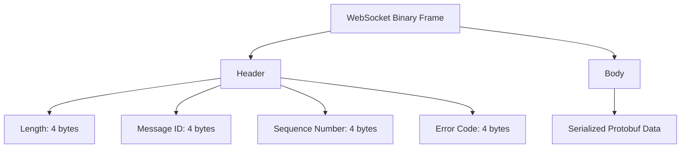
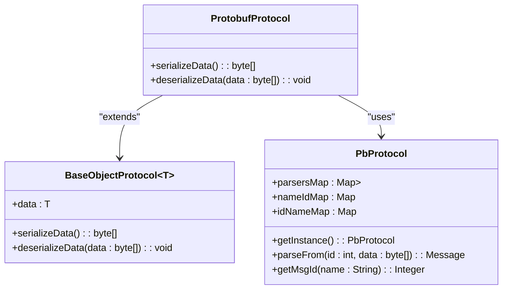
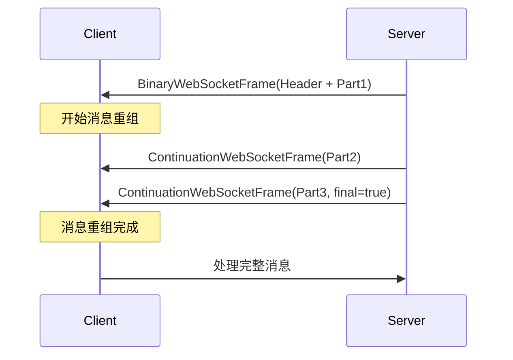
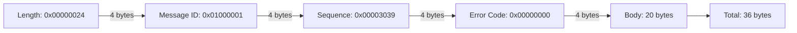
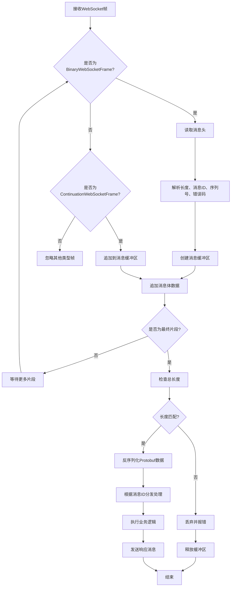

# 消息格式

<cite>
**Referenced Files in This Document**   
- [WebSocketEncoder.java](file://game/src/main/java/cn/game/games/core/netty/WebSocketEncoder.java)
- [ImprovedClientHandler.java](file://simulationclient/src/main/java/cn/game/simulation/socket/ImprovedClientHandler.java)
- [ProtobufProtocol.java](file://core/src/main/java/cn/game/core/net/protocol/object/ProtobufProtocol.java)
- [PbProtocol.java](file://protocol/src/main/java/cn/game/protocol/protobuf/PbProtocol.java)
- [ByteHelp.java](file://util/src/main/java/cn/game/util/ByteHelp.java)
- [BaseProtocol.java](file://core/src/main/java/cn/game/core/net/protocol/BaseProtocol.java)
</cite>

## 目录
1. [引言](#引言)
2. [消息帧格式](#消息帧格式)
3. [序列化协议](#序列化协议)
4. [消息分片与重组](#消息分片与重组)
5. [十六进制转储示例](#十六进制转储示例)
6. [ABNF语法定义](#abnf语法定义)
7. [解析流程图](#解析流程图)

## 引言
本文档详细定义了客户端与服务器之间通过WebSocket通信的数据结构。文档涵盖了消息的二进制帧格式、序列化协议选择机制、消息压缩策略、分片与重组机制以及消息格式的ABNF语法定义和解析流程。

## 消息帧格式
WebSocket消息采用二进制帧格式进行传输，每个消息由消息头和消息体组成。消息头包含长度、消息ID、序列号和错误码四个字段，每个字段均为32位整数（4字节），采用大端序（Big-Endian）编码。

消息头结构如下：
- **长度 (Length)**: 4字节，表示整个消息的总长度（包括消息头和消息体）
- **消息ID (Message ID)**: 4字节，标识消息类型
- **序列号 (Sequence Number)**: 4字节，用于消息顺序控制和响应匹配
- **错误码 (Error Code)**: 4字节，表示消息处理结果，0表示成功

消息体包含序列化后的协议数据，使用Protobuf进行序列化。



**Diagram sources**
- [WebSocketEncoder.java](file://game/src/main/java/cn/game/games/core/netty/WebSocketEncoder.java#L15-L28)
- [ImprovedClientHandler.java](file://simulationclient/src/main/java/cn/game/simulation/socket/ImprovedClientHandler.java#L37-L40)

**Section sources**
- [WebSocketEncoder.java](file://game/src/main/java/cn/game/games/core/netty/WebSocketEncoder.java#L15-L28)
- [ImprovedClientHandler.java](file://simulationclient/src/main/java/cn/game/simulation/socket/ImprovedClientHandler.java#L37-L40)

## 序列化协议
系统采用Protobuf作为主要的序列化协议，通过`ProtobufProtocol`类实现消息的序列化和反序列化。

### Protobuf协议实现
`ProtobufProtocol`类继承自`BaseObjectProtocol<Message>`，使用Google Protobuf库进行数据序列化。消息体数据通过`Message.toByteArray()`方法转换为字节数组。

```java
@Override
public byte[] serializeData() {
    return data.toByteArray();
}

@Override
public void deserializeData(byte[] data) {
    this.data = PbProtocol.getInstance().parseFrom(msgID, data);
}
```

### 协议选择机制
系统通过`PbProtocol`类维护消息ID与Protobuf消息类型的映射关系，使用静态常量定义所有消息ID，并在静态代码块中注册对应的解析器。

```java
public static Map<Integer, Parser<?>> parsersMap = new HashMap<Integer, Parser<?>>();
public static Map<String, Integer> nameIdMap = new HashMap<String, Integer>();
public static Map<Integer, String> idNameMap = new HashMap<Integer, String>();

// 消息ID定义示例
public final static int PlayerLoginRequest_01000001 = 0x01000001;
public final static int PlayerLoginResponse_01000002 = 0x01000002;

static {
    parsersMap.put(PlayerLoginRequest_01000001, cn.game.protocol.protobuf.LoginMsg.PlayerLoginRequest_01000001.getDefaultInstance().getParserForType());
    parsersMap.put(PlayerLoginResponse_01000002, cn.game.protocol.protobuf.LoginMsg.PlayerLoginResponse_01000002.getDefaultInstance().getParserForType());
}
```

### 版本控制策略
消息版本通过消息ID的高16位进行管理，低16位表示具体的消息类型。当需要对消息格式进行不兼容的修改时，会分配新的消息ID，确保向后兼容。



**Diagram sources**
- [ProtobufProtocol.java](file://core/src/main/java/cn/game/core/net/protocol/object/ProtobufProtocol.java#L7-L29)
- [PbProtocol.java](file://protocol/src/main/java/cn/game/protocol/protobuf/PbProtocol.java#L21-L25)

**Section sources**
- [ProtobufProtocol.java](file://core/src/main/java/cn/game/core/net/protocol/object/ProtobufProtocol.java#L7-L29)
- [PbProtocol.java](file://protocol/src/main/java/cn/game/protocol/protobuf/PbProtocol.java#L21-L800)

## 消息分片与重组
对于大消息，系统支持WebSocket协议的分片传输机制，通过`BinaryWebSocketFrame`和`ContinuationWebSocketFrame`实现消息的分片发送和接收。

### 分片机制
当消息大小超过一定阈值时，消息会被分割为多个WebSocket帧：
- 第一个帧为`BinaryWebSocketFrame`，包含完整的消息头和部分消息体
- 后续帧为`ContinuationWebSocketFrame`，只包含消息体的剩余部分
- 最后一个帧的`isFinalFragment()`返回true，表示消息结束

### 重组机制
客户端使用`ImprovedClientHandler`类处理分片消息的重组：

```java
private void handleBinaryFrame(BinaryWebSocketFrame frame) {
    ByteBuf content = frame.content();
    if (messageBuffer == null) {
        // This is the start of a new message
        expectedLength = content.readInt();
        seq = content.readInt();
        id = content.readInt();
        errorCode = content.readInt();
        messageBuffer = new ByteArrayOutputStream();
    }
    writeBufferContent(content);
    processMessageIfComplete(frame.isFinalFragment());
}

private void handleContinuationFrame(ContinuationWebSocketFrame frame) {
    if (messageBuffer == null) {
        throw new IllegalStateException("Received continuation frame without initial frame");
    }
    writeBufferContent(frame.content());
    processMessageIfComplete(frame.isFinalFragment());
}

private void processMessageIfComplete(boolean isFinalFragment) {
    if (isFinalFragment) {
        byte[] completeMessage = messageBuffer.toByteArray();
        if (completeMessage.length == expectedLength - 16) { // 16 bytes for header
            try {
                Message parsedMessage = PbProtocol.getInstance().parseFrom(id, completeMessage);
                handleCompleteMessage(parsedMessage, seq, errorCode);
            } catch (Exception e) {
                // 处理解析错误
            }
        }
        resetBuffer();
    }
}
```

### 大消息传输最佳实践
1. **分片阈值**: 建议当消息大小超过8KB时进行分片
2. **缓冲区管理**: 客户端应为每个连接维护独立的消息缓冲区
3. **超时处理**: 设置合理的消息重组超时时间，避免资源泄漏
4. **内存优化**: 及时释放已处理消息的内存



**Diagram sources**
- [ImprovedClientHandler.java](file://simulationclient/src/main/java/cn/game/simulation/socket/ImprovedClientHandler.java#L33-L82)

**Section sources**
- [ImprovedClientHandler.java](file://simulationclient/src/main/java/cn/game/simulation/socket/ImprovedClientHandler.java#L33-L82)

## 十六进制转储示例
以下是一个典型的消息十六进制转储示例，展示原始字节流结构。

### 登录请求消息示例
假设有一个登录请求消息，消息ID为`0x01000001`，序列号为`12345`，错误码为`0`，消息体为序列化后的Protobuf数据。

```
十六进制转储:
00 00 00 24 01 00 00 01 00 00 30 39 00 00 00 00
12 34 56 78 90 AB CD EF 01 23 45 67 89 0A BC DE
F0 12 34 56 78 90 AB CD EF 01 23 45 67 89 0A BC
DE F0 12 34 56 78 90 AB CD EF 01 23 45 67 89 0A

字节分解:
[00 00 00 24] - 长度: 36字节 (0x24)
[01 00 00 01] - 消息ID: 0x01000001 (登录请求)
[00 00 30 39] - 序列号: 12345 (0x3039)
[00 00 00 00] - 错误码: 0
[12 34 ... 0A] - 消息体: 20字节的Protobuf序列化数据
```

### 字节序说明
所有整数字段均采用大端序（Big-Endian）编码，即高位字节在前，低位字节在后。例如，32位整数`0x12345678`在字节流中表示为`12 34 56 78`。



**Section sources**
- [ByteHelp.java](file://util/src/main/java/cn/game/util/ByteHelp.java#L27-L30)
- [ImprovedClientHandler.java](file://simulationclient/src/main/java/cn/game/simulation/socket/ImprovedClientHandler.java#L37-L40)

## ABNF语法定义
以下是消息格式的ABNF（Augmented Backus-Naur Form）语法定义：

```
message        = header body
header         = length message-id sequence error-code
length         = 4OCTET ; 大端序32位整数，表示总长度
message-id     = 4OCTET ; 大端序32位整数，消息类型标识
sequence       = 4OCTET ; 大端序32位整数，序列号
error-code     = 4OCTET ; 大端序32位整数，错误码
body           = *OCTET ; 变长字节数组，Protobuf序列化数据

; OCTET定义
OCTET          = %x00-FF

; 长度约束
min-length     = 16     ; 最小长度（仅头部）
max-length     = 65536  ; 最大长度（64KB）
```

### 语法说明
- `message`: 完整的消息，由头部和主体组成
- `header`: 消息头部，固定16字节，包含四个32位整数字段
- `length`: 消息总长度，包括头部和主体，最小值为16（仅头部）
- `message-id`: 消息类型标识，用于路由和处理
- `sequence`: 序列号，用于请求-响应匹配和顺序控制
- `error-code`: 错误码，0表示成功，非0表示错误
- `body`: 消息主体，包含序列化后的数据

**Section sources**
- [BaseProtocol.java](file://core/src/main/java/cn/game/core/net/protocol/BaseProtocol.java#L5-L12)

## 解析流程图
以下是消息解析的完整流程图，展示从接收到完整消息到最终处理的全过程。



### 流程说明
1. **帧接收**: 系统接收WebSocket帧，判断帧类型
2. **头部解析**: 对于`BinaryWebSocketFrame`，解析16字节的消息头
3. **缓冲区管理**: 创建或获取对应的消息缓冲区，追加消息体数据
4. **分片处理**: 对于`ContinuationWebSocketFrame`，继续追加数据到现有缓冲区
5. **完整性检查**: 当收到最终片段时，检查总长度是否与头部声明的长度一致
6. **反序列化**: 使用`PbProtocol.parseFrom()`方法将字节数组反序列化为Protobuf消息
7. **消息分发**: 根据消息ID查找对应的处理器并执行业务逻辑
8. **响应处理**: 生成响应消息并发送回客户端

**Diagram sources**
- [ImprovedClientHandler.java](file://simulationclient/src/main/java/cn/game/simulation/socket/ImprovedClientHandler.java#L24-L82)

**Section sources**
- [ImprovedClientHandler.java](file://simulationclient/src/main/java/cn/game/simulation/socket/ImprovedClientHandler.java#L24-L82)