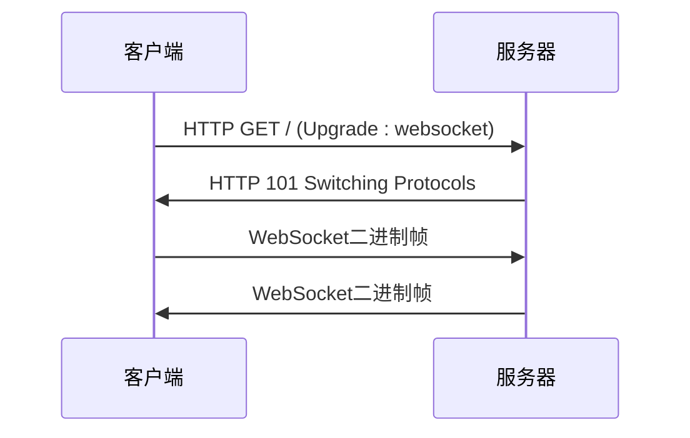
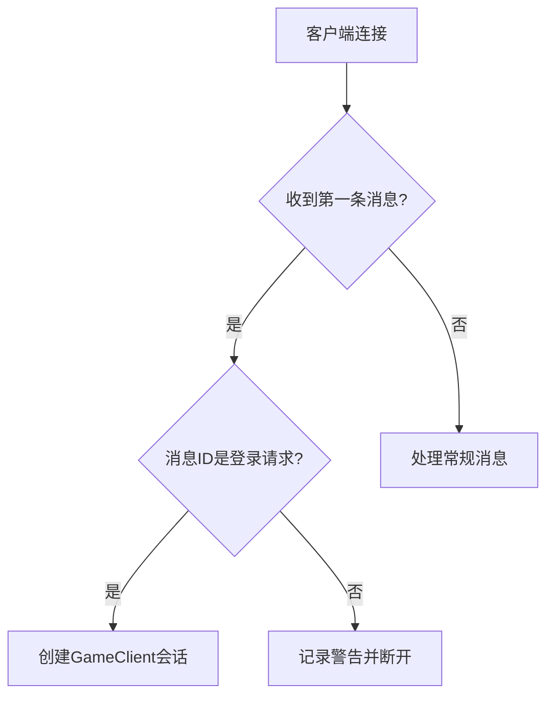
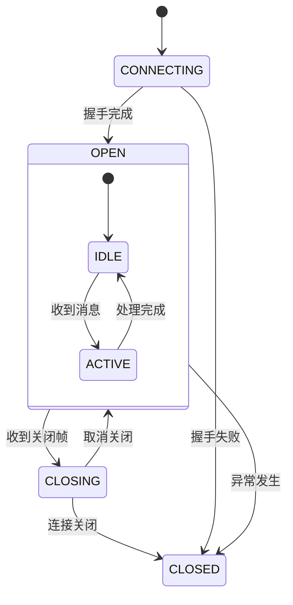
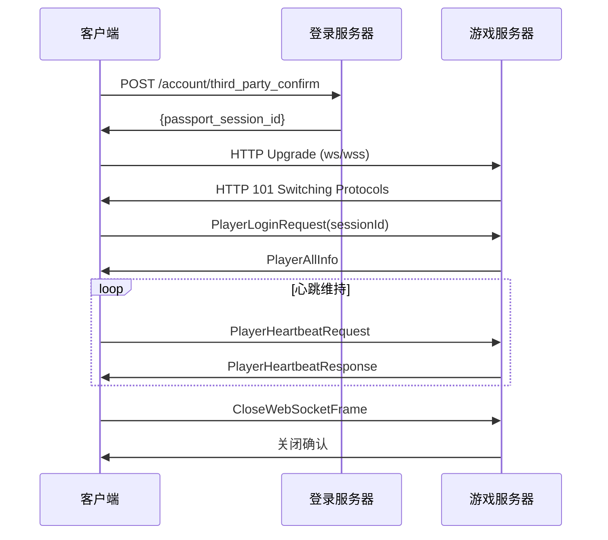

# 连接协议

<cite>
**本文档引用的文件**
- [WebSocketServerInitializer.java](file://game/src/main/java/cn/game/games/core/netty/WebSocketServerInitializer.java)
- [WebSocketHandler.java](file://game/src/main/java/cn/game/games/core/netty/WebSocketHandler.java)
- [WebSocketClientHandler.java](file://simulationclient/src/main/java/cn/game/simulation/client/handler/WebSocketClientHandler.java)
- [Client.java](file://simulationclient/src/main/java/cn/game/simulation/client/Client.java)
- [VertxThirdPartyConfirmReq.java](file://login/src/main/java/cn/game/login/net/clientpacket/vertx/VertxThirdPartyConfirmReq.java)
- [HandlerState.java](file://game/src/main/java/cn/game/games/core/netty/HandlerState.java)
- [env.properties](file://simulationclient/src/main/resources/env.properties)
</cite>

## 目录
1. [引言](#引言)
2. [WebSocket连接建立流程](#websocket连接建立流程)
3. [连接初始化与认证](#连接初始化与认证)
4. [连接状态机](#连接状态机)
5. [超时与连接限制](#超时与连接限制)
6. [错误处理](#错误处理)
7. [时序图](#时序图)

## 引言
本文档详细描述了WebSocket连接协议的完整流程，包括连接建立、认证、状态管理、超时控制和错误处理机制。系统采用Netty作为WebSocket服务器框架，通过HTTP升级协议建立长连接，支持WSS加密连接。

**本文档引用的文件**
- [WebSocketServerInitializer.java](file://game/src/main/java/cn/game/games/core/netty/WebSocketServerInitializer.java)
- [WebSocketHandler.java](file://game/src/main/java/cn/game/games/core/netty/WebSocketHandler.java)

## WebSocket连接建立流程

### HTTP升级请求握手过程
WebSocket连接通过HTTP/1.1的Upgrade机制建立。客户端发送HTTP请求，服务器响应101状态码完成协议切换。

客户端根据服务器地址类型决定使用ws还是wss协议：
- 如果服务器地址是IP地址，使用`ws://`协议
- 如果服务器地址是域名，使用`wss://`协议（启用SSL/TLS加密）

URL路径规范为根路径`/`，由`WebSocketServerInitializer.WEBSOCKET_PATH`常量定义。

**Section sources**
- [WebSocketServerInitializer.java](file://game/src/main/java/cn/game/games/core/netty/WebSocketServerInitializer.java#L35)
- [Client.java](file://simulationclient/src/main/java/cn/game/simulation/client/Client.java#L592-L594)

### SSL/TLS配置要求
服务器端通过`SslContext`配置SSL/TLS，客户端在连接域名时自动启用SSL。服务器端的`WebSocketServerInitializer`构造函数接收`SslContext`参数，用于安全连接。

客户端在`Client.connect()`方法中，当检测到域名连接时，使用`SslContextBuilder.forClient().build()`创建SSL上下文。



**Diagram sources**
- [WebSocketServerInitializer.java](file://game/src/main/java/cn/game/games/core/netty/WebSocketServerInitializer.java#L43-L45)
- [Client.java](file://simulationclient/src/main/java/cn/game/simulation/client/Client.java#L608-L609)

## 连接初始化与认证

### 认证令牌传递机制
认证采用两阶段流程：
1. 首先通过HTTP API进行第三方认证，获取`passport_session_id`
2. 在WebSocket连接后，发送包含`passport_session_id`的登录请求

在HTTP认证阶段，token通过Protobuf消息传递。对于官方渠道，token格式为`username password`，在`VertxThirdPartyConfirmReq.OfficialAuthHandler`中通过空格分割解析。

```java
String[] credentials = token.split(" ");
String username = credentials[0];
String password = credentials.length > 1 ? credentials[1] : "";
```

**Section sources**
- [VertxThirdPartyConfirmReq.java](file://login/src/main/java/cn/game/login/net/clientpacket/vertx/VertxThirdPartyConfirmReq.java#L102-L109)
- [Client.java](file://simulationclient/src/main/java/cn/game/simulation/client/Client.java#L645)

### 服务器响应格式
服务器在WebSocket握手完成后，等待客户端发送初始认证消息。服务器响应遵循二进制帧格式，包含12字节头部和Protobuf序列化数据体。

### 客户端初始认证消息结构
客户端必须发送`PlayerLoginRequest_01000001`消息作为初始认证，包含：
- sessionId (passport_session_id)
- 版本号
- 设备ID
- 账号ID
- 逻辑服务器ID
- 玩家ID

服务器在`WebSocketHandler.channelRead0()`方法中验证消息ID，只有`PlayerLoginRequest_01000001`才能创建新的`GameClient`会话。



**Diagram sources**
- [WebSocketHandler.java](file://game/src/main/java/cn/game/games/core/netty/WebSocketHandler.java#L62-L63)
- [Client.java](file://simulationclient/src/main/java/cn/game/simulation/client/Client.java#L644-L658)

## 连接状态机

系统定义了完整的连接状态生命周期，通过Netty的ChannelHandler方法实现状态转换。



状态转换条件：
- **CONNECTING → OPEN**: `channelActive`事件触发，握手完成
- **OPEN → CLOSING**: 收到`CloseWebSocketFrame`
- **CLOSING → CLOSED**: 连接完全关闭
- **任何状态 → CLOSED**: 发生异常或空闲超时

**Section sources**
- [WebSocketClientHandler.java](file://simulationclient/src/main/java/cn/game/simulation/client/handler/WebSocketClientHandler.java#L79-L81)
- [WebSocketHandler.java](file://game/src/main/java/cn/game/games/core/netty/WebSocketHandler.java#L100-L108)

## 超时与连接限制

### 连接超时设置
系统配置了120秒的空闲超时，通过`IdleStateHandler`实现：

```java
pipeline.addLast(new IdleStateHandler(120, 120, 120, TimeUnit.SECONDS));
```

当读或写空闲超过120秒时，触发`IdleStateEvent`，服务器主动关闭连接。

### 并发连接限制
服务器通过`GlobalTrafficShapingHandler`进行流量整形，限制全局连接的流量：

```java
public static final GlobalTrafficShapingHandler trafficHandler = 
    new GlobalTrafficShapingHandler(Executors.newScheduledThreadPool(1), 1000);
```

### IP限流策略
虽然代码中未直接实现IP限流，但通过`trafficHandler`可以扩展实现基于IP的流量控制。系统记录了客户端IP地址，为IP限流提供了基础数据。

```java
InetSocketAddress isa = (InetSocketAddress) ctx.channel().remoteAddress();
client.setIp(isa.getAddress().getHostAddress());
```

**Section sources**
- [WebSocketServerInitializer.java](file://game/src/main/java/cn/game/games/core/netty/WebSocketServerInitializer.java#L56)
- [WebSocketHandler.java](file://game/src/main/java/cn/game/games/core/netty/WebSocketHandler.java#L67-L68)

## 错误处理

### 常见错误代码及解决方案
系统定义了多种错误情况及处理方式：

| 错误代码 | 场景 | 解决方案 |
|--------|------|---------|
| 403 | 认证失败 | 检查token格式和凭据 |
| 429 | 请求过频 | 实现指数退避重试 |
| 握手失败 | SSL/TLS问题 | 确保域名证书有效 |
| 空闲超时 | 120秒无活动 | 客户端发送心跳 |

在`VertxThirdPartyConfirmReq`中，认证失败返回相应的错误码：
- `ACCOUNT_NOT_EXIST`: 账号不存在
- `PASSWORD_ERROR`: 密码错误
- `CHANNEL_NOT_SUPPORT`: 不支持的渠道

### 连接失败处理
客户端在连接失败时提供详细的错误信息。`WebSocketClientHandler`捕获握手异常并记录日志：

```java
} catch (WebSocketHandshakeException e) {
    systemOutLog.info("WebSocket Client failed to connect");
    handshakeFuture.setFailure(e);
}
```

**Section sources**
- [VertxThirdPartyConfirmReq.java](file://login/src/main/java/cn/game/login/net/clientpacket/vertx/VertxThirdPartyConfirmReq.java#L118-L129)
- [WebSocketClientHandler.java](file://simulationclient/src/main/java/cn/game/simulation/client/handler/WebSocketClientHandler.java#L103-L105)

## 时序图



**Diagram sources**
- [Client.java](file://simulationclient/src/main/java/cn/game/simulation/client/Client.java#L644-L660)
- [WebSocketHandler.java](file://game/src/main/java/cn/game/games/core/netty/WebSocketHandler.java#L51-L85)