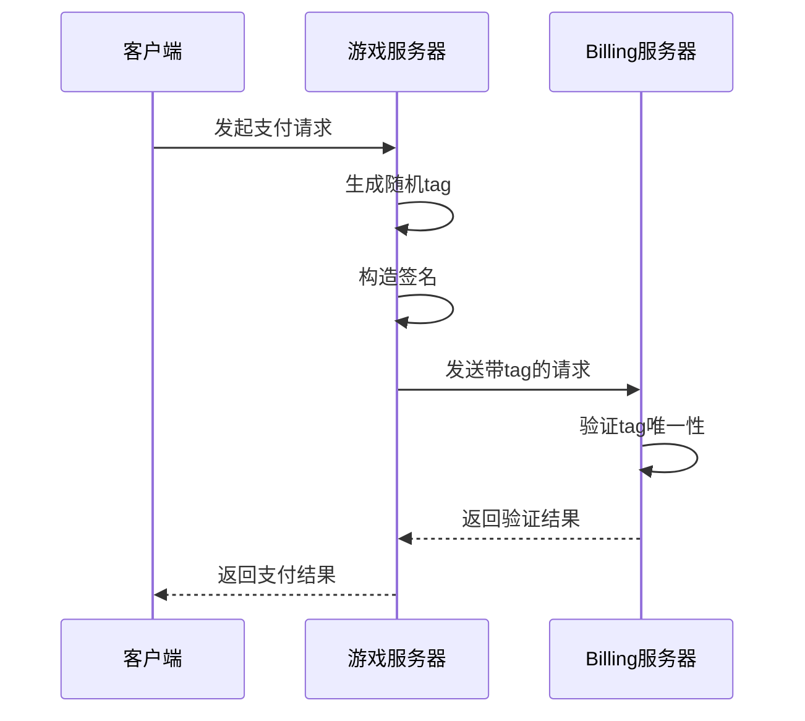
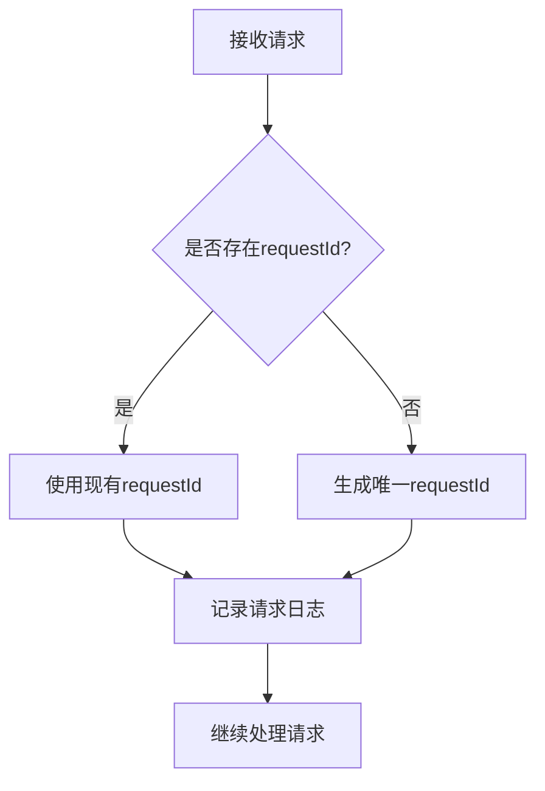
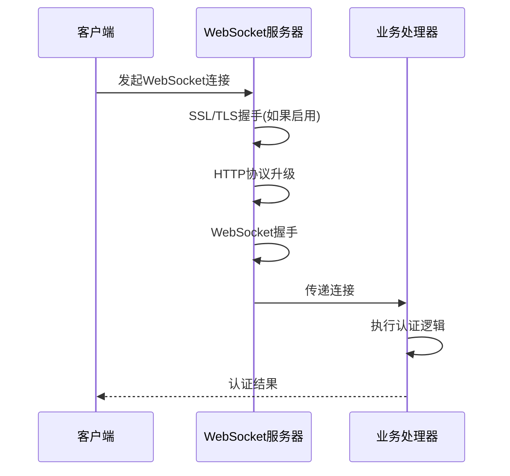
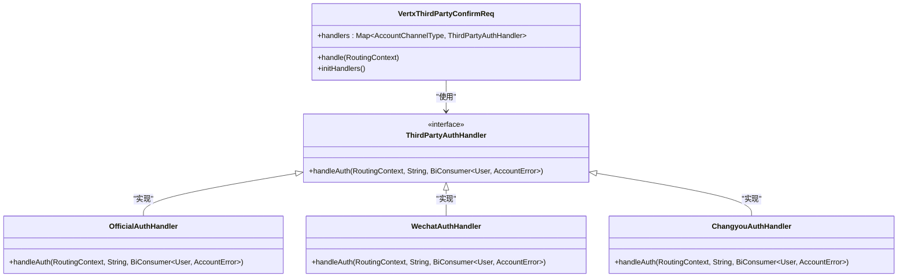
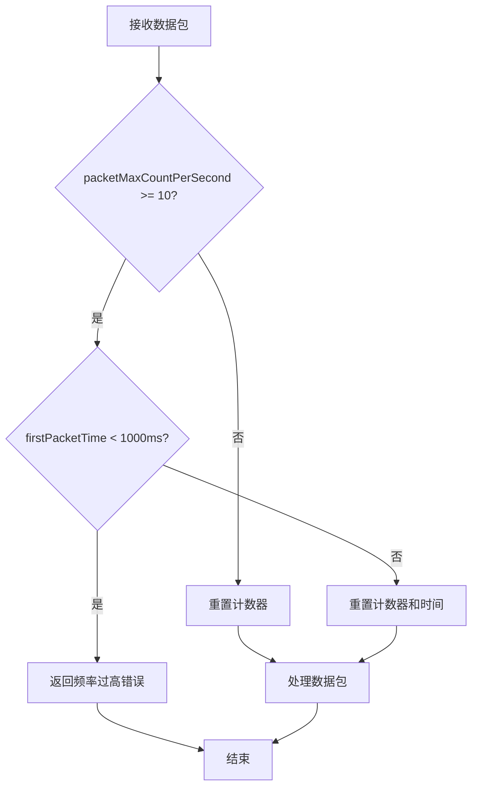
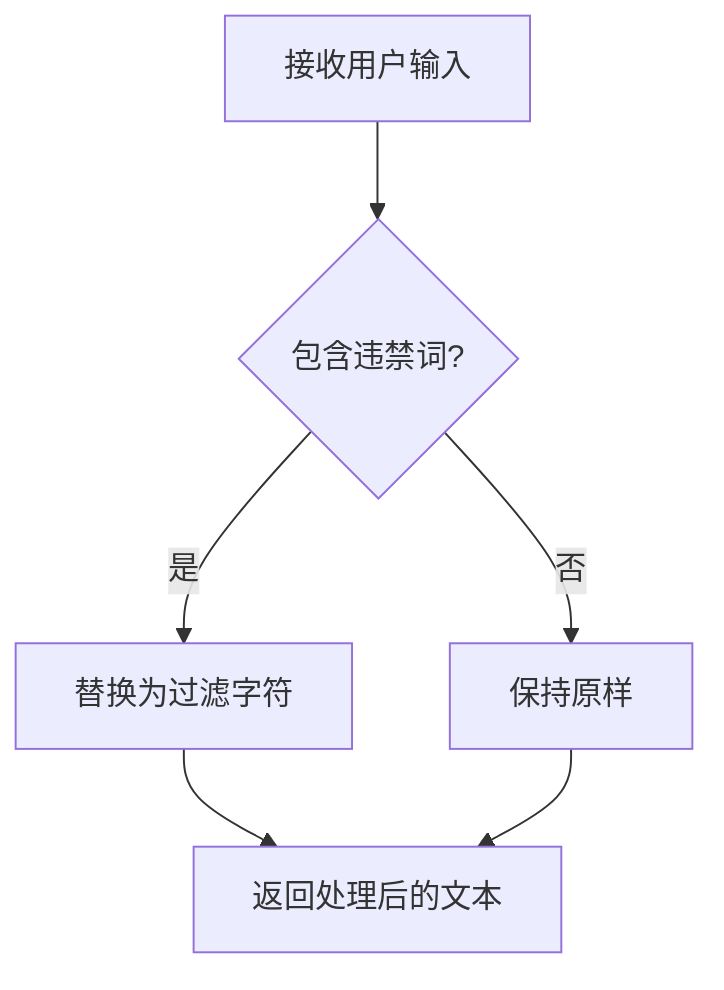
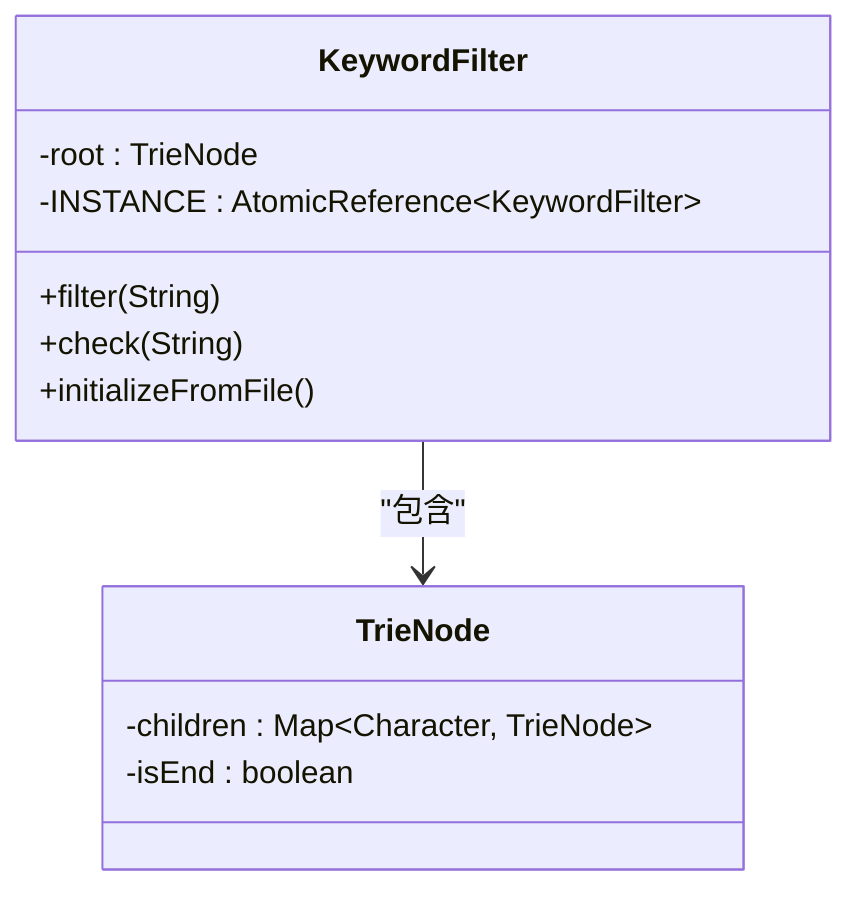
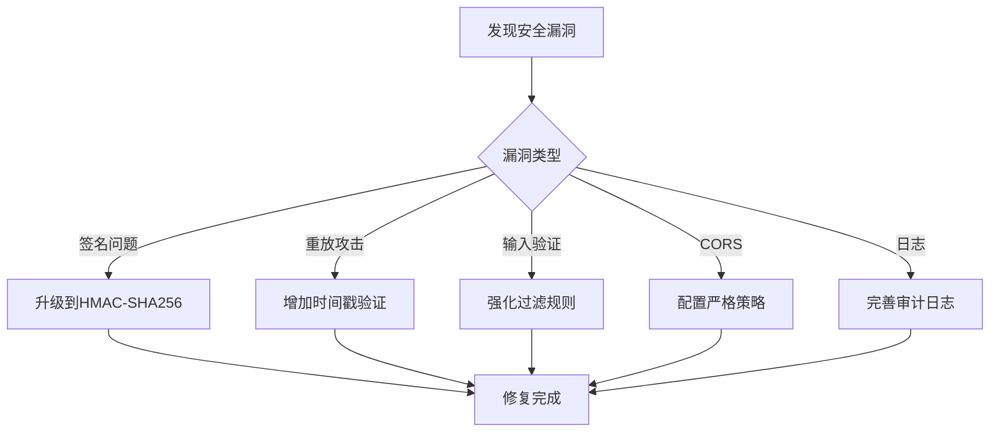

# 接口安全

<cite>
**本文档引用的文件**   
- [ChangYouSdk.java](file://core/src/main/java/cn/game/core/sdk/ChangYouSdk.java)
- [WechatHelper.java](file://login/src/main/java/cn/game/login/net/clientpacket/vertx/wechat/WechatHelper.java)
- [VertxRouterConfig.java](file://login/src/main/java/cn/game/login/net/clientpacket/vertx/VertxRouterConfig.java)
- [Config.java](file://util/src/main/java/cn/game/util/Config.java)
- [KeywordFilter.java](file://util/src/main/java/cn/game/util/KeywordFilter.java)
- [GameClient.java](file://game/src/main/java/cn/game/games/net/client/GameClient.java)
- [WebSocketServerInitializer.java](file://game/src/main/java/cn/game/games/core/netty/WebSocketServerInitializer.java)
</cite>

## 目录
1. [支付接口安全](#支付接口安全)
2. [防重放攻击策略](#防重放攻击策略)
3. [认证授权流程](#认证授权流程)
4. [输入验证机制](#输入验证机制)
5. [接口安全测试与漏洞修复](#接口安全测试与漏洞修复)

## 支付接口安全

### 畅游SDK签名验证机制

畅游SDK的支付接口采用基于MD5的签名验证机制，确保请求的完整性和真实性。该机制通过在HTTP头中包含`appkey`、`sign`、`tag`、`opcode`和`channelId`等参数来实现安全通信。

签名算法的实现细节如下：
1. **签名字符串构造**：将`opcode`、`data`、`appkey`、`appsecret`、`tag`和`channelId`按顺序拼接。
2. **MD5哈希计算**：对拼接后的字符串进行MD5哈希计算。
3. **子串提取**：从计算得到的MD5哈希值中提取下标8到24的16个字符作为最终的签名。

该机制在`ChangYouSdk`类的`sendBillingRequest`方法中实现，确保了所有与畅游Billing服务器的通信都经过严格的签名验证。

**Section sources**
- [ChangYouSdk.java](file://core/src/main/java/cn/game/core/sdk/ChangYouSdk.java#L233-L267)

### HMAC-SHA256签名算法

对于微信支付接口，系统采用HMAC-SHA256签名算法进行安全验证。该算法使用密钥和消息作为输入，生成固定长度的哈希值，具有更高的安全性。

`WechatHelper`类中的`hmacSha256`方法实现了HMAC-SHA256算法：
1. 使用`Mac.getInstance("HmacSHA256")`获取HMAC-SHA256实例。
2. 通过`SecretKeySpec`创建密钥规范。
3. 调用`doFinal`方法计算最终的HMAC值。
4. 将字节数组转换为十六进制字符串表示。

此算法用于计算支付签名（`calcPaySig`）和用户登录态签名（`calcSignature`），确保了微信支付接口的安全性。

**Section sources**
- [WechatHelper.java](file://login/src/main/java/cn/game/login/net/clientpacket/vertx/wechat/WechatHelper.java#L49-L64)

## 防重放攻击策略

### 请求时间窗口校验

系统通过`tag`参数实现防重放攻击。`tag`是一个8位以内的随机数，在每次请求时生成，确保每个请求的唯一性。在`ChangYouSdk`类的`sendBillingRequest`方法中，当`tag`参数为0时，系统会自动生成一个随机数。



**Diagram sources**
- [ChangYouSdk.java](file://core/src/main/java/cn/game/core/sdk/ChangYouSdk.java#L236-L237)

### 唯一请求ID的使用

系统在处理请求时使用唯一请求ID来跟踪和验证每个请求。在`VertxRouterConfig`类中，通过`requestId`参数实现请求的唯一标识和跟踪。



**Diagram sources**
- [VertxRouterConfig.java](file://login/src/main/java/cn/game/login/net/clientpacket/vertx/VertxRouterConfig.java#L192)

## 认证授权流程

### WebSocket认证流程

WebSocket连接的认证通过`WebSocketServerInitializer`类实现。该类在Netty管道中添加了`WebSocketServerProtocolHandler`，确保WebSocket协议的正确处理。

认证流程包括：
1. SSL/TLS加密（可选）
2. HTTP编解码
3. 对象聚合
4. 空闲状态检测
5. WebSocket协议处理
6. 自定义`WebSocketHandler`处理业务逻辑



**Diagram sources**
- [WebSocketServerInitializer.java](file://game/src/main/java/cn/game/games/core/netty/WebSocketServerInitializer.java#L47-L62)

### REST API认证授权

REST API的认证授权通过`VertxThirdPartyConfirmReq`类实现，支持多种第三方认证方式，包括官方账号、微信和畅游。



**Diagram sources**
- [VertxThirdPartyConfirmReq.java](file://login/src/main/java/cn/game/login/net/clientpacket/vertx/VertxThirdPartyConfirmReq.java#L40-L57)

### 访问频率限制

系统通过`GameClient`类实现访问频率限制，防止客户端请求过于频繁。当客户端在1秒内发送超过10个数据包时，系统会返回"requests_too_frequent"错误。



**Diagram sources**
- [GameClient.java](file://game/src/main/java/cn/game/games/net/client/GameClient.java#L278-L289)

## 输入验证机制

### 参数类型检查与长度限制

系统通过`Config`类中的`checkKeyWord`和`checkText`方法实现输入验证。这些方法检查文本内容是否包含违禁词，并对敏感内容进行过滤。



**Diagram sources**
- [Config.java](file://util/src/main/java/cn/game/util/Config.java#L248-L273)

### 特殊字符过滤

系统使用`KeywordFilter`类实现高效的敏感词过滤。该类基于Trie树数据结构，能够快速检测和过滤文本中的违禁词。



**Diagram sources**
- [KeywordFilter.java](file://util/src/main/java/cn/game/util/KeywordFilter.java#L14-L34)

### SQL注入与XSS防护

系统通过路径安全检查防止目录遍历攻击。在`VertxRouterConfig`类的`isInvalidPath`方法中，检查路径是否包含`../`、`..\`等危险字符序列。

```mermaid
flowchart TD
A[接收请求路径] --> B{包含危险字符?}
B --> |是| C[拦截请求]
B --> |否| D{符合正则表达式^[a-zA-Z0-9/._-]+$?}
D --> |是| E[允许请求]
D --> |否| C
C --> F[返回400错误]
E --> G[继续处理]
```

**Diagram sources**
- [VertxRouterConfig.java](file://login/src/main/java/cn/game/login/net/clientpacket/vertx/VertxRouterConfig.java#L214-L216)

## 接口安全测试与漏洞修复

### 安全测试用例

系统应进行以下安全测试：
1. **签名验证测试**：验证错误签名的请求是否被正确拒绝
2. **重放攻击测试**：使用相同的`tag`重复发送请求，验证系统是否拒绝重复请求
3. **频率限制测试**：短时间内发送大量请求，验证频率限制是否生效
4. **输入验证测试**：发送包含SQL注入和XSS payload的请求，验证系统是否正确过滤

### 常见漏洞修复建议

1. **升级签名算法**：将MD5签名升级为HMAC-SHA256，提高安全性
2. **加强时间窗口校验**：增加时间戳验证，确保请求在有效时间窗口内
3. **完善输入验证**：对所有用户输入进行严格的类型、长度和内容验证
4. **实施CORS策略**：配置严格的CORS策略，防止跨站请求伪造
5. **日志审计**：记录所有安全相关事件，便于追踪和分析



**Diagram sources**
- [WechatHelper.java](file://login/src/main/java/cn/game/login/net/clientpacket/vertx/wechat/WechatHelper.java#L30-L37)
- [VertxRouterConfig.java](file://login/src/main/java/cn/game/login/net/clientpacket/vertx/VertxRouterConfig.java#L164-L178)