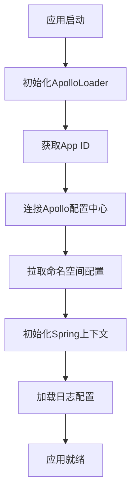
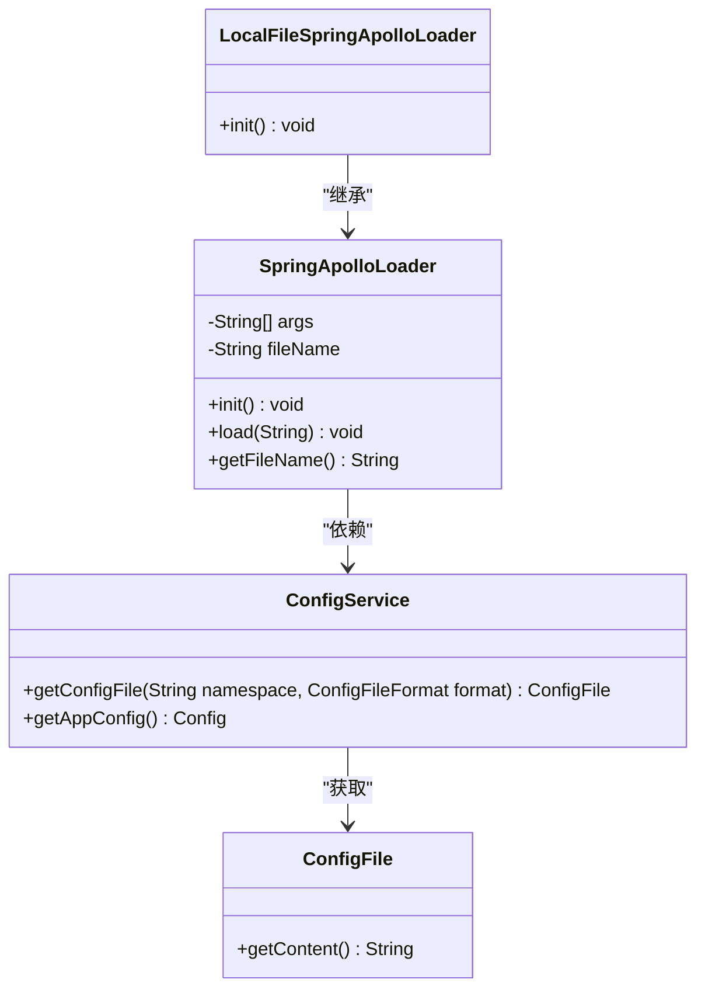
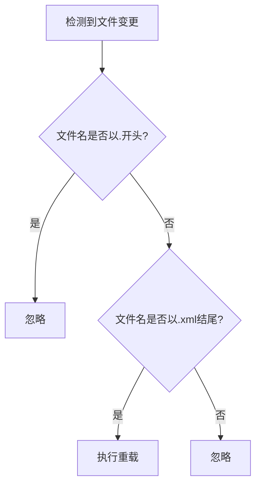

# 敏感信息管理

<cite>
**本文档引用的文件**
- [ApolloLoader.java](file://util/src/main/java/cn/game/util/ApolloLoader.java)
- [SpringApolloLoader.java](file://util/src/main/java/cn/game/util/SpringApolloLoader.java)
- [LocalFileSpringApolloLoader.java](file://util/src/main/java/cn/game/util/LocalFileSpringApolloLoader.java)
- [Log4j2ApolloLoader.java](file://util/src/main/java/cn/game/util/log/Log4j2ApolloLoader.java)
- [Config.java](file://util/src/main/java/cn/game/util/Config.java)
- [applicationContext-dataSource.xml](file://login/src/main/resources/spring/applicationContext-dataSource.xml)
- [applicationContext-loginserver.xml](file://login/src/main/resources/spring/applicationContext-loginserver.xml)
- [apiclient_key.pem](file://login/src/main/resources/apiclient_key.pem)
- [WatchServiceManager.java](file://util/src/main/java/cn/game/util/file/WatchServiceManager.java)
</cite>

## 目录
1. [引言](#引言)
2. [Apollo配置中心集成机制](#apollo配置中心集成机制)
3. [敏感信息的加密存储与安全分发](#敏感信息的加密存储与安全分发)
4. [配置的动态更新与热加载](#配置的动态更新与热加载)
5. [访问控制与权限审批流程](#访问控制与权限审批流程)
6. [配置变更的审计日志](#配置变更的审计日志)
7. [配置热更新的安全验证](#配置热更新的安全验证)
8. [敏感配置项的分类与管理规范](#敏感配置项的分类与管理规范)
9. [配置回滚方案](#配置回滚方案)
10. [总结](#总结)

## 引言
本系统通过集成Apollo配置中心，实现了对数据库连接密码、API密钥等敏感信息的集中化、安全化管理。该机制避免了敏感信息在代码中的硬编码，通过动态配置和加密存储，确保了信息的机密性与完整性。系统采用分层加载策略，结合Spring框架与Apollo客户端，实现了配置的动态更新、安全验证和审计追踪，为生产环境提供了可靠的安全保障。

## Apollo配置中心集成机制



**图示来源**
- [ApolloLoader.java](file://util/src/main/java/cn/game/util/ApolloLoader.java#L28-L43)
- [SpringApolloLoader.java](file://util/src/main/java/cn/game/util/SpringApolloLoader.java#L21-L33)
- [Log4j2ApolloLoader.java](file://util/src/main/java/cn/game/util/log/Log4j2ApolloLoader.java#L68-L74)

**本节来源**
- [ApolloLoader.java](file://util/src/main/java/cn/game/util/ApolloLoader.java#L1-L149)
- [SpringApolloLoader.java](file://util/src/main/java/cn/game/util/SpringApolloLoader.java#L1-L44)

## 敏感信息的加密存储与安全分发

系统通过Apollo配置中心实现敏感信息的加密存储与安全分发。数据库连接信息（如用户名、密码）通过占位符`${}`在Spring配置文件中引用，实际值存储于Apollo服务端并进行加密保护。应用启动时，Apollo客户端自动从服务端拉取解密后的配置，注入到Spring环境中。



**图示来源**
- [applicationContext-dataSource.xml](file://login/src/main/resources/spring/applicationContext-dataSource.xml#L20-L22)
- [SpringApolloLoader.java](file://util/src/main/java/cn/game/util/SpringApolloLoader.java#L27-L31)
- [LocalFileSpringApolloLoader.java](file://util/src/main/java/cn/game/util/LocalFileSpringApolloLoader.java#L28-L36)

**本节来源**
- [applicationContext-dataSource.xml](file://login/src/main/resources/spring/applicationContext-dataSource.xml#L1-L55)
- [Config.java](file://util/src/main/java/cn/game/util/Config.java#L190-L200)

## 配置的动态更新与热加载

系统实现了配置的动态更新与热加载机制。`WatchServiceManager`组件监听本地配置文件目录，当检测到XML文件被修改时，自动触发相应资源的重载。此机制与Apollo的配置推送相结合，确保了配置变更能够实时生效，无需重启应用。

```mermaid
flowchart TD
A[Apollo推送配置变更] --> B[Apollo客户端接收]
B --> C[更新本地缓存]
C --> D[WatchServiceManager检测到文件变化]
D --> E{文件是否为XML?}
E --> |是| F[触发ResourceListener.reload()]
E --> |否| G[忽略]
F --> H[应用使用新配置]
```

**图示来源**
- [WatchServiceManager.java](file://util/src/main/java/cn/game/util/file/WatchServiceManager.java#L105-L113)
- [ApolloLoader.java](file://util/src/main/java/cn/game/util/ApolloLoader.java#L76-L81)

**本节来源**
- [WatchServiceManager.java](file://util/src/main/java/cn/game/util/file/WatchServiceManager.java#L91-L146)
- [ApolloLoader.java](file://util/src/main/java/cn/game/util/ApolloLoader.java#L71-L81)

## 访问控制与权限审批流程

系统通过Apollo平台自身的访问控制机制来管理配置的访问权限。虽然代码中未直接体现审批流程，但通过`applicationContext-loginserver.xml`中的`apollo:config`命名空间配置，明确了配置的加载顺序和优先级，间接实现了对不同环境（如jdbc）配置的隔离管理，为权限审批提供了基础。

**本节来源**
- [applicationContext-loginserver.xml](file://login/src/main/resources/spring/applicationContext-loginserver.xml#L12-L14)

## 配置变更的审计日志

系统通过集成Log4j2日志框架与Apollo，实现了对配置变更的审计日志记录。`Log4j2ApolloLoader`组件在从Apollo获取新的日志配置后，会记录一条INFO级别的日志“Log4j2 configuration updated from Apollo”，明确告知配置已更新。此外，系统还通过邮件工具`MailUtil`在发生异常时发送告警，增强了审计能力。

**本节来源**
- [Log4j2ApolloLoader.java](file://util/src/main/java/cn/game/util/log/Log4j2ApolloLoader.java#L64)
- [WatchServiceManager.java](file://util/src/main/java/cn/game/util/file/WatchServiceManager.java#L124)

## 配置热更新的安全验证

为防止恶意配置注入，系统在配置热更新过程中实施了多项安全验证措施。`WatchServiceManager`在处理文件变更事件时，会检查文件名是否以`.`开头（隐藏文件）或是否以`.xml`结尾，仅对合法的XML文件执行重载操作。此外，`SecurityHandler`类中的`isInvalidPath`方法对请求路径进行严格校验，防止路径遍历等攻击。



**图示来源**
- [WatchServiceManager.java](file://util/src/main/java/cn/game/util/file/WatchServiceManager.java#L102-L106)
- [VertxRouterConfig.java](file://login/src/main/java/cn/game/login/net/clientpacket/vertx/VertxRouterConfig.java#L214-L216)

**本节来源**
- [WatchServiceManager.java](file://util/src/main/java/cn/game/util/file/WatchServiceManager.java#L102-L106)
- [VertxRouterConfig.java](file://login/src/main/java/cn/game/login/net/clientpacket/vertx/VertxRouterConfig.java#L185-L225)

## 敏感配置项的分类与管理规范

系统中的敏感配置项主要分为以下几类：
- **数据库凭证**：如`dbuser`、`dbpass`，存储于Apollo的`jdbc`命名空间。
- **API密钥与密钥**：如`CHANGYOU_SDK_APPSECRET`、`wechat_midas_AppKey`，在`Config.java`中通过`initialProp.getProperty()`加载。
- **加密证书**：如`apiclient_key.pem`，以文件形式存储，但其路径或使用方式可能受Apollo配置控制。
- **业务开关**：如`modulesDisabled`、`protocolsDisabled`，用于动态控制功能模块的启用状态。

管理规范要求所有敏感信息不得硬编码，必须通过Apollo进行管理，并遵循最小权限原则。

**本节来源**
- [Config.java](file://util/src/main/java/cn/game/util/Config.java#L190-L200)
- [apiclient_key.pem](file://login/src/main/resources/apiclient_key.pem#L1-L28)

## 配置回滚方案

在发生配置错误导致系统异常时，系统具备应急回滚能力。由于Apollo本身支持配置版本管理，运维人员可通过Apollo管理界面快速回滚到之前的稳定版本。同时，`WatchServiceManager`的监听机制确保了在手动恢复本地配置文件后，应用能自动重新加载旧版配置，作为辅助回滚手段。

**本节来源**
- [WatchServiceManager.java](file://util/src/main/java/cn/game/util/file/WatchServiceManager.java#L113-L115)

## 总结
本系统通过深度集成Apollo配置中心，构建了一套完整的敏感信息管理机制。该机制涵盖了加密存储、动态分发、访问控制、审计日志和安全验证等多个方面，有效避免了敏感信息的硬编码风险。通过配置热更新和回滚方案，系统在保证安全性的同时，也具备了良好的灵活性和可维护性，为业务的稳定运行提供了坚实的基础。