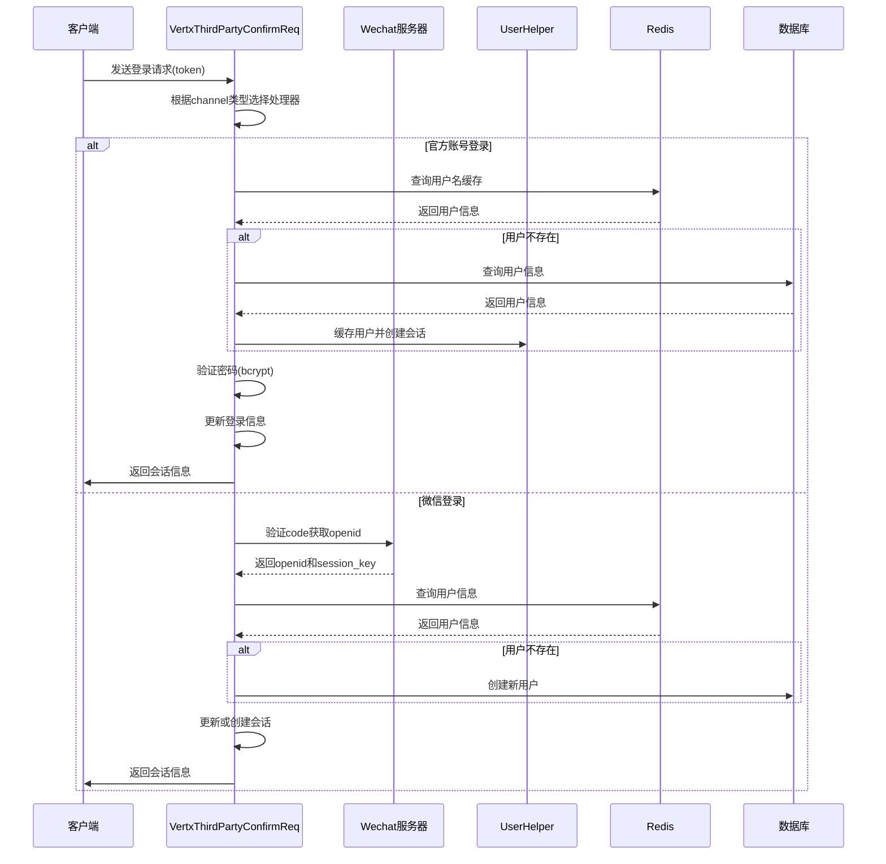

# 身份认证

<cite>
**本文档引用的文件**
- [PasswordUtil.java](file://login/src/main/java/cn/game/login/util/PasswordUtil.java)
- [User.java](file://login/src/main/java/cn/game/login/cache/entity/User.java)
- [VertxThirdPartyConfirmReq.java](file://login/src/main/java/cn/game/login/net/clientpacket/vertx/VertxThirdPartyConfirmReq.java)
- [WechatHandler.java](file://login/src/main/java/cn/game/center/WechatHandler.java)
- [WeiXinParamManager.java](file://login/src/main/java/cn/game/center/WeiXinParamManager.java)
- [UserMapper.java](file://login/src/main/java/cn/game/login/mapper/UserMapper.java)
- [LoginServer.java](file://login/src/main/java/cn/game/login/LoginServer.java)
- [CenterRestServer.java](file://login/src/main/java/cn/game/login/CenterRestServer.java)
</cite>

## 目录
1. [简介](#简介)
2. [用户密码加密存储方案](#用户密码加密存储方案)
3. [登录流程中的防暴力破解措施](#登录流程中的防暴力破解措施)
4. [微信第三方登录的OAuth2.0实现流程](#微信第三方登录的oauth20实现流程)
5. [会话管理机制](#会话管理机制)
6. [认证流程时序图](#认证流程时序图)
7. [常见认证失败场景排查指南](#常见认证失败场景排查指南)

## 简介
本系统实现了多通道身份认证机制，支持官方账号、微信、畅游等第三方平台登录。系统采用bcrypt算法对用户密码进行安全哈希存储，并通过Redis缓存用户会话信息以提升性能。登录流程中集成了防暴力破解机制，同时支持微信小程序的OAuth2.0登录流程，确保用户身份验证的安全性和可靠性。

**本文档引用的文件**
- [LoginServer.java](file://login/src/main/java/cn/game/login/LoginServer.java)

## 用户密码加密存储方案
系统采用bcrypt算法对用户密码进行加密存储，确保即使数据库泄露也无法轻易还原原始密码。bcrypt是一种自适应哈希函数，内置盐值生成和可配置的计算成本，能有效抵御彩虹表和暴力破解攻击。

密码哈希过程由`PasswordUtil`类实现，使用BCrypt库的默认配置：
- 盐值（Salt）：由BCrypt自动生成，每次哈希都使用不同的随机盐值
- 哈希迭代次数：BCrypt的默认工作因子（work factor）为12，对应4096次迭代
- 输出格式：包含算法标识、工作因子、盐值和哈希值的完整字符串，形如`$2a$12$salt...hash`

用户密码在数据库中存储于`User`实体的`pass`字段，明文密码不会被持久化。系统通过`PasswordUtil.hashPassword()`方法生成哈希值，通过`PasswordUtil.checkPassword()`方法验证用户输入的密码。

**本文档引用的文件**
- [PasswordUtil.java](file://login/src/main/java/cn/game/login/util/PasswordUtil.java#L12-L23)
- [User.java](file://login/src/main/java/cn/game/login/cache/entity/User.java#L18)
- [VertxThirdPartyConfirmReq.java](file://login/src/main/java/cn/game/login/net/clientpacket/vertx/VertxThirdPartyConfirmReq.java#L267-L269)

## 登录流程中的防暴力破解措施
系统通过多种机制防止暴力破解攻击：

1. **登录失败处理**：虽然代码中未显式实现失败次数计数器，但通过外部接口调用限制提供保护。例如，微信登录接口本身有频率限制（每个用户每分钟100次）。

2. **接口调用限制**：第三方认证接口如微信OAuth2.0接口具有内置的频率控制机制，错误码45011表示频率限制。

3. **账户状态检查**：系统能够识别高风险用户，微信接口错误码40226表示高风险等级用户被小程序登录拦截。

4. **生产环境验证**：系统在生产模式下强制使用bcrypt验证密码，在非生产环境允许明文比对，便于开发调试。

这些措施共同构成了多层次的防护体系，有效防止自动化工具进行大规模密码猜测攻击。

**本文档引用的文件**
- [VertxThirdPartyConfirmReq.java](file://login/src/main/java/cn/game/login/net/clientpacket/vertx/VertxThirdPartyConfirmReq.java#L148-L150)
- [PasswordUtil.java](file://login/src/main/java/cn/game/login/util/PasswordUtil.java)
- [User.java](file://login/src/main/java/cn/game/login/cache/entity/User.java)

## 微信第三方登录的OAuth2.0实现流程
系统实现了完整的微信第三方登录流程，基于OAuth2.0协议进行用户身份验证。

### access token验证
微信登录流程从客户端获取code开始，服务端通过`WechatAuthHandler`向微信服务器发起验证请求：
```
GET https://api.weixin.qq.com/sns/jscode2session?appid=APPID&secret=SECRET&js_code=JSCODE&grant_type=authorization_code
```
微信服务器返回包含`openid`、`session_key`和`unionid`的JSON响应。系统通过检查`errcode`字段验证请求结果，非0值表示验证失败。

### 用户信息获取
系统从微信响应中提取以下关键信息：
- `openid`：用户在当前小程序的唯一标识
- `unionid`：用户在微信开放平台的唯一标识
- `session_key`：会话密钥，用于后续数据解密

### 会话创建
验证成功后，系统执行以下会话创建流程：
1. 检查用户是否已存在（通过`openid`或用户名）
2. 若用户不存在，则创建新用户记录
3. 生成唯一的`sessionId`（通过`IdUtil.getId()`）
4. 将用户信息缓存到Redis（使用`UserHelper.setUserNewCache()`）
5. 返回包含`passportSessionId`的登录响应

微信access token的管理由`WeiXinParamManager`负责，通过定时任务自动刷新access token，确保第三方调用的持续有效性。

**本文档引用的文件**
- [VertxThirdPartyConfirmReq.java](file://login/src/main/java/cn/game/login/net/clientpacket/vertx/VertxThirdPartyConfirmReq.java#L137-L157)
- [WechatHandler.java](file://login/src/main/java/cn/game/center/WechatHandler.java)
- [WeiXinParamManager.java](file://login/src/main/java/cn/game/center/WeiXinParamManager.java)
- [User.java](file://login/src/main/java/cn/game/login/cache/entity/User.java#L310-L321)

## 会话管理机制
系统采用分布式会话管理机制，结合Redis缓存实现高性能的会话存储。

### session ID生成
会话ID由`IdUtil.getId()`方法生成，确保全局唯一性。每次用户成功登录或微信session_key更新时，都会生成新的sessionId，并与用户信息关联。

### 有效期管理
系统未使用传统的固定过期时间，而是采用"最近使用"原则：
- 用户每次成功登录都会更新`loginDate`和`loginTime`
- 会话信息存储在Redis中，但未设置显式的TTL（生存时间）
- 通过`updateSessionIfNeeded`方法检测session_key变化，及时更新会话

### 会话固定攻击防护
系统通过以下机制防止会话固定攻击：
1. **每次登录生成新会话ID**：`cacheAndCreateSession`方法确保每次认证成功都分配全新的sessionId
2. **旧会话清除**：当检测到session_key变化时，先调用`UserHelper.removeUser(user.getSessionId())`清除旧会话
3. **会话绑定**：会话与用户设备、渠道信息关联，增加会话劫持难度

会话信息主要存储在Redis中，使用`F_USER_NAME_ID`等缓存键进行快速查找，同时保持数据库中的用户基本信息同步。

**本文档引用的文件**
- [User.java](file://login/src/main/java/cn/game/login/cache/entity/User.java#L310-L321)
- [VertxThirdPartyConfirmReq.java](file://login/src/main/java/cn/game/login/net/clientpacket/vertx/VertxThirdPartyConfirmReq.java#L246-L252)
- [UserHelper.java](file://login/src/main/java/cn/game/login/net/clientpacket/vertx/UserHelper.java)

## 认证流程时序图


**图示来源**
- [VertxThirdPartyConfirmReq.java](file://login/src/main/java/cn/game/login/net/clientpacket/vertx/VertxThirdPartyConfirmReq.java)
- [UserHelper.java](file://login/src/main/java/cn/game/login/net/clientpacket/vertx/UserHelper.java)
- [User.java](file://login/src/main/java/cn/game/login/cache/entity/User.java)

## 常见认证失败场景排查指南
以下是常见认证失败场景及其排查方法：

### 1. 账号不存在（ACCOUNT_NOT_EXIST）
- **可能原因**：用户名输入错误或用户未注册
- **排查方法**：
  - 检查`username`参数是否正确
  - 确认用户是否已完成注册流程
  - 检查`channel`参数是否匹配注册渠道

### 2. 密码错误（PASSWORD_ERROR）
- **可能原因**：密码输入错误或密码重置未同步
- **排查方法**：
  - 确认密码是否区分大小写
  - 检查是否在非生产环境使用明文密码
  - 验证bcrypt哈希是否正确生成

### 3. 微信认证失败（CHANNEL_CHECK_FAIL）
- **可能原因**：code无效、频率超限或高风险用户
- **排查方法**：
  - 检查微信返回的`errcode`：
    - `40029`：code无效，需重新获取
    - `45011`：频率限制，需降低请求频率
    - `40226`：用户被拦截，需引导用户完成安全验证
  - 确认`appid`和`secret`配置正确

### 4. 缓存加载失败（SYSTEM_ERROR）
- **可能原因**：Redis连接异常或网络问题
- **排查方法**：
  - 检查Redis服务状态
  - 验证Redis连接配置
  - 查看系统日志中的网络异常信息

### 5. 渠道不支持（CHANNEL_NOT_SUPPORT）
- **可能原因**：请求的channel类型未注册
- **排查方法**：
  - 检查`initHandlers()`方法中是否注册了对应处理器
  - 确认`AccountChannelType`枚举是否包含请求的类型

### 6. 会话过期
- **可能原因**：长时间未活动或session_key变更
- **排查方法**：
  - 检查客户端是否保存了最新的`passportSessionId`
  - 确认是否需要重新登录获取新会话

通过以上排查指南，可以快速定位和解决大多数认证相关的问题。

**本文档引用的文件**
- [VertxThirdPartyConfirmReq.java](file://login/src/main/java/cn/game/login/net/clientpacket/vertx/VertxThirdPartyConfirmReq.java)
- [UserMapper.java](file://login/src/main/java/cn/game/login/mapper/UserMapper.java)
- [User.java](file://login/src/main/java/cn/game/login/cache/entity/User.java)