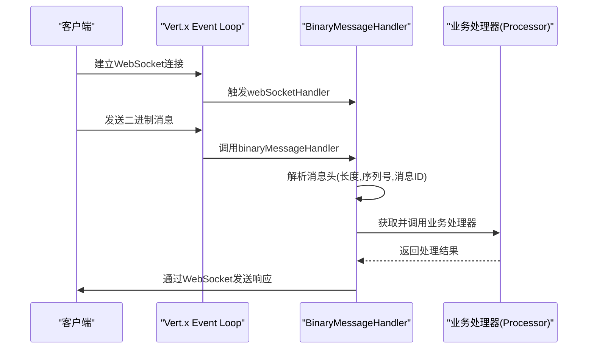
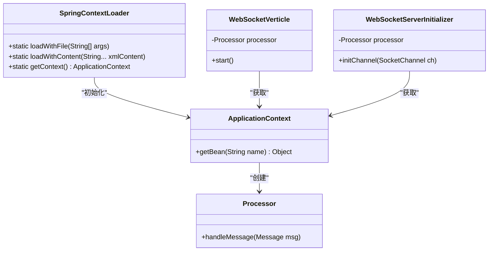
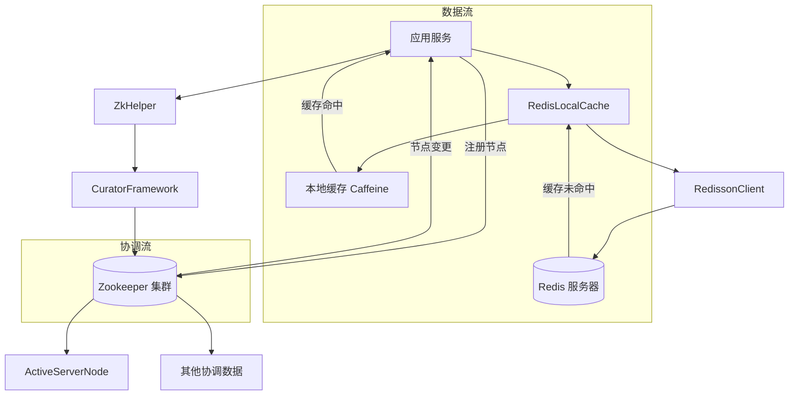
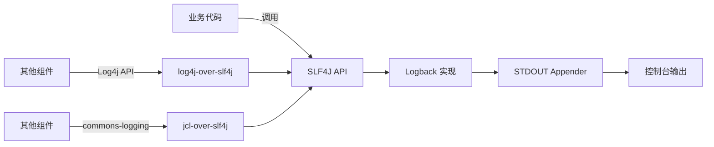
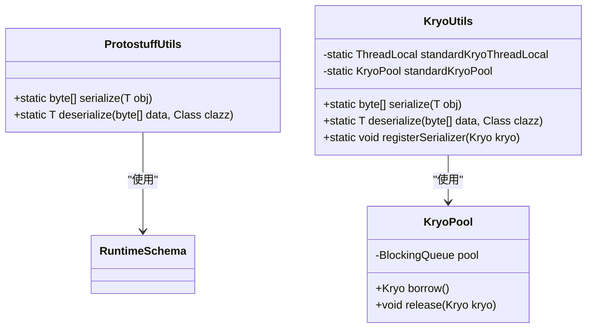

# 技术栈与依赖

<cite>
**本文档中引用的文件**  
- [pom.xml](file://pom.xml)
- [core\pom.xml](file://core/pom.xml)
- [game\pom.xml](file://game/pom.xml)
- [login\pom.xml](file://login/pom.xml)
- [util\pom.xml](file://util/pom.xml)
- [game\src\main\resources\config\logback.xml](file://game/src/main/resources/config/logback.xml)
- [util\src\main\java\cn\game\util\ProtostuffUtils.java](file://util/src/main/java/cn/game/util/ProtostuffUtils.java)
- [util\src\main\java\cn\game\util\KryoUtils.java](file://util/src/main/java/cn/game/util/KryoUtils.java)
- [util\src\main\resources\redisson.yaml](file://util/src/main/resources/redisson.yaml)
- [login\src\main\resources\spring\applicationContext-dataSource.xml](file://login/src/main/resources/spring/applicationContext-dataSource.xml)
- [login\src\main\resources\spring\applicationContext-loginserver.xml](file://login/src/main/resources/spring/applicationContext-loginserver.xml)
- [game\dataServer-mybatorConfig.xml](file://game/dataServer-mybatorConfig.xml)
- [core\src\main\java\cn\game\core\zookeeper\codec\ActiveServerNode.java](file://core/src/main/java/cn/game/core/zookeeper/codec/ActiveServerNode.java)
- [util\src\main\java\cn\game\util\ZkHelper.java](file://util/src/main/java/cn/game/util/ZkHelper.java)
- [core\src\main\java\cn\game\core\cache\RedisLocalCache.java](file://core/src/main/java/cn/game/core/cache/RedisLocalCache.java)
- [game\src\main\java\cn\game\games\core\vertx\WebSocketVerticle.java](file://game/src/main/java/cn/game/games/core/vertx/WebSocketVerticle.java)
- [game\src\main\java\cn\game\games\core\netty\WebSocketServer.java](file://game/src/main/java/cn/game/games/core/netty/WebSocketServer.java)
- [util\src\main\java\cn\game\util\SpringContextLoader.java](file://util/src/main/java/cn/game/util/SpringContextLoader.java)
</cite>

## 目录
1. [技术栈概览](#技术栈概览)
2. [Vert.x 5.0.4 异步事件驱动框架](#vertx-504-异步事件驱动框架)
3. [Spring 5.3.32 依赖注入与上下文管理](#spring-5332-依赖注入与上下文管理)
4. [Redis 与 Zookeeper 分布式协同](#redis-与-zookeeper-分布式协同)
5. [Maven 多模块依赖管理](#maven-多模块依赖管理)
6. [日志系统 (Logback)](#日志系统-logback)
7. [数据库访问层 (MyBatis)](#数据库访问层-mybatis)
8. [序列化工具 (Protostuff/Kryo)](#序列化工具-protostuffkryo)
9. [依赖树分析与版本冲突](#依赖树分析与版本冲突)

## 技术栈概览

本项目采用现代化的Java技术栈，构建了一个高性能、高并发的分布式游戏服务器系统。核心架构基于Vert.x 5.0.4异步事件驱动模型，结合Spring 5.3.32进行依赖注入和上下文管理。系统通过Redis和Zookeeper实现分布式环境下的数据共享与服务协调。Maven作为构建工具，管理着`core`、`game`、`login`等多个模块的复杂依赖关系。日志系统采用Logback，数据库访问通过MyBatis实现，而Protostuff和Kryo则作为关键的序列化工具，确保了数据在不同组件间高效传输。

**Section sources**
- [pom.xml](file://pom.xml#L25-L28)
- [game\pom.xml](file://game/pom.xml#L22-L35)
- [login\pom.xml](file://login/pom.xml#L77-L91)

## Vert.x 5.0.4 异步事件驱动框架

Vert.x 5.0.4是本项目处理高并发请求和WebSocket连接的核心框架。它采用事件驱动和非阻塞I/O模型，能够以极小的资源开销处理海量并发连接。在`game`模块中，`WebSocketVerticle`类利用Vert.x的`HttpServer`创建WebSocket服务，处理来自客户端的二进制消息。每个WebSocket连接由`binaryMessageHandler`处理，消息被解析后交由业务处理器进行异步处理，充分利用了Vert.x的事件循环机制，避免了线程阻塞，从而实现了高吞吐量和低延迟。

**Diagram sources**
- [game\src\main\java\cn\game\games\core\vertx\WebSocketVerticle.java](file://game/src/main/java/cn/game/games/core/vertx/WebSocketVerticle.java#L50-L65)

**Section sources**
- [pom.xml](file://pom.xml#L513-L547)
- [game\src\main\java\cn\game\games\core\vertx\WebSocketVerticle.java](file://game/src/main/java/cn/game/games/core/vertx/WebSocketVerticle.java#L48-L65)

## Spring 5.3.32 依赖注入与上下文管理

Spring 5.3.32在项目中主要负责依赖注入（DI）和应用上下文的管理。`util`模块中的`SpringContextLoader`类是Spring容器的启动入口，它使用`FileSystemXmlApplicationContext`加载XML配置文件来初始化Spring上下文。业务组件如`Processor`通过`SpringContextLoader.getContext().getBean()`方法从Spring容器中获取，实现了组件间的解耦。例如，在`WebSocketVerticle`和`WebSocketServerInitializer`中，`Processor`实例均通过Spring容器注入，确保了业务逻辑的统一管理和生命周期控制。

**Diagram sources**
- [util\src\main\java\cn\game\util\SpringContextLoader.java](file://util/src/main/java/cn/game/util/SpringContextLoader.java#L18-L123)
- [game\src\main\java\cn\game\games\core\vertx\WebSocketVerticle.java](file://game/src/main/java/cn/game/games/core/vertx/WebSocketVerticle.java#L48)
- [game\src\main\java\cn\game\games\core\netty\WebSocketServerInitializer.java](file://game/src/main/java/cn/game/games/core/netty/WebSocketServerInitializer.java#L61)

**Section sources**
- [pom.xml](file://pom.xml#L634-L676)
- [util\src\main\java\cn\game\util\SpringContextLoader.java](file://util/src/main/java/cn/game/util/SpringContextLoader.java#L18-L123)

## Redis 与 Zookeeper 分布式协同

在分布式环境下，Redis和Zookeeper协同工作，分别承担数据缓存和集群协调的职责。Redis通过`RedissonClient`客户端进行访问，`RedisLocalCache`类封装了对Redis的读写操作，实现了本地缓存与Redis的同步。Zookeeper则通过`CuratorFramework`客户端进行管理，`ZkHelper`类负责初始化Zookeeper连接。`ActiveServerNode`类定义了在Zookeeper中存储的节点元数据，用于服务发现和集群状态管理。两者结合，确保了分布式系统中数据的一致性和服务的高可用性。

**Diagram sources**
- [core\src\main\java\cn\game\core\cache\RedisLocalCache.java](file://core/src/main/java/cn/game/core/cache/RedisLocalCache.java#L41-L43)
- [util\src\main\resources\redisson.yaml](file://util/src/main/resources/redisson.yaml#L2-L6)
- [util\src\main\java\cn\game\util\ZkHelper.java](file://util/src/main/java/cn/game/util/ZkHelper.java#L36-L41)
- [core\src\main\java\cn\game\core\zookeeper\codec\ActiveServerNode.java](file://core/src/main/java/cn/game/core/zookeeper/codec/ActiveServerNode.java#L1-L15)

**Section sources**
- [pom.xml](file://pom.xml#L589-L605)
- [core\src\main\java\cn\game\core\cache\RedisLocalCache.java](file://core/src/main/java/cn/game/core/cache/RedisLocalCache.java#L41-L43)
- [util\src\main\resources\redisson.yaml](file://util/src/main/resources/redisson.yaml#L2-L6)
- [util\src\main\java\cn\game\util\ZkHelper.java](file://util/src/main/java/cn/game/util/ZkHelper.java#L36-L41)

## Maven 多模块依赖管理

Maven是本项目的核心构建工具，采用多模块（multi-module）结构进行依赖管理。根`pom.xml`文件定义了`util`、`core`、`game`、`login`等子模块，并通过`<dependencyManagement>`统一管理所有第三方依赖的版本，如Vert.x 5.0.4和Spring 5.3.32。子模块（如`game\pom.xml`）继承父POM，无需重复声明版本号，确保了依赖的一致性。`maven-assembly-plugin`插件用于打包，将项目及其所有依赖打包成一个可执行的JAR文件，简化了部署流程。

**Section sources**
- [pom.xml](file://pom.xml#L10-L16)
- [pom.xml](file://pom.xml#L25-L28)
- [pom.xml](file://pom.xml#L136-L238)
- [game\pom.xml](file://game/pom.xml#L51-L77)

## 日志系统 (Logback)

项目采用Logback作为日志框架，通过SLF4J门面进行日志记录。在`game`模块的`logback.xml`配置文件中，定义了一个名为`STDOUT`的控制台追加器（appender），其输出格式仅包含消息内容（`%msg%n`）。日志记录器（logger）`cn`被设置为错误级别（error），并将日志输出到`STDOUT`。这种配置确保了日志的简洁性，同时通过SLF4J桥接器，将Log4j等其他日志框架的输出也统一到Logback中，实现了日志系统的集中管理。

**Diagram sources**
- [pom.xml](file://pom.xml#L268-L287)
- [game\src\main\resources\config\logback.xml](file://game/src/main/resources/config/logback.xml#L1-L17)

**Section sources**
- [pom.xml](file://pom.xml#L268-L287)
- [game\src\main\resources\config\logback.xml](file://game/src/main/resources/config/logback.xml#L1-L17)

## 数据库访问层 (MyBatis)

MyBatis作为持久层框架，负责与MySQL数据库的交互。`login`模块的`applicationContext-dataSource.xml`配置了`DruidDataSource`数据源，连接池参数如初始大小、最大活跃连接数等均可通过外部属性配置。`applicationContext-loginserver.xml`中配置了`SqlSessionFactoryBean`，它将数据源与MyBatis关联，并自动扫描`mapping`目录下的XML映射文件。`dataServer-mybatorConfig.xml`是MyBatis Generator的配置文件，定义了代码生成规则，包括使用`SerializablePlugin`、`BatchInsertPlugin`等插件，自动生成实体类和Mapper接口，极大地提高了开发效率。

**Section sources**
- [login\src\main\resources\spring\applicationContext-dataSource.xml](file://login/src/main/resources/spring/applicationContext-dataSource.xml#L19-L30)
- [login\src\main\resources\spring\applicationContext-loginserver.xml](file://login/src/main/resources/spring/applicationContext-loginserver.xml#L26-L30)
- [game\dataServer-mybatorConfig.xml](file://game/dataServer-mybatorConfig.xml#L21-L38)

## 序列化工具 (Protostuff/Kryo)

为了高效地在网络上传输和在Redis中存储对象，项目选用了Protostuff和Kryo两种序列化工具。`ProtostuffUtils`类提供了基于Protostuff库的序列化方法，它利用`RuntimeSchema`动态生成序列化模式，无需预编译，适用于通用对象的快速序列化。`KryoUtils`类则封装了Kryo库，支持更复杂的对象图和循环引用。它通过`ThreadLocal`或对象池管理Kryo实例，避免了线程安全问题，并注册了`ArraysAsListSerializer`、`CollectionsEmptyListSerializer`等大量自定义序列化器，以处理Java集合类，确保了序列化的高性能和兼容性。

**Diagram sources**
- [util\src\main\java\cn\game\util\ProtostuffUtils.java](file://util/src/main/java/cn/game/util/ProtostuffUtils.java#L13-L37)
- [util\src\main\java\cn\game\util\KryoUtils.java](file://util/src/main/java/cn/game/util/KryoUtils.java#L60-L389)

**Section sources**
- [util\src\main\java\cn\game\util\ProtostuffUtils.java](file://util/src/main/java/cn/game/util/ProtostuffUtils.java#L13-L37)
- [util\src\main\java\cn\game\util\KryoUtils.java](file://util/src/main/java/cn/game/util/KryoUtils.java#L60-L389)

## 依赖树分析与版本冲突

通过对`pom.xml`文件的分析，可以构建出项目的完整依赖树。项目核心依赖包括：Vert.x 5.0.4（通过BOM导入）、Spring 5.3.32（通过BOM导入）、MyBatis 3.5.10、Druid 1.1.23、Redisson（通过`redisson.yaml`配置）、Curator 5.8.0等。潜在的版本冲突风险主要存在于日志框架。项目同时引入了`log4j-slf4j-impl`（2.23.1）和`slf4j-api`（1.7.25），虽然通过桥接器可以共存，但版本跨度较大，可能在某些边缘场景下出现兼容性问题。建议将`slf4j-api`升级到与Log4j2配套的更高版本（如1.7.30以上）以确保最佳兼容性。此外，项目使用了`com.fasterxml.jackson.core` 2.18.4，而Vert.x内部可能依赖较旧版本，但由于在`dependencyManagement`中已统一声明，Maven会自动进行版本仲裁，通常不会引发冲突。

**Section sources**
- [pom.xml](file://pom.xml#L166-L238)
- [pom.xml](file://pom.xml#L269-L287)
- [pom.xml](file://pom.xml#L424-L435)
- [pom.xml](file://pom.xml#L739-L743)
- [pom.xml](file://pom.xml#L589-L605)