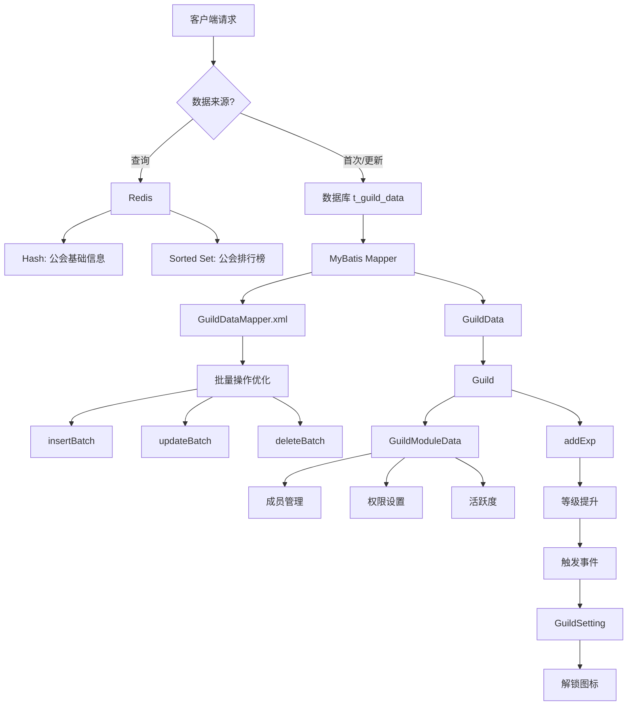

# 公会信息模型

<cite>
**本文档引用的文件**
- [GuildData.java](file://game\src\main\java\cn\game\games\cache\entity\GuildData.java)
- [GuildDataMapper.xml](file://game\src\main\resources\mapping\GuildDataMapper.xml)
- [Guild.java](file://game\src\main\java\cn\game\games\net\cross\guild\Guild.java)
- [GuildManager.java](file://game\src\main\java\cn\game\games\net\cross\guild\GuildManager.java)
- [GuildModuleData.java](file://game\src\main\java\cn\game\games\net\cross\guild\GuildModuleData.java)
- [GuildSetting.java](file://game\src\main\java\cn\game\games\net\cross\guild\GuildSetting.java)
- [SimpleGuild.java](file://game\src\main\java\cn\game\games\net\cross\guild\SimpleGuild.java)
- [GuildBasic.xml](file://game\src\main\resources\xml\GuildBasic.xml)
- [GuildConstants.java](file://game\src\main\java\cn\game\games\net\cross\guild\GuildConstants.java)
</cite>

## 目录
1. [公会核心数据结构](#公会核心数据结构)
2. [公会等级与经验系统](#公会等级与经验系统)
3. [MyBatis数据访问层](#mybatis数据访问层)
4. [Redis缓存设计](#redis缓存设计)
5. [公会操作与数据一致性](#公会操作与数据一致性)

## 公会核心数据结构

公会（Guild）实体的数据结构主要由 `GuildData` 类定义，该类实现了 `Serializable` 和 `DbEntity` 接口，用于持久化存储到数据库。核心字段包括：

- **公会ID** (`id`): `long` 类型，作为公会的唯一标识符，对应数据库表 `t_guild_data` 的主键。
- **公会名称** (`name`): `String` 类型，存储公会的名称。
- **创建时间** (`createTime`): `String` 类型，记录公会创建的时间戳，格式为可读的日期时间字符串。
- **等级** (`lv`): `byte` 类型，表示公会当前的等级。
- **公会图标** (`icon`): `int` 类型，标识公会使用的图标ID。
- **公告** (`notice`): `String` 类型，存储对所有成员可见的公会公告。
- **通知** (`notification`): `String` 类型，存储仅对成员可见的内部宣言或通知。
- **当前经验** (`exp`): `int` 类型，记录公会累积的经验值，用于升级。
- **服务器ID** (`serverId`): `String` 类型，标识该公会所属的逻辑服务器。
- **模块数据** (`modules`): `String` 类型，以JSON字符串的形式存储公会的复杂模块化数据，如成员列表、设置、日志等。

`Guild` 类是公会的核心业务对象，它封装了 `GuildData` 实例（`data` 字段）和 `GuildModuleData` 实例（`module` 字段）。`GuildData` 负责与数据库交互，而 `GuildModuleData` 则负责管理公会的动态状态和业务逻辑，如成员管理、权限、活跃度等。这种设计实现了数据与行为的分离。

**Section sources**
- [GuildData.java](file://game\src\main\java\cn\game\games\cache\entity\GuildData.java)
- [Guild.java](file://game\src\main\java\cn\game\games\net\cross\guild\Guild.java)
- [GuildModuleData.java](file://game\src\main\java\cn\game\games\net\cross\guild\GuildModuleData.java)

## 公会等级与经验系统

公会的等级与经验系统通过业务规则和代码逻辑共同实现。

### 业务规则
公会的升级规则由配置文件 `GuildBasic.xml` 定义。该文件是一个XML配置，为每个公会等级（`ID`）指定了升级所需的经验值（`Exp`）和最大成员数量（`NumberMax`）。例如，等级1升到等级2需要3000经验，等级2升到等级3需要8000经验，以此类推。当公会累积的经验值达到当前等级的升级阈值时，公会即可升级。

### 升级机制实现
升级逻辑在 `Guild` 类的 `addExp(int addExp)` 方法中实现。其核心流程如下：
1.  **累积经验**：将传入的新增经验值 `addExp` 累加到公会当前经验 `exp` 上。
2.  **循环检查升级**：使用 `while` 循环持续检查累积后的总经验是否大于或等于当前等级所需的经验值（通过 `GuildBasicManager` 从配置中获取）。
3.  **执行升级**：如果满足升级条件，则：
    -   从总经验中减去当前等级所需的经验值。
    -   调用 `setLv(getLv() + 1)` 将公会等级提升一级。
    -   触发 `ZONG_MEN_LEVEL_UP` 事件，通知所有监听器（如 `GuildSetting`）公会已升级。
4.  **更新剩余经验**：将循环结束后剩余的经验值设置为公会新的当前经验值。

此机制支持一次获得大量经验时的连续升级。此外，`GuildSetting` 类监听 `ZONG_MEN_LEVEL_UP` 事件，当公会升级时，会自动解锁该等级对应的公会图标，实现了等级与功能的联动。

**Section sources**
- [Guild.java](file://game\src\main\java\cn\game\games\net\cross\guild\Guild.java#L333-L354)
- [GuildBasic.xml](file://game\src\main\resources\xml\GuildBasic.xml)
- [GuildSetting.java](file://game\src\main\java\cn\game\games\net\cross\guild\GuildSetting.java#L47-L58)

## MyBatis数据访问层

公会数据的持久化通过MyBatis框架实现，核心是 `GuildDataMapper.xml` 映射文件。

### CRUD操作
该文件定义了对 `t_guild_data` 表的标准CRUD操作：
- **插入** (`insert`): 将新的 `GuildData` 对象插入数据库。
- **更新** (`updateByPrimaryKey`): 根据主键（公会ID）更新公会的全部字段。
- **删除** (`deleteByPrimaryKey`): 根据主键删除公会记录。
- **查询** (`selectByPrimaryKey`): 根据主键查询单个公会的完整信息。

### 批量操作与SQL优化
为了提高性能，映射文件提供了高效的批量操作：
- **批量插入** (`insertBatch`): 使用 `<foreach>` 标签生成 `INSERT INTO ... VALUES (...), (...), ...` 语句，一次性插入多条记录，显著减少了网络往返次数。
- **批量删除** (`deleteBatch`): 使用 `DELETE FROM ... WHERE id IN (...)` 语句，配合 `<foreach>` 遍历ID列表，实现一次删除多个公会。
- **批量更新** (`updateBatch`): 采用了一种高级的SQL技巧——`CASE WHEN` 语句。它生成一个 `UPDATE` 语句，其中每个字段的值都通过一个 `CASE` 表达式来确定，根据ID的不同设置不同的值。这避免了为每条记录执行一次 `UPDATE`，极大地提升了批量更新的效率。
- **分页查询** (`getBatchOffset`, `getBatchCursor`): 提供了两种分页策略。`getBatchOffset` 使用标准的 `LIMIT offset, limit`，适用于小偏移量；`getBatchCursor` 使用 `WHERE id > lastId` 的游标分页，更适合大数据量的场景，避免了深度分页的性能问题。

**Section sources**
- [GuildDataMapper.xml](file://game\src\main\resources\mapping\GuildDataMapper.xml)
- [GuildData.java](file://game\src\main\java\cn\game\games\cache\entity\GuildData.java)

## Redis缓存设计

系统使用Redis对公会数据进行多级缓存，以提升访问性能。

### 缓存结构
1.  **公会基础属性 (Hash)**: 使用 `SimpleGuild` 对象存储公会的核心属性。`SimpleGuild` 是一个轻量级的数据传输对象（DTO），包含公会ID、名称、等级、总战力、人数等常用信息。这些数据被序列化后，以 `Hash` 结构存储在Redis中，键名为 `CacheType.ZONG_MEN_SIMPLE_DATA.key(guildId)`。这种设计使得获取公会概要信息非常高效。
2.  **公会排行榜 (Sorted Set)**: 使用 `RankService` 将公会的战斗力（`totalPower`）作为分数，公会ID作为成员，存储在 `Sorted Set` 中。例如，`RankType.Guild` 类型的排行榜可以快速获取战斗力排名前N的公会，支持公会战、世界频道等需要排名的场景。

### 缓存同步
缓存的更新由 `GuildManager` 统一管理。在 `saveAllGuildData` 方法中，当公会数据被持久化到数据库后，会异步调用 `saveSimpleData(Guild guild)` 方法，将最新的 `SimpleGuild` 对象写回Redis，确保了数据库与缓存的一致性。

**Diagram sources**
- [GuildDataMapper.xml](file://game\src\main\resources\mapping\GuildDataMapper.xml)
- [GuildData.java](file://game\src\main\java\cn\game\games\cache\entity\GuildData.java)
- [Guild.java](file://game\src\main\java\cn\game\games\net\cross\guild\Guild.java)
- [GuildModuleData.java](file://game\src\main\java\cn\game\games\net\cross\guild\GuildModuleData.java)
- [GuildSetting.java](file://game\src\main\java\cn\game\games\net\cross\guild\GuildSetting.java)
- [SimpleGuild.java](file://game\src\main\java\cn\game\games\net\cross\guild\SimpleGuild.java)

**Section sources**
- [GuildManager.java](file://game\src\main\java\cn\game\games\net\cross\guild\GuildManager.java#L165-L168)
- [SimpleGuild.java](file://game\src\main\java\cn\game\games\net\cross\guild\SimpleGuild.java)
- [RankService.java](file://game\src\main\java\cn\game\games\net\game\module\rank\RankService.java)

## 公会操作与数据一致性

公会的关键操作（创建、更新、解散）都通过 `GuildManager` 进行协调，以保障数据一致性。

### 创建公会
`GuildManager.createGuild()` 方法负责创建新公会。流程如下：
1.  生成全局唯一的公会ID。
2.  检查公会名称是否已存在（通过Redis的 `trySet` 原子操作）。
3.  初始化 `Guild` 对象，设置初始等级、创建时间等。
4.  将 `GuildData` 插入数据库。
5.  将 `SimpleGuild` 缓存到Redis。
6.  将公会ID加入战斗力排行榜。
7.  将公会实例加入内存管理的 `guildMap` 中。

### 更新与解散
- **信息更新**：对公会名称、公告、图标的修改，会先更新内存中的 `Guild` 对象，然后通过 `DAO.update()` 持久化到数据库，并最终通过定时任务同步到Redis缓存。
- **解散公会**：`Guild.dissolveGuild()` 方法会执行一系列清理操作：移除所有成员、从排行榜中删除、删除Redis中的 `SimpleGuild` 缓存、从数据库中删除记录，并从 `GuildManager` 的内存映射中移除该公会实例。

### 一致性保障
系统通过以下机制保障数据一致性：
1.  **内存单例管理**：`GuildManager` 使用 `ConcurrentHashMap` 在内存中集中管理所有公会实例，确保同一时间对一个公会的操作是串行的。
2.  **异步持久化**：通过 `SchedulerService` 定时器（每5分钟）批量将内存中的公会数据保存到数据库，平衡了性能与数据安全。
3.  **事件驱动**：使用 `GuildEventHandler` 机制，当公会状态变更（如升级、跨天）时，发布事件通知所有相关模块，确保各模块状态同步。

**Section sources**
- [GuildManager.java](file://game\src\main\java\cn\game\games\net\cross\guild\GuildManager.java)
- [Guild.java](file://game\src\main\java\cn\game\games\net\cross\guild\Guild.java)
- [GuildConstants.java](file://game\src\main\java\cn\game\games\net\cross\guild\GuildConstants.java)