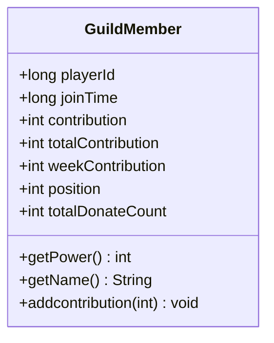
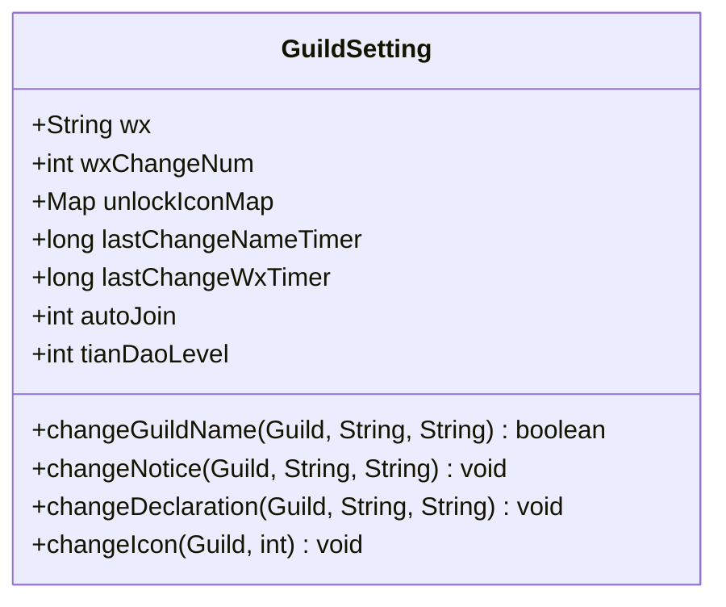
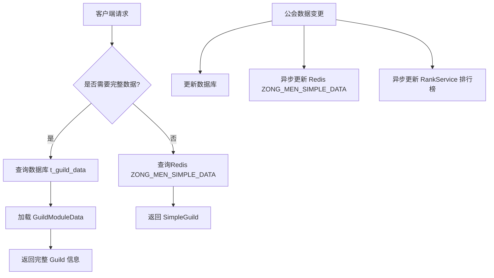

# 公会系统数据模型

<cite>
**本文档引用的文件**   
- [Guild.java](file://game\src\main\java\cn\game\games\net\cross\guild\Guild.java)
- [GuildMember.java](file://game\src\main\java\cn\game\games\net\cross\guild\GuildMember.java)
- [GuildSetting.java](file://game\src\main\java\cn\game\games\net\cross\guild\GuildSetting.java)
- [GuildModuleData.java](file://game\src\main\java\cn\game\games\net\cross\guild\GuildModuleData.java)
- [GuildDataMapper.xml](file://game\src\main\resources\mapping\GuildDataMapper.xml)
- [GuildJoinMapper.xml](file://game\src\main\resources\mapping\GuildJoinMapper.xml)
- [GuildManager.java](file://game\src\main\java\cn\game\games\net\cross\guild\GuildManager.java)
- [RankService.java](file://game\src\main\java\cn\game\games\net\game\module\rank\RankService.java)
- [SimpleGuild.java](file://game\src\main\java\cn\game\games\net\cross\guild\SimpleGuild.java)
</cite>

## 目录
1. [公会实体核心字段](#公会实体核心字段)
2. [公会成员信息结构](#公会成员信息结构)
3. [公会设置与权限配置](#公会设置与权限配置)
4. [MyBatis映射与数据查询](#mybatis映射与数据查询)
5. [Redis缓存策略](#redis缓存策略)
6. [数据一致性处理机制](#数据一致性处理机制)

## 公会实体核心字段

公会（Guild）实体是整个公会系统的核心，其数据主要由 `GuildData` 类表示，并存储在数据库的 `t_guild_data` 表中。该实体通过 `Guild` 类进行封装和管理，包含以下核心字段：

- **公会ID (id)**：公会的唯一标识符，类型为 `long`，对应数据库字段 `id`。
- **公会名称 (name)**：公会的名称，类型为 `String`，对应数据库字段 `name`。
- **创建时间 (createTime)**：公会创建的时间戳，类型为 `String`，对应数据库字段 `create_time`。
- **等级 (lv)**：公会的等级，类型为 `byte`，对应数据库字段 `lv`。
- **图标 (icon)**：公会的图标ID，类型为 `int`，对应数据库字段 `icon`。
- **公告 (notice)**：公会的公告内容，类型为 `String`，对应数据库字段 `notice`。
- **宣言 (notification)**：公会的宣言内容，类型为 `String`，对应数据库字段 `notification`。
- **经验 (exp)**：公会的当前经验值，用于升级，类型为 `int`，对应数据库字段 `exp`。
- **服务器ID (serverId)**：公会所属的服务器ID，类型为 `String`，对应数据库字段 `server_id`。
- **模块数据 (modules)**：一个包含公会所有复杂模块数据的JSON字符串，类型为 `String`，对应数据库字段 `modules`。

`Guild` 类将 `GuildData` 作为其核心数据存储，并通过 `GuildModuleData` 对象来管理公会的动态模块数据，如成员列表、设置、日志等。

**Section sources**
- [Guild.java](file://game\src\main\java\cn\game\games\net\cross\guild\Guild.java#L53-L85)
- [GuildDataMapper.xml](file://game\src\main\resources\mapping\GuildDataMapper.xml#L9-L18)

## 公会成员信息结构

公会成员（GuildMember）信息由 `GuildMember` 类表示，它不直接对应一个独立的数据库表，而是作为 `GuildModuleData` 的一部分，存储在 `GuildData` 的 `modules` 字段中。其核心信息包括：

- **成员ID (playerId)**：成员的玩家ID，类型为 `long`，是成员在公会中的唯一标识。
- **加入时间 (joinTime)**：成员加入公会的时间戳，类型为 `long`。
- **贡献度 (contribution)**：成员当天的贡献值，每日重置。
- **累计贡献度 (totalContribution)**：成员自加入以来的总贡献值。
- **本周贡献 (weekContribution)**：成员本周的贡献值，每周重置。
- **职位 (position)**：成员在公会中的职位，如会长、长老、精英、帮众等。

`GuildMember` 类还提供了获取成员战斗力和名称的方法，这些信息通过 `PlayerHelper` 从玩家缓存中获取。

**Diagram sources**
- [GuildMember.java](file://game\src\main\java\cn\game\games\net\cross\guild\GuildMember.java#L22-L35)

**Section sources**
- [GuildMember.java](file://game\src\main\java\cn\game\games\net\cross\guild\GuildMember.java#L22-L35)

## 公会设置与权限配置

公会设置（GuildSetting）由 `GuildSetting` 类管理，它也是 `GuildModuleData` 的一部分。其数据结构定义了公会的规则和权限：

- **微信号 (wx)**：宗主的微信号。
- **自动加入 (autoJoin)**：公会的加入方式，1为快速加入，2为需要验证，3为不可加入。
- **解锁图标 (unlockIconMap)**：一个 `Map<Integer, Long>`，记录了公会已解锁的图标ID及其过期时间戳（-1为永久）。
- **最后修改名称时间 (lastChangeNameTimer)**：最后一次修改公会名称的时间戳。

权限配置通过 `GuildPermissionsConfig` 类实现，它定义了不同职位（如会长、长老）对各项操作（如改名、发布公告、修改宣言、更换图标）的权限。当执行设置操作时，系统会先检查操作者的职位是否拥有相应权限。

**Diagram sources**
- [GuildSetting.java](file://game\src\main\java\cn\game\games\net\cross\guild\GuildSetting.java#L23-L39)

**Section sources**
- [GuildSetting.java](file://game\src\main\java\cn\game\games\net\cross\guild\GuildSetting.java#L23-L39)
- [Guild.java](file://game\src\main\java\cn\game\games\net\cross\guild\Guild.java#L172-L184)

## MyBatis映射与数据查询

公会系统的数据持久化通过MyBatis实现，主要映射文件为 `GuildDataMapper.xml` 和 `GuildJoinMapper.xml`。

`GuildDataMapper.xml` 负责 `t_guild_data` 表的CRUD操作。它定义了 `BaseResultMap` 和 `ResultMapWithBLOBs`，其中 `modules` 字段被映射为 `LONGVARCHAR` 类型。关键的查询操作包括：
- `getBatchOffset` 和 `getBatchCursor`：用于分页或游标方式批量加载公会数据，支持跨服数据同步。
- `updateBatch`：使用 `CASE WHEN` 语句批量更新公会数据，显著提升了批量更新的性能。
- `insertOrUpdate`：使用 `ON DUPLICATE KEY UPDATE` 语法实现插入或更新操作，保证了数据的一致性。

`GuildJoinMapper.xml` 负责 `t_guild_join` 表的操作，该表记录了玩家与公会的关联关系，包含 `player_id`、`guild_id` 和 `create_time` 三个字段。

**Section sources**
- [GuildDataMapper.xml](file://game\src\main\resources\mapping\GuildDataMapper.xml#L40-L273)
- [GuildJoinMapper.xml](file://game\src\main\resources\mapping\GuildJoinMapper.xml#L20-L178)

## Redis缓存策略

公会系统采用了多层Redis缓存策略以提升性能：

1.  **公会简介缓存 (SimpleGuild)**：使用 `CacheType.ZONG_MEN_SIMPLE_DATA` 键，将 `SimpleGuild` 对象（包含公会ID、名称、等级、战力、人数等基本信息）缓存在Redis中。当公会数据更新时，会异步调用 `GuildManager.saveSimpleData()` 方法更新此缓存。
2.  **公会名称ID映射**：使用 `GuildHelper.getNameKey(name)` 作为键，公会ID作为值，确保公会名称的全局唯一性。在创建或修改公会名称时，会使用 `RedisUtil.trySet()` 原子操作来检查名称是否已被占用。
3.  **公会成员列表缓存**：公会成员列表作为 `GuildModuleData` 的一部分，随 `Guild` 对象一起加载到内存中，不单独缓存。
4.  **公会战斗力排行榜**：使用 `Sorted Set` 数据结构，通过 `RankService.setScoreAsync()` 方法将公会ID和其总战力作为分数存入排行榜。`RankService` 使用一个巧妙的分数合成算法，将主分数（战力）和次要分数（时间）合并为一个 `double` 值，既保证了按战力排序，又能在战力相同时按时间排序。

**Diagram sources**
- [GuildManager.java](file://game\src\main\java\cn\game\games\net\cross\guild\GuildManager.java#L165-L168)
- [RankService.java](file://game\src\main\java\cn\game\games\net\game\module\rank\RankService.java#L227-L230)
- [SimpleGuild.java](file://game\src\main\java\cn\game\games\net\cross\guild\SimpleGuild.java#L16-L35)

**Section sources**
- [GuildManager.java](file://game\src\main\java\cn\game\games\net\cross\guild\GuildManager.java#L165-L168)
- [RankService.java](file://game\src\main\java\cn\game\games\net\game\module\rank\RankService.java#L227-L230)
- [SimpleGuild.java](file://game\src\main\java\cn\game\games\net\cross\guild\SimpleGuild.java#L16-L35)

## 数据一致性处理机制

公会系统通过多种机制确保数据的一致性：

1.  **创建**：创建公会时，首先使用 `RedisUtil.trySet()` 原子操作检查名称是否唯一。成功后，先在内存中创建 `Guild` 对象并初始化，然后将其 `GuildData` 插入数据库。插入成功后，再异步更新 `SimpleGuild` 缓存和战斗力排行榜。任何一步失败都会导致创建失败。
2.  **成员加入/退出**：
    - **加入**：成员申请加入时，先检查公会是否满员。通过审批后，调用 `Guild.joinGuild()` 方法，该方法会先向 `t_guild_join` 表插入记录（使用数据库唯一约束防止重复加入），再将成员添加到 `menMemberMap` 中，并发送通知。
    - **退出/踢出**：调用 `Guild.quitGuild()` 或 `GuildManager.kickMember()` 方法，会先从 `menMemberMap` 中移除成员，然后异步删除 `t_guild_join` 表中的记录，并发送通知。
3.  **解散**：解散公会是一个复杂的操作，由 `Guild.dissolveGuild()` 方法处理。它会：
    - 从内存中移除所有成员。
    - 从排行榜中移除公会。
    - 删除Redis中的 `SimpleGuild` 缓存和名称ID映射。
    - 从数据库中删除 `t_guild_data` 记录。
    - 从 `GuildManager` 的 `guildMap` 中移除该公会。
    这些操作按顺序执行，确保了数据的最终一致性。

**Section sources**
- [Guild.java](file://game\src\main\java\cn\game\games\net\cross\guild\Guild.java#L97-L118)
- [Guild.java](file://game\src\main\java\cn\game\games\net\cross\guild\Guild.java#L300-L314)
- [GuildManager.java](file://game\src\main\java\cn\game\games\net\cross\guild\GuildManager.java#L180-L217)
- [GuildModuleData.java](file://game\src\main\java\cn\game\games\net\cross\guild\GuildModuleData.java#L130-L136)