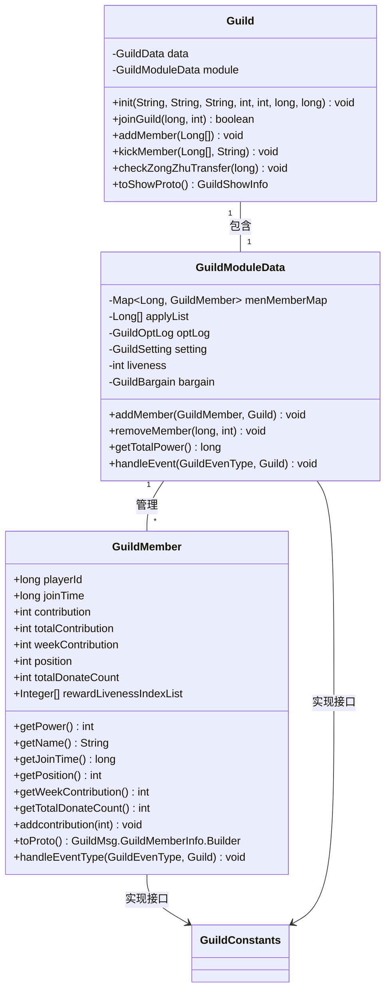
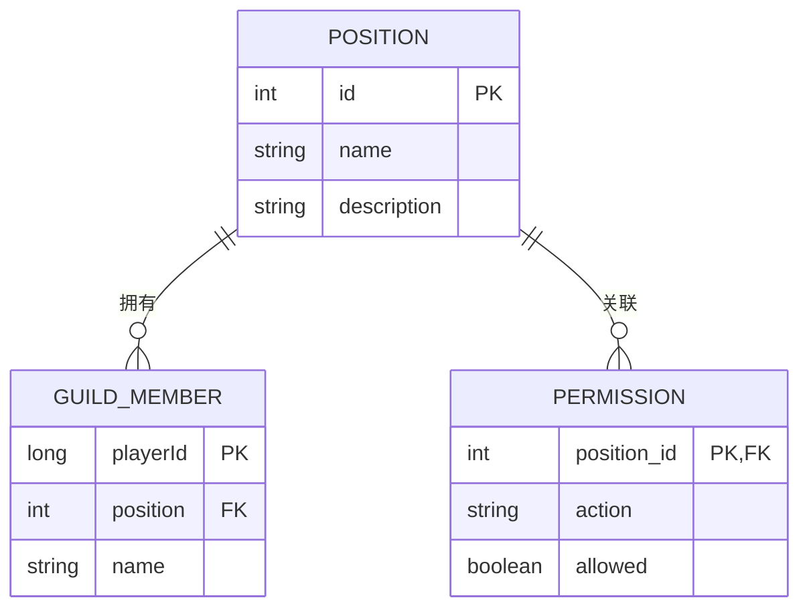
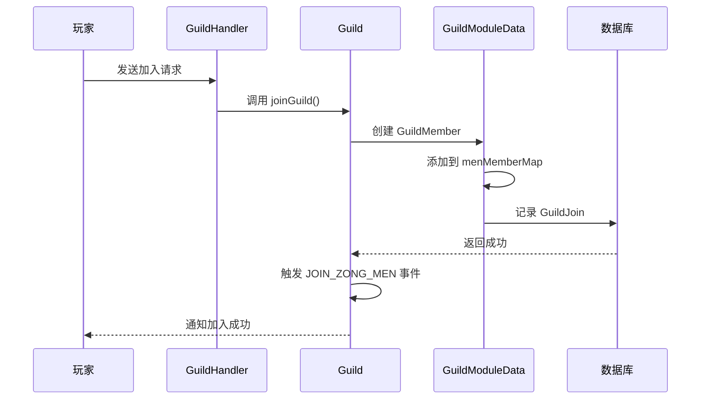

# 成员模型

<cite>
**本文档引用的文件**  
- [GuildMember.java](file://game\src\main\java\cn\game\games\net\cross\guild\GuildMember.java)
- [Guild.java](file://game\src\main\java\cn\game\games\net\cross\guild\Guild.java)
- [GuildModuleData.java](file://game\src\main\java\cn\game\games\net\cross\guild\GuildModuleData.java)
- [GuildConstants.java](file://game\src\main\java\cn\game\games\net\cross\guild\GuildConstants.java)
- [GuildOptLog.java](file://game\src\main\java\cn\game\games\net\cross\guild\GuildOptLog.java)
- [GuildSetting.java](file://game\src\main\java\cn\game\games\net\cross\guild\GuildSetting.java)
- [RankHelper.java](file://game\src\main\java\cn\game\games\net\game\module\rank\RankHelper.java)
- [GuildHandler.java](file://game\src\main\java\cn\game\games\net\game\module\guild\GuildHandler.java)
- [GameSSLogger.java](file://game\src\main\java\cn\game\games\core\log\GameSSLogger.java)
</cite>

## 目录
1. [简介](#简介)
2. [核心数据结构](#核心数据结构)
3. [成员字段详解](#成员字段详解)
4. [职位体系与权限分级](#职位体系与权限分级)
5. [贡献度与排名机制](#贡献度与排名机制)
6. [成员列表排序逻辑](#成员列表排序逻辑)
7. [成员管理操作](#成员管理操作)
8. [批量加载与缓存优化](#批量加载与缓存优化)
9. [跨服数据同步](#跨服数据同步)
10. [日志与审计](#日志与审计)

## 简介
公会成员（GuildMember）是游戏社交系统中的核心实体之一，代表玩家在公会中的身份与状态。该模型不仅包含基础的身份信息，还承载了复杂的业务逻辑，如权限管理、贡献累积、排名计算等。本文档深入解析公会成员的数据结构、管理机制及性能优化策略，为系统维护与功能扩展提供技术参考。

## 核心数据结构
公会成员的核心数据结构由 `GuildMember` 类定义，该类封装了成员的所有属性与行为。成员数据通过 `Guild` 实体进行统一管理，`Guild` 内部通过 `GuildModuleData` 维护成员列表（`menMemberMap`），实现高效的增删改查操作。



**图示来源**  
- [GuildMember.java](file://game\src\main\java\cn\game\games\net\cross\guild\GuildMember.java)
- [Guild.java](file://game\src\main\java\cn\game\games\net\cross\guild\Guild.java)
- [GuildModuleData.java](file://game\src\main\java\cn\game\games\net\cross\guild\GuildModuleData.java)
- [GuildConstants.java](file://game\src\main\java\cn\game\games\net\cross\guild\GuildConstants.java)

**本节来源**  
- [GuildMember.java](file://game\src\main\java\cn\game\games\net\cross\guild\GuildMember.java#L1-L150)
- [Guild.java](file://game\src\main\java\cn\game\games\net\cross\guild\Guild.java#L1-L502)
- [GuildModuleData.java](file://game\src\main\java\cn\game\games\net\cross\guild\GuildModuleData.java#L1-L242)

## 成员字段详解
公会成员模型包含以下关键字段，每个字段都对应特定的业务含义：

| 字段名 | 类型 | 说明 |
| :--- | :--- | :--- |
| `playerId` | long | 成员的唯一玩家ID，关联玩家系统 |
| `joinTime` | long | 成员加入公会的时间戳（毫秒） |
| `contribution` | int | 当日贡献度，每日零点重置 |
| `totalContribution` | int | 历史累计贡献度，永不重置 |
| `weekContribution` | int | 本周贡献度，每周重置 |
| `position` | int | 成员职位，决定权限与排序 |
| `totalDonateCount` | int | 累计捐献次数，用于特定奖励 |
| `rewardLivenessIndexList` | List~Integer~ | 已领取的活跃度奖励索引（已弃用） |

这些字段通过 `toProto()` 方法序列化为网络协议数据，供客户端使用。

**本节来源**  
- [GuildMember.java](file://game\src\main\java\cn\game\games\net\cross\guild\GuildMember.java#L22-L39)

## 职位体系与权限分级
公会采用四级职位体系，通过 `GuildConstants` 类中的常量定义，实现了清晰的权限分级：



**职位常量定义：**
- `ZONG_MEN_POSITION_ZONG_ZHU` (1): 会长，拥有最高权限
- `ZONG_MEN_POSITION_ZHANG_LAO` (2): 长老/副会长，拥有管理权限
- `ZONG_MEN_POSITION_JING_YING` (3): 精英，享有特殊待遇
- `ZONG_MEN_POSITION_BANG_ZHONG` (4): 普通成员

职位变更通过 `setPosition()` 方法实现，并触发 `ZONG_MEN_POSITION_CHANGE` 事件，记录操作日志并通知相关玩家。

**本节来源**  
- [GuildConstants.java](file://game\src\main\java\cn\game\games\net\cross\guild\GuildConstants.java#L18-L24)
- [GuildMember.java](file://game\src\main\java\cn\game\games\net\cross\guild\GuildMember.java#L32-L33)
- [GuildOptLog.java](file://game\src\main\java\cn\game\games\net\cross\guild\GuildOptLog.java#L38-L46)

## 贡献度与排名机制
贡献度是衡量成员活跃度的核心指标，系统实现了多维度的贡献度管理：

1.  **贡献度累积**：通过 `addcontribution()` 方法增加贡献，同时更新当日、本周和历史总贡献。
2.  **周期性重置**：`GuildMember` 实现了 `GuildEventHandler` 接口，监听 `CROSS_DAY` 和 `CROSS_WEEK` 事件，自动清零当日和本周贡献。
3.  **排名计算**：贡献度是成员排名的主要依据之一。

```mermaid
flowchart TD
A[成员捐献] --> B[addcontribution()]
B --> C[更新 contribution]
B --> D[更新 weekContribution]
B --> E[更新 totalContribution]
F[CROSS_DAY 事件] --> G[contribution = 0]
H[CROSS_WEEK 事件] --> I[weekContribution = 0]
```

**图示来源**  
- [GuildMember.java](file://game\src\main\java\cn\game\games\net\cross\guild\GuildMember.java#L104-L148)

**本节来源**  
- [GuildMember.java](file://game\src\main\java\cn\game\games\net\cross\guild\GuildMember.java#L104-L148)

## 成员列表排序逻辑
公会成员列表的展示遵循一套复杂的排序规则，确保信息呈现的合理性和公平性。排序逻辑在 `GuildHelper` 类中实现，具体规则如下：

1.  **在线状态**：在线成员排在离线成员之前。
2.  **离线时间**：离线成员按最后活跃时间从近到远排序。
3.  **职位高低**：职位高的成员排在前面（会长 > 长老 > 精英 > 成员）。
4.  **战力大小**：同职位成员按战斗力从高到低排序。

此排序逻辑确保了公会界面的直观性，让管理者能快速识别核心成员。

**本节来源**  
- [GuildHelper.java](file://game\src\main\java\cn\game\games\net\cross\guild\GuildHelper.java#L185-L205)

## 成员管理操作
系统提供了一套完整的成员管理操作，包括加入、退出、踢出和职位变更。

### 成员加入
成员通过申请或直接加入（自动加入）成为公会一员。核心流程如下：


**图示来源**  
- [Guild.java](file://game\src\main\java\cn\game\games\net\cross\guild\Guild.java#L97-L118)
- [GuildModuleData.java](file://game\src\main\java\cn\game\games\net\cross\guild\GuildModuleData.java#L108-L112)

### 成员踢出
会长或长老可以踢出成员，此操作会触发一系列后续动作：
1.  从 `menMemberMap` 中移除成员。
2.  发送踢出通知给被踢玩家。
3.  记录操作日志。
4.  更新公会总战力排行榜。

**本节来源**  
- [Guild.java](file://game\src\main\java\cn\game\games\net\cross\guild\Guild.java#L427-L438)
- [GuildModuleData.java](file://game\src\main\java\cn\game\games\net\cross\guild\GuildModuleData.java#L143-L163)

## 批量加载与缓存优化
为应对公会成员列表的高并发读取需求，系统采用了分层缓存与异步加载策略。

### 分页查询与Redis缓存
公会列表的查询通过 `RankService` 实现，利用Redis的Sorted Set（有序集合）存储公会战力排名。查询时，先从排名中获取公会ID列表，再通过 `RedisLocalCache` 批量获取 `SimpleGuild` 对象，最后组装返回。

```mermaid
flowchart LR
A[客户端请求公会列表] --> B[RankHelper.getGuildRankList()]
B --> C[RankService.getPageAsync()]
C --> D[Redis Sorted Set 获取排名]
D --> E[RedisLocalCache.multiGetAsync()]
E --> F[批量获取 SimpleGuild]
F --> G[组装 GuildRankList]
G --> A
```

**图示来源**  
- [RankHelper.java](file://game\src\main\java\cn\game\games\net\game\module\rank\RankHelper.java#L93-L112)
- [GuildHandler.java](file://game\src\main\java\cn\game\games\net\game\module\guild\GuildHandler.java#L580-L612)

**本节来源**  
- [RankHelper.java](file://game\src\main\java\cn\game\games\net\game\module\rank\RankHelper.java#L93-L112)
- [GuildHandler.java](file://game\src\main\java\cn\game\games\net\game\module\guild\GuildHandler.java#L580-L612)

## 跨服数据同步
在跨服场景下，公会成员数据的同步依赖于分布式缓存（Redis）和消息队列。当成员在跨服服务器上执行操作时，相关数据变更会通过异步方式同步到主服的 `GuildManager` 中，确保数据的一致性。`IdCache` 和 `RedisUtil` 等工具类负责处理跨服ID映射和缓存操作。

**本节来源**  
- [GuildHelper.java](file://game\src\main\java\cn\game\games\net\cross\guild\GuildHelper.java#L106-L115)
- [GuildManager.java](file://game\src\main\java\cn\game\games\net\cross\guild\GuildManager.java#L227-L234)

## 日志与审计
系统对所有关键操作进行详细日志记录，确保操作的可追溯性。

### 业务日志
通过 `GameSSLogger` 类，将成员相关的操作记录到业务日志中，例如：
- `logguildmemberpositionchange`: 记录职位变更
- `logguildjoin`: 记录成员加入
- `logguildupgrade`: 记录公会升级

### 操作日志
`GuildOptLog` 类负责记录公会内部的操作日志，如成员加入、退出、踢出、名称变更等。这些日志以列表形式存储在内存中，并通过 `toProto()` 方法推送给所有成员。

**本节来源**  
- [GameSSLogger.java](file://game\src\main\java\cn\game\games\core\log\GameSSLogger.java#L899-L904)
- [GuildOptLog.java](file://game\src\main\java\cn\game\games\net\cross\guild\GuildOptLog.java#L31-L63)