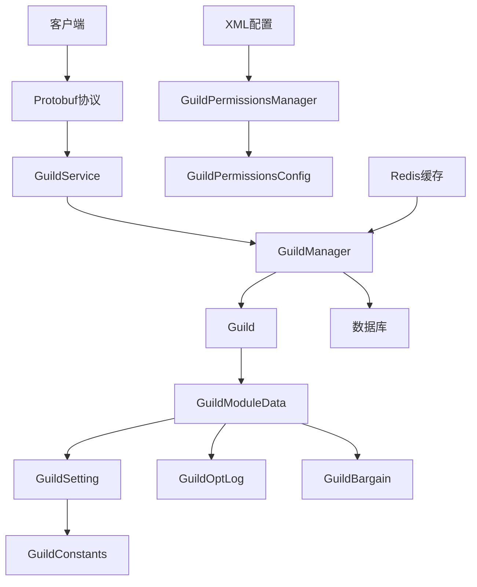
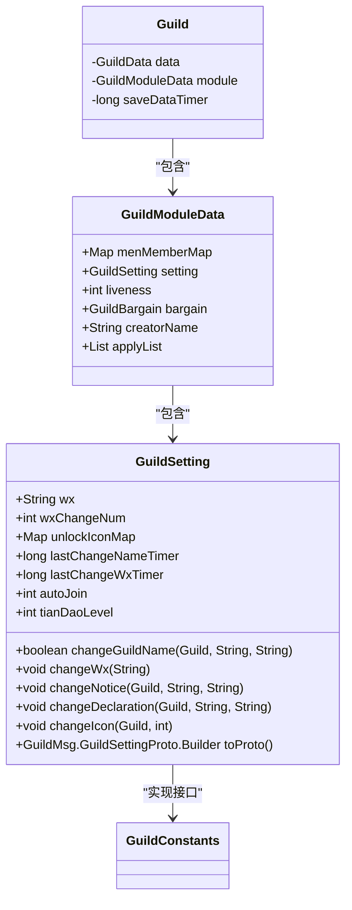
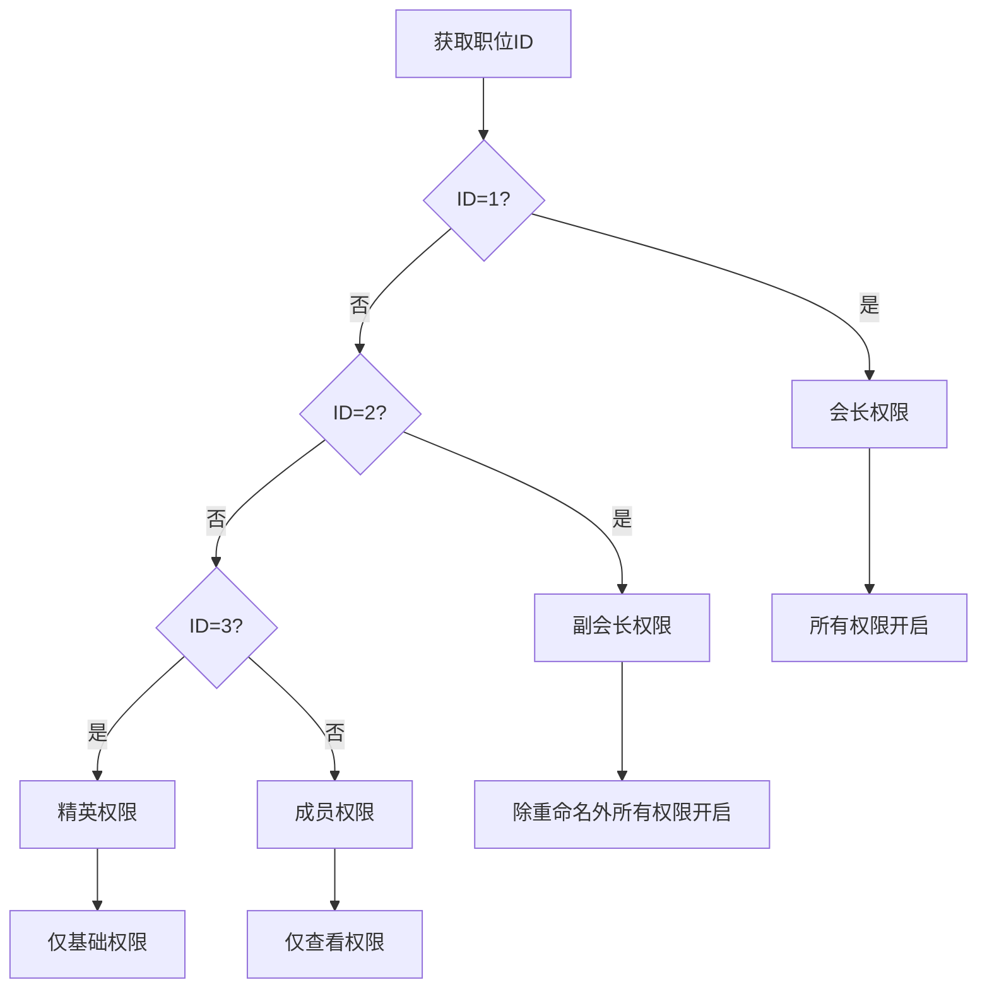
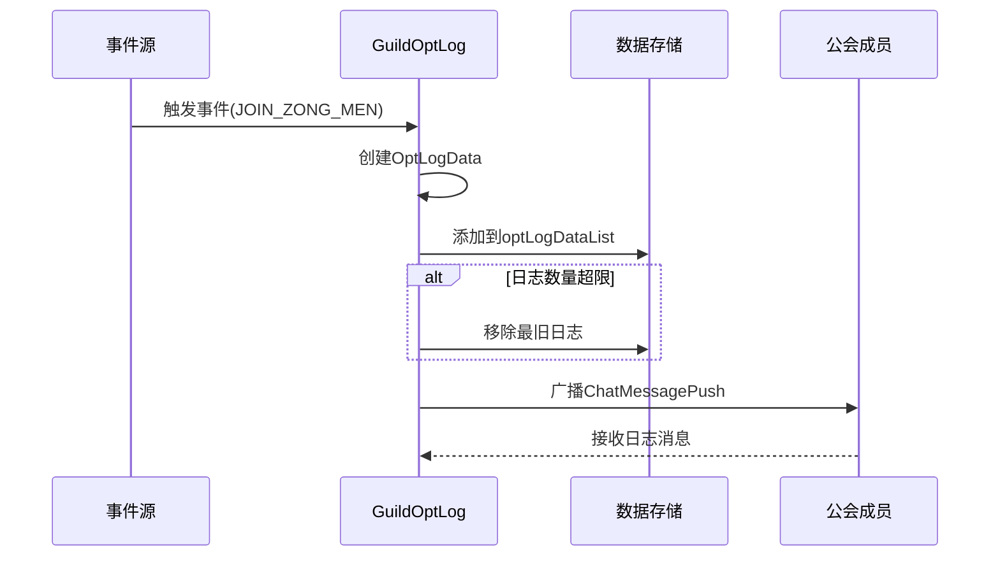
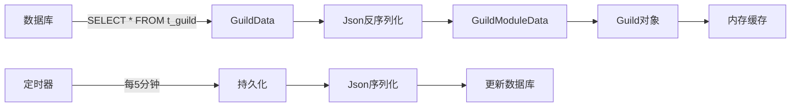

# 权限模型

<cite>
**本文档引用的文件**  
- [GuildSetting.java](file://game\src\main\java\cn\game\games\net\cross\guild\GuildSetting.java)
- [GuildConstants.java](file://game\src\main\java\cn\game\games\net\cross\guild\GuildConstants.java)
- [GuildModuleData.java](file://game\src\main\java\cn\game\games\net\cross\guild\GuildModuleData.java)
- [Guild.java](file://game\src\main\java\cn\game\games\net\cross\guild\Guild.java)
- [GuildService.java](file://game\src\main\java\cn\game\games\net\cross\guild\service\GuildService.java)
- [GuildPermissions.xml](file://game\src\main\resources\xml\GuildPermissions.xml)
- [GuildPermissionsManager.java](file://protocol\src\main\java\cn\game\protocol\generated\manager\GuildPermissionsManager.java)
- [GuildPermissionsConfig.java](file://protocol\src\main\java\cn\game\protocol\generated\config\GuildPermissionsConfig.java)
- [GuildOptLog.java](file://game\src\main\java\cn\game\games\net\cross\guild\GuildOptLog.java)
</cite>

## 目录
1. [引言](#引言)
2. [公会权限系统架构](#公会权限系统架构)
3. [核心数据结构分析](#核心数据结构分析)
4. [权限配置与控制机制](#权限配置与控制机制)
5. [权限级别与职位映射](#权限级别与职位映射)
6. [权限变更审计日志](#权限变更审计日志)
7. [内存加载与数据库同步](#内存加载与数据库同步)
8. [权限位设计原理](#权限位设计原理)
9. [核心功能实现](#核心功能实现)
10. [高并发线程安全处理](#高并发线程安全处理)

## 引言

公会权限系统（GuildSetting）是游戏社交功能的核心组成部分，负责管理公会的各项设置与权限控制。本系统通过精细化的权限划分，确保公会管理的有序性和安全性。系统实现了成员加入审批、公告修改、资金使用、成员踢出等关键操作的权限控制，支持会长、副会长、精英、成员等不同职位的权限差异化配置。通过XML配置文件定义权限模板，结合内存对象与数据库持久化，实现了灵活且高效的权限管理体系。系统还包含完整的审计日志功能，记录所有重要操作，确保公会管理的透明度和可追溯性。

## 公会权限系统架构

公会权限系统采用分层架构设计，主要包括数据层、服务层和表现层。数据层由XML配置文件和数据库表组成，存储权限模板和公会设置数据。服务层包含GuildService、GuildManager等核心服务类，处理业务逻辑和权限验证。表现层通过Protobuf协议与客户端通信，提供公会设置的序列化和反序列化功能。

系统通过事件驱动机制实现组件间的松耦合，GuildConstants中定义的事件类型（如ZONG_MEN_LEVEL_UP、CHANGE_ZONG_MEN_NAME等）被不同处理器监听和处理。这种设计使得权限变更、等级提升等操作能够自动触发相关业务逻辑，如解锁新图标、记录操作日志等。



**图示来源**
- [GuildService.java](file://game\src\main\java\cn\game\games\net\cross\guild\service\GuildService.java)
- [GuildManager.java](file://game\src\main\java\cn\game\games\net\cross\guild\GuildManager.java)
- [Guild.java](file://game\src\main\java\cn\game\games\net\cross\guild\Guild.java)
- [GuildModuleData.java](file://game\src\main\java\cn\game\games\net\cross\guild\GuildModuleData.java)
- [GuildSetting.java](file://game\src\main\java\cn\game\games\net\cross\guild\GuildSetting.java)
- [GuildPermissionsManager.java](file://protocol\src\main\java\cn\game\protocol\generated\manager\GuildPermissionsManager.java)

## 核心数据结构分析

公会权限系统的核心数据结构围绕GuildSetting类展开，该类实现了GuildConstants.GuildEventHandler接口，能够响应公会事件。GuildSetting类包含多个字段，用于存储公会的各种设置信息：

- **wx**: 宗主微信号，字符串类型
- **wxChangeNum**: 微信号修改次数，整数类型
- **unlockIconMap**: 解锁的图标集合，Map<Integer, Long>类型，键为图标ID，值为过期时间戳（-1表示永久）
- **lastChangeNameTimer**: 上一次修改公会名称的时间戳
- **lastChangeWxTimer**: 上一次修改微信号的时间戳
- **autoJoin**: 自动加入设置，1表示快速加入，2表示需要验证加入，3表示不可加入
- **tianDaoLevel**: 天道等级

这些字段通过getter和setter方法提供访问接口，支持外部组件的读取和修改。GuildSetting对象被包含在GuildModuleData中，作为公会模块数据的一部分，与成员列表、操作日志等其他模块数据共同构成完整的公会状态。



**图示来源**
- [GuildSetting.java](file://game\src\main\java\cn\game\games\net\cross\guild\GuildSetting.java)
- [GuildModuleData.java](file://game\src\main\java\cn\game\games\net\cross\guild\GuildModuleData.java)
- [Guild.java](file://game\src\main\java\cn\game\games\net\cross\guild\Guild.java)
- [GuildConstants.java](file://game\src\main\java\cn\game\games\net\cross\guild\GuildConstants.java)

## 权限配置与控制机制

公会权限系统通过严格的权限控制机制确保各项操作的安全性。当玩家尝试执行敏感操作时，系统会首先检查其职位对应的权限配置。权限验证流程如下：

1. 获取操作者的职位信息
2. 通过GuildPermissionsManager获取该职位的权限配置
3. 检查目标操作是否在允许的权限范围内
4. 如果权限不足，抛出zong_men_permission_not_enough异常

以修改公会公告为例，相关代码逻辑如下：
```java
if (!StringUtils.isEmpty(request.getNotice())) {
    if (!permissionsConfig.Notice) {
        fail(ErrorMsgEnum.zong_men_permission_not_enough);
    }
    setting.changeNotice(guildInfo, request.getNotice(), request.getOperatorName());
}
```

系统支持的权限控制包括：
- **成员加入审批（Approval）**: 控制是否可以审批新成员加入申请
- **公告修改（Notice）**: 控制是否可以修改公会公告
- **宣言修改（Manifesto）**: 控制是否可以修改公会宣言
- **成员管理（Member）**: 控制是否可以管理成员（如踢出）
- **职位设置（Posts）**: 控制是否可以调整成员职位
- **名称修改（Rename）**: 控制是否可以修改公会名称
- **图标修改（Icon）**: 控制是否可以修改公会图标

这些权限在处理相应请求时都会进行验证，确保只有具备相应权限的职位才能执行操作。

**本节来源**
- [GuildService.java](file://game\src\main\java\cn\game\games\net\cross\guild\service\GuildService.java#L198-L214)
- [GuildSetting.java](file://game\src\main\java\cn\game\games\net\cross\guild\GuildSetting.java#L104-L128)

## 权限级别与职位映射

公会权限系统通过XML配置文件定义了不同职位的权限模板，实现了权限级别与职位的清晰映射。`GuildPermissions.xml`文件中定义了四种职位：会长、副会长、精英和成员，每种职位都有明确的权限配置。

```xml
<GuildPermissions>
    <GuildPermissions Approval="true" ID="1" Icon="true" Manifesto="true" Member="true" Name="会长" Notice="true" Number="1"
        Posts="true" Remove="true" Rename="true"/>
    <GuildPermissions Approval="true" ID="2" Icon="false" Manifesto="true" Member="true" Name="副会长" Notice="true" Number="2"
        Posts="true" Remove="true" Rename="false"/>
    <GuildPermissions Approval="false" ID="3" Icon="false" Manifesto="false" Member="false" Name="精英" Notice="false" Number="5"
        Posts="false" Remove="false" Rename="false"/>
    <GuildPermissions Approval="false" ID="4" Icon="false" Manifesto="false" Member="false" Name="成员" Notice="false"
        Number="999" Posts="false" Remove="false" Rename="false"/>
</GuildPermissions>
```

每种职位的权限配置如下：

| 职位 | ID | 审批 | 图标 | 宣言 | 成员 | 公告 | 职位 | 踢出 | 重命名 | 人数上限 |
|------|----|------|------|------|------|------|------|------|--------|----------|
| 会长 | 1 | 是 | 是 | 是 | 是 | 是 | 是 | 是 | 是 | 1 |
| 副会长 | 2 | 是 | 否 | 是 | 是 | 是 | 是 | 是 | 否 | 2 |
| 精英 | 3 | 否 | 否 | 否 | 否 | 否 | 否 | 否 | 否 | 5 |
| 成员 | 4 | 否 | 否 | 否 | 否 | 否 | 否 | 否 | 否 | 999 |

这些配置通过GuildPermissionsManager类加载到内存中，形成一个ID到权限配置的映射表。当需要验证权限时，系统通过职位ID获取对应的GuildPermissionsConfig对象，然后检查具体权限字段的布尔值。



**图示来源**
- [GuildPermissions.xml](file://game\src\main\resources\xml\GuildPermissions.xml)
- [GuildPermissionsManager.java](file://protocol\src\main\java\cn\game\protocol\generated\manager\GuildPermissionsManager.java)
- [GuildPermissionsConfig.java](file://protocol\src\main\java\cn\game\protocol\generated\config\GuildPermissionsConfig.java)

## 权限变更审计日志

公会系统实现了完整的操作审计日志功能，通过GuildOptLog类记录所有重要操作。该类实现了GuildEventHandler接口，监听并处理多种公会事件，包括成员加入、职位变更、名称修改、成员退出、宣言修改、成员踢出和公告修改等。

当特定事件发生时，GuildOptLog会创建一个OptLogData对象，记录操作时间、操作类型和相关参数。日志条目被存储在optLogDataList列表中，并通过广播机制通知所有公会成员。系统还设置了日志数量上限（由GlobalConst.GuildLogNum定义），当达到上限时会自动移除最旧的日志条目。



日志记录的关键流程包括：
1. 事件触发：公会状态变更时调用handleEvent方法
2. 日志创建：根据事件类型和参数创建OptLogData对象
3. 存储管理：将日志添加到列表，必要时清理旧日志
4. 消息广播：通过GuildHelper.broadcastNotifyMsgToPlayer向所有成员发送日志消息
5. 序列化：提供toProto方法将日志转换为Protobuf格式，便于网络传输

这种设计确保了所有重要操作都有迹可循，增强了系统的透明度和可审计性。

**图示来源**
- [GuildOptLog.java](file://game\src\main\java\cn\game\games\net\cross\guild\GuildOptLog.java)
- [GuildConstants.java](file://game\src\main\java\cn\game\games\net\cross\guild\GuildConstants.java#L26-L30)
- [GuildHelper.java](file://game\src\main\java\cn\game\games\net\cross\guild\GuildHelper.java)

## 内存加载与数据库同步

公会权限系统采用内存优先的设计策略，将公会数据加载到内存中进行高效操作，同时定期与数据库同步以确保数据持久化。系统通过GuildManager单例管理所有公会对象的生命周期。

当服务器启动或公会数据需要加载时，系统执行以下流程：
1. 从数据库读取GuildData对象
2. 使用JsonUtil解析modules字段，重建GuildModuleData对象
3. 初始化事件处理器注册
4. 将公会对象放入内存缓存



数据同步机制的关键特点包括：
- **延迟持久化**：通过SAVE_ZONG_MEN_DATA_TIMER常量（5分钟）控制持久化频率，减少数据库压力
- **变更检测**：saveDataTimer字段记录下次保存时间，避免不必要的数据库写入
- **批量更新**：使用JsonUtil.toJsonStringWithType将整个模块数据序列化后一次性更新
- **缓存一致性**：Redis缓存用于存储公会简单信息和成员映射，确保跨服务器访问的一致性

当公会数据发生变化时，系统不会立即写入数据库，而是更新内存对象并调整saveDataTimer。只有当定时器触发且当前时间超过saveDataTimer时，才会执行数据库更新操作。这种设计在保证数据安全的同时，显著提升了系统性能。

**图示来源**
- [Guild.java](file://game\src\main\java\cn\game\games\net\cross\guild\Guild.java#L63-L66)
- [GuildConstants.java](file://game\src\main\java\cn\game\games\net\cross\guild\GuildConstants.java#L15)
- [GuildModuleData.java](file://game\src\main\java\cn\game\games\net\cross\guild\GuildModuleData.java#L97-L102)

## 权限位设计原理

公会权限系统采用基于XML配置的布尔值权限模型，而非传统的位掩码（bitmask）设计。这种设计选择主要基于以下几个考虑：

1. **可读性和可维护性**：XML配置文件中的布尔属性（如Approval="true"、Notice="true"）直观易懂，非技术人员也能轻松理解和修改权限配置。

2. **灵活性**：每个权限都是独立的字段，可以单独开启或关闭，无需考虑位运算的复杂性。新增权限时只需添加新的XML属性，无需重新设计位掩码结构。

3. **配置热更新**：GuildPermissionsManager实现了ResourceListener接口，能够监听XML文件的变化并自动重新加载配置，实现权限配置的热更新。

4. **类型安全**：使用强类型的GuildPermissionsConfig类封装权限配置，避免了位运算可能导致的类型错误。

虽然系统没有采用位掩码设计，但其权限模型仍然具有高效性：
- 权限检查是简单的布尔值比较操作，时间复杂度为O(1)
- 所有权限配置在服务器启动时加载到内存中，形成HashMap索引，查找效率高
- 使用DeepImmutables.map确保配置的不可变性，支持安全的并发访问

这种设计在保持高性能的同时，大大降低了系统的复杂性和维护成本，特别适合权限结构相对稳定且需要频繁配置调整的游戏系统。

**本节来源**
- [GuildPermissions.xml](file://game\src\main\resources\xml\GuildPermissions.xml)
- [GuildPermissionsManager.java](file://protocol\src\main\java\cn\game\protocol\generated\manager\GuildPermissionsManager.java)
- [GuildPermissionsConfig.java](file://protocol\src\main\java\cn\game\protocol\generated\config\GuildPermissionsConfig.java)

## 核心功能实现

公会权限系统的核心功能通过一系列方法实现，涵盖了权限检查、修改和继承等关键操作。

### 权限检查实现

权限检查主要在GuildService.setGuildSetting方法中完成。系统首先获取操作者的职位，然后查询该职位的权限配置，最后验证具体操作是否被允许：

```java
GuildMember member = guildInfo.getMember(request.getOperatorId());
GuildPermissionsConfig permissionsConfig = GuildPermissionsManager.instance().get(member.position);

if (!permissionsConfig.Rename) {
    fail(ErrorMsgEnum.zong_men_permission_not_enough);
}
```

### 权限修改实现

权限修改操作通过GuildSetting类的方法实现，每个方法都包含相应的业务逻辑和状态更新：

- **changeGuildName**: 修改公会名称，包含名称唯一性检查
- **changeWx**: 修改微信号，同时更新修改次数和时间戳
- **changeNotice**: 修改公告，触发CHANGE_ZONG_MEN_NOTICE事件
- **changeDeclaration**: 修改宣言，触发CHANGE_ZONG_MEN_DECLARATION事件
- **changeIcon**: 修改图标，直接更新公会数据

### 权限继承实现

权限继承通过事件机制实现。当公会等级提升时，GuildSetting类的handleEventType方法会自动解锁对应等级的图标：

```java
@Override
public void handleEventType(GuildConstants.GuildEvenType type, Guild info, Object... params) {
    switch (type) {
        case ZONG_MEN_LEVEL_UP:
            int level = info.getLv();
            GuildIconManager.instance().list().stream()
                .filter(icon -> icon.LV == level)
                .forEach(icon -> {
                    for (int iconId : icon.Icon) {
                        if (unlockIconMap.containsKey(iconId)) {
                            continue;
                        }
                        unlockIconMap.put(iconId, -1L);
                    }
                });
            break;
    }
}
```

这种设计实现了权限的自动继承，当公会达到特定等级时，相关权限（如新图标）会自动解锁，无需手动配置。

**本节来源**
- [GuildService.java](file://game\src\main\java\cn\game\games\net\cross\guild\service\GuildService.java#L172-L221)
- [GuildSetting.java](file://game\src\main\java\cn\game\games\net\cross\guild\GuildSetting.java#L72-L128)
- [GuildSetting.java](file://game\src\main\java\cn\game\games\net\cross\guild\GuildSetting.java#L45-L62)

## 高并发线程安全处理

公会权限系统在高并发场景下采用了多种线程安全处理机制，确保数据一致性和系统稳定性。

### 事件处理同步

系统使用Future和Promise机制处理异步操作，避免阻塞主线程。例如在踢人操作中：

```java
PlayerManager.getInstance().batchGetSimplePlayerListFromRedisAsync(targetPidList)
    .onSuccess(res -> {
        res.forEach(simplePlayer -> {
            module.removeMember(simplePlayer.getId(),1);
            handleEvent(GuildConstants.GuildEvenType.ZONG_MEN_KICK_MEMBER, playerName, simplePlayer.getName());
        });
    });
```

### 缓存操作安全

系统使用RedisUtil.trySet等原子操作确保关键数据的线程安全。例如在修改公会名称时：

```java
boolean trySet = RedisUtil.trySet(GuildHelper.getNameKey(newName), newName);
if (!trySet) {
    return false; // 名称已存在
}
```

### 内存数据保护

GuildModuleData中的eventTypeHandleMaps使用HashMap，虽然不是线程安全的，但系统通过以下方式确保安全：
- 在公会初始化时完成所有事件处理器的注册
- 运行时只读取事件处理器列表，不进行修改
- 使用transient关键字标记，避免序列化问题

### 性能监控

系统内置了事件处理性能监控，当事件处理时间超过50毫秒时会记录错误日志：

```java
long beginTimer = System.currentTimeMillis();
// 处理事件
long endTimer = System.currentTimeMillis();
if (endTimer - beginTimer > 50) {
    GuildManager.log.error("handleEvent time is too long, type:{}, use:{}", evenType.getDesc(), endTimer - beginTimer);
}
```

这些机制共同确保了系统在高并发环境下的稳定运行，能够有效处理大量公会操作请求。

**本节来源**
- [Guild.java](file://game\src\main\java\cn\game\games\net\cross\guild\Guild.java#L428-L437)
- [GuildSetting.java](file://game\src\main\java\cn\game\games\net\cross\guild\GuildSetting.java#L73-L76)
- [GuildModuleData.java](file://game\src\main\java\cn\game\games\net\cross\guild\GuildModuleData.java#L78-L90)