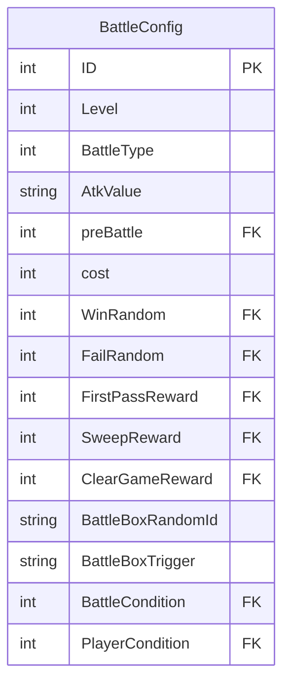
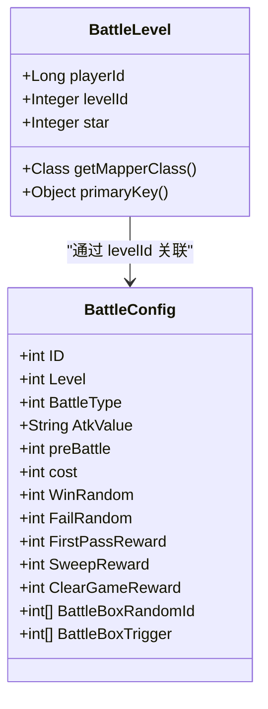

# 战斗关卡模型

<cite>
**本文档引用文件**   
- [Battle.xml](file://game/src/main/resources/xml/Battle.xml)
- [BattleLevel.java](file://game/src/main/java/cn/game/games/cache/entity/BattleLevel.java)
- [BattleLevelMapper.java](file://game/src/main/java/cn/game/games/net/data/mapper/BattleLevelMapper.java)
- [BattleLevelMapper.xml](file://game/src/main/resources/mapping/BattleLevelMapper.xml)
- [BattleConfig.java](file://protocol/src/main/java/cn/game/protocol/generated/config/BattleConfig.java)
- [BattleModule.java](file://game/src/main/java/cn/game/games/net/game/module/battle/BattleModule.java)
- [BattleHelper.java](file://game/src/main/java/cn/game/games/net/game/helper/BattleHelper.java)
- [Chapter.java](file://game/src/main/java/cn/game/games/cache/entity/Chapter.java)
</cite>

## 目录
1. [引言](#引言)
2. [核心数据结构](#核心数据结构)
3. [关卡配置数据模型](#关卡配置数据模型)
4. [玩家关卡进度数据模型](#玩家关卡进度数据模型)
5. [数据存储与持久化](#数据存储与持久化)
6. [数据加载与缓存机制](#数据加载与缓存机制)
7. [批量操作实现](#批量操作实现)
8. [结论](#结论)

## 引言
本文档全面解析游戏系统中的战斗关卡（BattleLevel）数据模型。文档详细阐述了关卡的静态配置数据与玩家的动态进度数据，分析了其在XML配置文件中的组织结构、在Java实体类中的映射关系，以及在数据库中的存储方式。同时，文档深入探讨了关卡数据的动态加载、缓存更新和批量操作的实现机制，为理解战斗关卡系统的数据流和业务逻辑提供了完整的视角。

## 核心数据结构
战斗关卡系统的核心数据结构分为两大类：**关卡配置数据**和**玩家关卡进度数据**。前者定义了关卡的静态属性，后者记录了玩家与关卡交互的动态状态。

### 关卡配置数据 (BattleConfig)
关卡配置数据定义了游戏中所有关卡的静态属性。这些数据在游戏启动时从XML文件加载，并通过`BattleConfig`类进行封装。该类的实例由`BattleManager`进行统一管理，提供全局访问。

### 玩家关卡进度数据 (BattleLevel)
玩家关卡进度数据记录了单个玩家对特定关卡的挑战状态。该数据以玩家ID和关卡ID为联合主键，存储在数据库中，并通过`BattleLevel`实体类进行映射。

**Section sources**
- [BattleLevel.java](file://game/src/main/java/cn/game/games/cache/entity/BattleLevel.java#L7-L86)
- [BattleConfig.java](file://protocol/src/main/java/cn/game/protocol/generated/config/BattleConfig.java#L11-L200)

## 关卡配置数据模型
关卡配置数据存储在`game/src/main/resources/xml/Battle.xml`文件中，以XML格式组织。每个`<Battle>`标签代表一个关卡，其属性定义了关卡的所有静态信息。

### XML文件结构
```xml
<Battle 
    ID="110011" 
    Level="1" 
    BattleType="1" 
    preBattle="0"
    AtkValue="15000"
    cost="10001"
    WinRandom="231001"
    FailRandom="231000"
    FirstPassReward="0"
    SweepReward="0"
    ClearGameReward="0"
    BattleBoxRandomId="901011;901012;901013"
    BattleBoxTrigger="1;50;100"
    BattleCondition="0"
    PlayerCondition="0"
    TargetMonsterStrateg=""
    Cnt=""
    ConvertAwardFUN=""
    FUNCondition=""
    FUNFactor=""
    FUNRandom=""
/>
```

### 关键属性定义
以下表格详细描述了`Battle.xml`中各属性的含义：

| 属性名 | 数据类型 | 描述 |
| :--- | :--- | :--- |
| `ID` | Integer | **关卡ID**。全局唯一标识符，用于区分不同关卡。 |
| `Level` | Integer | **关卡等级**。在所属章节或系列中的顺序。 |
| `BattleType` | Integer | **关卡类型**。定义关卡的玩法，如：1=普通关卡, 2=精英关卡, 22=降妖伏魔, 99=主线剧情。 |
| `preBattle` | Integer | **前置关卡ID**。必须通关此ID的关卡后，当前关卡才会解锁。 |
| `AtkValue` | String | **推荐战力**。对玩家角色战力的建议值，为空表示无要求。 |
| `cost` | Integer | **进入消耗**。挑战此关卡需要消耗的资源ID（如体力）。 |
| `WinRandom` | Integer | **胜利奖励**。通关成功后，从该ID对应的掉落表中获取奖励。 |
| `FailRandom` | Integer | **失败奖励**。挑战失败后，从该ID对应的掉落表中获取奖励。 |
| `FirstPassReward` | Integer | **首通奖励**。首次通关时获得的固定奖励，从指定掉落表中获取。 |
| `SweepReward` | Integer | **扫荡奖励**。使用扫荡功能时获得的奖励，通常与通关奖励相同。 |
| `ClearGameReward` | Integer | **通关宝箱奖励**。通关后额外获得的固定奖励，有UI提示。 |
| `BattleBoxRandomId` | String (分号分隔) | **章节宝箱奖励组**。当满足`BattleBoxTrigger`条件时，从该组ID中随机一个掉落表获取奖励。 |
| `BattleBoxTrigger` | String (分号分隔) | **章节宝箱触发条件**。例如，剩余血量百分比>=指定值时触发。 |
| `BattleCondition` | Integer | **前置条件**。可能关联到玩家的修为等级等系统。 |
| `PlayerCondition` | Integer | **玩家限制**。通过`Condition`表定义的玩家属性限制。 |
| `TargetMonsterStrateg` | String (分号/竖线分隔) | **针对怪物策略**。定义战斗中对怪物的属性增益或削弱。 |
| `Cnt` | String (分号/竖线分隔) | **BUFF条数**。用于随机生成战斗中的增益或减益效果。 |



**Diagram sources **
- [Battle.xml](file://game/src/main/resources/xml/Battle.xml#L1-L800)
- [BattleConfig.java](file://protocol/src/main/java/cn/game/protocol/generated/config/BattleConfig.java#L13-L58)

**Section sources**
- [Battle.xml](file://game/src/main/resources/xml/Battle.xml#L1-L800)
- [BattleConfig.java](file://protocol/src/main/java/cn/game/protocol/generated/config/BattleConfig.java#L11-L200)

## 玩家关卡进度数据模型
玩家关卡进度数据记录了玩家个人的挑战状态，其核心是`BattleLevel`实体类。

### Java实体类定义
`BattleLevel`类实现了`Serializable`和`DbEntity`接口，用于与数据库进行映射。

```java
public class BattleLevel implements Serializable, DbEntity {
    private Long playerId; // 角色ID
    private Integer levelId; // 关卡id
    private Integer star; // 通关星数
    // ... getter and setter methods
}
```

### 核心属性
- **playerId**: 长整型，关联到玩家的唯一ID。
- **levelId**: 整型，关联到`Battle.xml`中定义的关卡ID。
- **star**: 整型，表示通关获得的星数，用于评价通关表现和解锁后续内容。

### 与关卡配置的关联
`BattleLevel`实体通过`levelId`字段与`BattleConfig`建立关联。服务器在处理玩家挑战时，会根据`levelId`从`BattleManager`中查询对应的`BattleConfig`，获取关卡的静态配置（如敌人、奖励等），然后结合`BattleLevel`中的玩家进度数据（如星数）来执行业务逻辑。



**Diagram sources **
- [BattleLevel.java](file://game/src/main/java/cn/game/games/cache/entity/BattleLevel.java#L7-L86)
- [BattleConfig.java](file://protocol/src/main/java/cn/game/protocol/generated/config/BattleConfig.java#L11-L200)

**Section sources**
- [BattleLevel.java](file://game/src/main/java/cn/game/games/cache/entity/BattleLevel.java#L7-L86)

## 数据存储与持久化
玩家的关卡进度数据需要持久化存储，以保证玩家数据不丢失。

### 数据库表结构
`BattleLevel`实体映射到数据库中的`t_battle_level`表。

```sql
CREATE TABLE t_battle_level (
    player_id BIGINT NOT NULL,
    level_id INTEGER NOT NULL,
    star INTEGER,
    PRIMARY KEY (player_id, level_id)
);
```

### MyBatis映射
`BattleLevelMapper.xml`文件定义了Java实体与数据库表之间的映射关系。

```xml
<mapper namespace="cn.game.games.net.data.mapper.BattleLevelMapper">
  <resultMap id="BaseResultMap" type="cn.game.games.cache.entity.BattleLevel">
    <id column="player_id" jdbcType="BIGINT" property="playerId" />
    <id column="level_id" jdbcType="INTEGER" property="levelId" />
    <result column="star" jdbcType="INTEGER" property="star" />
  </resultMap>
  <!-- CRUD操作的SQL语句 -->
</mapper>
```

### 持久化操作
`BattleLevelMapper`接口定义了对`t_battle_level`表进行操作的标准方法，包括：
- `insert`: 插入新的关卡记录。
- `updateByPrimaryKey`: 更新指定玩家和关卡的星数。
- `selectByPrimaryKey`: 根据玩家ID和关卡ID查询进度。
- `selectByPlayerId`: 查询指定玩家的所有关卡进度。

**Section sources**
- [BattleLevelMapper.xml](file://game/src/main/resources/mapping/BattleLevelMapper.xml#L1-L170)
- [BattleLevelMapper.java](file://game/src/main/java/cn/game/games/net/data/mapper/BattleLevelMapper.java#L7-L67)

## 数据加载与缓存机制
为了平衡性能与数据一致性，系统采用了“数据库持久化 + 内存缓存”的混合模式。

### 内存缓存结构
在`BattleModule`中，使用一个`Map<Integer, BattleLevel>`来缓存当前玩家的所有关卡进度数据。

```java
public class BattleModule extends BasePlayerModule {
    @Deprecated
    @JsonIgnore
    private Map<Integer, BattleLevel> levels; // key: levelId, value: BattleLevel
    // ...
}
```

### 数据加载流程
1.  **初始化**: 玩家登录时，系统通过`BattleLevelMapper.selectByPlayerId(playerId)`一次性从数据库加载该玩家所有的`BattleLevel`记录。
2.  **缓存**: 将查询到的`List<BattleLevel>`放入`BattleModule`的`levels`缓存中。
3.  **业务处理**: 在后续的战斗逻辑中，直接从内存缓存中读取和修改`BattleLevel`对象。

### 数据更新流程
当玩家完成一次挑战后，系统会更新其关卡进度。

```java
public class BattleModule {
    public void updateBattleLevel(BattleLevel level) {
        DAO.execute(BattleLevelMapper.class, MapperConstant.updateByPrimaryKey, level);
    }
    // ...
}
```
1.  **修改缓存**: 先在内存中的`levels`缓存里更新`BattleLevel`对象的`star`值。
2.  **持久化**: 调用`updateBattleLevel`方法，通过MyBatis将变更异步写入数据库。

这种模式确保了高频读取操作的性能，同时保证了数据的最终一致性。

**Section sources**
- [BattleModule.java](file://game/src/main/java/cn/game/games/net/game/module/battle/BattleModule.java#L67-L68)
- [BattleModule.java](file://game/src/main/java/cn/game/games/net/game/module/battle/BattleModule.java#L241-L245)

## 批量操作实现
系统提供了对`BattleLevel`数据的批量操作支持，以优化性能。

### 批量插入
`insertBatch`方法允许一次性插入多条记录，减少了数据库连接的开销。

```xml
<insert id="insertBatch" parameterType="java.util.List">
    insert into t_battle_level (player_id, level_id, star)
    values 
    <foreach collection="list" item="item" separator=",">
        (#{item.playerId}, #{item.levelId}, #{item.star})
    </foreach>
</insert>
```

### 批量更新
`updateBatch`方法通过一条复杂的SQL语句，使用`CASE WHEN`语句对多条记录进行更新。

```xml
<update id="updateBatch" parameterType="java.util.List">
    update t_battle_level 
    <trim prefix="set" suffixOverrides=",">
      <trim prefix="star =case " suffix="end,">
        <foreach collection="recordList" item="item">
          when player_id = #{item.playerId} and level_id = #{item.levelId} then #{item.star}
        </foreach>
      </trim>
    </trim>
    where (player_id,level_id) in(
    <foreach collection="recordList" item="item" separator=",">
      (#{item.playerId}, #{item.levelId})
    </foreach>
    )
</update>
```

### 批量删除
`deleteBatch`方法通过`IN`子句和`FOREACH`标签，一次性删除多条记录。

```xml
<delete id="deleteBatch" parameterType="java.util.List">
    delete from t_battle_level where 
    (player_id,level_id) in 
    <foreach collection="list" item="item" open="(" separator="," close=")">
      (#{item.playerId},#{item.levelId})
    </foreach>
</delete>
```

**Section sources**
- [BattleLevelMapper.xml](file://game/src/main/resources/mapping/BattleLevelMapper.xml#L124-L169)

## 结论
战斗关卡数据模型通过清晰的分层设计，有效地管理了游戏中的关卡信息。静态的`BattleConfig`数据与动态的`BattleLevel`数据分离，使得配置灵活且易于维护。系统通过MyBatis实现了数据的持久化，并利用内存缓存显著提升了运行时性能。批量操作的实现进一步优化了数据处理效率。整体设计体现了高内聚、低耦合的原则，为战斗系统的稳定运行提供了坚实的数据基础。