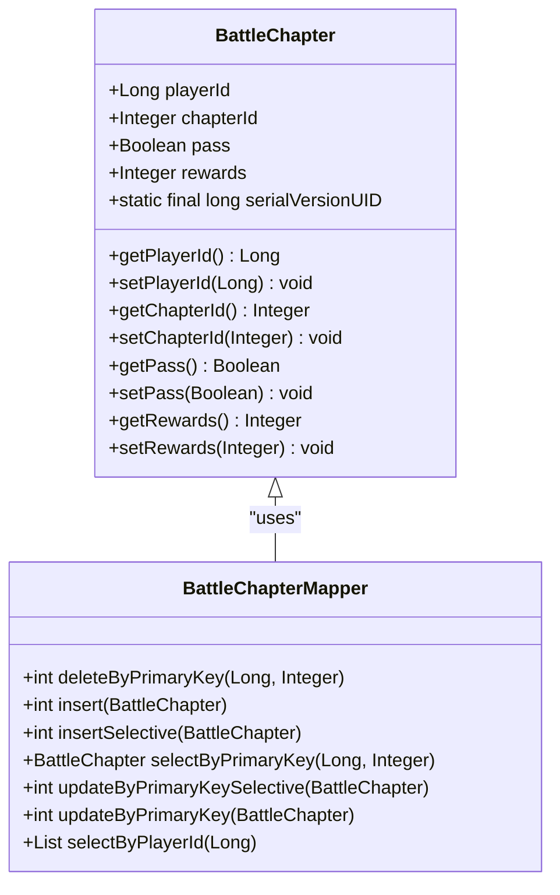
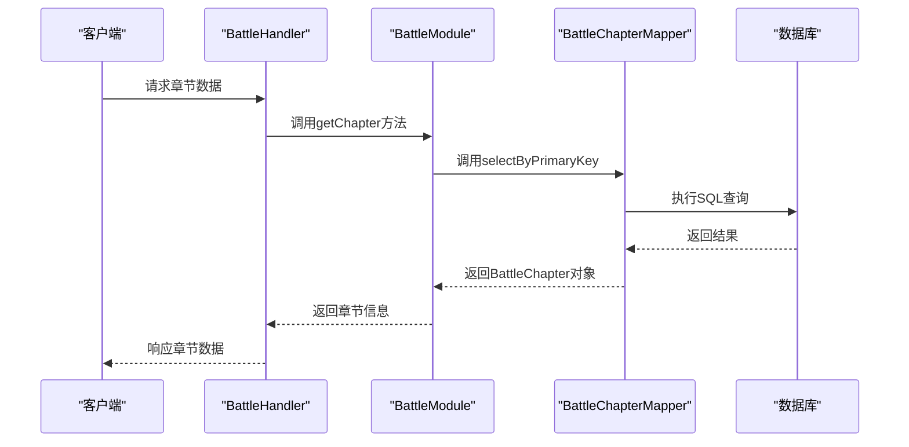
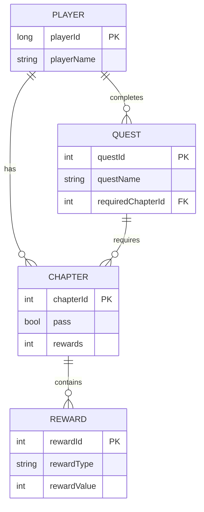

# 战斗章节模型

<cite>
**本文档引用的文件**   
- [BattleChapter.java](file://game/src/main/java/cn/game/games/cache/entity/BattleChapter.java)
- [BattleChapterMapper.java](file://game/src/main/java/cn/game/games/net/data/mapper/BattleChapterMapper.java)
- [BattleChapterMapper.xml](file://game/src/main/resources/mapping/BattleChapterMapper.xml)
- [Battle.xml](file://game/src/main/resources/xml/Battle.xml)
- [BattleModule.java](file://game/src/main/java/cn/game/games/net/game/module/battle/BattleModule.java)
- [BattleHandler.java](file://game/src/main/java/cn/game/games/net/game/module/battle/BattleHandler.java)
- [MainBattle.java](file://game/src/main/java/cn/game/games/net/game/module/battle/MainBattle.java)
- [BattleHelper.java](file://game/src/main/java/cn/game/games/net/game/helper/BattleHelper.java)
</cite>

## 目录
1. [战斗章节数据结构设计](#战斗章节数据结构设计)
2. [章节配置数据映射机制](#章节配置数据映射机制)
3. [章节进度数据持久化策略](#章节进度数据持久化策略)
4. [章节数据查询与更新](#章节数据查询与更新)
5. [缓存管理机制](#缓存管理机制)
6. [模块集成关系](#模块集成关系)

## 战斗章节数据结构设计

战斗章节（BattleChapter）的数据结构设计主要包含章节ID、章节名称、解锁条件和章节奖励配置等核心字段。在Java实体类中，`BattleChapter`类定义了与数据库表`t_battle_chapter`对应的字段，包括`playerId`（角色ID）、`chapterId`（章节ID）、`pass`（是否通关）和`rewards`（领取过的奖励索引）等属性。这些字段通过MyBatis框架与数据库进行映射，实现了数据的持久化存储。

**Section sources**
- [BattleChapter.java](file://game/src/main/java/cn/game/games/cache/entity/BattleChapter.java#L1-L87)

## 章节配置数据映射机制

章节配置数据从XML文件（Battle.xml）到Java对象的映射过程由MyBatis框架完成。`BattleChapterMapper.xml`文件定义了SQL映射规则，将XML中的配置数据映射到`BattleChapter`实体类。例如，`selectByPrimaryKey`方法用于根据`playerId`和`chapterId`查询特定的章节记录，而`insertSelective`方法则用于插入新的章节数据。这种映射机制确保了配置数据能够高效地加载到内存中，并供游戏逻辑使用。

**Diagram sources **
- [BattleChapter.java](file://game/src/main/java/cn/game/games/cache/entity/BattleChapter.java#L1-L87)
- [BattleChapterMapper.java](file://game/src/main/java/cn/game/games/net/data/mapper/BattleChapterMapper.java#L1-L45)

**Section sources**
- [BattleChapterMapper.xml](file://game/src/main/resources/mapping/BattleChapterMapper.xml#L1-L125)

## 章节进度数据持久化策略

章节进度数据的存储方式主要依赖于数据库表`t_battle_chapter`，该表记录了玩家已通关的章节状态和星级评价等信息。当玩家完成某个章节时，系统会更新`pass`字段为`true`，并可能更新`rewards`字段以记录已领取的奖励。此外，`BattleModule`类中的`isBattlePass`方法用于检查玩家是否已经通过某个章节，这涉及到对数据库的查询操作。

**Section sources**
- [BattleModule.java](file://game/src/main/java/cn/game/games/net/game/module/battle/BattleModule.java#L205-L229)

## 章节数据查询与更新

章节数据的查询和更新操作主要通过`BattleChapterMapper`接口提供的方法实现。例如，`selectByPlayerId`方法可以获取某个玩家的所有章节进度，而`updateByPrimaryKeySelective`方法则允许部分字段的更新。在实际应用中，`BattleHandler`类负责处理客户端请求，调用相应的服务方法来更新章节状态或查询章节信息。

**Diagram sources **
- [BattleHandler.java](file://game/src/main/java/cn/game/games/net/game/module/battle/BattleHandler.java#L316-L342)
- [BattleModule.java](file://game/src/main/java/cn/game/games/net/game/module/battle/BattleModule.java#L298-L300)

**Section sources**
- [BattleHandler.java](file://game/src/main/java/cn/game/games/net/game/module/battle/BattleHandler.java#L316-L342)

## 缓存管理机制

为了提高性能，系统采用了缓存机制来管理章节数据。`BattleModule`类中的`chapters`集合存储了玩家的章节进度，避免了频繁的数据库访问。当玩家完成某个章节时，系统首先更新内存中的缓存，然后异步地将更改持久化到数据库中。这种方式不仅提高了响应速度，还减少了数据库的压力。

**Section sources**
- [BattleModule.java](file://game/src/main/java/cn/game/games/net/game/module/battle/BattleModule.java#L298-L300)

## 模块集成关系

战斗章节模型与其他模块（如任务系统、活动系统）的集成关系主要体现在事件驱动的架构上。例如，当玩家完成某个章节时，会触发`EventTypeEnum.ChapterWin`事件，任务系统监听该事件并更新相关任务的进度。此外，`BattleHelper`类提供了辅助方法，用于判断章节的前置条件和完成状态，这些方法被多个模块共享和调用。

**Diagram sources **
- [BattleHelper.java](file://game/src/main/java/cn/game/games/net/game/helper/BattleHelper.java#L140-L159)
- [EliteFinish.java](file://game/src/main/java/cn/game/games/net/game/module/quest/require/EliteFinish.java#L1-L32)

**Section sources**
- [BattleHelper.java](file://game/src/main/java/cn/game/games/net/game/helper/BattleHelper.java#L140-L159)
- [EliteFinish.java](file://game/src/main/java/cn/game/games/net/game/module/quest/require/EliteFinish.java#L1-L32)