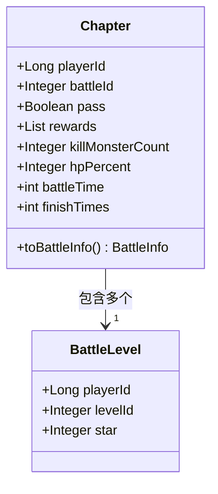
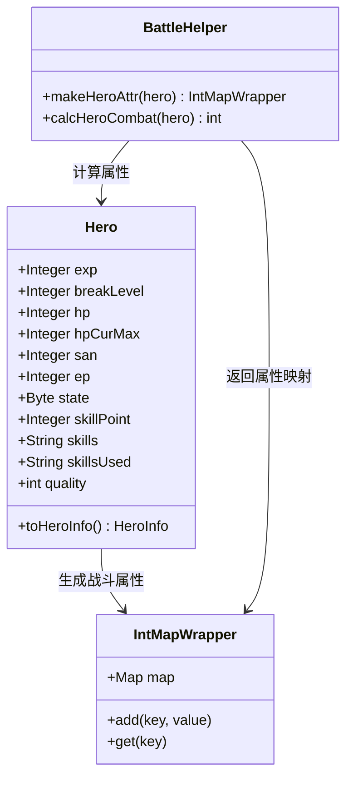
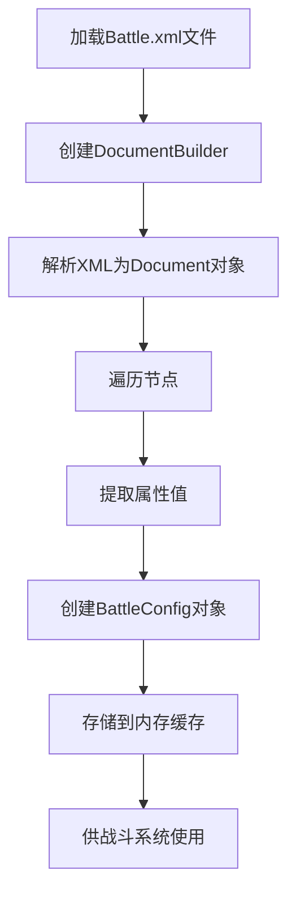
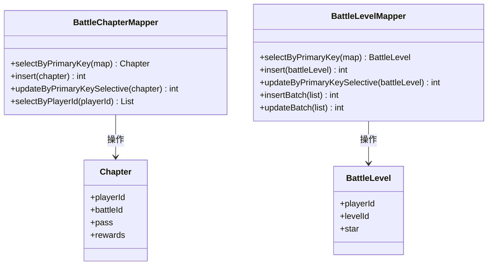
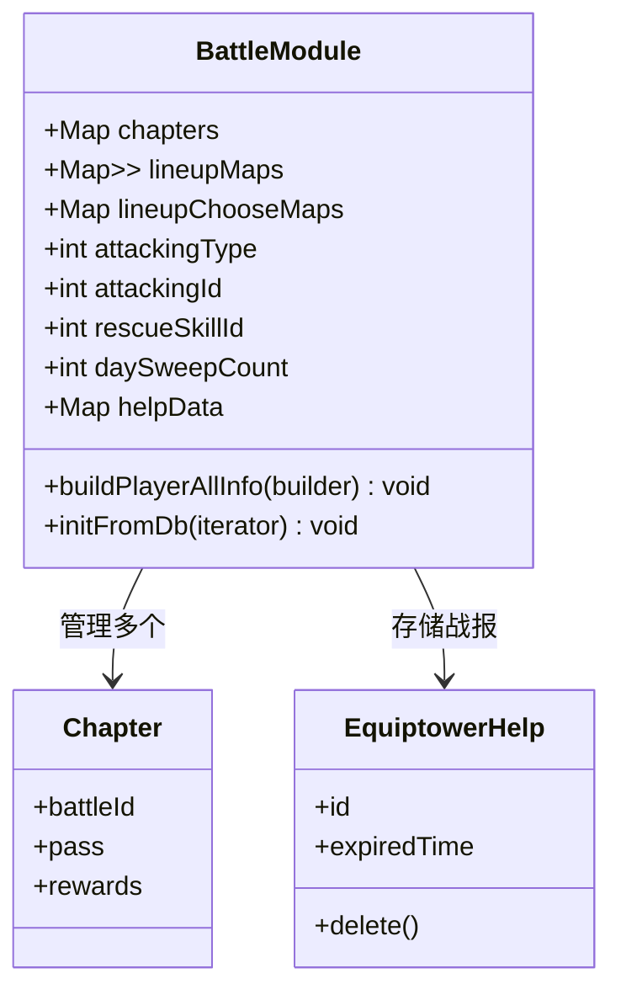

# 战斗系统数据模型

<cite>
**本文档引用文件**   
- [Battle.xml](file://game/src/main/resources/xml/Battle.xml)
- [Chapter.java](file://game/src/main/java/cn/game/games/cache/entity/Chapter.java)
- [BattleLevel.java](file://game/src/main/java/cn/game/games/cache/entity/BattleLevel.java)
- [Hero.java](file://game/src/main/java/cn/game/games/cache/entity/Hero.java)
- [BattleChapterMapper.xml](file://game/src/main/resources/mapping/BattleChapterMapper.xml)
- [BattleLevelMapper.xml](file://game/src/main/resources/mapping/BattleLevelMapper.xml)
- [BattleModule.java](file://game/src/main/java/cn/game/games/net/game/module/battle/BattleModule.java)
- [BattleHelper.java](file://game/src/main/java/cn/game/games/net/game/helper/BattleHelper.java)
</cite>

## 目录
1. [战斗章节与关卡结构](#战斗章节与关卡结构)
2. [英雄实体属性映射](#英雄实体属性映射)
3. [战斗配置数据转换机制](#战斗配置数据转换机制)
4. [战斗进度数据持久化策略](#战斗进度数据持久化策略)
5. [战斗临时数据内存管理](#战斗临时数据内存管理)

## 战斗章节与关卡结构

战斗章节（BattleChapter）和战斗关卡（BattleLevel）是游戏战斗系统的核心数据结构，分别对应战役的章节和具体关卡。在数据模型中，`Chapter` 类表示战斗章节，其主要属性包括：

- **playerId**: 玩家ID，用于标识该章节进度属于哪个玩家
- **battleId**: 战役ID，标识具体的章节编号
- **pass**: 布尔值，表示该章节是否已通关
- **rewards**: 整数列表，记录已领取的章节奖励索引
- **killMonsterCount**: 击杀怪物数量
- **hpPercent**: 通关时剩余血量百分比
- **battleTime**: 本章最长战斗时长（秒）
- **finishTimes**: 本章完成次数

战斗关卡（BattleLevel）的数据结构相对简单，主要包含：

- **playerId**: 玩家ID
- **levelId**: 关卡ID
- **star**: 通关获得的星数评价

章节的解锁条件在 `Battle.xml` 配置文件中通过 `preBattle` 属性定义，表示前置必须通关的战役ID。例如，ID为110012的战役需要先通关ID为110011的战役才能解锁。奖励配置通过 `FirstPassReward`（首通奖励）、`SweepReward`（扫荡奖励）等属性进行定义。

**图源**
- [Chapter.java](file://game/src/main/java/cn/game/games/cache/entity/Chapter.java#L11-L184)
- [BattleLevel.java](file://game/src/main/java/cn/game/games/cache/entity/BattleLevel.java#L7-L86)

**节源**
- [Chapter.java](file://game/src/main/java/cn/game/games/cache/entity/Chapter.java#L11-L184)
- [BattleLevel.java](file://game/src/main/java/cn/game/games/cache/entity/BattleLevel.java#L7-L86)

## 英雄实体属性映射

英雄（Hero）实体在战斗中的属性映射是战斗系统的核心部分。`Hero` 类继承自 `ItemNoStack` 并实现了 `DbEntity` 接口，其战斗相关字段包括：

- **exp**: 等级经验
- **breakLevel**: 突破等级
- **hp**: 当前生命值
- **hpCurMax**: 当前最大生命值
- **san**: SAN值（精神值）
- **ep**: 能量值
- **state**: 状态（0正常，1重伤，2死亡）
- **skillPoint**: 技能点
- **skills**: 技能配置
- **skillsUsed**: 已使用技能
- **quality**: 品质等级

在战斗中，英雄的战斗属性通过 `BattleHelper.makeHeroAttr()` 方法计算生成。该方法结合英雄的基础属性、等级、突破等级和品质，通过公式 `(初始值 + (等级-1) * 成长值) * (1 + 突破值/10000)` 计算最终战斗属性值。战斗属性包括攻击力、防御力、生命值、暴击率等，这些属性存储在 `IntMapWrapper` 结构中，并用于计算英雄的战斗力评分。

**图源**
- [Hero.java](file://game/src/main/java/cn/game/games/cache/entity/Hero.java#L9-L321)
- [BattleHelper.java](file://game/src/main/java/cn/game/games/net/game/helper/BattleHelper.java#L312-L367)

**节源**
- [Hero.java](file://game/src/main/java/cn/game/games/cache/entity/Hero.java#L9-L321)
- [BattleHelper.java](file://game/src/main/java/cn/game/games/net/game/helper/BattleHelper.java#L312-L367)

## 战斗配置数据转换机制

战斗配置数据采用XML文件（如 `Battle.xml`）进行定义，并通过Java对象进行解析和使用。系统使用 `XmlUtils` 工具类进行XML文件的加载和解析，将XML配置转换为内存中的数据结构。

在 `Battle.xml` 文件中，每个 `<Battle>` 元素定义了一个战斗关卡的配置，包含ID、前置条件（preBattle）、解锁条件（PlayerCondition）、奖励配置（FirstPassReward、SweepReward）等属性。这些配置在服务器启动时被解析并存储在内存中，供战斗系统运行时查询使用。

数据转换流程如下：
1. 使用 `XmlUtils.loadFile()` 方法加载XML文件
2. 通过DOM解析器将XML文档转换为Document对象
3. 遍历XML节点，提取战斗配置信息
4. 将配置信息映射到相应的Java对象中
5. 存储在内存缓存中供快速访问

这种机制实现了配置数据与代码逻辑的分离，便于游戏内容的调整和更新。

**图源**
- [Battle.xml](file://game/src/main/resources/xml/Battle.xml#L1-L727)
- [XmlUtils.java](file://util/src/main/java/cn/game/util/XmlUtils.java#L85-L132)

**节源**
- [Battle.xml](file://game/src/main/resources/xml/Battle.xml#L1-L727)
- [XmlUtils.java](file://util/src/main/java/cn/game/util/XmlUtils.java#L85-L132)

## 战斗进度数据持久化策略

战斗进度数据采用数据库持久化策略，通过MyBatis框架实现Java对象与数据库表的映射。系统定义了专门的数据访问对象（DAO）和映射文件，确保战斗进度数据的可靠存储和高效访问。

对于战斗章节进度，系统使用 `t_battle_chapter` 数据库表进行存储，其结构与 `Chapter` 实体类对应。MyBatis映射文件 `BattleChapterMapper.xml` 定义了CRUD操作，包括：
- `selectByPrimaryKey`: 根据玩家ID和章节ID查询进度
- `insert`: 插入新的章节进度
- `updateByPrimaryKeySelective`: 更新章节通关状态和奖励领取情况
- `selectByPlayerId`: 查询玩家所有章节进度

对于战斗关卡进度，系统使用 `t_battle_level` 表进行存储，`BattleLevelMapper.xml` 提供了相应的数据库操作。特别的是，该映射文件支持批量操作（`insertBatch`、`updateBatch`），提高了大量数据更新的效率。

数据持久化策略还包括：
1. 玩家登录时从数据库加载战斗进度
2. 战斗状态变更时更新内存中的实体
3. 定期或在关键操作后将变更持久化到数据库
4. 使用主键（playerId + battleId/levelId）确保数据唯一性

**图源**
- [BattleChapterMapper.xml](file://game/src/main/resources/mapping/BattleChapterMapper.xml#L1-L125)
- [BattleLevelMapper.xml](file://game/src/main/resources/mapping/BattleLevelMapper.xml#L1-L170)
- [Chapter.java](file://game/src/main/java/cn/game/games/cache/entity/Chapter.java#L11-L184)
- [BattleLevel.java](file://game/src/main/java/cn/game/games/cache/entity/BattleLevel.java#L7-L86)

**节源**
- [BattleChapterMapper.xml](file://game/src/main/resources/mapping/BattleChapterMapper.xml#L1-L125)
- [BattleLevelMapper.xml](file://game/src/main/resources/mapping/BattleLevelMapper.xml#L1-L170)

## 战斗临时数据内存管理

战斗过程中的临时数据采用内存管理方案，主要由 `BattleModule` 类负责管理。该模块作为玩家战斗数据的核心管理器，维护了战斗相关的各种临时状态。

临时数据主要包括：
- **战斗阵容（lineupMaps）**: 存储玩家在不同战斗类型中的英雄阵容配置
- **战斗状态（attackingType, attackingId）**: 记录当前正在进行的战斗类型和ID
- **战斗次数统计**: 如 `battleTimes`、`daySweepCount` 等
- **特殊战斗状态**: 如 `rescueSkillId`（救援技能ID）
- **战报数据（helpData）**: 临时存储战斗帮助和战报信息

内存管理策略包括：
1. 玩家数据在登录时从数据库加载到内存
2. 战斗过程中直接操作内存中的对象
3. 使用 `IntMapWrapper` 等高效数据结构存储属性映射
4. 定期检查并清理过期数据（如过期的战报）
5. 在玩家登出或定期保存时将变更持久化

`BattleModule` 还实现了 `buildPlayerAllInfo()` 方法，将内存中的战斗数据构建成协议缓冲区（Protocol Buffer）消息，发送给客户端，确保前后端数据同步。

**图源**
- [BattleModule.java](file://game/src/main/java/cn/game/games/net/game/module/battle/BattleModule.java#L21-L815)
- [Chapter.java](file://game/src/main/java/cn/game/games/cache/entity/Chapter.java#L11-L184)
- [EquiptowerHelp.java](file://game/src/main/java/cn/game/games/cache/entity/EquiptowerHelp.java)

**节源**
- [BattleModule.java](file://game/src/main/java/cn/game/games/net/game/module/battle/BattleModule.java#L21-L815)