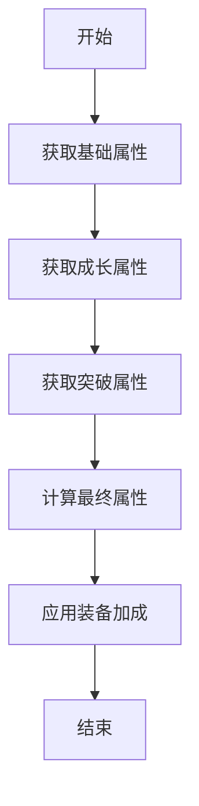
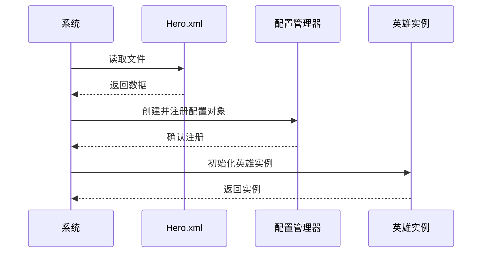
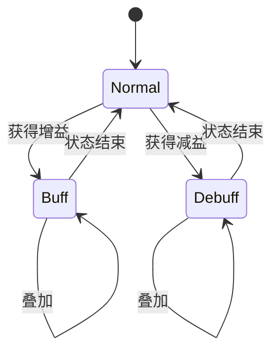
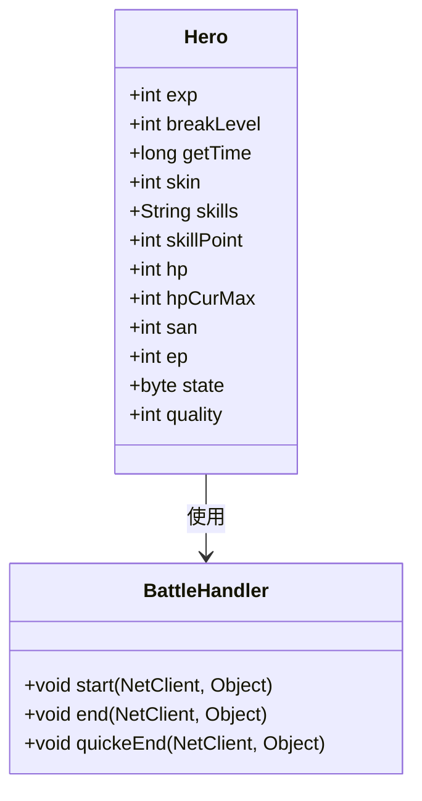

# 英雄战斗属性

<cite>
**本文档引用文件**   
- [Hero.java](file://game\src\main\java\cn\game\games\cache\entity\Hero.java)
- [BattleHandler.java](file://game\src\main\java\cn\game\games\net\game\module\battle\BattleHandler.java)
- [Hero.xml](file://game\src\main\resources\xml\Hero.xml)
- [AttributeVlalueManager.java](file://protocol\src\main\java\cn\game\protocol\generated\manager\AttributeVlalueManager.java)
- [HeroBreakManager.java](file://protocol\src\main\java\cn\game\protocol\generated\manager\HeroBreakManager.java)
- [AttrEffectConfigManager.java](file://protocol\src\main\java\cn\game\protocol\generated\manager\AttrEffectConfigManager.java)
</cite>

## 目录
1. [简介](#简介)
2. [英雄实体与战斗属性字段](#英雄实体与战斗属性字段)
3. [英雄属性计算逻辑](#英雄属性计算逻辑)
4. [英雄配置数据加载流程](#英雄配置数据加载流程)
5. [战斗过程中的临时状态管理](#战斗过程中的临时状态管理)
6. [英雄属性在战斗计算中的应用](#英雄属性在战斗计算中的应用)
7. [结论](#结论)

## 简介
本文档深入剖析了游戏系统中英雄在战斗中的属性模型设计。详细解析了英雄实体（Hero）中与战斗相关的字段，包括基础属性、成长属性、技能属性和装备加成等。说明了英雄属性的计算逻辑，如基础值、成长系数、装备/符文加成的叠加方式。分析了英雄配置数据从XML文件（Hero.xml）加载到内存的流程，以及运行时属性的动态计算机制。探讨了战斗过程中临时状态（如增益/减益效果、怒气值）的管理方案。结合战斗处理器（BattleHandler）的代码，说明了英雄属性在实际战斗计算中的应用方式。

## 英雄实体与战斗属性字段
英雄实体（Hero）是游戏中的核心数据结构，包含了英雄的各种属性和状态。以下是英雄实体中与战斗相关的字段：

- **等级经验（exp）**：英雄当前的经验值，用于计算等级提升。
- **突破等级（breakLevel）**：英雄的突破等级，影响属性加成。
- **获取时间（getTime）**：英雄被获取的时间戳。
- **当前使用的皮肤id（skin）**：英雄当前使用的皮肤标识。
- **技能（skills）**：英雄的技能信息。
- **技能点（skillPoint）**：英雄可用于升级技能的技能点数。
- **血量（hp）**：英雄当前的生命值。
- **血量当前最大值（hpCurMax）**：英雄当前的最大生命值。
- **san值（san）**：英雄的精神值，影响某些特殊效果。
- **ep（ep）**：英雄的能量值，用于释放技能。
- **状态（state）**：英雄的当前状态，如正常、重伤、死亡等。
- **品质（quality）**：英雄的品质，影响基础属性和成长率。

这些字段共同构成了英雄在战斗中的基本属性和状态，为后续的属性计算和战斗逻辑提供了基础数据。

**Section sources**
- [Hero.java](file://game\src\main\java\cn\game\games\cache\entity\Hero.java#L1-L321)

## 英雄属性计算逻辑
英雄的属性计算是一个复杂的过程，涉及基础属性、成长属性、突破属性和装备加成等多个方面。以下是英雄属性计算的主要逻辑：

1. **基础属性**：英雄的基础属性由配置文件（Hero.xml）中的`InitialAttributeId`指定，这些属性在英雄创建时确定。
2. **成长属性**：英雄的成长属性由`GrowthAttributeId`指定，表示每升一级所增加的属性值。
3. **突破属性**：英雄的突破属性由`BreakOneTime`指定，表示每次突破所增加的属性值。突破属性的计算公式为：
   $$
   \text{最终值} = (\text{初始值} + (\text{等级} - 1) \times \text{成长值}) \times (1 + \text{突破值} / 10000)
   $$
4. **装备加成**：装备和符文可以为英雄提供额外的属性加成，这些加成通常以百分比或固定值的形式叠加到基础属性上。

通过上述逻辑，英雄的最终属性值得以动态计算，确保了战斗中的公平性和策略性。

**Diagram sources **
- [Hero.java](file://game\src\main\java\cn\game\games\cache\entity\Hero.java#L1-L321)
- [BattleHelper.java](file://game\src\main\java\cn\game\games\net\game\helper\BattleHelper.java#L312-L367)

**Section sources**
- [Hero.java](file://game\src\main\java\cn\game\games\cache\entity\Hero.java#L1-L321)
- [BattleHelper.java](file://game\src\main\java\cn\game\games\net\game\helper\BattleHelper.java#L312-L367)

## 英雄配置数据加载流程
英雄配置数据从XML文件（Hero.xml）加载到内存的流程如下：

1. **读取XML文件**：系统启动时，读取`Hero.xml`文件，解析其中的英雄配置数据。
2. **创建配置对象**：根据XML文件中的数据，创建相应的配置对象，如`AttributeVlalueConfig`、`HeroBreakConfig`等。
3. **注册管理器**：将配置对象注册到相应的管理器中，如`AttributeVlalueManager`、`HeroBreakManager`等，以便在运行时快速访问。
4. **初始化英雄实例**：当玩家获取英雄时，根据配置数据初始化英雄实例，并设置其基础属性和状态。

这一流程确保了英雄配置数据的高效加载和管理，为游戏的正常运行提供了保障。

**Diagram sources **
- [Hero.xml](file://game\src\main\resources\xml\Hero.xml#L1-L244)
- [AttributeVlalueManager.java](file://protocol\src\main\java\cn\game\protocol\generated\manager\AttributeVlalueManager.java#L1-L97)
- [HeroBreakManager.java](file://protocol\src\main\java\cn\game\protocol\generated\manager\HeroBreakManager.java#L1-L96)

**Section sources**
- [Hero.xml](file://game\src\main\resources\xml\Hero.xml#L1-L244)
- [AttributeVlalueManager.java](file://protocol\src\main\java\cn\game\protocol\generated\manager\AttributeVlalueManager.java#L1-L97)
- [HeroBreakManager.java](file://protocol\src\main\java\cn\game\protocol\generated\manager\HeroBreakManager.java#L1-L96)

## 战斗过程中的临时状态管理
在战斗过程中，英雄可能会受到各种临时状态的影响，如增益效果（Buff）和减益效果（Debuff）。这些状态的管理方案如下：

1. **状态类型**：状态分为增益和减益两种，每种状态都有特定的效果和持续时间。
2. **状态叠加**：同一类型的状态可以叠加，但通常有最大叠加层数限制。
3. **状态刷新**：当英雄再次受到相同状态影响时，状态的持续时间会刷新。
4. **状态移除**：状态在持续时间结束后自动移除，或通过特定技能提前移除。

通过有效的状态管理，战斗过程更加丰富和策略化，增加了游戏的趣味性和挑战性。

**Diagram sources **
- [HeroBUFF.xml](file://game\src\main\resources\xml\HeroBUFF.xml#L73-L512)
- [IRoleBattleAction.java](file://game\src\main\java\cn\game\games\net\game\module\battle\IRoleBattleAction.java#L54-L112)

**Section sources**
- [HeroBUFF.xml](file://game\src\main\resources\xml\HeroBUFF.xml#L73-L512)
- [IRoleBattleAction.java](file://game\src\main\java\cn\game\games\net\game\module\battle\IRoleBattleAction.java#L54-L112)

## 英雄属性在战斗计算中的应用
英雄属性在实际战斗计算中起着至关重要的作用。以下是英雄属性在战斗计算中的主要应用方式：

1. **伤害计算**：英雄的攻击力和敌人的防御力共同决定了每次攻击造成的伤害。
2. **生命值管理**：英雄的生命值决定了其在战斗中的生存能力，生命值归零则英雄死亡。
3. **技能释放**：英雄的能量值（ep）决定了其能否释放技能，技能的威力通常与英雄的属性相关。
4. **状态影响**：增益和减益状态会影响英雄的各项属性，从而改变战斗的走向。

通过合理利用英雄属性，玩家可以在战斗中制定出最优的策略，提高胜率。

**Diagram sources **
- [Hero.java](file://game\src\main\java\cn\game\games\cache\entity\Hero.java#L1-L321)
- [BattleHandler.java](file://game\src\main\java\cn\game\games\net\game\module\battle\BattleHandler.java#L1-L800)

**Section sources**
- [Hero.java](file://game\src\main\java\cn\game\games\cache\entity\Hero.java#L1-L321)
- [BattleHandler.java](file://game\src\main\java\cn\game\games\net\game\module\battle\BattleHandler.java#L1-L800)

## 结论
通过对英雄战斗属性模型的深入剖析，我们了解了英雄实体中与战斗相关的字段、属性计算逻辑、配置数据加载流程、临时状态管理方案以及属性在战斗计算中的应用方式。这些设计确保了游戏战斗系统的公平性、策略性和趣味性，为玩家提供了丰富的游戏体验。未来可以进一步优化属性计算算法，增加更多类型的临时状态，提升游戏的可玩性和深度。